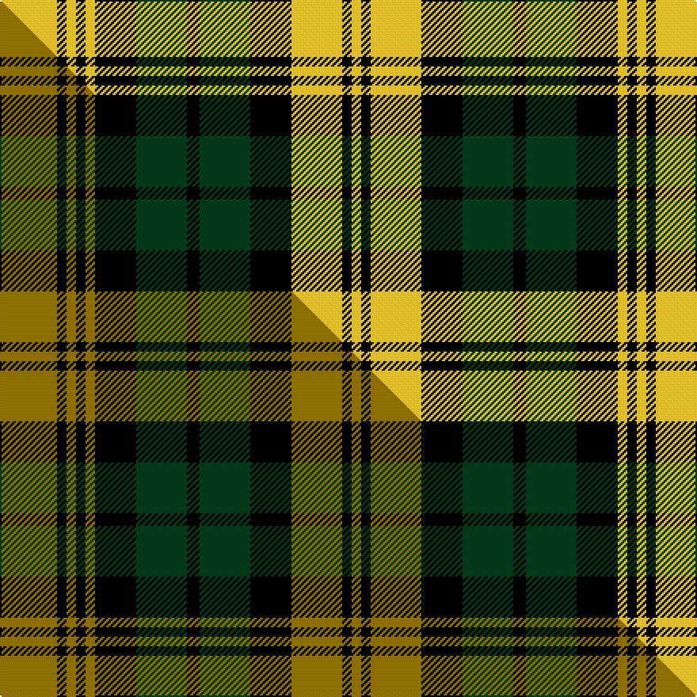

This is one **variant** — a specific cloth: this exact thread count and colourway, with its own
provenance below. It is one weaving of the [sett](/setts/ly18k3ly3k3ly3k13dg16k4dg16k13ly16k3ly3/) (the scale-free proportion — the
same cloth at any scale or shade), whose colour order is pattern [YKYKGKGKYKYKY](/stripes/ykykgkgkykyky/).

Part of the [Campbell Collegiate](/tartans/campbell-collegiate/) tartan — the named design grouping this sett with its other cloths.

Sourced from tartans-authority.  It is a [13 stripe tartan](/stripes/stripes13/).

Original link [https://www.tartanregister.gov.uk/tartanDetails.aspx?ref=10456](https://www.tartanregister.gov.uk/tartanDetails.aspx?ref=10456)

Dataset <small>— provenance for this record, inherited from the source manifest</small>

<dl class="dataset-prov">
<dt>source</dt><dd><a href="/sources/tartans-authority/">Scottish Tartans Authority</a></dd>
<dt>data captured from</dt><dd><a href="https://github.com/thetartan/tartan-database/blob/master/data/tartans-authority/data.csv">https://github.com/thetartan/tartan-database/blob/master/data/tartans-authority/data.csv</a></dd>
<dt>data date</dt><dd>24th May 2011 <small>(this record)</small></dd>
<dt>licence</dt><dd><a href="https://creativecommons.org/licenses/by-nc-nd/4.0/">CC BY-NC-ND 4.0</a></dd>
</dl>

Capture chain <small>— the hands this data passed through, oldest first; each capture carries its own licence</small>

<ol class="capture-chain">
<li><a href="https://www.tartansauthority.com/">Scottish Tartans Authority</a> <small>the heritage body's archive — its tartan-ferret record browser is retired (links repaired to the SRT, above)</small></li>
<li><a href="https://github.com/thetartan/tartan-database">thetartan/tartan-database</a> <small>2016-2017</small> · <a href="https://creativecommons.org/licenses/by-nc-nd/4.0/">CC BY-NC-ND 4.0</a> <small>Levko Kravets's frozen compilation — the capture we vendored, and where its CC licence text came from</small></li>
<li>this dictionary <small>captured 2026-06-10 · commit 5bf86c7566</small> <small>each re-capture is a git commit to data/sources</small></li>
</ol>

## Register references

External register numbers recorded for this tartan.

- Scottish Register of Tartans: [10456](https://www.tartanregister.gov.uk/tartanDetails?ref=10456)
- Scottish Tartans Authority (ITI): 10456

## Thread count
LY/36 K6 LY6 K6 LY6 K26 DG32 K8 DG32 K26 LY32 K6 LY/6

One full sett is **414 threads**.

## Palette
<table><thead><tr><th>Colour</th><th>Shade</th><th>OKLCh</th></tr></thead><tbody><tr><td>DG</td><td><code style="background-color:#053819;">#053819</code> <small style="color:#888">#053819</small></td><td><small style="color:#888">oklch(30.0% 0.075 151.3)</small></td></tr><tr><td>K</td><td><code style="background-color:#000000;">#000000</code> <small style="color:#888">#000000</small></td><td><small style="color:#888">oklch(0.0% 0.000 0.0)</small></td></tr><tr><td>LY</td><td><code style="background-color:#DCBC32;">#DCBC32</code> <small style="color:#888">#DCBC32</small></td><td><small style="color:#888">oklch(80.0% 0.150 95.2)</small></td></tr></tbody></table>

# Sample pattern

## Compared to the master

This cloth is one sett of its design; the master sett (the exemplar the design is anchored on) is below for comparison.

Its **ΔTartan distance** from the master is **0.15** — the same measure the nearest-tartans table ranks by (0 is identical; a re-scale of the same cloth is near 0, a recolour or a different proportion further).

<figure class="master-compare" style="margin:0">

this sett
master sett ★

<figcaption style="color:#888;font-size:smaller">One weave of this sett against the <a href="/setts/y18k3y3k3y3k13dg16k4dg16k13y16k3y3/">master sett ★</a>, split on the diagonal: a shared proportion runs seamlessly across it with only the shades shifting; a different proportion breaks on it.</figcaption>
</figure>

## Nearest tartan variants

The nearest existing variants by ΔTartan distance, with this cloth at the top so the swatches line up against it.

ΔTartan

Threads

Variant

Sett

—

414

<a href="/variants/s13/ly18k3ly3k3ly3k13dg16k4dg16k13ly16k3ly3~x2/">Campbell Collegiate (Corporate)</a>

<a href="/ttd/edit/#slug=y18k3y3k3y3k13dg16k4dg16k13y16k3y3~x2&amp;base=ly18k3ly3k3ly3k13dg16k4dg16k13ly16k3ly3~x2" title="compare in the TTD">0.15</a>

414

<a href="/variants/s13/y18k3y3k3y3k13dg16k4dg16k13y16k3y3~x2/">Campbell Collegiate</a>

<a href="/ttd/edit/#slug=ly12k2ly2k2ly2k10g12k3g12k10ly12k2ly2~x2&amp;base=ly18k3ly3k3ly3k13dg16k4dg16k13ly16k3ly3~x2" title="compare in the TTD">0.26</a>

304

<a href="/variants/s13/ly12k2ly2k2ly2k10g12k3g12k10ly12k2ly2~x2/">Brown Watch</a>

<a href="/ttd/edit/#slug=dy11k1dy1k1dy1k8g8k1g8k8dy8k1dy1~x4&amp;base=ly18k3ly3k3ly3k13dg16k4dg16k13ly16k3ly3~x2" title="compare in the TTD">0.54</a>

416

<a href="/variants/s13/dy11k1dy1k1dy1k8g8k1g8k8dy8k1dy1~x4/">Brown Watch Trade Tartan</a>

<a href="/ttd/edit/#slug=n6k1n1k1n2k4ly6k1n2k2~x8&amp;base=ly18k3ly3k3ly3k13dg16k4dg16k13ly16k3ly3~x2" title="compare in the TTD">2.25</a>

352

<a href="/variants/s10/n6k1n1k1n2k4ly6k1n2k2~x8/">Tyndrum</a>

<a href="/ttd/edit/#slug=o25k4o4k4o4k23g23y4g23k23o23k4o4~x2&amp;base=ly18k3ly3k3ly3k13dg16k4dg16k13ly16k3ly3~x2" title="compare in the TTD">2.26</a>

614

<a href="/variants/s13/o25k4o4k4o4k23g23y4g23k23o23k4o4~x2/">Poulter, Green (Corporate)</a>

<a href="/ttd/edit/#slug=lr25k4lr4k4lr4k23g23y4g23k23lr23k4lr4~x2&amp;base=ly18k3ly3k3ly3k13dg16k4dg16k13ly16k3ly3~x2" title="compare in the TTD">2.54</a>

614

<a href="/variants/s13/lr25k4lr4k4lr4k23g23y4g23k23lr23k4lr4~x2/">Poulter Green Corporate Tartan</a>

<a href="/ttd/edit/#slug=o11k1o1k1o1k8g8k1g8k8o8k1o1~x2&amp;base=ly18k3ly3k3ly3k13dg16k4dg16k13ly16k3ly3~x2" title="compare in the TTD">2.56</a>

208

<a href="/variants/s13/o11k1o1k1o1k8g8k1g8k8o8k1o1~x2/">Brown, Watch</a>

<a href="/ttd/edit/#slug=r3k6r3k6g6k1w1k1g6r1~x2&amp;base=ly18k3ly3k3ly3k13dg16k4dg16k13ly16k3ly3~x2" title="compare in the TTD">2.58</a>

128

<a href="/variants/s10/r3k6r3k6g6k1w1k1g6r1~x2/">MacDiarmid #3</a>

<a href="/ttd/edit/#slug=ly16k2ly2k2ly2k16r16k3r16k16ly16k2ly2~x2&amp;base=ly18k3ly3k3ly3k13dg16k4dg16k13ly16k3ly3~x2" title="compare in the TTD">2.61</a>

408

<a href="/variants/s13/ly16k2ly2k2ly2k16r16k3r16k16ly16k2ly2~x2/">Unidentified (NZ)</a>

<a href="/ttd/edit/#slug=lb14k3lb3k3lb3k16g16k3g16k16lb16k3lb3~x2&amp;base=ly18k3ly3k3ly3k13dg16k4dg16k13ly16k3ly3~x2" title="compare in the TTD">2.64</a>

426

<a href="/variants/s13/lb14k3lb3k3lb3k16g16k3g16k16lb16k3lb3~x2/">Campbell (Clan)</a>

## Neighbour map

Every grey dot is one of 13621 variants placed by the first two principal components of the ΔTartan feature space (42% of its variance). Red is this tartan; blue dots are its nearest — click one to open its page.

<svg viewBox="0 0 640 380" role="img" style="max-width:100%;height:auto;border:1px solid #e0e0e0;border-radius:4px;display:block" xmlns="http://www.w3.org/2000/svg"><image href="/nn/cloud.v1.png" width="640" height="380"/><a href="/variants/s13/y18k3y3k3y3k13dg16k4dg16k13y16k3y3~x2/"><circle cx="162.0" cy="212.5" r="4" fill="#3465a4"><title>Campbell Collegiate</title></circle></a><a href="/variants/s13/ly12k2ly2k2ly2k10g12k3g12k10ly12k2ly2~x2/"><circle cx="121.8" cy="204.2" r="4" fill="#3465a4"><title>Brown Watch</title></circle></a><a href="/variants/s13/dy11k1dy1k1dy1k8g8k1g8k8dy8k1dy1~x4/"><circle cx="195.9" cy="179.6" r="4" fill="#3465a4"><title>Brown Watch Trade Tartan</title></circle></a><a href="/variants/s10/n6k1n1k1n2k4ly6k1n2k2~x8/"><circle cx="166.5" cy="212.2" r="4" fill="#3465a4"><title>Tyndrum</title></circle></a><a href="/variants/s13/o25k4o4k4o4k23g23y4g23k23o23k4o4~x2/"><circle cx="119.3" cy="187.0" r="4" fill="#3465a4"><title>Poulter, Green (Corporate)</title></circle></a><a href="/variants/s13/lr25k4lr4k4lr4k23g23y4g23k23lr23k4lr4~x2/"><circle cx="107.5" cy="183.9" r="4" fill="#3465a4"><title>Poulter Green Corporate Tartan</title></circle></a><a href="/variants/s13/o11k1o1k1o1k8g8k1g8k8o8k1o1~x2/"><circle cx="172.6" cy="169.1" r="4" fill="#3465a4"><title>Brown, Watch</title></circle></a><a href="/variants/s10/r3k6r3k6g6k1w1k1g6r1~x2/"><circle cx="127.6" cy="201.2" r="4" fill="#3465a4"><title>MacDiarmid #3</title></circle></a><a href="/variants/s13/ly16k2ly2k2ly2k16r16k3r16k16ly16k2ly2~x2/"><circle cx="143.5" cy="173.7" r="4" fill="#3465a4"><title>Unidentified (NZ)</title></circle></a><a href="/variants/s13/lb14k3lb3k3lb3k16g16k3g16k16lb16k3lb3~x2/"><circle cx="125.3" cy="208.2" r="4" fill="#3465a4"><title>Campbell (Clan)</title></circle></a><circle cx="128.5" cy="203.2" r="5" fill="#c00000"/><text x="320" y="376" text-anchor="middle" font-size="11" fill="#999">ground</text><text x="11" y="190" text-anchor="middle" font-size="11" fill="#999" transform="rotate(-90 11 190)">complexity</text></svg>

ID: /variants/s13/ly18k3ly3k3ly3k13dg16k4dg16k13ly16k3ly3~x2/
