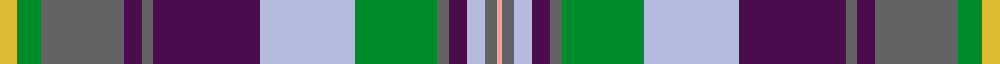

This is one **variant** — a specific cloth: this exact thread count and colourway, with its own
provenance below. It is one weaving of the [sett](/tartans/e/en/enable/) (the scale-free proportion — the
same cloth at any scale or shade), whose colour order is pattern [YBWBBGWBBBBGY](/stripes/ybwbbgwbbbbgy/).

Part of the [Enable](/tartans/e/en/enable/) tartan — the named design grouping this sett with its other cloths.

Sourced from tartans-authority.  It is a [13 stripe tartan](/stripes/stripes13/).

Original link <code>http://www.tartansauthority.com/tartan-ferret/display/8700/</code> — retired · [Internet Archive copy](https://web.archive.org/web/*/http://www.tartansauthority.com/tartan-ferret/display/8700/*)

Dataset <small>— provenance for this record, inherited from the source manifest</small>

<dl class="dataset-prov">
<dt>source</dt><dd><a href="/sources/tartans-authority/">Scottish Tartans Authority</a></dd>
<dt>data captured from</dt><dd><a href="https://github.com/thetartan/tartan-database/blob/master/data/tartans-authority/data.csv">https://github.com/thetartan/tartan-database/blob/master/data/tartans-authority/data.csv</a></dd>
<dt>data date</dt><dd>pre 2014 <small>(this record)</small></dd>
<dt>licence</dt><dd><a href="https://creativecommons.org/licenses/by-nc-nd/4.0/">CC BY-NC-ND 4.0</a></dd>
</dl>

Capture chain <small>— the hands this data passed through, oldest first; each capture carries its own licence</small>

<ol class="capture-chain">
<li><a href="https://www.tartansauthority.com/">Scottish Tartans Authority</a> <small>the heritage body’s archive — its tartan-ferret record browser is retired; dead record links are shown unlinked, with an Internet Archive copy (ITI numbers are not SRT references)</small></li>
<li><a href="https://github.com/thetartan/tartan-database">thetartan/tartan-database</a> <small>2016-2017</small> · <a href="https://creativecommons.org/licenses/by-nc-nd/4.0/">CC BY-NC-ND 4.0</a> <small>Levko Kravets's frozen compilation — the capture we vendored, and where its CC licence text came from</small></li>
<li>this dictionary <small>captured 2026-06-10 · commit 5bf86c7566</small> <small>each re-capture is a git commit to data/sources</small></li>
</ol>

## Register references

External register numbers recorded for this tartan.

- Scottish Register of Tartans: [8700](https://www.tartanregister.gov.uk/tartanDetails?ref=8700)
- Scottish Tartans Authority (ITI): 8700

## Thread count
LY/6 G8 N28 DP6 N4 DP36 LB32 G28 N4 DP6 LB6 N4 LR/2

One full sett is **332 threads**.

## Palette
<table><thead><tr><th>Colour</th><th>Shade</th><th>OKLCh</th></tr></thead><tbody><tr><td>G</td><td><code style="background-color:#008B2A;">#008B2A</code> <small style="color:#888">#008B2A</small></td><td><small style="color:#888">oklch(55.4% 0.170 145.9)</small></td></tr><tr><td>DP</td><td><code style="background-color:#4B0B4F;">#4B0B4F</code> <small style="color:#888">#4B0B4F</small></td><td><small style="color:#888">oklch(30.1% 0.125 325.4)</small></td></tr><tr><td>LB</td><td><code style="background-color:#B5BBDE;">#B5BBDE</code> <small style="color:#888">#B5BBDE</small></td><td><small style="color:#888">oklch(79.9% 0.050 277.6)</small></td></tr><tr><td>LR</td><td><code style="background-color:#FF9C97;">#FF9C97</code> <small style="color:#888">#FF9C97</small></td><td><small style="color:#888">oklch(79.3% 0.119 23.2)</small></td></tr><tr><td>N</td><td><code style="background-color:#636363;">#636363</code> <small style="color:#888">#636363</small></td><td><small style="color:#888">oklch(50.0% 0.000 89.9)</small></td></tr><tr><td>LY</td><td><code style="background-color:#DCBC32;">#DCBC32</code> <small style="color:#888">#DCBC32</small></td><td><small style="color:#888">oklch(80.0% 0.150 95.2)</small></td></tr></tbody></table>

# Sample pattern

## Nearest tartan variants

The nearest existing variants by ΔTartan distance, with this cloth at the top so the swatches line up against it.

ΔTartan

Threads

Variant

Sett

—

332

<a href="/variants/s13/ly3g4n14dp3n2dp18lb16g14n2dp3lb3n2lr1~x2/">Enable (Corporate)</a>

<a href="/ttd/edit/#slug=y3lb21db12g3db3y3db3gi8g5db2g7w3~x2~db1003265-gi1902194&amp;base=ly3g4n14dp3n2dp18lb16g14n2dp3lb3n2lr1~x2" title="compare in the TTD">2.60</a>

280

<a href="/variants/s12/y3lb21db12g3db3y3db3gi8g5db2g7w3~x2~db1003265-gi1902194/">Holroyd, John (Personal)</a>

<a href="/ttd/edit/#slug=w3g7dt2g5db8dt3ly3dt3g3dt12lb21ly3~x2~dt1204274-db1406275&amp;base=ly3g4n14dp3n2dp18lb16g14n2dp3lb3n2lr1~x2" title="compare in the TTD">2.77</a>

280

<a href="/variants/s12/w3g7db2g5dbi8db3ly3db3g3db12lb21ly3~x2~db1204274-dbi1406275/">Holroyd, John (Personal</a>

<a href="/ttd/edit/#slug=w2n1lr12o2lr2o2lr2o2lr2dp10o1dp10g12n2g4lr2~x2~n1900000-lr3000000-o2404317-dp1105325&amp;base=ly3g4n14dp3n2dp18lb16g14n2dp3lb3n2lr1~x2" title="compare in the TTD">3.12</a>

264

<a href="/variants/s16/w2n1lr12o2lr2o2lr2o2lr2dp10o1dp10g12n2g4lr2~x2~n1900000-lr3000000-o2404317-dp1105325/">Cribb (2016)</a>

<a href="/ttd/edit/#slug=dy1lb3dp14w2db22w2g14dy3lb1~x2~db1406275&amp;base=ly3g4n14dp3n2dp18lb16g14n2dp3lb3n2lr1~x2" title="compare in the TTD">3.13</a>

244

<a href="/variants/s9/dy1lb3dp14w2db22w2g14dy3lb1~x2~db1406275/">Yule Name Tartan</a>

<a href="/ttd/edit/#slug=db16n8dy1n1w1n1lb6g3n1g3w1~x4~db1003265-n2203265&amp;base=ly3g4n14dp3n2dp18lb16g14n2dp3lb3n2lr1~x2" title="compare in the TTD">3.14</a>

268

<a href="/variants/s11/db16n8dy1n1w1n1lb6g3n1g3w1~x4~db1003265-n2203265/">Brighton &amp; Hove</a>

<a href="/ttd/edit/#slug=lp66db2lo14db2ly5b8db12dg60g60lp2db25~dg1806142-g2304202&amp;base=ly3g4n14dp3n2dp18lb16g14n2dp3lb3n2lr1~x2" title="compare in the TTD">3.22</a>

421

<a href="/variants/s11/lp66db2lo14db2ly5b8db12dg60g60lp2db25~dg1806142-g2304202/">Dundee Carers' Centre</a>

<a href="/ttd/edit/#slug=g4db34g4dy4db4dy4g3dy13g21dy4w3dr11ly3~x2&amp;base=ly3g4n14dp3n2dp18lb16g14n2dp3lb3n2lr1~x2" title="compare in the TTD">3.32</a>

434

<a href="/variants/s13/g4db34g4dy4db4dy4g3dy13g21dy4w3dr11ly3~x2/">State Seal of Illinois (Fashion)</a>

<a href="/ttd/edit/#slug=y3db5lb12t1lb3t1lb2t2lb2t3lb1t4lb1t8dbi21w3~x2~db1106275-t2304245-dbi1404245&amp;base=ly3g4n14dp3n2dp18lb16g14n2dp3lb3n2lr1~x2" title="compare in the TTD">3.32</a>

276

<a href="/variants/s16/y3db5lb12t1lb3t1lb2t2lb2t3lb1t4lb1t8dbi21w3~x2~db1106275-t2304245-dbi1404245/">Ryder Cup, The</a>

<a href="/ttd/edit/#slug=w3db19w1lb17y11g10w1db3w1~x2&amp;base=ly3g4n14dp3n2dp18lb16g14n2dp3lb3n2lr1~x2" title="compare in the TTD">3.39</a>

256

<a href="/variants/s9/w3db19w1lb17y11g10w1db3w1~x2/">Bird Family (Australia) (Personal)</a>

<a href="/ttd/edit/#slug=g3dp3n2db14g16dp18n2dp3n14db4y3lo1n2~x2&amp;base=ly3g4n14dp3n2dp18lb16g14n2dp3lb3n2lr1~x2" title="compare in the TTD">3.40</a>

330

<a href="/variants/s13/g3dp3n2db14g16dp18n2dp3n14db4y3lo1n2~x2/">ENABLE Scotland</a>

## Neighbour map

Every grey dot is one of 13656 variants placed by the first two principal components of the ΔTartan feature space (42% of its variance). Red is this tartan; blue dots are its nearest — click one to open its page. The map is a flat projection of a many-dimensional space — [how to read it](/posts/neighbourhood-maps/).

<svg viewBox="0 0 640 380" role="img" style="max-width:100%;height:auto;border:1px solid #e0e0e0;border-radius:4px;display:block" xmlns="http://www.w3.org/2000/svg"><image href="/nn/cloud.v1.png" width="640" height="380"/><a href="/variants/s12/y3lb21db12g3db3y3db3gi8g5db2g7w3~x2~db1003265-gi1902194/"><circle cx="119.2" cy="175.0" r="4" fill="#3465a4"><title>Holroyd, John (Personal)</title></circle></a><a href="/variants/s12/w3g7db2g5dbi8db3ly3db3g3db12lb21ly3~x2~db1204274-dbi1406275/"><circle cx="115.8" cy="173.8" r="4" fill="#3465a4"><title>Holroyd, John (Personal</title></circle></a><a href="/variants/s16/w2n1lr12o2lr2o2lr2o2lr2dp10o1dp10g12n2g4lr2~x2~n1900000-lr3000000-o2404317-dp1105325/"><circle cx="121.3" cy="140.1" r="4" fill="#3465a4"><title>Cribb (2016)</title></circle></a><a href="/variants/s9/dy1lb3dp14w2db22w2g14dy3lb1~x2~db1406275/"><circle cx="199.4" cy="143.8" r="4" fill="#3465a4"><title>Yule Name Tartan</title></circle></a><a href="/variants/s11/db16n8dy1n1w1n1lb6g3n1g3w1~x4~db1003265-n2203265/"><circle cx="199.2" cy="141.0" r="4" fill="#3465a4"><title>Brighton &amp; Hove</title></circle></a><a href="/variants/s11/lp66db2lo14db2ly5b8db12dg60g60lp2db25~dg1806142-g2304202/"><circle cx="158.1" cy="114.9" r="4" fill="#3465a4"><title>Dundee Carers' Centre</title></circle></a><a href="/variants/s13/g4db34g4dy4db4dy4g3dy13g21dy4w3dr11ly3~x2/"><circle cx="180.9" cy="161.5" r="4" fill="#3465a4"><title>State Seal of Illinois (Fashion)</title></circle></a><a href="/variants/s16/y3db5lb12t1lb3t1lb2t2lb2t3lb1t4lb1t8dbi21w3~x2~db1106275-t2304245-dbi1404245/"><circle cx="183.2" cy="128.1" r="4" fill="#3465a4"><title>Ryder Cup, The</title></circle></a><a href="/variants/s9/w3db19w1lb17y11g10w1db3w1~x2/"><circle cx="176.5" cy="170.3" r="4" fill="#3465a4"><title>Bird Family (Australia) (Personal)</title></circle></a><a href="/variants/s13/g3dp3n2db14g16dp18n2dp3n14db4y3lo1n2~x2/"><circle cx="204.8" cy="166.8" r="4" fill="#3465a4"><title>ENABLE Scotland</title></circle></a><circle cx="162.7" cy="152.1" r="5" fill="#c00000"/><text x="320" y="376" text-anchor="middle" font-size="11" fill="#999">ground</text><text x="11" y="190" text-anchor="middle" font-size="11" fill="#999" transform="rotate(-90 11 190)">complexity</text></svg>

ID: /variants/s13/ly3g4n14dp3n2dp18lb16g14n2dp3lb3n2lr1~x2/
