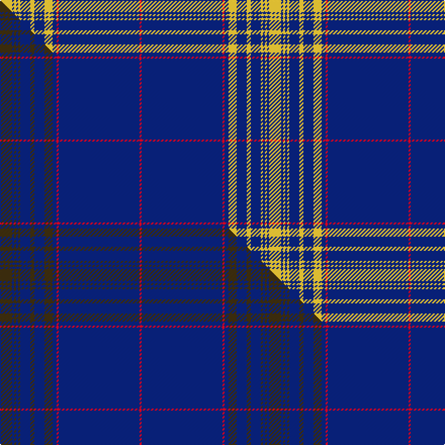

This page is one **sett** — a single exact thread-count. It belongs to the [tartan](/setts/ly6db1ly1db1ly1db5ly2db5ly4db2r1db40r1/)
(the same proportion at any scale), whose colour order is pattern [RBRBYBYBYBYBY](/stripes/rbrbybybybyby/).

Part of the [Angotta](/tartans/angotta/) tartan — the named design grouping this sett with its other cloths.

Sourced from tartans-authority.  It is a [13 stripe tartan](/stripes/stripes13/).

Original link [https://www.tartanregister.gov.uk/tartanDetails.aspx?ref=10038](https://www.tartanregister.gov.uk/tartanDetails.aspx?ref=10038)

Dataset <small>— provenance for this record, inherited from the source manifest</small>

<dl class="dataset-prov">
<dt>source</dt><dd><a href="/sources/tartans-authority/">Scottish Tartans Authority</a></dd>
<dt>data captured from</dt><dd><a href="https://github.com/thetartan/tartan-database/blob/master/data/tartans-authority/data.csv">https://github.com/thetartan/tartan-database/blob/master/data/tartans-authority/data.csv</a></dd>
<dt>data date</dt><dd>Mar. 2009 <small>(this record)</small></dd>
<dt>licence</dt><dd><a href="https://creativecommons.org/licenses/by-nc-nd/4.0/">CC BY-NC-ND 4.0</a></dd>
</dl>

Capture chain <small>— the hands this data passed through, oldest first; each capture carries its own licence</small>

<ol class="capture-chain">
<li><a href="https://www.tartansauthority.com/">Scottish Tartans Authority</a> <small>the heritage body's archive — its tartan-ferret record browser is retired (links repaired to the SRT, above)</small></li>
<li><a href="https://github.com/thetartan/tartan-database">thetartan/tartan-database</a> <small>2016-2017</small> · <a href="https://creativecommons.org/licenses/by-nc-nd/4.0/">CC BY-NC-ND 4.0</a> <small>Levko Kravets's frozen compilation — the capture we vendored, and where its CC licence text came from</small></li>
<li>this dictionary <small>captured 2026-06-10 · commit 5bf86c7566</small> <small>each re-capture is a git commit to data/sources</small></li>
</ol>

## Register references

External register numbers recorded for this tartan.

- Scottish Register of Tartans: [10038](https://www.tartanregister.gov.uk/tartanDetails?ref=10038)
- Scottish Tartans Authority (ITI): 10038

## Thread count
LY/12 DB2 LY2 DB2 LY2 DB10 LY4 DB10 LY8 DB4 R2 DB80 R/2

One full sett is **266 threads**.

## Palette
<table><thead><tr><th>Colour</th><th>Shade</th><th>OKLCh</th></tr></thead><tbody><tr><td>DB</td><td><code style="background-color:#082077;">#082077</code> <small style="color:#888">#082077</small></td><td><small style="color:#888">oklch(30.0% 0.149 265.1)</small></td></tr><tr><td>LY</td><td><code style="background-color:#DCBC32;">#DCBC32</code> <small style="color:#888">#DCBC32</small></td><td><small style="color:#888">oklch(80.0% 0.150 95.2)</small></td></tr><tr><td>R</td><td><code style="background-color:#D60020;">#D60020</code> <small style="color:#888">#D60020</small></td><td><small style="color:#888">oklch(55.2% 0.224 25.5)</small></td></tr></tbody></table>

# Sample pattern

## Compared to the master

This cloth is one sett of its design; the master sett (the exemplar the design is anchored on) is below for comparison.

Its **ΔTartan distance** from the master is **0.16** — the same measure the nearest-tartans table ranks by (0 is identical; a re-scale of the same cloth is near 0, a recolour or a different proportion further).

<figure class="master-compare" style="margin:0">

this sett
master sett ★

<figcaption style="color:#888;font-size:smaller">One weave of this sett against the <a href="/setts/dy6db1dy1db1dy1db5dy2db5dy4db2r1db40r1/">master sett ★</a>, split on the diagonal: a shared proportion runs seamlessly across it with only the shades shifting; a different proportion breaks on it.</figcaption>
</figure>

## Nearest tartan variants

The nearest existing variants by ΔTartan distance, with this cloth at the top so the swatches line up against it.

ΔTartan

Threads

Variant

Sett

—

266

<a href="/variants/s13/ly6db1ly1db1ly1db5ly2db5ly4db2r1db40r1~x2/">Angotta (Name)</a>

<a href="/ttd/edit/#slug=db23k1db1w1db1r1db4y2db1y2db1y2db1y2~x2&amp;base=ly6db1ly1db1ly1db5ly2db5ly4db2r1db40r1~x2" title="compare in the TTD">2.32</a>

122

<a href="/variants/s14/db23k1db1w1db1r1db4y2db1y2db1y2db1y2~x2/">King Pootatau Te Wherowhero</a>

<a href="/ttd/edit/#slug=db62w2db4w5db6y2r8y3w4~x2&amp;base=ly6db1ly1db1ly1db5ly2db5ly4db2r1db40r1~x2" title="compare in the TTD">2.97</a>

252

<a href="/variants/s9/db62w2db4w5db6y2r8y3w4~x2/">George, Stuart (Personal)</a>

<a href="/ttd/edit/#slug=db63ly3w3db8ly3db3w3db3r14db9ly3~x2&amp;base=ly6db1ly1db1ly1db5ly2db5ly4db2r1db40r1~x2" title="compare in the TTD">3.30</a>

328

<a href="/variants/s11/db63ly3w3db8ly3db3w3db3r14db9ly3~x2/">Ottawa Fire Service (Corporate)</a>

<a href="/ttd/edit/#slug=db40ly1db1r9db1ly1db6ly1db1r9~x2&amp;base=ly6db1ly1db1ly1db5ly2db5ly4db2r1db40r1~x2" title="compare in the TTD">3.47</a>

182

<a href="/variants/s10/db40ly1db1r9db1ly1db6ly1db1r9~x2/">Miyuki</a>

<a href="/ttd/edit/#slug=w3db4w1db2g1db3r10db2r2db3g1db3r2db32r1~x2&amp;base=ly6db1ly1db1ly1db5ly2db5ly4db2r1db40r1~x2" title="compare in the TTD">3.56</a>

272

<a href="/variants/s15/w3db4w1db2g1db3r10db2r2db3g1db3r2db32r1~x2/">International School of Aberdeen</a>

<a href="/ttd/edit/#slug=db50w4db8y1db8y8g1y8db8w1db8y4~x2&amp;base=ly6db1ly1db1ly1db5ly2db5ly4db2r1db40r1~x2" title="compare in the TTD">3.60</a>

328

<a href="/variants/s12/db50w4db8y1db8y8g1y8db8w1db8y4~x2/">Herry (2016)</a>

<a href="/ttd/edit/#slug=db60r2db2r6db1r2db1r6db1r2db1r6db2n2~x2&amp;base=ly6db1ly1db1ly1db5ly2db5ly4db2r1db40r1~x2" title="compare in the TTD">3.61</a>

252

<a href="/variants/s14/db60r2db2r6db1r2db1r6db1r2db1r6db2n2~x2/">Abaco Loyalist</a>

<a href="/ttd/edit/#slug=db66w2db10w2db10w2db12r3lb24~x2&amp;base=ly6db1ly1db1ly1db5ly2db5ly4db2r1db40r1~x2" title="compare in the TTD">3.68</a>

344

<a href="/variants/s9/db66w2db10w2db10w2db12r3lb24~x2/">RAAF</a>

<a href="/ttd/edit/#slug=t7db5lr6db5r7db2t2db70lr2&amp;base=ly6db1ly1db1ly1db5ly2db5ly4db2r1db40r1~x2" title="compare in the TTD">3.70</a>

203

<a href="/variants/s9/t7db5lr6db5r7db2t2db70lr2/">United States (Personal)</a>

<a href="/ttd/edit/#slug=db35g3w3r3db35r2db3w2db5w1db5r1db8r1db5w1db5w2db3r2~x2&amp;base=ly6db1ly1db1ly1db5ly2db5ly4db2r1db40r1~x2" title="compare in the TTD">3.75</a>

426

<a href="/variants/s20/db35g3w3r3db35r2db3w2db5w1db5r1db8r1db5w1db5w2db3r2~x2/">Martha De Laurentiis</a>

## Neighbour map

Every grey dot is one of 13621 variants placed by the first two principal components of the ΔTartan feature space (42% of its variance). Red is this tartan; blue dots are its nearest — click one to open its page.

<svg viewBox="0 0 640 380" role="img" style="max-width:100%;height:auto;border:1px solid #e0e0e0;border-radius:4px;display:block" xmlns="http://www.w3.org/2000/svg"><image href="/nn/cloud.v1.png" width="640" height="380"/><a href="/variants/s14/db23k1db1w1db1r1db4y2db1y2db1y2db1y2~x2/"><circle cx="451.8" cy="69.1" r="4" fill="#3465a4"><title>King Pootatau Te Wherowhero</title></circle></a><a href="/variants/s9/db62w2db4w5db6y2r8y3w4~x2/"><circle cx="468.1" cy="92.9" r="4" fill="#3465a4"><title>George, Stuart (Personal)</title></circle></a><a href="/variants/s11/db63ly3w3db8ly3db3w3db3r14db9ly3~x2/"><circle cx="454.6" cy="105.6" r="4" fill="#3465a4"><title>Ottawa Fire Service (Corporate)</title></circle></a><a href="/variants/s10/db40ly1db1r9db1ly1db6ly1db1r9~x2/"><circle cx="491.6" cy="102.5" r="4" fill="#3465a4"><title>Miyuki</title></circle></a><a href="/variants/s15/w3db4w1db2g1db3r10db2r2db3g1db3r2db32r1~x2/"><circle cx="437.4" cy="78.3" r="4" fill="#3465a4"><title>International School of Aberdeen</title></circle></a><a href="/variants/s12/db50w4db8y1db8y8g1y8db8w1db8y4~x2/"><circle cx="517.7" cy="101.0" r="4" fill="#3465a4"><title>Herry (2016)</title></circle></a><a href="/variants/s14/db60r2db2r6db1r2db1r6db1r2db1r6db2n2~x2/"><circle cx="539.9" cy="65.2" r="4" fill="#3465a4"><title>Abaco Loyalist</title></circle></a><a href="/variants/s9/db66w2db10w2db10w2db12r3lb24~x2/"><circle cx="466.6" cy="113.3" r="4" fill="#3465a4"><title>RAAF</title></circle></a><a href="/variants/s9/t7db5lr6db5r7db2t2db70lr2/"><circle cx="547.5" cy="79.0" r="4" fill="#3465a4"><title>United States (Personal)</title></circle></a><a href="/variants/s20/db35g3w3r3db35r2db3w2db5w1db5r1db8r1db5w1db5w2db3r2~x2/"><circle cx="531.3" cy="68.6" r="4" fill="#3465a4"><title>Martha De Laurentiis</title></circle></a><circle cx="515.6" cy="78.9" r="5" fill="#c00000"/><text x="320" y="376" text-anchor="middle" font-size="11" fill="#999">ground</text><text x="11" y="190" text-anchor="middle" font-size="11" fill="#999" transform="rotate(-90 11 190)">complexity</text></svg>

ID: /variants/s13/ly6db1ly1db1ly1db5ly2db5ly4db2r1db40r1~x2/
