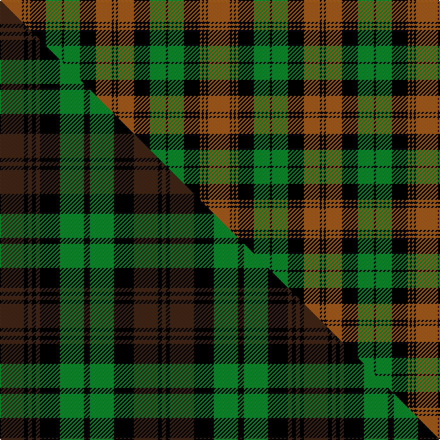

This is one **variant** — a specific cloth: this exact thread count and colourway, with its own
provenance below. It is one weaving of the [sett](/setts/o11k1o1k1o1k8g8k1g8k8o8k1o1/) (the scale-free proportion — the
same cloth at any scale or shade), whose colour order is pattern [RKRKGKGKRKRKR](/stripes/rkrkgkgkrkrkr/).

Part of the [Brown Watch](/tartans/brown-watch-2/) tartan — the named design grouping this sett with its other cloths.

Sourced from weddslist.  It is a [13 stripe tartan](/stripes/stripes13/).

Original link [http://www.weddslist.com/cgi-bin/tartans/pg.pl?source=sts](http://www.weddslist.com/cgi-bin/tartans/pg.pl?source=sts)

Dataset <small>— provenance for this record, inherited from the source manifest</small>

<dl class="dataset-prov">
<dt>source</dt><dd><a href="/sources/weddslist/">Weddslist</a></dd>
<dt>data captured from</dt><dd><a href="https://github.com/thetartan/tartan-database/blob/master/data/weddslist/data.csv">https://github.com/thetartan/tartan-database/blob/master/data/weddslist/data.csv</a></dd>
<dt>data date</dt><dd>2016-11-17 <small>(dataset default)</small></dd>
<dt>licence</dt><dd><a href="https://creativecommons.org/licenses/by-nc-nd/4.0/">CC BY-NC-ND 4.0</a></dd>
</dl>

Capture chain <small>— the hands this data passed through, oldest first; each capture carries its own licence</small>

<ol class="capture-chain">
<li><a href="https://www.weddslist.com/tartans/">Weddslist</a> <small>the living privately compiled reference</small></li>
<li><a href="https://github.com/thetartan/tartan-database">thetartan/tartan-database</a> <small>2016-2017</small> · <a href="https://creativecommons.org/licenses/by-nc-nd/4.0/">CC BY-NC-ND 4.0</a> <small>Levko Kravets's frozen compilation — the capture we vendored, and where its CC licence text came from</small></li>
<li>this dictionary <small>captured 2026-06-10 · commit 5bf86c7566</small> <small>each re-capture is a git commit to data/sources</small></li>
</ol>

## Thread count
O/22 K2 O2 K2 O2 K16 G16 K2 G16 K16 O16 K2 O/2

One full sett is **208 threads**.

## Palette
<table><thead><tr><th>Colour</th><th>Shade</th><th>OKLCh</th></tr></thead><tbody><tr><td>G</td><td><code style="background-color:#008B2A;">#008B2A</code> <small style="color:#888">#008B2A</small></td><td><small style="color:#888">oklch(55.4% 0.170 145.9)</small></td></tr><tr><td>K</td><td><code style="background-color:#000000;">#000000</code> <small style="color:#888">#000000</small></td><td><small style="color:#888">oklch(0.0% 0.000 0.0)</small></td></tr><tr><td>O</td><td><code style="background-color:#A65C11;">#A65C11</code> <small style="color:#888">#A65C11</small></td><td><small style="color:#888">oklch(55.0% 0.125 58.3)</small></td></tr></tbody></table>

# Sample pattern

## Compared to the master

This cloth is one sett of its design; the master sett (the exemplar the design is anchored on) is below for comparison.

Its **ΔTartan distance** from the master is **0.48** — the same measure the nearest-tartans table ranks by (0 is identical; a re-scale of the same cloth is near 0, a recolour or a different proportion further).

<figure class="master-compare" style="margin:0">

this sett
master sett ★

<figcaption style="color:#888;font-size:smaller">One weave of this sett against the <a href="/setts/do12k2do2k2do2k10g12k3g12k10do12k2do2/">master sett ★</a>, split on the diagonal: a shared proportion runs seamlessly across it with only the shades shifting; a different proportion breaks on it.</figcaption>
</figure>

## Nearest tartan variants

The nearest existing variants by ΔTartan distance, with this cloth at the top so the swatches line up against it.

ΔTartan

Threads

Variant

Sett

—

208

<a href="/variants/s13/o11k1o1k1o1k8g8k1g8k8o8k1o1~x2/">Brown, Watch</a>

<a href="/ttd/edit/#slug=do12k2do2k2do2k10g12k3g12k10do12k2do2~x2&amp;base=o11k1o1k1o1k8g8k1g8k8o8k1o1~x2" title="compare in the TTD">0.48</a>

304

<a href="/variants/s13/do12k2do2k2do2k10g12k3g12k10do12k2do2~x2/">Brown Watch (Fashion)</a>

<a href="/ttd/edit/#slug=o25k4o4k4o4k23g23y4g23k23o23k4o4~x2&amp;base=o11k1o1k1o1k8g8k1g8k8o8k1o1~x2" title="compare in the TTD">1.37</a>

614

<a href="/variants/s13/o25k4o4k4o4k23g23y4g23k23o23k4o4~x2/">Poulter, Green (Corporate)</a>

<a href="/ttd/edit/#slug=g7k2g7y1k2y1k10y3r10y3k10y1g11k2g3k2~x2&amp;base=o11k1o1k1o1k8g8k1g8k8o8k1o1~x2" title="compare in the TTD">2.29</a>

282

<a href="/variants/s16/g7k2g7y1k2y1k10y3r10y3k10y1g11k2g3k2~x2/">Blackburn Appalachian Hunting</a>

<a href="/ttd/edit/#slug=dy11k1dy1k1dy1k8g8k1g8k8dy8k1dy1~x4&amp;base=o11k1o1k1o1k8g8k1g8k8o8k1o1~x2" title="compare in the TTD">2.43</a>

416

<a href="/variants/s13/dy11k1dy1k1dy1k8g8k1g8k8dy8k1dy1~x4/">Brown Watch Trade Tartan</a>

<a href="/ttd/edit/#slug=k1db1r1k8r1g6r6db1k6r1g8r1k1~x2&amp;base=o11k1o1k1o1k8g8k1g8k8o8k1o1~x2" title="compare in the TTD">2.48</a>

164

<a href="/variants/s13/k1db1r1k8r1g6r6db1k6r1g8r1k1~x2/">Cumming (d)</a>

<a href="/ttd/edit/#slug=k1db1r1k8r1g6r6db1k6r1g8r1k1&amp;base=o11k1o1k1o1k8g8k1g8k8o8k1o1~x2" title="compare in the TTD">2.48</a>

82

<a href="/variants/s13/k1db1r1k8r1g6r6db1k6r1g8r1k1/">Cumming</a>

<a href="/ttd/edit/#slug=ly18k3ly3k3ly3k13dg16k4dg16k13ly16k3ly3~x2&amp;base=o11k1o1k1o1k8g8k1g8k8o8k1o1~x2" title="compare in the TTD">2.56</a>

414

<a href="/variants/s13/ly18k3ly3k3ly3k13dg16k4dg16k13ly16k3ly3~x2/">Campbell Collegiate (Corporate)</a>

<a href="/ttd/edit/#slug=y18k3y3k3y3k13dg16k4dg16k13y16k3y3~x2&amp;base=o11k1o1k1o1k8g8k1g8k8o8k1o1~x2" title="compare in the TTD">2.79</a>

414

<a href="/variants/s13/y18k3y3k3y3k13dg16k4dg16k13y16k3y3~x2/">Campbell Collegiate</a>

<a href="/ttd/edit/#slug=g24k3g2k3g4k4r20k3r6~x2&amp;base=o11k1o1k1o1k8g8k1g8k8o8k1o1~x2" title="compare in the TTD">2.93</a>

216

<a href="/variants/s9/g24k3g2k3g4k4r20k3r6~x2/">Alma College (Corporate)</a>

<a href="/ttd/edit/#slug=k21g2k2g2k3g15r29g2r2g4~x2~r2109032&amp;base=o11k1o1k1o1k8g8k1g8k8o8k1o1~x2" title="compare in the TTD">2.96</a>

278

<a href="/variants/s10/k21g2k2g2k3g15r29g2r2g4~x2~r2109032/">City of Armadale</a>

## Neighbour map

Every grey dot is one of 13621 variants placed by the first two principal components of the ΔTartan feature space (42% of its variance). Red is this tartan; blue dots are its nearest — click one to open its page.

<svg viewBox="0 0 640 380" role="img" style="max-width:100%;height:auto;border:1px solid #e0e0e0;border-radius:4px;display:block" xmlns="http://www.w3.org/2000/svg"><image href="/nn/cloud.v1.png" width="640" height="380"/><a href="/variants/s13/do12k2do2k2do2k10g12k3g12k10do12k2do2~x2/"><circle cx="159.5" cy="212.7" r="4" fill="#3465a4"><title>Brown Watch (Fashion)</title></circle></a><a href="/variants/s13/o25k4o4k4o4k23g23y4g23k23o23k4o4~x2/"><circle cx="119.3" cy="187.0" r="4" fill="#3465a4"><title>Poulter, Green (Corporate)</title></circle></a><a href="/variants/s16/g7k2g7y1k2y1k10y3r10y3k10y1g11k2g3k2~x2/"><circle cx="132.7" cy="156.2" r="4" fill="#3465a4"><title>Blackburn Appalachian Hunting</title></circle></a><a href="/variants/s13/dy11k1dy1k1dy1k8g8k1g8k8dy8k1dy1~x4/"><circle cx="195.9" cy="179.6" r="4" fill="#3465a4"><title>Brown Watch Trade Tartan</title></circle></a><a href="/variants/s13/k1db1r1k8r1g6r6db1k6r1g8r1k1~x2/"><circle cx="133.0" cy="158.4" r="4" fill="#3465a4"><title>Cumming (d)</title></circle></a><a href="/variants/s13/k1db1r1k8r1g6r6db1k6r1g8r1k1/"><circle cx="133.0" cy="158.4" r="4" fill="#3465a4"><title>Cumming</title></circle></a><a href="/variants/s13/ly18k3ly3k3ly3k13dg16k4dg16k13ly16k3ly3~x2/"><circle cx="128.5" cy="203.2" r="4" fill="#3465a4"><title>Campbell Collegiate (Corporate)</title></circle></a><a href="/variants/s13/y18k3y3k3y3k13dg16k4dg16k13y16k3y3~x2/"><circle cx="162.0" cy="212.4" r="4" fill="#3465a4"><title>Campbell Collegiate</title></circle></a><a href="/variants/s9/g24k3g2k3g4k4r20k3r6~x2/"><circle cx="224.9" cy="165.2" r="4" fill="#3465a4"><title>Alma College (Corporate)</title></circle></a><a href="/variants/s10/k21g2k2g2k3g15r29g2r2g4~x2~r2109032/"><circle cx="206.2" cy="145.2" r="4" fill="#3465a4"><title>City of Armadale</title></circle></a><circle cx="172.6" cy="169.1" r="5" fill="#c00000"/><text x="320" y="376" text-anchor="middle" font-size="11" fill="#999">ground</text><text x="11" y="190" text-anchor="middle" font-size="11" fill="#999" transform="rotate(-90 11 190)">complexity</text></svg>

ID: /variants/s13/o11k1o1k1o1k8g8k1g8k8o8k1o1~x2/
