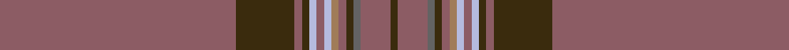

This page is one **sett** — a single exact thread-count. It belongs to the [tartan](/setts/o32dy8o1dy1lb1o1lb1oi1o1dy1n1o4dy1/)
(the same proportion at any scale), whose colour order is pattern [GRBGRRWRWGRGR](/stripes/grbgrrwrwgrgr/).

Sourced from register-of-tartans.  It is a [13 stripe tartan](/stripes/stripes13/).

Original link https://www.tartanregister.gov.uk/tartanDetails.aspx?ref=3296

2 attestations — the source records this cloth was collapsed from (oldest owns this page)

<ul>
<li>01/01/1983 — Parma (register-of-tartans, <a href="https://www.tartanregister.gov.uk/tartanDetails.aspx?ref=3296">record</a>)  <em>Sample in Scottish Tartans Authority's Johnston Collection.</em></li>
<li>pre 1983 — Parma (Fashion) (tartans-authority, <a href="http://www.tartansauthority.com/tartan-ferret/display/5516/">record</a>)  <em>Sample in STA Johnston Collection.</em></li>
</ul>

## Register references

External register numbers recorded for this tartan.

- Scottish Register of Tartans: [3296](https://www.tartanregister.gov.uk/tartanDetails.aspx?ref=3296)
- Scottish Tartans Authority (ITI): 5516

## Thread count
O/128 DY32 O4 DY4 LB4 O4 LB4 Oi4 O4 DY4 N4 O16 DY/4

One full sett is **300 threads**.

## Palette
<table><thead><tr><th>Colour</th><th>Shade</th><th>OKLCh</th></tr></thead><tbody><tr><td>O</td><td><code style="background-color:#8C5C64;">#8C5C64</code> <small style="color:#888">#8C5C64</small></td><td><small style="color:#888">oklch(52.9% 0.064 8.6)</small></td></tr><tr><td>O</td><td><code style="background-color:#A07C58;">#A07C58</code> <small style="color:#888">#A07C58</small></td><td><small style="color:#888">oklch(61.2% 0.067 66.0)</small></td></tr><tr><td>N</td><td><code style="background-color:#636363;">#636363</code> <small style="color:#888">#636363</small></td><td><small style="color:#888">oklch(50.0% 0.000 89.9)</small></td></tr><tr><td>LB</td><td><code style="background-color:#B5BBDE;">#B5BBDE</code> <small style="color:#888">#B5BBDE</small></td><td><small style="color:#888">oklch(79.9% 0.050 277.6)</small></td></tr><tr><td>DY</td><td><code style="background-color:#3A2B0D;">#3A2B0D</code> <small style="color:#888">#3A2B0D</small></td><td><small style="color:#888">oklch(30.0% 0.049 82.0)</small></td></tr></tbody></table>

# Sample pattern

## Nearest tartan variants

The nearest existing variants by ΔTartan distance, with this cloth at the top so the swatches line up against it.

ΔTartan

Threads

Variant

Sett

—

300

<a href="/variants/s13/o32dy8o1dy1lb1o1lb1oi1o1dy1n1o4dy1~x4~o2103000-oi2403057/">Parma</a>

<a href="/ttd/edit/#slug=dt110o3lr14w1dp10w1lr6o3dp4dt2~x2~dt1700000-lr2800000&amp;base=o32dy8o1dy1lb1o1lb1oi1o1dy1n1o4dy1~x4~o2103000-oi2403057" title="compare in the TTD">3.07</a>

392

<a href="/variants/s10/n110o3lr14w1dp10w1lr6o3dp4n2~x2~n1700000-lr2800000/">Vetoclock</a>

<a href="/ttd/edit/#slug=n110lp3o14w1dp10w1o6lp3dp4n2~x2~n1900000-o2500000&amp;base=o32dy8o1dy1lb1o1lb1oi1o1dy1n1o4dy1~x4~o2103000-oi2403057" title="compare in the TTD">3.17</a>

392

<a href="/variants/s10/n110lp3o14w1dp10w1o6lp3dp4n2~x2~n1900000-o2500000/">Vetoclock</a>

<a href="/ttd/edit/#slug=n44do4n1k1n4y4k1db4do4~x2&amp;base=o32dy8o1dy1lb1o1lb1oi1o1dy1n1o4dy1~x4~o2103000-oi2403057" title="compare in the TTD">3.64</a>

172

<a href="/variants/s9/n44do4n1k1n4y4k1db4do4~x2/">Fermanagh (1990)</a>

## Neighbour map

Every grey dot is one of 13620 variants placed by the first two principal components of the ΔTartan feature space (42% of its variance). Red is this tartan; blue dots are its nearest — click one to open its page.

<svg viewBox="0 0 640 380" role="img" style="max-width:100%;height:auto;border:1px solid #e0e0e0;border-radius:4px;display:block" xmlns="http://www.w3.org/2000/svg"><image href="/nn/cloud.v1.png" width="640" height="380"/><a href="/variants/s10/n110o3lr14w1dp10w1lr6o3dp4n2~x2~n1700000-lr2800000/"><circle cx="574.9" cy="86.3" r="4" fill="#3465a4"><title>Vetoclock</title></circle></a><a href="/variants/s10/n110lp3o14w1dp10w1o6lp3dp4n2~x2~n1900000-o2500000/"><circle cx="602.8" cy="98.8" r="4" fill="#3465a4"><title>Vetoclock</title></circle></a><a href="/variants/s9/n44do4n1k1n4y4k1db4do4~x2/"><circle cx="556.9" cy="96.4" r="4" fill="#3465a4"><title>Fermanagh (1990)</title></circle></a><circle cx="573.5" cy="94.7" r="5" fill="#c00000"/><text x="320" y="376" text-anchor="middle" font-size="11" fill="#999">ground</text><text x="11" y="190" text-anchor="middle" font-size="11" fill="#999" transform="rotate(-90 11 190)">complexity</text></svg>

ID: /variants/s13/o32dy8o1dy1lb1o1lb1oi1o1dy1n1o4dy1~x4~o2103000-oi2403057/
