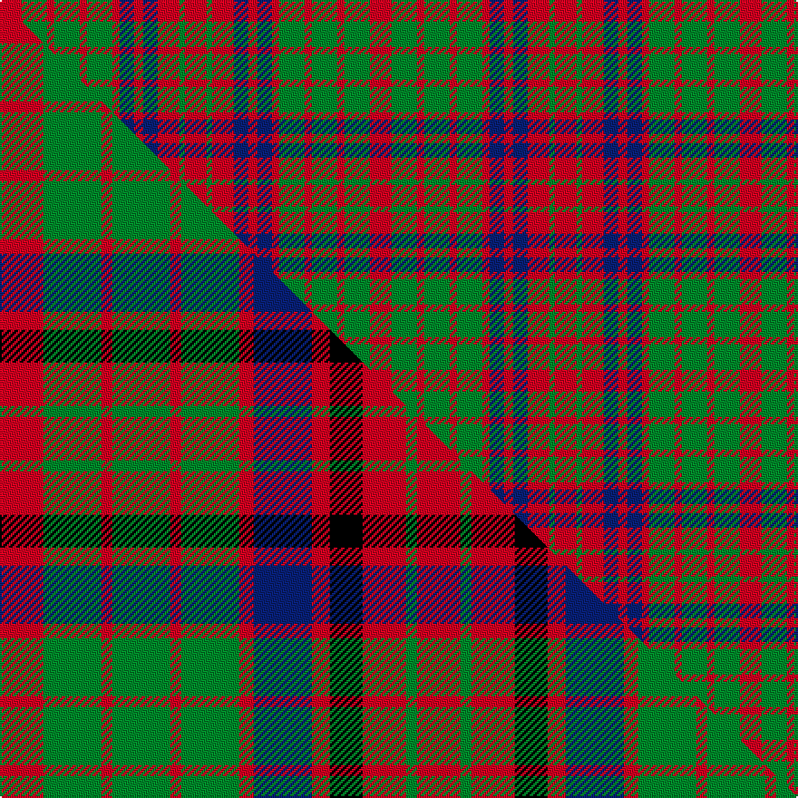

This page is one **sett** — a single exact thread-count. It belongs to the [tartan](/setts/r12g14r4g14r4g14r4db8r5db8r12g3r12/)
(the same proportion at any scale), whose colour order is pattern [RGRBRBRGRGRGR](/stripes/rgrbrbrgrgrgr/).

Part of the [Grant of Monymusk](/tartans/grant-of-monymusk/) tartan — the named design grouping this sett with its other cloths.

Sourced from weddslist.  It is a [13 stripe tartan](/stripes/stripes13/).

Original link http://www.weddslist.com/cgi-bin/tartans/pg.pl?source=rb

2 attestations — the source records this cloth was collapsed from (oldest owns this page)

<ul>
<li>undated — Grant of Monymusk (weddslist, <a href="http://www.weddslist.com/cgi-bin/tartans/pg.pl?source=rb">record</a>) </li>
<li>undated — Grant of Monymusk (weddslist, <a href="http://www.weddslist.com/cgi-bin/tartans/pg.pl?source=x">record</a>) </li>
</ul>

## Thread count
R/12 G14 R4 G14 R4 G14 R4 DB8 R5 DB8 R12 G3 R/12

One full sett is **204 threads**.

## Palette
<table><thead><tr><th>Colour</th><th>Shade</th><th>OKLCh</th></tr></thead><tbody><tr><td>DB</td><td><code style="background-color:#082077;">#082077</code> <small style="color:#888">#082077</small></td><td><small style="color:#888">oklch(30.0% 0.149 265.1)</small></td></tr><tr><td>G</td><td><code style="background-color:#008B2A;">#008B2A</code> <small style="color:#888">#008B2A</small></td><td><small style="color:#888">oklch(55.4% 0.170 145.9)</small></td></tr><tr><td>R</td><td><code style="background-color:#D60020;">#D60020</code> <small style="color:#888">#D60020</small></td><td><small style="color:#888">oklch(55.2% 0.224 25.5)</small></td></tr></tbody></table>

# Sample pattern

## Compared to the master

This cloth is one sett of its design; the master sett (the exemplar the design is anchored on) is below for comparison.

Its **ΔTartan distance** from the master is **1.77** — the same measure the nearest-tartans table ranks by (0 is identical; a re-scale of the same cloth is near 0, a recolour or a different proportion further).

<figure class="master-compare" style="margin:0">

this sett
master sett ★

<figcaption style="color:#888;font-size:smaller">One weave of this sett against the <a href="/setts/r12g16r3g16r3g16r4db16r5k9r12g3r12/">master sett ★</a>, split on the diagonal: a shared proportion runs seamlessly across it with only the shades shifting; a different proportion breaks on it.</figcaption>
</figure>

## Nearest tartan variants

The nearest existing variants by ΔTartan distance, with this cloth at the top so the swatches line up against it.

ΔTartan

Threads

Variant

Sett

—

204

<a href="/variants/s13/r12g14r4g14r4g14r4db8r5db8r12g3r12/">Grant of Monymusk</a>

<a href="/ttd/edit/#slug=r12g14r4g14r4g14r4db8r5db8r12g3r12~x2&amp;base=r12g14r4g14r4g14r4db8r5db8r12g3r12" title="compare in the TTD">0.00</a>

408

<a href="/variants/s13/r12g14r4g14r4g14r4db8r5db8r12g3r12~x2/">Grant of Monymusk</a>

<a href="/ttd/edit/#slug=r12g16r3g16r3g16r4db16r5k9r12g3r12~x2&amp;base=r12g14r4g14r4g14r4db8r5db8r12g3r12" title="compare in the TTD">0.54</a>

460

<a href="/variants/s13/r12g16r3g16r3g16r4db16r5k9r12g3r12~x2/">Grant of Monymusk</a>

<a href="/ttd/edit/#slug=r10g12r3g12r12g4r5g5r12y4r5g12r4~x2&amp;base=r12g14r4g14r4g14r4db8r5db8r12g3r12" title="compare in the TTD">1.80</a>

372

<a href="/variants/s13/r10g12r3g12r12g4r5g5r12y4r5g12r4~x2/">MacRurie, MacRory</a>

<a href="/ttd/edit/#slug=r8g10r2g10r9g3r4g4r10y3r3g10r3~x2&amp;base=r12g14r4g14r4g14r4db8r5db8r12g3r12" title="compare in the TTD">1.82</a>

294

<a href="/variants/s13/r8g10r2g10r9g3r4g4r10y3r3g10r3~x2/">MacRurie/MacRory</a>

<a href="/ttd/edit/#slug=g21r5g21r21g5r4g5r21w4r5db21r4&amp;base=r12g14r4g14r4g14r4db8r5db8r12g3r12" title="compare in the TTD">1.86</a>

249

<a href="/variants/s12/g21r5g21r21g5r4g5r21w4r5db21r4/">MacRae (Sample)</a>

<a href="/ttd/edit/#slug=r2g2r12db10lb3g10r2g2r2g10r12g2r2~x2&amp;base=r12g14r4g14r4g14r4db8r5db8r12g3r12" title="compare in the TTD">2.17</a>

276

<a href="/variants/s13/r2g2r12db10lb3g10r2g2r2g10r12g2r2~x2/">Matheson (Logan 1831)</a>

<a href="/ttd/edit/#slug=r2g2r12db10lb3g10r2g2r2g10r12g2r2&amp;base=r12g14r4g14r4g14r4db8r5db8r12g3r12" title="compare in the TTD">2.17</a>

138

<a href="/variants/s13/r2g2r12db10lb3g10r2g2r2g10r12g2r2/">Matheson N</a>

<a href="/ttd/edit/#slug=r2g2r12db10w3g10r2g2r2g10r12g2r2&amp;base=r12g14r4g14r4g14r4db8r5db8r12g3r12" title="compare in the TTD">2.17</a>

138

<a href="/variants/s13/r2g2r12db10w3g10r2g2r2g10r12g2r2/">Matheson N</a>

## Neighbour map

Every grey dot is one of 13620 variants placed by the first two principal components of the ΔTartan feature space (42% of its variance). Red is this tartan; blue dots are its nearest — click one to open its page.

<svg viewBox="0 0 640 380" role="img" style="max-width:100%;height:auto;border:1px solid #e0e0e0;border-radius:4px;display:block" xmlns="http://www.w3.org/2000/svg"><image href="/nn/cloud.v1.png" width="640" height="380"/><a href="/variants/s13/r12g14r4g14r4g14r4db8r5db8r12g3r12~x2/"><circle cx="222.0" cy="261.0" r="4" fill="#3465a4"><title>Grant of Monymusk</title></circle></a><a href="/variants/s13/r12g16r3g16r3g16r4db16r5k9r12g3r12~x2/"><circle cx="138.9" cy="217.3" r="4" fill="#3465a4"><title>Grant of Monymusk</title></circle></a><a href="/variants/s13/r10g12r3g12r12g4r5g5r12y4r5g12r4~x2/"><circle cx="286.1" cy="274.2" r="4" fill="#3465a4"><title>MacRurie, MacRory</title></circle></a><a href="/variants/s13/r8g10r2g10r9g3r4g4r10y3r3g10r3~x2/"><circle cx="292.0" cy="261.0" r="4" fill="#3465a4"><title>MacRurie/MacRory</title></circle></a><a href="/variants/s12/g21r5g21r21g5r4g5r21w4r5db21r4/"><circle cx="206.4" cy="219.9" r="4" fill="#3465a4"><title>MacRae (Sample)</title></circle></a><a href="/variants/s13/r2g2r12db10lb3g10r2g2r2g10r12g2r2~x2/"><circle cx="220.7" cy="204.4" r="4" fill="#3465a4"><title>Matheson (Logan 1831)</title></circle></a><a href="/variants/s13/r2g2r12db10lb3g10r2g2r2g10r12g2r2/"><circle cx="220.7" cy="204.4" r="4" fill="#3465a4"><title>Matheson N</title></circle></a><a href="/variants/s13/r2g2r12db10w3g10r2g2r2g10r12g2r2/"><circle cx="212.8" cy="201.9" r="4" fill="#3465a4"><title>Matheson N</title></circle></a><circle cx="222.0" cy="261.0" r="5" fill="#c00000"/><text x="320" y="376" text-anchor="middle" font-size="11" fill="#999">ground</text><text x="11" y="190" text-anchor="middle" font-size="11" fill="#999" transform="rotate(-90 11 190)">complexity</text></svg>

ID: /variants/s13/r12g14r4g14r4g14r4db8r5db8r12g3r12/
