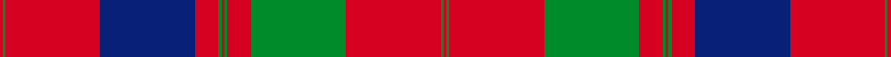
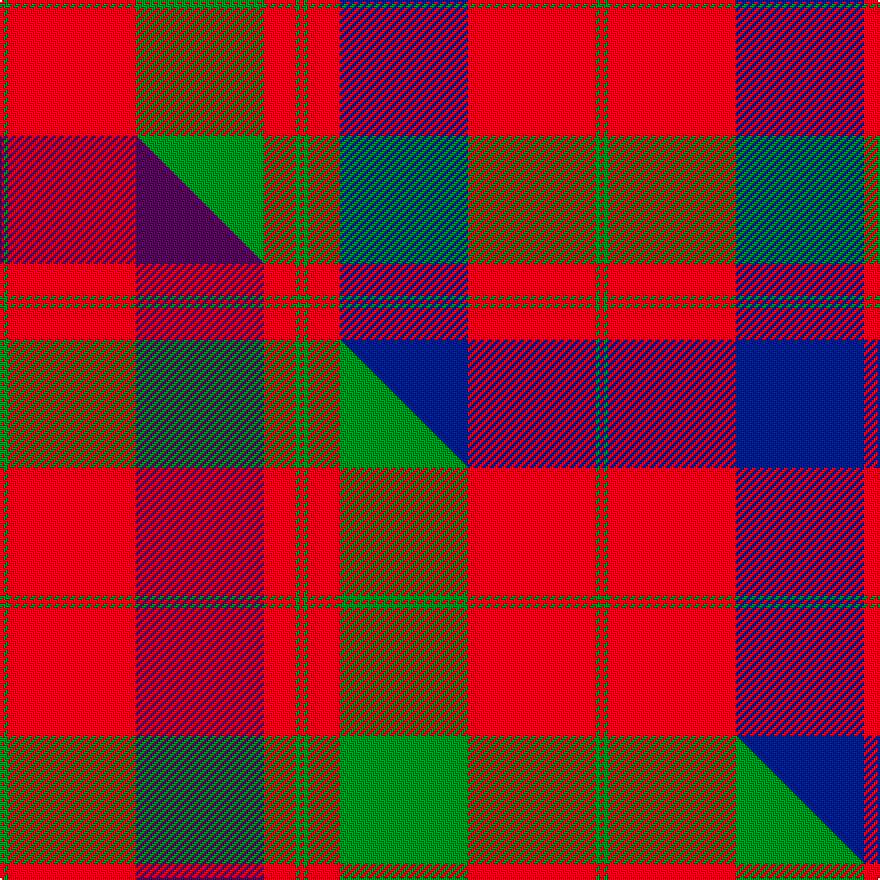

This is one **variant** — a specific cloth: this exact thread count and colourway, with its own
provenance below. It is one weaving of the [sett](/tartans/g/gr/grant-of-rothiemurchus/) (the scale-free proportion — the
same cloth at any scale or shade), whose colour order is pattern [RGRBRGRGRGRGR](/stripes/rgrbrgrgrgrgr/).

Part of the [Grant of Rothiemurchus](/tartans/g/gr/grant-of-rothiemurchus/) tartan — the named design grouping this sett with its other cloths.

Sourced from house-of-tartan.  It is a [13 stripe tartan](/stripes/stripes13/).

Original link [http://www.house-of-tartan.scotland.net/house/TartanViewjs.asp?colr=Def&tnam=1496](http://www.house-of-tartan.scotland.net/house/TartanViewjs.asp?colr=Def&tnam=1496)

## Provenance

Earliest known date: pre 2003 From a wedding plaid recorded by Miss M. MacDougall.

2 attestations — the source records this cloth was collapsed from (oldest owns this page)

<ul>
<li>pre 2003 — Grant of Rothiemurchus Artifact Tartan (house-of-tartan, <a href="http://www.house-of-tartan.scotland.net/house/TartanViewjs.asp?colr=Def&tnam=1496">record</a>) </li>
<li>undated — Grant of Rothiemurchus (weddslist, <a href="http://www.weddslist.com/cgi-bin/tartans/pg.pl?source=sts">record</a>) </li>
</ul>

Dataset <small>— provenance for this record, inherited from the source manifest</small>

<dl class="dataset-prov">
<dt>source</dt><dd><a href="/sources/house-of-tartan/">House of Tartan</a></dd>
<dt>data captured from</dt><dd><a href="https://github.com/thetartan/tartan-database/blob/master/data/house-of-tartan/data.csv">https://github.com/thetartan/tartan-database/blob/master/data/house-of-tartan/data.csv</a></dd>
<dt>data date</dt><dd>pre 2003 <small>(this record)</small></dd>
<dt>licence</dt><dd><a href="https://creativecommons.org/licenses/by-nc-nd/4.0/">CC BY-NC-ND 4.0</a></dd>
</dl>

Capture chain <small>— the hands this data passed through, oldest first; each capture carries its own licence</small>

<ol class="capture-chain">
<li><a href="http://www.house-of-tartan.scotland.net/">House of Tartan</a> <small>the weaver/retailer's database — the site is now offline; the URL is kept as the ultimate source's identity</small></li>
<li><a href="https://github.com/thetartan/tartan-database">thetartan/tartan-database</a> <small>2016-2017</small> · <a href="https://creativecommons.org/licenses/by-nc-nd/4.0/">CC BY-NC-ND 4.0</a> <small>Levko Kravets's frozen compilation — the capture we vendored, and where its CC licence text came from</small></li>
<li>this dictionary <small>captured 2026-06-10 · commit 5bf86c7566</small> <small>each re-capture is a git commit to data/sources</small></li>
</ol>

## Thread count
R/2 G2 R64 DB64 R16 G2 R2 G2 R16 G64 R64 G2 R/2

One full sett is **600 threads**.

## Palette
<table><thead><tr><th>Colour</th><th>Shade</th><th>OKLCh</th></tr></thead><tbody><tr><td>DB</td><td><code style="background-color:#082077;">#082077</code> <small style="color:#888">#082077</small></td><td><small style="color:#888">oklch(30.0% 0.149 265.1)</small></td></tr><tr><td>G</td><td><code style="background-color:#008B2A;">#008B2A</code> <small style="color:#888">#008B2A</small></td><td><small style="color:#888">oklch(55.4% 0.170 145.9)</small></td></tr><tr><td>R</td><td><code style="background-color:#D60020;">#D60020</code> <small style="color:#888">#D60020</small></td><td><small style="color:#888">oklch(55.2% 0.224 25.5)</small></td></tr></tbody></table>

# Sample pattern

## Compared to the master

This cloth is one sett of its design; the master sett (the exemplar the design is anchored on) is below for comparison.

Its **ΔTartan distance** from the master is **1.00** — the same measure the nearest-tartans table ranks by (0 is identical; a re-scale of the same cloth is near 0, a recolour or a different proportion further).

<figure class="master-compare" style="margin:0">

this sett
master sett ★

<figcaption style="color:#888;font-size:smaller">One weave of this sett against the <a href="/setts/r1g1r32dp32r8g1r1g1r8g32r32g1r1/">master sett ★</a>, split on the diagonal: a shared proportion runs seamlessly across it with only the shades shifting; a different proportion breaks on it.</figcaption>
</figure>

## Nearest tartan variants

The nearest existing variants by ΔTartan distance, with this cloth at the top so the swatches line up against it.

ΔTartan

Threads

Variant

Sett

—

600

<a href="/variants/s13/r1g1r32db32r8g1r1g1r8g32r32g1r1~x2/">Grant of Rothiemurchus Artifact Tartan</a>

<a href="/ttd/edit/#slug=r1g1r32dp32r8g1r1g1r8g32r32g1r1~x2&amp;base=r1g1r32db32r8g1r1g1r8g32r32g1r1~x2" title="compare in the TTD">1.00</a>

600

<a href="/variants/s13/r1g1r32dp32r8g1r1g1r8g32r32g1r1~x2/">Unnamed 18th century plaid from Rothiemurchus</a>

<a href="/ttd/edit/#slug=g2r3db2r48db60r21g2r21g60r48db2r3g2~x2&amp;base=r1g1r32db32r8g1r1g1r8g32r32g1r1~x2" title="compare in the TTD">1.25</a>

1088

<a href="/variants/s13/g2r3db2r48db60r21g2r21g60r48db2r3g2~x2/">Fraser, Wedding dress</a>

<a href="/ttd/edit/#slug=r6db2r2g24r2g2r2db8r34db2r2db1r6~x2&amp;base=r1g1r32db32r8g1r1g1r8g32r32g1r1~x2" title="compare in the TTD">1.66</a>

348

<a href="/variants/s13/r6db2r2g24r2g2r2db8r34db2r2db1r6~x2/">Grant of Glenmoriston (Clan)</a>

<a href="/ttd/edit/#slug=g19r7g7r7g7r14db3r3g19r3db3r66db7r14~x2&amp;base=r1g1r32db32r8g1r1g1r8g32r32g1r1~x2" title="compare in the TTD">1.92</a>

650

<a href="/variants/s14/g19r7g7r7g7r14db3r3g19r3db3r66db7r14~x2/">MacGillivray Hunting Clan Tartan</a>

<a href="/ttd/edit/#slug=dg2r3db2r48dg60r21dg2r21db60r48db2r3dg2&amp;base=r1g1r32db32r8g1r1g1r8g32r32g1r1~x2" title="compare in the TTD">1.93</a>

544

<a href="/variants/s13/dg2r3db2r48dg60r21dg2r21db60r48db2r3dg2/">Fraser, Isabella (Artefact)</a>

<a href="/ttd/edit/#slug=r5dp2r2g42r5dp36r70dp4r7g2&amp;base=r1g1r32db32r8g1r1g1r8g32r32g1r1~x2" title="compare in the TTD">1.97</a>

343

<a href="/variants/s10/r5dp2r2g42r5dp36r70dp4r7g2/">MacPherson of Cluny</a>

<a href="/ttd/edit/#slug=r4lb1db1r32lb2r2db12r2g16r4lb1r4db2~x2&amp;base=r1g1r32db32r8g1r1g1r8g32r32g1r1~x2" title="compare in the TTD">2.13</a>

320

<a href="/variants/s13/r4lb1db1r32lb2r2db12r2g16r4lb1r4db2~x2/">MacGillivray Clan Tartan</a>

<a href="/ttd/edit/#slug=r4lb1db1r32lb2r2db12r2g16r4lb1r4db2&amp;base=r1g1r32db32r8g1r1g1r8g32r32g1r1~x2" title="compare in the TTD">2.13</a>

160

<a href="/variants/s13/r4lb1db1r32lb2r2db12r2g16r4lb1r4db2/">MacGillivray</a>

<a href="/ttd/edit/#slug=r4w1db1r32w2r2db12r2g16r4w1r4db2&amp;base=r1g1r32db32r8g1r1g1r8g32r32g1r1~x2" title="compare in the TTD">2.23</a>

160

<a href="/variants/s13/r4w1db1r32w2r2db12r2g16r4w1r4db2/">MacGillivray</a>

<a href="/ttd/edit/#slug=r6db1r2db2r28lb2r2db9r2g2r2g24r3db2r6db2~x2&amp;base=r1g1r32db32r8g1r1g1r8g32r32g1r1~x2" title="compare in the TTD">2.27</a>

364

<a href="/variants/s16/r6db1r2db2r28lb2r2db9r2g2r2g24r3db2r6db2~x2/">Drummond Clan Tartan</a>

## Neighbour map

Every grey dot is one of 13662 variants placed by the first two principal components of the ΔTartan feature space (42% of its variance). Red is this tartan; blue dots are its nearest — click one to open its page. The map is a flat projection of a many-dimensional space — [how to read it](/posts/neighbourhood-maps/).

<svg viewBox="0 0 640 380" role="img" style="max-width:100%;height:auto;border:1px solid #e0e0e0;border-radius:4px;display:block" xmlns="http://www.w3.org/2000/svg"><image href="/nn/cloud.v1.png" width="640" height="380"/><a href="/variants/s13/r1g1r32dp32r8g1r1g1r8g32r32g1r1~x2/"><circle cx="378.6" cy="122.5" r="4" fill="#3465a4"><title>Unnamed 18th century plaid from Rothiemurchus</title></circle></a><a href="/variants/s13/g2r3db2r48db60r21g2r21g60r48db2r3g2~x2/"><circle cx="342.1" cy="130.1" r="4" fill="#3465a4"><title>Fraser, Wedding dress</title></circle></a><a href="/variants/s13/r6db2r2g24r2g2r2db8r34db2r2db1r6~x2/"><circle cx="397.1" cy="109.3" r="4" fill="#3465a4"><title>Grant of Glenmoriston (Clan)</title></circle></a><a href="/variants/s14/g19r7g7r7g7r14db3r3g19r3db3r66db7r14~x2/"><circle cx="428.2" cy="132.2" r="4" fill="#3465a4"><title>MacGillivray Hunting Clan Tartan</title></circle></a><a href="/variants/s13/dg2r3db2r48dg60r21dg2r21db60r48db2r3dg2/"><circle cx="350.7" cy="130.4" r="4" fill="#3465a4"><title>Fraser, Isabella (Artefact)</title></circle></a><a href="/variants/s10/r5dp2r2g42r5dp36r70dp4r7g2/"><circle cx="370.5" cy="126.7" r="4" fill="#3465a4"><title>MacPherson of Cluny</title></circle></a><a href="/variants/s13/r4lb1db1r32lb2r2db12r2g16r4lb1r4db2~x2/"><circle cx="364.6" cy="97.5" r="4" fill="#3465a4"><title>MacGillivray Clan Tartan</title></circle></a><a href="/variants/s13/r4lb1db1r32lb2r2db12r2g16r4lb1r4db2/"><circle cx="364.6" cy="97.5" r="4" fill="#3465a4"><title>MacGillivray</title></circle></a><a href="/variants/s13/r4w1db1r32w2r2db12r2g16r4w1r4db2/"><circle cx="355.4" cy="94.5" r="4" fill="#3465a4"><title>MacGillivray</title></circle></a><a href="/variants/s16/r6db1r2db2r28lb2r2db9r2g2r2g24r3db2r6db2~x2/"><circle cx="336.6" cy="98.5" r="4" fill="#3465a4"><title>Drummond Clan Tartan</title></circle></a><circle cx="360.5" cy="119.6" r="5" fill="#c00000"/><text x="320" y="376" text-anchor="middle" font-size="11" fill="#999">ground</text><text x="11" y="190" text-anchor="middle" font-size="11" fill="#999" transform="rotate(-90 11 190)">complexity</text></svg>

ID: /variants/s13/r1g1r32db32r8g1r1g1r8g32r32g1r1~x2/
