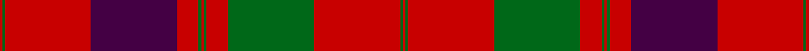

This page is one **sett** — a single exact thread-count. It belongs to the [tartan](/setts/r1g1r32dp32r8g1r1g1r8g32r32g1r1/)
(the same proportion at any scale), whose colour order is pattern [RGRBRGRGRGRGR](/stripes/rgrbrgrgrgrgr/).

Part of the [Grant of Rothiemurchus](/tartans/grant-of-rothiemurchus/) tartan — the named design grouping this sett with its other cloths.

Sourced from register-of-tartans.  It is a [13 stripe tartan](/stripes/stripes13/).

Original link https://www.tartanregister.gov.uk/tartanDetails.aspx?ref=1511

## Also known as

This cloth is also recorded under:

- Grant of Rothiemurchus Artifact
- Unnamed 18th century plaid from Rothiemurchus

2 attestations — the source records this cloth was collapsed from (oldest owns this page)

<ul>
<li>01/01/1750 — Unnamed 18th century plaid from Rothiemurchus (register-of-tartans, <a href="https://www.tartanregister.gov.uk/tartanDetails.aspx?ref=1511">record</a>)</li>
<li>1750 — Grant of Rothiemurchus (Clan) (tartans-authority, <a href="http://www.tartansauthority.com/tartan-ferret/display/1496/">record</a>)</li>
</ul>

## Register references

External register numbers recorded for this tartan.

- Scottish Register of Tartans: [1511](https://www.tartanregister.gov.uk/tartanDetails.aspx?ref=1511)
- Scottish Tartans Authority (ITI): 1496
- Scottish Tartans World Register: 1496

## Thread count
R/2 G2 R64 DP64 R16 G2 R2 G2 R16 G64 R64 G2 R/2

One full sett is **600 threads**.

## Palette

Palette: <strong>Tartan Register</strong>
<table><thead><tr><th>Colour</th><th>Threads</th><th>Shade</th><th>Base</th><th>OKLCh</th></tr></thead><tbody><tr><td>R/</td><td style="text-align:right;font-variant-numeric:tabular-nums">2</td><td><code style="background-color:#C80000;">#C80000</code> <small style="color:#888">#C80000</small></td><td>R <code style="background-color:#CC0000;">#CC0000</code></td><td><small style="color:#888">oklch(52.3% 0.215 29.2)</small></td></tr><tr><td>G</td><td style="text-align:right;font-variant-numeric:tabular-nums">2</td><td><code style="background-color:#006818;">#006818</code> <small style="color:#888">#006818</small></td><td>G <code style="background-color:#006100;">#006100</code></td><td><small style="color:#888">oklch(45.0% 0.142 145.0)</small></td></tr><tr><td>R</td><td style="text-align:right;font-variant-numeric:tabular-nums">64</td><td><code style="background-color:#C80000;">#C80000</code> <small style="color:#888">#C80000</small></td><td>R <code style="background-color:#CC0000;">#CC0000</code></td><td><small style="color:#888">oklch(52.3% 0.215 29.2)</small></td></tr><tr><td>DP</td><td style="text-align:right;font-variant-numeric:tabular-nums">64</td><td><code style="background-color:#440044;">#440044</code> <small style="color:#888">#440044</small></td><td>B <code style="background-color:#2A418A;">#2A418A</code></td><td><small style="color:#888">oklch(27.1% 0.125 328.4)</small></td></tr><tr><td>R</td><td style="text-align:right;font-variant-numeric:tabular-nums">16</td><td><code style="background-color:#C80000;">#C80000</code> <small style="color:#888">#C80000</small></td><td>R <code style="background-color:#CC0000;">#CC0000</code></td><td><small style="color:#888">oklch(52.3% 0.215 29.2)</small></td></tr><tr><td>G</td><td style="text-align:right;font-variant-numeric:tabular-nums">2</td><td><code style="background-color:#006818;">#006818</code> <small style="color:#888">#006818</small></td><td>G <code style="background-color:#006100;">#006100</code></td><td><small style="color:#888">oklch(45.0% 0.142 145.0)</small></td></tr><tr><td>R</td><td style="text-align:right;font-variant-numeric:tabular-nums">2</td><td><code style="background-color:#C80000;">#C80000</code> <small style="color:#888">#C80000</small></td><td>R <code style="background-color:#CC0000;">#CC0000</code></td><td><small style="color:#888">oklch(52.3% 0.215 29.2)</small></td></tr><tr><td>G</td><td style="text-align:right;font-variant-numeric:tabular-nums">2</td><td><code style="background-color:#006818;">#006818</code> <small style="color:#888">#006818</small></td><td>G <code style="background-color:#006100;">#006100</code></td><td><small style="color:#888">oklch(45.0% 0.142 145.0)</small></td></tr><tr><td>R</td><td style="text-align:right;font-variant-numeric:tabular-nums">16</td><td><code style="background-color:#C80000;">#C80000</code> <small style="color:#888">#C80000</small></td><td>R <code style="background-color:#CC0000;">#CC0000</code></td><td><small style="color:#888">oklch(52.3% 0.215 29.2)</small></td></tr><tr><td>G</td><td style="text-align:right;font-variant-numeric:tabular-nums">64</td><td><code style="background-color:#006818;">#006818</code> <small style="color:#888">#006818</small></td><td>G <code style="background-color:#006100;">#006100</code></td><td><small style="color:#888">oklch(45.0% 0.142 145.0)</small></td></tr><tr><td>R</td><td style="text-align:right;font-variant-numeric:tabular-nums">64</td><td><code style="background-color:#C80000;">#C80000</code> <small style="color:#888">#C80000</small></td><td>R <code style="background-color:#CC0000;">#CC0000</code></td><td><small style="color:#888">oklch(52.3% 0.215 29.2)</small></td></tr><tr><td>G</td><td style="text-align:right;font-variant-numeric:tabular-nums">2</td><td><code style="background-color:#006818;">#006818</code> <small style="color:#888">#006818</small></td><td>G <code style="background-color:#006100;">#006100</code></td><td><small style="color:#888">oklch(45.0% 0.142 145.0)</small></td></tr><tr><td>R/</td><td style="text-align:right;font-variant-numeric:tabular-nums">2</td><td><code style="background-color:#C80000;">#C80000</code> <small style="color:#888">#C80000</small></td><td>R <code style="background-color:#CC0000;">#CC0000</code></td><td><small style="color:#888">oklch(52.3% 0.215 29.2)</small></td></tr></tbody></table>

## Nearest tartans

The nearest existing variants by ΔTartan distance, with this tartan at the top so the swatches line up against it.

ΔTartan

Tartan

Sett

—

<a href="/ttd/edit/#slug=r1g1r32dp32r8g1r1g1r8g32r32g1r1~x2">Unnamed 18th century plaid from Rothiemurchus</a> <a class="nn-out" href="/variants/s13/r1g1r32dp32r8g1r1g1r8g32r32g1r1~x2/" title="open its dictionary page">↗</a>

0.74

<a href="/ttd/edit/#slug=g2r3db2r48db60r21g2r21g60r48db2r3g2&amp;base=r1g1r32dp32r8g1r1g1r8g32r32g1r1~x2">Fraser, Isabella (Artefact)</a> <a class="nn-out" href="/variants/s13/g2r3db2r48db60r21g2r21g60r48db2r3g2/" title="open its dictionary page">↗</a>

0.75

<a href="/ttd/edit/#slug=r1g1r32db32r8g1r1g1r8g32r32g1r1~x2&amp;base=r1g1r32dp32r8g1r1g1r8g32r32g1r1~x2">Grant of Rothiemurchus</a> <a class="nn-out" href="/variants/s13/r1g1r32db32r8g1r1g1r8g32r32g1r1~x2/" title="open its dictionary page">↗</a>

0.83

<a href="/ttd/edit/#slug=db80r56dg3r56dg88r64db3r4dg3r4db3r64&amp;base=r1g1r32dp32r8g1r1g1r8g32r32g1r1~x2">Unidentified Cant #14</a> <a class="nn-out" href="/variants/s12/db80r56dg3r56dg88r64db3r4dg3r4db3r64/" title="open its dictionary page">↗</a>

0.92

<a href="/ttd/edit/#slug=g2r3db2r48db60r21g2r21g60r48db2r3g2~x2&amp;base=r1g1r32dp32r8g1r1g1r8g32r32g1r1~x2">Fraser, Wedding dress</a> <a class="nn-out" href="/variants/s13/g2r3db2r48db60r21g2r21g60r48db2r3g2~x2/" title="open its dictionary page">↗</a>

1.09

<a href="/ttd/edit/#slug=dg2r2db1r24db6r3dg12r4db1~x2&amp;base=r1g1r32dp32r8g1r1g1r8g32r32g1r1~x2">MacDonald #7</a> <a class="nn-out" href="/variants/s9/dg2r2db1r24db6r3dg12r4db1~x2/" title="open its dictionary page">↗</a>

1.10

<a href="/ttd/edit/#slug=r4db2r2db2r56db16r4dg1r4dg36r3dg1r4~x2&amp;base=r1g1r32dp32r8g1r1g1r8g32r32g1r1~x2">Grant (Vestiarium Scoticum)</a> <a class="nn-out" href="/variants/s13/r4db2r2db2r56db16r4dg1r4dg36r3dg1r4~x2/" title="open its dictionary page">↗</a>

1.11

<a href="/ttd/edit/#slug=r6dp2r2dg24r2dg2r2dp8r2t1r32dp2r2dp1r6~x2&amp;base=r1g1r32dp32r8g1r1g1r8g32r32g1r1~x2">Drummond - 1819 (Clan)</a> <a class="nn-out" href="/variants/s15/r6dp2r2dg24r2dg2r2dp8r2t1r32dp2r2dp1r6~x2/" title="open its dictionary page">↗</a>

1.13

<a href="/ttd/edit/#slug=r4t1db1r32t2r2db12r2g16r4t1r4db2~x2&amp;base=r1g1r32dp32r8g1r1g1r8g32r32g1r1~x2">MacGillivray</a> <a class="nn-out" href="/variants/s13/r4t1db1r32t2r2db12r2g16r4t1r4db2~x2/" title="open its dictionary page">↗</a>

1.13

<a href="/ttd/edit/#slug=r6lb1r24dp6dg2dp1dg2dp1dg12r1&amp;base=r1g1r32dp32r8g1r1g1r8g32r32g1r1~x2">Chisholm D</a> <a class="nn-out" href="/variants/s10/r6lb1r24dp6dg2dp1dg2dp1dg12r1/" title="open its dictionary page">↗</a>

1.14

<a href="/ttd/edit/#slug=r3dp1r1dg21r3dp18r35dp1ly1r4dg1&amp;base=r1g1r32dp32r8g1r1g1r8g32r32g1r1~x2">MacPherson Of Cluny</a> <a class="nn-out" href="/variants/s11/r3dp1r1dg21r3dp18r35dp1ly1r4dg1/" title="open its dictionary page">↗</a>

## Neighbour map

Every grey dot is one of 14360 variants placed by the first two principal components of the ΔTartan feature space (44% of its variance). Red is this tartan; blue dots are its nearest — click one to open its page.

<svg viewBox="0 0 640 380" role="img" style="max-width:100%;height:auto;border:1px solid #e0e0e0;border-radius:4px;display:block" xmlns="http://www.w3.org/2000/svg"><image href="/nn/cloud.v1.png" width="640" height="380"/><a href="/variants/s13/g2r3db2r48db60r21g2r21g60r48db2r3g2/"><circle cx="364.8" cy="133.5" r="4" fill="#3465a4"><title>Fraser, Isabella (Artefact)</title></circle></a><a href="/variants/s13/r1g1r32db32r8g1r1g1r8g32r32g1r1~x2/"><circle cx="388.6" cy="127.0" r="4" fill="#3465a4"><title>Grant of Rothiemurchus</title></circle></a><a href="/variants/s12/db80r56dg3r56dg88r64db3r4dg3r4db3r64/"><circle cx="393.1" cy="149.8" r="4" fill="#3465a4"><title>Unidentified Cant #14</title></circle></a><a href="/variants/s13/g2r3db2r48db60r21g2r21g60r48db2r3g2~x2/"><circle cx="365.9" cy="134.9" r="4" fill="#3465a4"><title>Fraser, Wedding dress</title></circle></a><a href="/variants/s9/dg2r2db1r24db6r3dg12r4db1~x2/"><circle cx="413.3" cy="147.5" r="4" fill="#3465a4"><title>MacDonald #7</title></circle></a><a href="/variants/s13/r4db2r2db2r56db16r4dg1r4dg36r3dg1r4~x2/"><circle cx="433.4" cy="86.9" r="4" fill="#3465a4"><title>Grant (Vestiarium Scoticum)</title></circle></a><a href="/variants/s15/r6dp2r2dg24r2dg2r2dp8r2t1r32dp2r2dp1r6~x2/"><circle cx="400.8" cy="89.1" r="4" fill="#3465a4"><title>Drummond - 1819 (Clan)</title></circle></a><a href="/variants/s13/r4t1db1r32t2r2db12r2g16r4t1r4db2~x2/"><circle cx="394.4" cy="103.1" r="4" fill="#3465a4"><title>MacGillivray</title></circle></a><a href="/variants/s10/r6lb1r24dp6dg2dp1dg2dp1dg12r1/"><circle cx="372.0" cy="125.8" r="4" fill="#3465a4"><title>Chisholm D</title></circle></a><a href="/variants/s11/r3dp1r1dg21r3dp18r35dp1ly1r4dg1/"><circle cx="367.7" cy="103.7" r="4" fill="#3465a4"><title>MacPherson Of Cluny</title></circle></a><circle cx="391.4" cy="123.6" r="5" fill="#c00000"/></svg>

ID: /variants/s13/r1g1r32dp32r8g1r1g1r8g32r32g1r1~x2/
