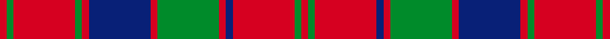

This page is one **sett** — a single exact thread-count. It belongs to the [tartan](/setts/r1g1r9db1r1g9r1db9r1g1r9g1r1/)
(the same proportion at any scale), whose colour order is pattern [RGRBRGRBRGRGR](/stripes/rgrbrgrbrgrgr/).

Part of the [Robertson](/tartans/robertson/) tartan — the named design grouping this sett with its other cloths.

Sourced from weddslist.  It is a [13 stripe tartan](/stripes/stripes13/).

Original link [http://www.weddslist.com/cgi-bin/tartans/pg.pl?source=tinsel](http://www.weddslist.com/cgi-bin/tartans/pg.pl?source=tinsel)

2 attestations — the source records this cloth was collapsed from (oldest owns this page)

<ul>
<li>undated — Robertson (weddslist, <a href="http://www.weddslist.com/cgi-bin/tartans/pg.pl?source=tinsel">record</a>) </li>
<li>undated — Robertson (weddslist, <a href="http://www.weddslist.com/cgi-bin/tartans/pg.pl?source=x">record</a>) </li>
</ul>

Dataset <small>— provenance for this record, inherited from the source manifest</small>

<dl class="dataset-prov">
<dt>source</dt><dd><a href="/sources/weddslist/">Weddslist</a></dd>
<dt>data captured from</dt><dd><a href="https://github.com/thetartan/tartan-database/blob/master/data/weddslist/data.csv">https://github.com/thetartan/tartan-database/blob/master/data/weddslist/data.csv</a></dd>
<dt>data date</dt><dd>2016-11-17 <small>(dataset default)</small></dd>
<dt>licence</dt><dd><a href="https://creativecommons.org/licenses/by-nc-nd/4.0/">CC BY-NC-ND 4.0</a></dd>
</dl>

Capture chain <small>— the hands this data passed through, oldest first; each capture carries its own licence</small>

<ol class="capture-chain">
<li><a href="https://www.weddslist.com/tartans/">Weddslist</a> <small>the living privately compiled reference</small></li>
<li><a href="https://github.com/thetartan/tartan-database">thetartan/tartan-database</a> <small>2016-2017</small> · <a href="https://creativecommons.org/licenses/by-nc-nd/4.0/">CC BY-NC-ND 4.0</a> <small>Levko Kravets's frozen compilation — the capture we vendored, and where its CC licence text came from</small></li>
<li>this dictionary <small>captured 2026-06-10 · commit 5bf86c7566</small> <small>each re-capture is a git commit to data/sources</small></li>
</ol>

## Thread count
R/2 G2 R18 G2 R2 DB18 R2 G18 R2 DB2 R18 G2 R/2

One full sett is **176 threads**.

## Palette
<table><thead><tr><th>Colour</th><th>Shade</th><th>OKLCh</th></tr></thead><tbody><tr><td>DB</td><td><code style="background-color:#082077;">#082077</code> <small style="color:#888">#082077</small></td><td><small style="color:#888">oklch(30.0% 0.149 265.1)</small></td></tr><tr><td>G</td><td><code style="background-color:#008B2A;">#008B2A</code> <small style="color:#888">#008B2A</small></td><td><small style="color:#888">oklch(55.4% 0.170 145.9)</small></td></tr><tr><td>R</td><td><code style="background-color:#D60020;">#D60020</code> <small style="color:#888">#D60020</small></td><td><small style="color:#888">oklch(55.2% 0.224 25.5)</small></td></tr></tbody></table>

# Sample pattern

## Nearest tartan variants

The nearest existing variants by ΔTartan distance, with this cloth at the top so the swatches line up against it.

ΔTartan

Threads

Variant

Sett

—

176

<a href="/variants/s13/r1g1r9db1r1g9r1db9r1g1r9g1r1~x2/">Robertson</a>

<a href="/ttd/edit/#slug=r1g1r9db1r1g9r1db9r1g1r9g1r1~x4&amp;base=r1g1r9db1r1g9r1db9r1g1r9g1r1~x2" title="compare in the TTD">0.00</a>

352

<a href="/variants/s13/r1g1r9db1r1g9r1db9r1g1r9g1r1~x4/">Robertson #3</a>

<a href="/ttd/edit/#slug=r1g1r9db1r1g9r1db9r1g1r9g1r1&amp;base=r1g1r9db1r1g9r1db9r1g1r9g1r1~x2" title="compare in the TTD">0.00</a>

88

<a href="/variants/s13/r1g1r9db1r1g9r1db9r1g1r9g1r1/">Robertson</a>

<a href="/ttd/edit/#slug=r4g4r35b4r4g35r4b35r4b4r35g4r4&amp;base=r1g1r9db1r1g9r1db9r1g1r9g1r1~x2" title="compare in the TTD">1.08</a>

344

<a href="/variants/s13/r4g4r35b4r4g35r4b35r4b4r35g4r4/">Robertson 1</a>

<a href="/ttd/edit/#slug=r3g2r19db2r3db20r3g20r3db2r19g2r3~x4&amp;base=r1g1r9db1r1g9r1db9r1g1r9g1r1~x2" title="compare in the TTD">1.22</a>

784

<a href="/variants/s13/r3g2r19db2r3db20r3g20r3db2r19g2r3~x4/">Robertson Curtain</a>

<a href="/ttd/edit/#slug=r3g3r35db3r3db35r3g35r3db3r35g3r3~x2&amp;base=r1g1r9db1r1g9r1db9r1g1r9g1r1~x2" title="compare in the TTD">1.29</a>

656

<a href="/variants/s13/r3g3r35db3r3db35r3g35r3db3r35g3r3~x2/">Robertson 1819</a>

<a href="/ttd/edit/#slug=r5g2r30db3r3db30r3g30r3db3r30g2r5~x2&amp;base=r1g1r9db1r1g9r1db9r1g1r9g1r1~x2" title="compare in the TTD">1.49</a>

576

<a href="/variants/s13/r5g2r30db3r3db30r3g30r3db3r30g2r5~x2/">Robertson D</a>

<a href="/ttd/edit/#slug=r5g2r30db3r3db30r3g30r3db3r30g2r5&amp;base=r1g1r9db1r1g9r1db9r1g1r9g1r1~x2" title="compare in the TTD">1.49</a>

288

<a href="/variants/s13/r5g2r30db3r3db30r3g30r3db3r30g2r5/">Robertson D</a>

<a href="/ttd/edit/#slug=r3g1r15db2r2db15r2g15r2db2r15g1r3~x2&amp;base=r1g1r9db1r1g9r1db9r1g1r9g1r1~x2" title="compare in the TTD">1.52</a>

300

<a href="/variants/s13/r3g1r15db2r2db15r2g15r2db2r15g1r3~x2/">Robertson D</a>

<a href="/ttd/edit/#slug=db3r23db3r26db3r3db25r3g24r3~x2&amp;base=r1g1r9db1r1g9r1db9r1g1r9g1r1~x2" title="compare in the TTD">1.77</a>

452

<a href="/variants/s10/db3r23db3r26db3r3db25r3g24r3~x2/">Unidentified Early 18th Centuary</a>

<a href="/ttd/edit/#slug=g6r2g2r18db9r3g3r3db9r3g24r2g2r4~x2&amp;base=r1g1r9db1r1g9r1db9r1g1r9g1r1~x2" title="compare in the TTD">1.94</a>

340

<a href="/variants/s14/g6r2g2r18db9r3g3r3db9r3g24r2g2r4~x2/">Stuart/Stewart of Urrard</a>

## Neighbour map

Every grey dot is one of 13621 variants placed by the first two principal components of the ΔTartan feature space (42% of its variance). Red is this tartan; blue dots are its nearest — click one to open its page.

<svg viewBox="0 0 640 380" role="img" style="max-width:100%;height:auto;border:1px solid #e0e0e0;border-radius:4px;display:block" xmlns="http://www.w3.org/2000/svg"><image href="/nn/cloud.v1.png" width="640" height="380"/><a href="/variants/s13/r1g1r9db1r1g9r1db9r1g1r9g1r1~x4/"><circle cx="293.4" cy="176.2" r="4" fill="#3465a4"><title>Robertson #3</title></circle></a><a href="/variants/s13/r1g1r9db1r1g9r1db9r1g1r9g1r1/"><circle cx="293.4" cy="176.2" r="4" fill="#3465a4"><title>Robertson</title></circle></a><a href="/variants/s13/r4g4r35b4r4g35r4b35r4b4r35g4r4/"><circle cx="316.6" cy="186.6" r="4" fill="#3465a4"><title>Robertson 1</title></circle></a><a href="/variants/s13/r3g2r19db2r3db20r3g20r3db2r19g2r3~x4/"><circle cx="299.9" cy="175.3" r="4" fill="#3465a4"><title>Robertson Curtain</title></circle></a><a href="/variants/s13/r3g3r35db3r3db35r3g35r3db3r35g3r3~x2/"><circle cx="303.3" cy="160.7" r="4" fill="#3465a4"><title>Robertson 1819</title></circle></a><a href="/variants/s13/r5g2r30db3r3db30r3g30r3db3r30g2r5~x2/"><circle cx="319.3" cy="155.0" r="4" fill="#3465a4"><title>Robertson D</title></circle></a><a href="/variants/s13/r5g2r30db3r3db30r3g30r3db3r30g2r5/"><circle cx="319.3" cy="155.0" r="4" fill="#3465a4"><title>Robertson D</title></circle></a><a href="/variants/s13/r3g1r15db2r2db15r2g15r2db2r15g1r3~x2/"><circle cx="319.8" cy="159.9" r="4" fill="#3465a4"><title>Robertson D</title></circle></a><a href="/variants/s10/db3r23db3r26db3r3db25r3g24r3~x2/"><circle cx="285.6" cy="200.0" r="4" fill="#3465a4"><title>Unidentified Early 18th Centuary</title></circle></a><a href="/variants/s14/g6r2g2r18db9r3g3r3db9r3g24r2g2r4~x2/"><circle cx="260.0" cy="175.8" r="4" fill="#3465a4"><title>Stuart/Stewart of Urrard</title></circle></a><circle cx="293.4" cy="176.2" r="5" fill="#c00000"/><text x="320" y="376" text-anchor="middle" font-size="11" fill="#999">ground</text><text x="11" y="190" text-anchor="middle" font-size="11" fill="#999" transform="rotate(-90 11 190)">complexity</text></svg>

ID: /variants/s13/r1g1r9db1r1g9r1db9r1g1r9g1r1~x2/
