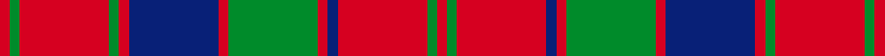

This page is one **sett** — a single exact thread-count. It belongs to the [tartan](/setts/r1g1r9db1r1g9r1db9r1g1r9g1r1/)
(the same proportion at any scale), whose colour order is pattern [RGRBRGRBRGRGR](/stripes/rgrbrgrbrgrgr/).

Part of the [Robertson](/tartans/robertson/) tartan — the named design grouping this sett with its other cloths.

Sourced from register-of-tartans.  It is a [13 stripe tartan](/stripes/stripes13/).

Original link https://www.tartanregister.gov.uk/tartanDetails.aspx?ref=3524

## Provenance

Earliest known date: 1831 The oldest records show Robertson tartan with a white line. But the modern weavers sett, without the white, can be traced to Logan's book 'The Scottish Gael' published in 1831. D.C.Stewart noted a subtle difference in Logan's count which is reproduced here. That is the use of contrasting narrow stripes next to the broader stripe. Other versions have only blue, narrow stripes. Stewart reckoned that it added 'balance in the design'. Mid toned blues and greens are used in this illustration.

3 attestations — the source records this cloth was collapsed from (oldest owns this page)

<ul>
<li>undated — Robertson #3 (register-of-tartans, <a href="https://www.tartanregister.gov.uk/tartanDetails.aspx?ref=3524">record</a>)  <em>The oldest records show Robertson tartan with a white line. But the modern weavers sett, without the white, can be traced to Logan's book 'The Scottish Gael' published in 1831. D.C. Stewart noted a subtle difference in Logan's count which is reproduced here. That is the use of contrasting narrow stripes next to the broader stripe. Other versions have only blue, narrow stripes. Stewart reckoned that it added 'balance in the design'. Mid toned blues and greens are used in this illustration.</em></li>
<li>undated — Robertson 3 (weddslist, <a href="http://www.weddslist.com/cgi-bin/tartans/pg.pl?source=sts">record</a>) </li>
<li>undated — Robertson Clan Tartan (house-of-tartan, <a href="http://www.house-of-tartan.scotland.net/house/TartanViewjs.asp?colr=Def&tnam=1391">record</a>) </li>
</ul>

## Register references

External register numbers recorded for this tartan.

- Scottish Register of Tartans: [3524](https://www.tartanregister.gov.uk/tartanDetails.aspx?ref=3524)
- Scottish Tartans World Register: 1391

## Thread count
R/4 G4 R36 G4 R4 DB36 R4 G36 R4 DB4 R36 G4 R/4

One full sett is **352 threads**.

## Palette
<table><thead><tr><th>Colour</th><th>Shade</th><th>OKLCh</th></tr></thead><tbody><tr><td>B</td><td><code style="background-color:#082077;">#082077</code> <small style="color:#888">#082077</small></td><td><small style="color:#888">oklch(30.0% 0.149 265.1)</small></td></tr><tr><td>G</td><td><code style="background-color:#008B2A;">#008B2A</code> <small style="color:#888">#008B2A</small></td><td><small style="color:#888">oklch(55.4% 0.170 145.9)</small></td></tr><tr><td>R</td><td><code style="background-color:#D60020;">#D60020</code> <small style="color:#888">#D60020</small></td><td><small style="color:#888">oklch(55.2% 0.224 25.5)</small></td></tr></tbody></table>

# Sample pattern

## Nearest variants

The nearest existing variants by ΔTartan distance, with this cloth at the top so the swatches line up against it.

ΔTartan

Threads

Variant

Sett

—

352

<a href="/variants/s13/r1g1r9db1r1g9r1db9r1g1r9g1r1~x4/">Robertson #3</a>

<a href="/ttd/edit/#slug=r1g1r9db1r1g9r1db9r1g1r9g1r1&amp;base=r1g1r9db1r1g9r1db9r1g1r9g1r1~x4" title="compare in the TTD">0.00</a>

88

<a href="/variants/s13/r1g1r9db1r1g9r1db9r1g1r9g1r1/">Robertson</a>

<a href="/ttd/edit/#slug=r1g1r9db1r1g9r1db9r1g1r9g1r1~x2&amp;base=r1g1r9db1r1g9r1db9r1g1r9g1r1~x4" title="compare in the TTD">0.00</a>

176

<a href="/variants/s13/r1g1r9db1r1g9r1db9r1g1r9g1r1~x2/">Robertson</a>

<a href="/ttd/edit/#slug=r4g4r35b4r4g35r4b35r4b4r35g4r4&amp;base=r1g1r9db1r1g9r1db9r1g1r9g1r1~x4" title="compare in the TTD">1.08</a>

344

<a href="/variants/s13/r4g4r35b4r4g35r4b35r4b4r35g4r4/">Robertson 1</a>

<a href="/ttd/edit/#slug=r3g2r19db2r3db20r3g20r3db2r19g2r3~x4&amp;base=r1g1r9db1r1g9r1db9r1g1r9g1r1~x4" title="compare in the TTD">1.22</a>

784

<a href="/variants/s13/r3g2r19db2r3db20r3g20r3db2r19g2r3~x4/">Robertson Curtain</a>

<a href="/ttd/edit/#slug=r3g3r35db3r3db35r3g35r3db3r35g3r3~x2&amp;base=r1g1r9db1r1g9r1db9r1g1r9g1r1~x4" title="compare in the TTD">1.29</a>

656

<a href="/variants/s13/r3g3r35db3r3db35r3g35r3db3r35g3r3~x2/">Robertson 1819</a>

<a href="/ttd/edit/#slug=r5g2r30db3r3db30r3g30r3db3r30g2r5~x2&amp;base=r1g1r9db1r1g9r1db9r1g1r9g1r1~x4" title="compare in the TTD">1.52</a>

576

<a href="/variants/s13/r5g2r30db3r3db30r3g30r3db3r30g2r5~x2/">Robertson D</a>

<a href="/ttd/edit/#slug=r5g2r30db3r3db30r3g30r3db3r30g2r5&amp;base=r1g1r9db1r1g9r1db9r1g1r9g1r1~x4" title="compare in the TTD">1.52</a>

288

<a href="/variants/s13/r5g2r30db3r3db30r3g30r3db3r30g2r5/">Robertson D</a>

<a href="/ttd/edit/#slug=r3g1r15db2r2db15r2g15r2db2r15g1r3~x2&amp;base=r1g1r9db1r1g9r1db9r1g1r9g1r1~x4" title="compare in the TTD">1.57</a>

300

<a href="/variants/s13/r3g1r15db2r2db15r2g15r2db2r15g1r3~x2/">Robertson D</a>

<a href="/ttd/edit/#slug=g6r2g2r18db9r3g3r3db9r3g24r2g2r4~x2&amp;base=r1g1r9db1r1g9r1db9r1g1r9g1r1~x4" title="compare in the TTD">1.94</a>

340

<a href="/variants/s14/g6r2g2r18db9r3g3r3db9r3g24r2g2r4~x2/">Stuart/Stewart of Urrard</a>

<a href="/ttd/edit/#slug=r12db1r1g8r2db1r1db3r1db1r12g1r1g4~x4&amp;base=r1g1r9db1r1g9r1db9r1g1r9g1r1~x4" title="compare in the TTD">1.98</a>

328

<a href="/variants/s14/r12db1r1g8r2db1r1db3r1db1r12g1r1g4~x4/">MacColl</a>

## Neighbour map

Every grey dot is one of 13620 variants placed by the first two principal components of the ΔTartan feature space (42% of its variance). Red is this tartan; blue dots are its nearest — click one to open its page.

<svg viewBox="0 0 640 380" role="img" style="max-width:100%;height:auto;border:1px solid #e0e0e0;border-radius:4px;display:block" xmlns="http://www.w3.org/2000/svg"><image href="/nn/cloud.v1.png" width="640" height="380"/><a href="/variants/s13/r1g1r9db1r1g9r1db9r1g1r9g1r1/"><circle cx="293.3" cy="175.8" r="4" fill="#3465a4"><title>Robertson</title></circle></a><a href="/variants/s13/r1g1r9db1r1g9r1db9r1g1r9g1r1~x2/"><circle cx="293.3" cy="175.8" r="4" fill="#3465a4"><title>Robertson</title></circle></a><a href="/variants/s13/r4g4r35b4r4g35r4b35r4b4r35g4r4/"><circle cx="316.6" cy="186.1" r="4" fill="#3465a4"><title>Robertson 1</title></circle></a><a href="/variants/s13/r3g2r19db2r3db20r3g20r3db2r19g2r3~x4/"><circle cx="299.9" cy="174.9" r="4" fill="#3465a4"><title>Robertson Curtain</title></circle></a><a href="/variants/s13/r3g3r35db3r3db35r3g35r3db3r35g3r3~x2/"><circle cx="303.3" cy="160.3" r="4" fill="#3465a4"><title>Robertson 1819</title></circle></a><a href="/variants/s13/r5g2r30db3r3db30r3g30r3db3r30g2r5~x2/"><circle cx="319.2" cy="154.6" r="4" fill="#3465a4"><title>Robertson D</title></circle></a><a href="/variants/s13/r5g2r30db3r3db30r3g30r3db3r30g2r5/"><circle cx="319.2" cy="154.6" r="4" fill="#3465a4"><title>Robertson D</title></circle></a><a href="/variants/s13/r3g1r15db2r2db15r2g15r2db2r15g1r3~x2/"><circle cx="319.7" cy="159.5" r="4" fill="#3465a4"><title>Robertson D</title></circle></a><a href="/variants/s14/g6r2g2r18db9r3g3r3db9r3g24r2g2r4~x2/"><circle cx="259.9" cy="175.4" r="4" fill="#3465a4"><title>Stuart/Stewart of Urrard</title></circle></a><a href="/variants/s14/r12db1r1g8r2db1r1db3r1db1r12g1r1g4~x4/"><circle cx="376.8" cy="159.6" r="4" fill="#3465a4"><title>MacColl</title></circle></a><circle cx="293.3" cy="175.8" r="5" fill="#c00000"/><text x="320" y="376" text-anchor="middle" font-size="11" fill="#999">ground</text><text x="11" y="190" text-anchor="middle" font-size="11" fill="#999" transform="rotate(-90 11 190)">complexity</text></svg>

ID: /variants/s13/r1g1r9db1r1g9r1db9r1g1r9g1r1~x4/
