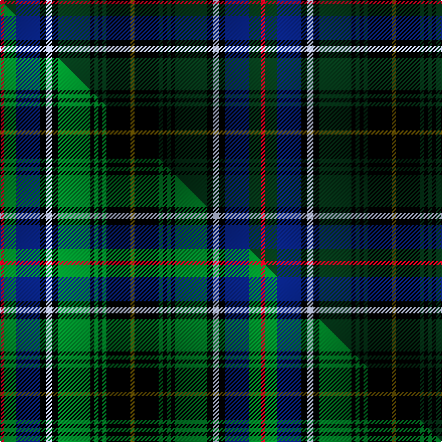

This is one **variant** — a specific cloth: this exact thread count and colourway, with its own
provenance below. It is one weaving of the [sett](/tartans/m/ma/macinnes-2/) (the scale-free proportion — the
same cloth at any scale or shade), whose colour order is pattern [GKGKGKGKWKBGR](/stripes/gkgkgkgkwkbgr/).

Part of the [MacInnes](/tartans/m/ma/macinnes-2/) tartan — the named design grouping this sett with its other cloths.

Sourced from tartans-authority.  It is a [13 stripe tartan](/stripes/stripes13/).

Original link <code>http://www.tartansauthority.com/tartan-ferret/display/1464/</code> — retired · [Internet Archive copy](https://web.archive.org/web/*/http://www.tartansauthority.com/tartan-ferret/display/1464/*)

Dataset <small>— provenance for this record, inherited from the source manifest</small>

<dl class="dataset-prov">
<dt>source</dt><dd><a href="/sources/tartans-authority/">Scottish Tartans Authority</a></dd>
<dt>data captured from</dt><dd><a href="https://github.com/thetartan/tartan-database/blob/master/data/tartans-authority/data.csv">https://github.com/thetartan/tartan-database/blob/master/data/tartans-authority/data.csv</a></dd>
<dt>data date</dt><dd>1908 <small>(this record)</small></dd>
<dt>licence</dt><dd><a href="https://creativecommons.org/licenses/by-nc-nd/4.0/">CC BY-NC-ND 4.0</a></dd>
</dl>

Capture chain <small>— the hands this data passed through, oldest first; each capture carries its own licence</small>

<ol class="capture-chain">
<li><a href="https://www.tartansauthority.com/">Scottish Tartans Authority</a> <small>the heritage body’s archive — its tartan-ferret record browser is retired; dead record links are shown unlinked, with an Internet Archive copy (ITI numbers are not SRT references)</small></li>
<li><a href="https://github.com/thetartan/tartan-database">thetartan/tartan-database</a> <small>2016-2017</small> · <a href="https://creativecommons.org/licenses/by-nc-nd/4.0/">CC BY-NC-ND 4.0</a> <small>Levko Kravets's frozen compilation — the capture we vendored, and where its CC licence text came from</small></li>
<li>this dictionary <small>captured 2026-06-10 · commit 5bf86c7566</small> <small>each re-capture is a git commit to data/sources</small></li>
</ol>

## Register references

External register numbers recorded for this tartan.

- Scottish Tartans Authority (ITI): 1464

## Thread count
R/4 DG12 DB24 K6 LB6 K6 DG32 K4 DG4 K4 DG4 K24 Y/4

One full sett is **260 threads**.

## Palette
<table><thead><tr><th>Colour</th><th>Shade</th><th>OKLCh</th></tr></thead><tbody><tr><td>LB</td><td><code style="background-color:#B5BBDE;">#B5BBDE</code> <small style="color:#888">#B5BBDE</small></td><td><small style="color:#888">oklch(79.9% 0.050 277.6)</small></td></tr><tr><td>DB</td><td><code style="background-color:#082077;">#082077</code> <small style="color:#888">#082077</small></td><td><small style="color:#888">oklch(30.0% 0.149 265.1)</small></td></tr><tr><td>DG</td><td><code style="background-color:#053819;">#053819</code> <small style="color:#888">#053819</small></td><td><small style="color:#888">oklch(30.0% 0.075 151.3)</small></td></tr><tr><td>K</td><td><code style="background-color:#000000;">#000000</code> <small style="color:#888">#000000</small></td><td><small style="color:#888">oklch(0.0% 0.000 0.0)</small></td></tr><tr><td>R</td><td><code style="background-color:#D60020;">#D60020</code> <small style="color:#888">#D60020</small></td><td><small style="color:#888">oklch(55.2% 0.224 25.5)</small></td></tr><tr><td>Y</td><td><code style="background-color:#8B6E00;">#8B6E00</code> <small style="color:#888">#8B6E00</small></td><td><small style="color:#888">oklch(55.1% 0.113 90.4)</small></td></tr></tbody></table>

# Sample pattern

## Compared to the master

This cloth is one sett of its design; the master sett (the exemplar the design is anchored on) is below for comparison.

Its **ΔTartan distance** from the master is **0.16** — the same measure the nearest-tartans table ranks by (0 is identical; a re-scale of the same cloth is near 0, a recolour or a different proportion further).

<figure class="master-compare" style="margin:0">

this sett
master sett ★

<figcaption style="color:#888;font-size:smaller">One weave of this sett against the <a href="/setts/r2g6db12k3lb3k3g16k2g2k2g2k12y2/">master sett ★</a>, split on the diagonal: a shared proportion runs seamlessly across it with only the shades shifting; a different proportion breaks on it.</figcaption>
</figure>

## Nearest tartan variants

The nearest existing variants by ΔTartan distance, with this cloth at the top so the swatches line up against it.

ΔTartan

Threads

Variant

Sett

—

260

<a href="/variants/s13/r2dg6db12k3lb3k3dg16k2dg2k2dg2k12y2~x2/">MacInnes (Clan)</a>

<a href="/ttd/edit/#slug=r2g6db12k3lb3k3g16k2g2k2g2k12y2~x2&amp;base=r2dg6db12k3lb3k3dg16k2dg2k2dg2k12y2~x2" title="compare in the TTD">0.16</a>

260

<a href="/variants/s13/r2g6db12k3lb3k3g16k2g2k2g2k12y2~x2/">MacInnes</a>

<a href="/ttd/edit/#slug=r2g6db12k3lb3k3g16k2g2k2g2k12y2&amp;base=r2dg6db12k3lb3k3dg16k2dg2k2dg2k12y2~x2" title="compare in the TTD">0.16</a>

130

<a href="/variants/s13/r2g6db12k3lb3k3g16k2g2k2g2k12y2/">MacInnes</a>

<a href="/ttd/edit/#slug=k20dg18k2w2k5y2k2dg18k20db18t4db4t4db18~x2~db1406275-t2205244&amp;base=r2dg6db12k3lb3k3dg16k2dg2k2dg2k12y2~x2" title="compare in the TTD">1.75</a>

472

<a href="/variants/s14/k20dg18k2w2k5y2k2dg18k20db18t4db4t4db18~x2~db1406275-t2205244/">Shandon (Personal)</a>

<a href="/ttd/edit/#slug=k2dr1db9dr2k7db2dr6g6dr2k12lb1n1k1~x4&amp;base=r2dg6db12k3lb3k3dg16k2dg2k2dg2k12y2~x2" title="compare in the TTD">1.95</a>

404

<a href="/variants/s13/k2dr1db9dr2k7db2dr6g6dr2k12lb1n1k1~x4/">Oban (District?)</a>

<a href="/ttd/edit/#slug=r2k1db8k8dg8ly2dg8k8db1k1db1k1db4r1~x4&amp;base=r2dg6db12k3lb3k3dg16k2dg2k2dg2k12y2~x2" title="compare in the TTD">2.13</a>

420

<a href="/variants/s14/r2k1db8k8dg8ly2dg8k8db1k1db1k1db4r1~x4/">Farquharson of Baldovie</a>

<a href="/ttd/edit/#slug=dg2k1db9k9dg9k1w1k2w1k1dg9k9db9k1r2~x4&amp;base=r2dg6db12k3lb3k3dg16k2dg2k2dg2k12y2~x2" title="compare in the TTD">2.21</a>

512

<a href="/variants/s15/dg2k1db9k9dg9k1w1k2w1k1dg9k9db9k1r2~x4/">Stephenson Htg (Name)</a>

<a href="/ttd/edit/#slug=dg17k2dg2k2dg2k15db15r7db15k15dg2k2dg2k2dg17lo2~x2&amp;base=r2dg6db12k3lb3k3dg16k2dg2k2dg2k12y2~x2" title="compare in the TTD">2.29</a>

438

<a href="/variants/s16/dg17k2dg2k2dg2k15db15r7db15k15dg2k2dg2k2dg17lo2~x2/">Thormanby Buccaneer Bay</a>

<a href="/ttd/edit/#slug=db22k2ly3k2db22k4g10k2g10r3k4r3do10g2do10k3~x2&amp;base=r2dg6db12k3lb3k3dg16k2dg2k2dg2k12y2~x2" title="compare in the TTD">2.31</a>

398

<a href="/variants/s16/db22k2ly3k2db22k4g10k2g10r3k4r3do10g2do10k3~x2/">Yeomans (2016)</a>

<a href="/ttd/edit/#slug=k20g18k2y2k5w2k2g18k20dp18t4dp4t4dp18~x2&amp;base=r2dg6db12k3lb3k3dg16k2dg2k2dg2k12y2~x2" title="compare in the TTD">2.35</a>

472

<a href="/variants/s14/k20g18k2y2k5w2k2g18k20dp18t4dp4t4dp18~x2/">Shandon (Personal)</a>

<a href="/ttd/edit/#slug=db17k3db3k3db3k17dg17k2w3k2dg17k17db17k2r3~x2&amp;base=r2dg6db12k3lb3k3dg16k2dg2k2dg2k12y2~x2" title="compare in the TTD">2.41</a>

464

<a href="/variants/s15/db17k3db3k3db3k17dg17k2w3k2dg17k17db17k2r3~x2/">Cumbernauld District Tartan</a>

## Neighbour map

Every grey dot is one of 13656 variants placed by the first two principal components of the ΔTartan feature space (42% of its variance). Red is this tartan; blue dots are its nearest — click one to open its page. The map is a flat projection of a many-dimensional space — [how to read it](/posts/neighbourhood-maps/).

<svg viewBox="0 0 640 380" role="img" style="max-width:100%;height:auto;border:1px solid #e0e0e0;border-radius:4px;display:block" xmlns="http://www.w3.org/2000/svg"><image href="/nn/cloud.v1.png" width="640" height="380"/><a href="/variants/s13/r2g6db12k3lb3k3g16k2g2k2g2k12y2~x2/"><circle cx="101.8" cy="140.1" r="4" fill="#3465a4"><title>MacInnes</title></circle></a><a href="/variants/s13/r2g6db12k3lb3k3g16k2g2k2g2k12y2/"><circle cx="101.8" cy="140.1" r="4" fill="#3465a4"><title>MacInnes</title></circle></a><a href="/variants/s14/k20dg18k2w2k5y2k2dg18k20db18t4db4t4db18~x2~db1406275-t2205244/"><circle cx="128.2" cy="148.8" r="4" fill="#3465a4"><title>Shandon (Personal)</title></circle></a><a href="/variants/s13/k2dr1db9dr2k7db2dr6g6dr2k12lb1n1k1~x4/"><circle cx="142.6" cy="126.8" r="4" fill="#3465a4"><title>Oban (District?)</title></circle></a><a href="/variants/s14/r2k1db8k8dg8ly2dg8k8db1k1db1k1db4r1~x4/"><circle cx="129.3" cy="163.3" r="4" fill="#3465a4"><title>Farquharson of Baldovie</title></circle></a><a href="/variants/s15/dg2k1db9k9dg9k1w1k2w1k1dg9k9db9k1r2~x4/"><circle cx="143.0" cy="154.2" r="4" fill="#3465a4"><title>Stephenson Htg (Name)</title></circle></a><a href="/variants/s16/dg17k2dg2k2dg2k15db15r7db15k15dg2k2dg2k2dg17lo2~x2/"><circle cx="151.5" cy="158.2" r="4" fill="#3465a4"><title>Thormanby Buccaneer Bay</title></circle></a><a href="/variants/s16/db22k2ly3k2db22k4g10k2g10r3k4r3do10g2do10k3~x2/"><circle cx="122.0" cy="124.1" r="4" fill="#3465a4"><title>Yeomans (2016)</title></circle></a><a href="/variants/s14/k20g18k2y2k5w2k2g18k20dp18t4dp4t4dp18~x2/"><circle cx="96.8" cy="137.6" r="4" fill="#3465a4"><title>Shandon (Personal)</title></circle></a><a href="/variants/s15/db17k3db3k3db3k17dg17k2w3k2dg17k17db17k2r3~x2/"><circle cx="150.0" cy="160.5" r="4" fill="#3465a4"><title>Cumbernauld District Tartan</title></circle></a><circle cx="138.3" cy="148.2" r="5" fill="#c00000"/><text x="320" y="376" text-anchor="middle" font-size="11" fill="#999">ground</text><text x="11" y="190" text-anchor="middle" font-size="11" fill="#999" transform="rotate(-90 11 190)">complexity</text></svg>

ID: /variants/s13/r2dg6db12k3lb3k3dg16k2dg2k2dg2k12y2~x2/
