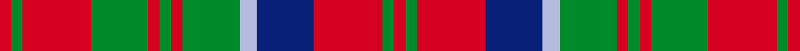

This page is one **sett** — a single exact thread-count. It belongs to the [tartan](/setts/r2g2r12db10lb3g10r2g2r2g10r12g2r2/)
(the same proportion at any scale), whose colour order is pattern [RGRBWGRGRGRGR](/stripes/rgrbwgrgrgrgr/).

Part of the [Matheson N](/tartans/matheson-n/) tartan — the named design grouping this sett with its other cloths.

Sourced from register-of-tartans.  It is a [13 stripe tartan](/stripes/stripes13/).

Original link https://www.tartanregister.gov.uk/tartanDetails.aspx?ref=2854

3 attestations — the source records this cloth was collapsed from (oldest owns this page)

<ul>
<li>undated — Matheson (Logan 1831) (register-of-tartans, <a href="https://www.tartanregister.gov.uk/tartanDetails.aspx?ref=2854">record</a>)  <em>As recorded by James Logan in The Scottish Gael (1831) and by D C Stewart in The Setts of the Scottish Tartans, No:189.</em></li>
<li>undated — Matheson (weddslist, <a href="http://www.weddslist.com/cgi-bin/tartans/pg.pl?source=sts">record</a>) </li>
<li>undated — Matheson N (weddslist, <a href="http://www.weddslist.com/cgi-bin/tartans/pg.pl?source=tinsel">record</a>) </li>
</ul>

## Register references

External register numbers recorded for this tartan.

- Scottish Register of Tartans: [2854](https://www.tartanregister.gov.uk/tartanDetails.aspx?ref=2854)
- Scottish Tartans World Register: 1499

## Thread count
R/4 G4 R24 G20 R4 G4 R4 G20 LB6 DB20 R24 G4 R/4

One full sett is **276 threads**.

## Palette
<table><thead><tr><th>Colour</th><th>Shade</th><th>OKLCh</th></tr></thead><tbody><tr><td>LB</td><td><code style="background-color:#B5BBDE;">#B5BBDE</code> <small style="color:#888">#B5BBDE</small></td><td><small style="color:#888">oklch(79.9% 0.050 277.6)</small></td></tr><tr><td>DB</td><td><code style="background-color:#082077;">#082077</code> <small style="color:#888">#082077</small></td><td><small style="color:#888">oklch(30.0% 0.149 265.1)</small></td></tr><tr><td>G</td><td><code style="background-color:#008B2A;">#008B2A</code> <small style="color:#888">#008B2A</small></td><td><small style="color:#888">oklch(55.4% 0.170 145.9)</small></td></tr><tr><td>R</td><td><code style="background-color:#D60020;">#D60020</code> <small style="color:#888">#D60020</small></td><td><small style="color:#888">oklch(55.2% 0.224 25.5)</small></td></tr></tbody></table>

# Sample pattern

## Nearest variants

The nearest existing variants by ΔTartan distance, with this cloth at the top so the swatches line up against it.

ΔTartan

Threads

Variant

Sett

—

276

<a href="/variants/s13/r2g2r12db10lb3g10r2g2r2g10r12g2r2~x2/">Matheson (Logan 1831)</a>

<a href="/ttd/edit/#slug=r2g2r12db10lb3g10r2g2r2g10r12g2r2&amp;base=r2g2r12db10lb3g10r2g2r2g10r12g2r2~x2" title="compare in the TTD">0.00</a>

138

<a href="/variants/s13/r2g2r12db10lb3g10r2g2r2g10r12g2r2/">Matheson N</a>

<a href="/ttd/edit/#slug=r2g2r12db10w3g10r2g2r2g10r12g2r2&amp;base=r2g2r12db10lb3g10r2g2r2g10r12g2r2~x2" title="compare in the TTD">0.30</a>

138

<a href="/variants/s13/r2g2r12db10w3g10r2g2r2g10r12g2r2/">Matheson N</a>

<a href="/ttd/edit/#slug=g21r5g21r21g5r4g5r21w4r5db21r4&amp;base=r2g2r12db10lb3g10r2g2r2g10r12g2r2~x2" title="compare in the TTD">2.50</a>

249

<a href="/variants/s12/g21r5g21r21g5r4g5r21w4r5db21r4/">MacRae (Sample)</a>

<a href="/ttd/edit/#slug=w1db1r7g2r2g6r1g6r2g2r8lo1~x4&amp;base=r2g2r12db10lb3g10r2g2r2g10r12g2r2~x2" title="compare in the TTD">2.86</a>

304

<a href="/variants/s12/w1db1r7g2r2g6r1g6r2g2r8lo1~x4/">Bruce County (District)</a>

<a href="/ttd/edit/#slug=y1r8g2r2g6r1g6r2g2r7db1w1~x4&amp;base=r2g2r12db10lb3g10r2g2r2g10r12g2r2~x2" title="compare in the TTD">2.86</a>

304

<a href="/variants/s12/y1r8g2r2g6r1g6r2g2r7db1w1~x4/">Bruce County</a>

<a href="/ttd/edit/#slug=y1r8g2r2g6r1g6r2g2r7db1w1~x2&amp;base=r2g2r12db10lb3g10r2g2r2g10r12g2r2~x2" title="compare in the TTD">2.86</a>

152

<a href="/variants/s12/y1r8g2r2g6r1g6r2g2r7db1w1~x2/">Bruce County</a>

## Neighbour map

Every grey dot is one of 13620 variants placed by the first two principal components of the ΔTartan feature space (42% of its variance). Red is this tartan; blue dots are its nearest — click one to open its page.

<svg viewBox="0 0 640 380" role="img" style="max-width:100%;height:auto;border:1px solid #e0e0e0;border-radius:4px;display:block" xmlns="http://www.w3.org/2000/svg"><image href="/nn/cloud.v1.png" width="640" height="380"/><a href="/variants/s13/r2g2r12db10lb3g10r2g2r2g10r12g2r2/"><circle cx="220.7" cy="204.4" r="4" fill="#3465a4"><title>Matheson N</title></circle></a><a href="/variants/s13/r2g2r12db10w3g10r2g2r2g10r12g2r2/"><circle cx="212.8" cy="201.9" r="4" fill="#3465a4"><title>Matheson N</title></circle></a><a href="/variants/s12/g21r5g21r21g5r4g5r21w4r5db21r4/"><circle cx="206.4" cy="219.9" r="4" fill="#3465a4"><title>MacRae (Sample)</title></circle></a><a href="/variants/s12/w1db1r7g2r2g6r1g6r2g2r8lo1~x4/"><circle cx="274.2" cy="186.5" r="4" fill="#3465a4"><title>Bruce County (District)</title></circle></a><a href="/variants/s12/y1r8g2r2g6r1g6r2g2r7db1w1~x4/"><circle cx="277.6" cy="187.9" r="4" fill="#3465a4"><title>Bruce County</title></circle></a><a href="/variants/s12/y1r8g2r2g6r1g6r2g2r7db1w1~x2/"><circle cx="277.6" cy="187.9" r="4" fill="#3465a4"><title>Bruce County</title></circle></a><circle cx="220.7" cy="204.4" r="5" fill="#c00000"/><text x="320" y="376" text-anchor="middle" font-size="11" fill="#999">ground</text><text x="11" y="190" text-anchor="middle" font-size="11" fill="#999" transform="rotate(-90 11 190)">complexity</text></svg>

ID: /variants/s13/r2g2r12db10lb3g10r2g2r2g10r12g2r2~x2/
