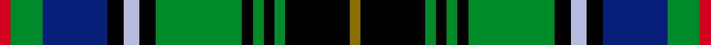

This page is one **sett** — a single exact thread-count. It belongs to the [tartan](/setts/r2g6db12k3lb3k3g16k2g2k2g2k12y2/)
(the same proportion at any scale), whose colour order is pattern [GKGKGKGKWKBGR](/stripes/gkgkgkgkwkbgr/).

Part of the [MacInnes](/tartans/macinnes-2/) tartan — the named design grouping this sett with its other cloths.

Sourced from register-of-tartans.  It is a [13 stripe tartan](/stripes/stripes13/).

Original link https://www.tartanregister.gov.uk/tartanDetails.aspx?ref=2471

## Provenance

Earliest known date: 1908 Recorded by Adam in 1908. The Clan MacInnes of the West and the Clan Innes of Moray are two separate clans. The similarity in the structure of the MacInnes green tartan and the Innes red have resulted in the use of both tartans as 'dress' and 'hunting' tartans by both clans. The notes in the archives of the Scottish Tartans Society attribute the design to the 'Onich Grocer' with no further explanation. MacInneses are hereditary bowmen to the Chief of MacKinnon.

4 attestations — the source records this cloth was collapsed from (oldest owns this page)

<ul>
<li>01/01/1908 — MacInnes (register-of-tartans, <a href="https://www.tartanregister.gov.uk/tartanDetails.aspx?ref=2471">record</a>)  <em>Threadcount recorded by William McInnes in the Public Register of all Arms and Bearings in Scotland, 44/73, 15 November 1960. The Scottish Tartans Society notes for this tartan attribute the design to the 'Onich Grocer' with no further explanation. Further research by Alasdair 'MacInnes' Campbell of Fort William has identified John MacInnes of Onich, who was born around 1851 and was Registrar for Ballachulish and Corran of Ardgour 1874-1920. John MacInnes was also a tailor and weaver and ran a general merchant store from the same premises as his Registry Office. It is said that when King Edward VII was the Prince of Wales he called at John's 'Nether Lochaber Stores' to have an outfit made. It is said that the royal patronage went to John's head - to the disdain of his neighbours.</em></li>
<li>undated — MacInnes (weddslist, <a href="http://www.weddslist.com/cgi-bin/tartans/pg.pl?source=sts">record</a>) </li>
<li>undated — MacInnes (weddslist, <a href="http://www.weddslist.com/cgi-bin/tartans/pg.pl?source=tinsel">record</a>) </li>
<li>undated — MacInnes Clan Tartan (house-of-tartan, <a href="http://www.house-of-tartan.scotland.net/house/TartanViewjs.asp?colr=Def&tnam=1464">record</a>) </li>
</ul>

## Register references

External register numbers recorded for this tartan.

- Scottish Register of Tartans: [2471](https://www.tartanregister.gov.uk/tartanDetails.aspx?ref=2471)
- Scottish Tartans Authority (ITI): 1464
- Scottish Tartans World Register: 1464

## Thread count
R/4 G12 DB24 K6 LB6 K6 G32 K4 G4 K4 G4 K24 Y/4

One full sett is **260 threads**.

## Palette
<table><thead><tr><th>Colour</th><th>Shade</th><th>OKLCh</th></tr></thead><tbody><tr><td>LB</td><td><code style="background-color:#B5BBDE;">#B5BBDE</code> <small style="color:#888">#B5BBDE</small></td><td><small style="color:#888">oklch(79.9% 0.050 277.6)</small></td></tr><tr><td>DB</td><td><code style="background-color:#082077;">#082077</code> <small style="color:#888">#082077</small></td><td><small style="color:#888">oklch(30.0% 0.149 265.1)</small></td></tr><tr><td>G</td><td><code style="background-color:#008B2A;">#008B2A</code> <small style="color:#888">#008B2A</small></td><td><small style="color:#888">oklch(55.4% 0.170 145.9)</small></td></tr><tr><td>K</td><td><code style="background-color:#000000;">#000000</code> <small style="color:#888">#000000</small></td><td><small style="color:#888">oklch(0.0% 0.000 0.0)</small></td></tr><tr><td>R</td><td><code style="background-color:#D60020;">#D60020</code> <small style="color:#888">#D60020</small></td><td><small style="color:#888">oklch(55.2% 0.224 25.5)</small></td></tr><tr><td>Y</td><td><code style="background-color:#8B6E00;">#8B6E00</code> <small style="color:#888">#8B6E00</small></td><td><small style="color:#888">oklch(55.1% 0.113 90.4)</small></td></tr></tbody></table>

# Sample pattern

## Nearest tartan variants

The nearest existing variants by ΔTartan distance, with this cloth at the top so the swatches line up against it.

ΔTartan

Threads

Variant

Sett

—

260

<a href="/variants/s13/r2g6db12k3lb3k3g16k2g2k2g2k12y2~x2/">MacInnes</a>

<a href="/ttd/edit/#slug=r2g6db12k3lb3k3g16k2g2k2g2k12y2&amp;base=r2g6db12k3lb3k3g16k2g2k2g2k12y2~x2" title="compare in the TTD">0.00</a>

130

<a href="/variants/s13/r2g6db12k3lb3k3g16k2g2k2g2k12y2/">MacInnes</a>

<a href="/ttd/edit/#slug=r2g6db12k3w3k3g16k2g2k2g2k12y2&amp;base=r2g6db12k3lb3k3g16k2g2k2g2k12y2~x2" title="compare in the TTD">0.30</a>

130

<a href="/variants/s13/r2g6db12k3w3k3g16k2g2k2g2k12y2/">MacInnes</a>

## Neighbour map

Every grey dot is one of 13620 variants placed by the first two principal components of the ΔTartan feature space (42% of its variance). Red is this tartan; blue dots are its nearest — click one to open its page.

<svg viewBox="0 0 640 380" role="img" style="max-width:100%;height:auto;border:1px solid #e0e0e0;border-radius:4px;display:block" xmlns="http://www.w3.org/2000/svg"><image href="/nn/cloud.v1.png" width="640" height="380"/><a href="/variants/s13/r2g6db12k3lb3k3g16k2g2k2g2k12y2/"><circle cx="102.1" cy="140.2" r="4" fill="#3465a4"><title>MacInnes</title></circle></a><a href="/variants/s13/r2g6db12k3w3k3g16k2g2k2g2k12y2/"><circle cx="98.1" cy="139.0" r="4" fill="#3465a4"><title>MacInnes</title></circle></a><circle cx="102.1" cy="140.2" r="5" fill="#c00000"/><text x="320" y="376" text-anchor="middle" font-size="11" fill="#999">ground</text><text x="11" y="190" text-anchor="middle" font-size="11" fill="#999" transform="rotate(-90 11 190)">complexity</text></svg>

ID: /variants/s13/r2g6db12k3lb3k3g16k2g2k2g2k12y2~x2/
