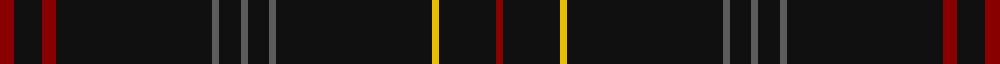

This page is one **sett** — a single exact thread-count. It belongs to the [tartan](/setts/r2k4r2k22n1k3n1k3n1k22ly1k8r1/)
(the same proportion at any scale), whose colour order is pattern [RKRKBKBKBKYKR](/stripes/rkrkbkbkbkykr/).

Sourced from tartans-authority.  It is a [13 stripe tartan](/stripes/stripes13/).

Original link http://www.tartansauthority.com/tartan-ferret/display/7958/

## Register references

External register numbers recorded for this tartan.

- Scottish Register of Tartans: [7958](https://www.tartanregister.gov.uk/tartanDetails?ref=7958)
- Scottish Tartans Authority (ITI): 7958

## Thread count
DR/4 K8 DR4 K44 N2 K6 N2 K6 N2 K44 Y2 K16 DR/2

One full sett is **278 threads**.

## Palette

Palette: <strong>Tartan Register</strong> <small style="color:#888">(3 of 4 colours)</small>
<table><thead><tr><th>Colour</th><th>Threads</th><th>Shade</th><th>Base</th><th>OKLCh</th></tr></thead><tbody><tr><td>DR/</td><td style="text-align:right;font-variant-numeric:tabular-nums">4</td><td><code style="background-color:#880000;">#880000</code> <small style="color:#888">#880000</small></td><td>R <code style="background-color:#CC0000;">#CC0000</code></td><td><small style="color:#888">oklch(39.4% 0.162 29.2)</small></td></tr><tr><td>K</td><td style="text-align:right;font-variant-numeric:tabular-nums">8</td><td><code style="background-color:#101010;">#101010</code> <small style="color:#888">#101010</small></td><td>K <code style="background-color:#000000;">#000000</code></td><td><small style="color:#888">oklch(17.3% 0.000 89.9)</small></td></tr><tr><td>DR</td><td style="text-align:right;font-variant-numeric:tabular-nums">4</td><td><code style="background-color:#880000;">#880000</code> <small style="color:#888">#880000</small></td><td>R <code style="background-color:#CC0000;">#CC0000</code></td><td><small style="color:#888">oklch(39.4% 0.162 29.2)</small></td></tr><tr><td>K</td><td style="text-align:right;font-variant-numeric:tabular-nums">44</td><td><code style="background-color:#101010;">#101010</code> <small style="color:#888">#101010</small></td><td>K <code style="background-color:#000000;">#000000</code></td><td><small style="color:#888">oklch(17.3% 0.000 89.9)</small></td></tr><tr><td>N</td><td style="text-align:right;font-variant-numeric:tabular-nums">2</td><td><code style="background-color:#5C5C5C;">#5C5C5C</code> <small style="color:#888">#5C5C5C</small></td><td>B <code style="background-color:#2A418A;">#2A418A</code></td><td><small style="color:#888">oklch(47.5% 0.000 89.9)</small></td></tr><tr><td>K</td><td style="text-align:right;font-variant-numeric:tabular-nums">6</td><td><code style="background-color:#101010;">#101010</code> <small style="color:#888">#101010</small></td><td>K <code style="background-color:#000000;">#000000</code></td><td><small style="color:#888">oklch(17.3% 0.000 89.9)</small></td></tr><tr><td>N</td><td style="text-align:right;font-variant-numeric:tabular-nums">2</td><td><code style="background-color:#5C5C5C;">#5C5C5C</code> <small style="color:#888">#5C5C5C</small></td><td>B <code style="background-color:#2A418A;">#2A418A</code></td><td><small style="color:#888">oklch(47.5% 0.000 89.9)</small></td></tr><tr><td>K</td><td style="text-align:right;font-variant-numeric:tabular-nums">6</td><td><code style="background-color:#101010;">#101010</code> <small style="color:#888">#101010</small></td><td>K <code style="background-color:#000000;">#000000</code></td><td><small style="color:#888">oklch(17.3% 0.000 89.9)</small></td></tr><tr><td>N</td><td style="text-align:right;font-variant-numeric:tabular-nums">2</td><td><code style="background-color:#5C5C5C;">#5C5C5C</code> <small style="color:#888">#5C5C5C</small></td><td>B <code style="background-color:#2A418A;">#2A418A</code></td><td><small style="color:#888">oklch(47.5% 0.000 89.9)</small></td></tr><tr><td>K</td><td style="text-align:right;font-variant-numeric:tabular-nums">44</td><td><code style="background-color:#101010;">#101010</code> <small style="color:#888">#101010</small></td><td>K <code style="background-color:#000000;">#000000</code></td><td><small style="color:#888">oklch(17.3% 0.000 89.9)</small></td></tr><tr><td>Y</td><td style="text-align:right;font-variant-numeric:tabular-nums">2</td><td><code style="background-color:#E8C000;">#E8C000</code> <small style="color:#888">#E8C000</small></td><td>Y <code style="background-color:#F2BF00;">#F2BF00</code></td><td><small style="color:#888">oklch(81.9% 0.168 93.7)</small></td></tr><tr><td>K</td><td style="text-align:right;font-variant-numeric:tabular-nums">16</td><td><code style="background-color:#101010;">#101010</code> <small style="color:#888">#101010</small></td><td>K <code style="background-color:#000000;">#000000</code></td><td><small style="color:#888">oklch(17.3% 0.000 89.9)</small></td></tr><tr><td>DR/</td><td style="text-align:right;font-variant-numeric:tabular-nums">2</td><td><code style="background-color:#880000;">#880000</code> <small style="color:#888">#880000</small></td><td>R <code style="background-color:#CC0000;">#CC0000</code></td><td><small style="color:#888">oklch(39.4% 0.162 29.2)</small></td></tr></tbody></table>

## Nearest tartans

The nearest existing variants by ΔTartan distance, with this tartan at the top so the swatches line up against it.

ΔTartan

Tartan

Sett

—

<a href="/ttd/edit/#slug=r2k4r2k22n1k3n1k3n1k22ly1k8r1~x2">Edinburgh Castle (Corporate?)</a> <a class="nn-out" href="/variants/s13/r2k4r2k22n1k3n1k3n1k22ly1k8r1~x2/" title="open its dictionary page">↗</a>

1.78

<a href="/ttd/edit/#slug=dt40dg3dp4dt28lo2lr2dt7~x2&amp;base=r2k4r2k22n1k3n1k3n1k22ly1k8r1~x2">Pisniak (Personal)</a> <a class="nn-out" href="/variants/s7/dt40dg3dp4dt28lo2lr2dt7~x2/" title="open its dictionary page">↗</a>

1.79

<a href="/ttd/edit/#slug=k78y16k2n2k2y2k3r2k10~x2&amp;base=r2k4r2k22n1k3n1k3n1k22ly1k8r1~x2">Scotland's Lionheart</a> <a class="nn-out" href="/variants/s9/k78y16k2n2k2y2k3r2k10~x2/" title="open its dictionary page">↗</a>

1.84

<a href="/ttd/edit/#slug=k72r3k11t9k11r3k37&amp;base=r2k4r2k22n1k3n1k3n1k22ly1k8r1~x2">Chafyn House (School)</a> <a class="nn-out" href="/variants/s7/k72r3k11t9k11r3k37/" title="open its dictionary page">↗</a>

1.86

<a href="/ttd/edit/#slug=k75dp6o2k2o2dp6k12db2o2~x2&amp;base=r2k4r2k22n1k3n1k3n1k22ly1k8r1~x2">Clan Inebriated (Corporate)</a> <a class="nn-out" href="/variants/s9/k75dp6o2k2o2dp6k12db2o2~x2/" title="open its dictionary page">↗</a>

2.00

<a href="/ttd/edit/#slug=k5db1k1n1k3n1k1db1k3db1k1g1k16g1k1n1k2~x4&amp;base=r2k4r2k22n1k3n1k3n1k22ly1k8r1~x2">Dickie (Glasgow)</a> <a class="nn-out" href="/variants/s17/k5db1k1n1k3n1k1db1k3db1k1g1k16g1k1n1k2~x4/" title="open its dictionary page">↗</a>

2.02

<a href="/ttd/edit/#slug=k3g2k20r2k12g2k4g2k6g2~x2&amp;base=r2k4r2k22n1k3n1k3n1k22ly1k8r1~x2">Renwick</a> <a class="nn-out" href="/variants/s10/k3g2k20r2k12g2k4g2k6g2~x2/" title="open its dictionary page">↗</a>

2.02

<a href="/ttd/edit/#slug=k75r1k4n15k2n1k3db1k2r1~x2&amp;base=r2k4r2k22n1k3n1k3n1k22ly1k8r1~x2">Selkirk Silver Band (Corporate)</a> <a class="nn-out" href="/variants/s10/k75r1k4n15k2n1k3db1k2r1~x2/" title="open its dictionary page">↗</a>

2.05

<a href="/ttd/edit/#slug=k70n2k3n12k1o3k1n12k3n2k60o2n2dp3~x2&amp;base=r2k4r2k22n1k3n1k3n1k22ly1k8r1~x2">Grassi (2009)</a> <a class="nn-out" href="/variants/s14/k70n2k3n12k1o3k1n12k3n2k60o2n2dp3~x2/" title="open its dictionary page">↗</a>

2.07

<a href="/ttd/edit/#slug=k62r3k3lo3k3r3k9o5~x2&amp;base=r2k4r2k22n1k3n1k3n1k22ly1k8r1~x2">Auld Bernensis</a> <a class="nn-out" href="/variants/s8/k62r3k3lo3k3r3k9o5~x2/" title="open its dictionary page">↗</a>

2.11

<a href="/ttd/edit/#slug=k15dp2dt1r1t1k15r1dt2k15t1k15dp4dt2t1k15~x2&amp;base=r2k4r2k22n1k3n1k3n1k22ly1k8r1~x2">GOLF (Corporate)</a> <a class="nn-out" href="/variants/s15/k15dp2dt1r1t1k15r1dt2k15t1k15dp4dt2t1k15~x2/" title="open its dictionary page">↗</a>

## Neighbour map

Every grey dot is one of 14360 variants placed by the first two principal components of the ΔTartan feature space (44% of its variance). Red is this tartan; blue dots are its nearest — click one to open its page.

<svg viewBox="0 0 640 380" role="img" style="max-width:100%;height:auto;border:1px solid #e0e0e0;border-radius:4px;display:block" xmlns="http://www.w3.org/2000/svg"><image href="/nn/cloud.v1.png" width="640" height="380"/><a href="/variants/s7/dt40dg3dp4dt28lo2lr2dt7~x2/"><circle cx="626.0" cy="204.4" r="4" fill="#3465a4"><title>Pisniak (Personal)</title></circle></a><a href="/variants/s9/k78y16k2n2k2y2k3r2k10~x2/"><circle cx="626.0" cy="137.8" r="4" fill="#3465a4"><title>Scotland's Lionheart</title></circle></a><a href="/variants/s7/k72r3k11t9k11r3k37/"><circle cx="626.0" cy="214.1" r="4" fill="#3465a4"><title>Chafyn House (School)</title></circle></a><a href="/variants/s9/k75dp6o2k2o2dp6k12db2o2~x2/"><circle cx="626.0" cy="135.8" r="4" fill="#3465a4"><title>Clan Inebriated (Corporate)</title></circle></a><a href="/variants/s17/k5db1k1n1k3n1k1db1k3db1k1g1k16g1k1n1k2~x4/"><circle cx="605.7" cy="183.8" r="4" fill="#3465a4"><title>Dickie (Glasgow)</title></circle></a><a href="/variants/s10/k3g2k20r2k12g2k4g2k6g2~x2/"><circle cx="561.7" cy="237.4" r="4" fill="#3465a4"><title>Renwick</title></circle></a><a href="/variants/s10/k75r1k4n15k2n1k3db1k2r1~x2/"><circle cx="626.0" cy="128.0" r="4" fill="#3465a4"><title>Selkirk Silver Band (Corporate)</title></circle></a><a href="/variants/s14/k70n2k3n12k1o3k1n12k3n2k60o2n2dp3~x2/"><circle cx="617.9" cy="120.9" r="4" fill="#3465a4"><title>Grassi (2009)</title></circle></a><a href="/variants/s8/k62r3k3lo3k3r3k9o5~x2/"><circle cx="598.1" cy="152.5" r="4" fill="#3465a4"><title>Auld Bernensis</title></circle></a><a href="/variants/s15/k15dp2dt1r1t1k15r1dt2k15t1k15dp4dt2t1k15~x2/"><circle cx="581.5" cy="198.7" r="4" fill="#3465a4"><title>GOLF (Corporate)</title></circle></a><circle cx="626.0" cy="173.0" r="5" fill="#c00000"/></svg>

ID: /variants/s13/r2k4r2k22n1k3n1k3n1k22ly1k8r1~x2/
