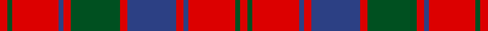

This page is one **sett** — a single exact thread-count. It belongs to the [tartan](/setts/r3dg2r19db2r3dg20r3db20r3db2r19dg2r3/)
(the same proportion at any scale), whose colour order is pattern [RGRBRBRGRBRGR](/stripes/rgrbrbrgrbrgr/).

Sourced from register-of-tartans.  It is a [13 stripe tartan](/stripes/stripes13/).

Original link https://www.tartanregister.gov.uk/tartanDetails.aspx?ref=3529

## Also known as

This cloth is also recorded under:

- Robertson, Curtain

## Register references

External register numbers recorded for this tartan.

- Scottish Register of Tartans: [3529](https://www.tartanregister.gov.uk/tartanDetails.aspx?ref=3529)
- Scottish Tartans World Register: 1494

## Thread count
R/12 G8 R76 B8 R12 G80 R12 B80 R12 B8 R76 G8 R/12

One full sett is **784 threads**.

## Palette

Palette: <strong>Tartan Register</strong>
<table><thead><tr><th>Colour</th><th>Threads</th><th>Shade</th><th>Base</th><th>OKLCh</th></tr></thead><tbody><tr><td>R/</td><td style="text-align:right;font-variant-numeric:tabular-nums">12</td><td><code style="background-color:#DC0000;">#DC0000</code> <small style="color:#888">#DC0000</small></td><td>R <code style="background-color:#CC0000;">#CC0000</code></td><td><small style="color:#888">oklch(56.2% 0.230 29.2)</small></td></tr><tr><td>G</td><td style="text-align:right;font-variant-numeric:tabular-nums">8</td><td><code style="background-color:#005020;">#005020</code> <small style="color:#888">#005020</small></td><td>G <code style="background-color:#006100;">#006100</code></td><td><small style="color:#888">oklch(37.7% 0.105 149.6)</small></td></tr><tr><td>R</td><td style="text-align:right;font-variant-numeric:tabular-nums">76</td><td><code style="background-color:#DC0000;">#DC0000</code> <small style="color:#888">#DC0000</small></td><td>R <code style="background-color:#CC0000;">#CC0000</code></td><td><small style="color:#888">oklch(56.2% 0.230 29.2)</small></td></tr><tr><td>B</td><td style="text-align:right;font-variant-numeric:tabular-nums">8</td><td><code style="background-color:#2C4084;">#2C4084</code> <small style="color:#888">#2C4084</small></td><td>B <code style="background-color:#2A418A;">#2A418A</code></td><td><small style="color:#888">oklch(39.4% 0.117 268.3)</small></td></tr><tr><td>R</td><td style="text-align:right;font-variant-numeric:tabular-nums">12</td><td><code style="background-color:#DC0000;">#DC0000</code> <small style="color:#888">#DC0000</small></td><td>R <code style="background-color:#CC0000;">#CC0000</code></td><td><small style="color:#888">oklch(56.2% 0.230 29.2)</small></td></tr><tr><td>G</td><td style="text-align:right;font-variant-numeric:tabular-nums">80</td><td><code style="background-color:#005020;">#005020</code> <small style="color:#888">#005020</small></td><td>G <code style="background-color:#006100;">#006100</code></td><td><small style="color:#888">oklch(37.7% 0.105 149.6)</small></td></tr><tr><td>R</td><td style="text-align:right;font-variant-numeric:tabular-nums">12</td><td><code style="background-color:#DC0000;">#DC0000</code> <small style="color:#888">#DC0000</small></td><td>R <code style="background-color:#CC0000;">#CC0000</code></td><td><small style="color:#888">oklch(56.2% 0.230 29.2)</small></td></tr><tr><td>B</td><td style="text-align:right;font-variant-numeric:tabular-nums">80</td><td><code style="background-color:#2C4084;">#2C4084</code> <small style="color:#888">#2C4084</small></td><td>B <code style="background-color:#2A418A;">#2A418A</code></td><td><small style="color:#888">oklch(39.4% 0.117 268.3)</small></td></tr><tr><td>R</td><td style="text-align:right;font-variant-numeric:tabular-nums">12</td><td><code style="background-color:#DC0000;">#DC0000</code> <small style="color:#888">#DC0000</small></td><td>R <code style="background-color:#CC0000;">#CC0000</code></td><td><small style="color:#888">oklch(56.2% 0.230 29.2)</small></td></tr><tr><td>B</td><td style="text-align:right;font-variant-numeric:tabular-nums">8</td><td><code style="background-color:#2C4084;">#2C4084</code> <small style="color:#888">#2C4084</small></td><td>B <code style="background-color:#2A418A;">#2A418A</code></td><td><small style="color:#888">oklch(39.4% 0.117 268.3)</small></td></tr><tr><td>R</td><td style="text-align:right;font-variant-numeric:tabular-nums">76</td><td><code style="background-color:#DC0000;">#DC0000</code> <small style="color:#888">#DC0000</small></td><td>R <code style="background-color:#CC0000;">#CC0000</code></td><td><small style="color:#888">oklch(56.2% 0.230 29.2)</small></td></tr><tr><td>G</td><td style="text-align:right;font-variant-numeric:tabular-nums">8</td><td><code style="background-color:#005020;">#005020</code> <small style="color:#888">#005020</small></td><td>G <code style="background-color:#006100;">#006100</code></td><td><small style="color:#888">oklch(37.7% 0.105 149.6)</small></td></tr><tr><td>R/</td><td style="text-align:right;font-variant-numeric:tabular-nums">12</td><td><code style="background-color:#DC0000;">#DC0000</code> <small style="color:#888">#DC0000</small></td><td>R <code style="background-color:#CC0000;">#CC0000</code></td><td><small style="color:#888">oklch(56.2% 0.230 29.2)</small></td></tr></tbody></table>

## Nearest tartans

The nearest existing variants by ΔTartan distance, with this tartan at the top so the swatches line up against it.

ΔTartan

Tartan

Sett

—

<a href="/ttd/edit/#slug=r3dg2r19db2r3dg20r3db20r3db2r19dg2r3~x4">Robertson Curtain</a> <a class="nn-out" href="/variants/s13/r3dg2r19db2r3dg20r3db20r3db2r19dg2r3~x4/" title="open its dictionary page">↗</a>

0.28

<a href="/ttd/edit/#slug=r1dg1r9dg1r1db9r1dg9r1db1r9dg1r1~x4&amp;base=r3dg2r19db2r3dg20r3db20r3db2r19dg2r3~x4">Robertson #3</a> <a class="nn-out" href="/variants/s13/r1dg1r9dg1r1db9r1dg9r1db1r9dg1r1~x4/" title="open its dictionary page">↗</a>

0.37

<a href="/ttd/edit/#slug=r4g4r35dp4r4dp35r4g35r4dp4r35g4r4&amp;base=r3dg2r19db2r3dg20r3db20r3db2r19dg2r3~x4">Robertson 1</a> <a class="nn-out" href="/variants/s13/r4g4r35dp4r4dp35r4g35r4dp4r35g4r4/" title="open its dictionary page">↗</a>

0.56

<a href="/ttd/edit/#slug=r3g2r19db2r3db20r3g20r3db2r19g2r3~x4&amp;base=r3dg2r19db2r3dg20r3db20r3db2r19dg2r3~x4">Robertson, Curtain</a> <a class="nn-out" href="/variants/s13/r3g2r19db2r3db20r3g20r3db2r19g2r3~x4/" title="open its dictionary page">↗</a>

0.59

<a href="/ttd/edit/#slug=r28dg2r5dg2r28db3r3dg24r3db24r3db3~x2&amp;base=r3dg2r19db2r3dg20r3db20r3db2r19dg2r3~x4">Robertson #5</a> <a class="nn-out" href="/variants/s12/r28dg2r5dg2r28db3r3dg24r3db24r3db3~x2/" title="open its dictionary page">↗</a>

0.61

<a href="/ttd/edit/#slug=r3g3r35db3r3db35r3g35r3db3r35g3r3~x2&amp;base=r3dg2r19db2r3dg20r3db20r3db2r19dg2r3~x4">Robertson 1819</a> <a class="nn-out" href="/variants/s13/r3g3r35db3r3db35r3g35r3db3r35g3r3~x2/" title="open its dictionary page">↗</a>

0.72

<a href="/ttd/edit/#slug=db3r23db3r26db3r3db25r3dg24r3~x2&amp;base=r3dg2r19db2r3dg20r3db20r3db2r19dg2r3~x4">Unidentified Early 18th Centuary</a> <a class="nn-out" href="/variants/s10/db3r23db3r26db3r3db25r3dg24r3~x2/" title="open its dictionary page">↗</a>

0.74

<a href="/ttd/edit/#slug=r45db4r4dg48r4db4r4db15r4db4r40dg4r4dg30&amp;base=r3dg2r19db2r3dg20r3db20r3db2r19dg2r3~x4">Bruce Old</a> <a class="nn-out" href="/variants/s14/r45db4r4dg48r4db4r4db15r4db4r40dg4r4dg30/" title="open its dictionary page">↗</a>

0.74

<a href="/ttd/edit/#slug=r1g1r9db1r1g9r1db9r1g1r9g1r1~x4&amp;base=r3dg2r19db2r3dg20r3db20r3db2r19dg2r3~x4">Robertson 3</a> <a class="nn-out" href="/variants/s13/r1g1r9db1r1g9r1db9r1g1r9g1r1~x4/" title="open its dictionary page">↗</a>

0.87

<a href="/ttd/edit/#slug=db3r23db3r26db3r3db25r3g24r3~x2&amp;base=r3dg2r19db2r3dg20r3db20r3db2r19dg2r3~x4">Unidentified, Early 18th C</a> <a class="nn-out" href="/variants/s10/db3r23db3r26db3r3db25r3g24r3~x2/" title="open its dictionary page">↗</a>

0.88

<a href="/ttd/edit/#slug=r1dg1r9dg1r1db9r1dg9r1db1r9dg1r1&amp;base=r3dg2r19db2r3dg20r3db20r3db2r19dg2r3~x4">Robertson</a> <a class="nn-out" href="/variants/s13/r1dg1r9dg1r1db9r1dg9r1db1r9dg1r1/" title="open its dictionary page">↗</a>

## Neighbour map

Every grey dot is one of 14360 variants placed by the first two principal components of the ΔTartan feature space (44% of its variance). Red is this tartan; blue dots are its nearest — click one to open its page.

<svg viewBox="0 0 640 380" role="img" style="max-width:100%;height:auto;border:1px solid #e0e0e0;border-radius:4px;display:block" xmlns="http://www.w3.org/2000/svg"><image href="/nn/cloud.v1.png" width="640" height="380"/><a href="/variants/s13/r1dg1r9dg1r1db9r1dg9r1db1r9dg1r1~x4/"><circle cx="306.9" cy="173.9" r="4" fill="#3465a4"><title>Robertson #3</title></circle></a><a href="/variants/s13/r4g4r35dp4r4dp35r4g35r4dp4r35g4r4/"><circle cx="307.9" cy="175.3" r="4" fill="#3465a4"><title>Robertson 1</title></circle></a><a href="/variants/s13/r3g2r19db2r3db20r3g20r3db2r19g2r3~x4/"><circle cx="319.4" cy="179.4" r="4" fill="#3465a4"><title>Robertson, Curtain</title></circle></a><a href="/variants/s12/r28dg2r5dg2r28db3r3dg24r3db24r3db3~x2/"><circle cx="342.6" cy="163.5" r="4" fill="#3465a4"><title>Robertson #5</title></circle></a><a href="/variants/s13/r3g3r35db3r3db35r3g35r3db3r35g3r3~x2/"><circle cx="318.7" cy="161.2" r="4" fill="#3465a4"><title>Robertson 1819</title></circle></a><a href="/variants/s10/db3r23db3r26db3r3db25r3dg24r3~x2/"><circle cx="295.4" cy="197.5" r="4" fill="#3465a4"><title>Unidentified Early 18th Centuary</title></circle></a><a href="/variants/s14/r45db4r4dg48r4db4r4db15r4db4r40dg4r4dg30/"><circle cx="318.5" cy="161.1" r="4" fill="#3465a4"><title>Bruce Old</title></circle></a><a href="/variants/s13/r1g1r9db1r1g9r1db9r1g1r9g1r1~x4/"><circle cx="310.8" cy="179.0" r="4" fill="#3465a4"><title>Robertson 3</title></circle></a><a href="/variants/s10/db3r23db3r26db3r3db25r3g24r3~x2/"><circle cx="300.9" cy="203.3" r="4" fill="#3465a4"><title>Unidentified, Early 18th C</title></circle></a><a href="/variants/s13/r1dg1r9dg1r1db9r1dg9r1db1r9dg1r1/"><circle cx="292.8" cy="171.8" r="4" fill="#3465a4"><title>Robertson</title></circle></a><circle cx="314.4" cy="173.6" r="5" fill="#c00000"/></svg>

ID: /variants/s13/r3dg2r19db2r3dg20r3db20r3db2r19dg2r3~x4/
