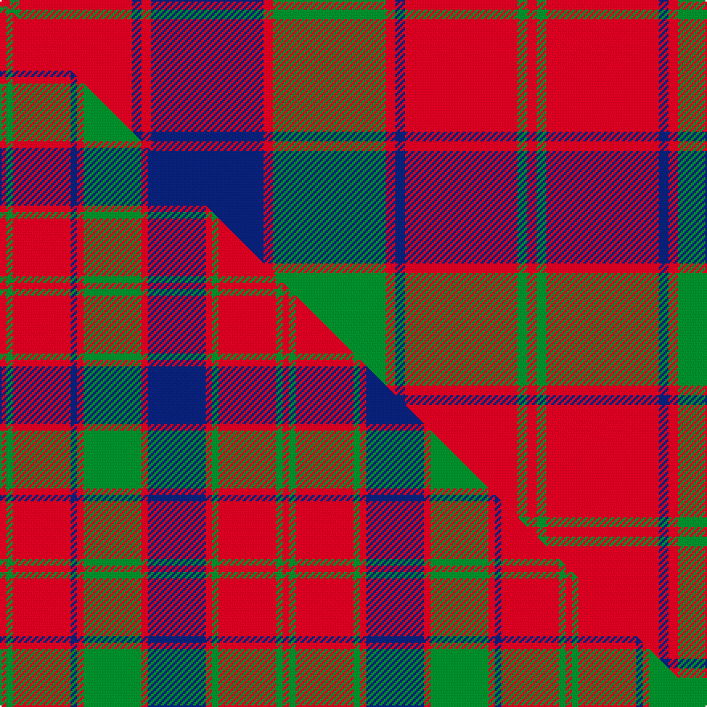

This page is one **sett** — a single exact thread-count. It belongs to the [tartan](/setts/r3g3r35db3r3db35r3g35r3db3r35g3r3/)
(the same proportion at any scale), whose colour order is pattern [RGRBRBRGRBRGR](/stripes/rgrbrbrgrbrgr/).

Part of the [Robertson](/tartans/robertson/) tartan — the named design grouping this sett with its other cloths.

Sourced from register-of-tartans.  It is a [13 stripe tartan](/stripes/stripes13/).

Original link https://www.tartanregister.gov.uk/tartanDetails.aspx?ref=3527

2 attestations — the source records this cloth was collapsed from (oldest owns this page)

<ul>
<li>01/01/1819 — Robertson 1819 (register-of-tartans, <a href="https://www.tartanregister.gov.uk/tartanDetails.aspx?ref=3527">record</a>)  <em>1819 KPB. The entry in W and A Smith's 1850 publication 'Authenticated Tartans of the Clans & Families of Scotland' reads: 'We had our specimen from the Manufacturer: it has always been known as 'The Robertson,' and has been approved of by all the authorities to whom we have referred it.' The Scottish Tartans Society Sindex card gives a count of 8 for all the smaller lines instead of 6 as given here. Woven sample. The Robertsons, known as Clan Donnachaidh, are claimed to be descended from the Celtic Earls of Atholl. Wilson's sett uses purple in place of the blue recorded by James Logan in the 'Scottish Gael' (1831). Wilsons of Bannockburn a weaving firm founded c1770 near Stirling. The Pattern books are in the National Museum of Antiquities, Edinburgh. Copys of the Pattern books and letters in the Scottish Tartans Society archive.</em></li>
<li>1819 — Robertson - 1819 (Clan) (tartans-authority, <a href="http://www.tartansauthority.com/tartan-ferret/display/1501/">record</a>)  <em>1819 Key Pattern Book. The entry in Andrew & William Smith's 1850 publication 'Authenticated Tartans of the Clans & Families of Scotland' reads: "We had our specimen from the Manufacturer: it has always been known as 'The Roberston,' and has been approved of by all the authorities to whom we have referred it." The STS Sindex card gives a count of 8 for all the smaller lines instead of 6 as given here. Woven sample.</em></li>
</ul>

## Register references

External register numbers recorded for this tartan.

- Scottish Register of Tartans: [3527](https://www.tartanregister.gov.uk/tartanDetails.aspx?ref=3527)
- Scottish Tartans Authority (ITI): 1501
- Scottish Tartans World Register: 1501

## Thread count
R/6 G6 R70 DB6 R6 DB70 R6 G70 R6 DB6 R70 G6 R/6

One full sett is **656 threads**.

## Palette
<table><thead><tr><th>Colour</th><th>Shade</th><th>OKLCh</th></tr></thead><tbody><tr><td>DB</td><td><code style="background-color:#082077;">#082077</code> <small style="color:#888">#082077</small></td><td><small style="color:#888">oklch(30.0% 0.149 265.1)</small></td></tr><tr><td>G</td><td><code style="background-color:#008B2A;">#008B2A</code> <small style="color:#888">#008B2A</small></td><td><small style="color:#888">oklch(55.4% 0.170 145.9)</small></td></tr><tr><td>R</td><td><code style="background-color:#D60020;">#D60020</code> <small style="color:#888">#D60020</small></td><td><small style="color:#888">oklch(55.2% 0.224 25.5)</small></td></tr></tbody></table>

# Sample pattern

## Compared to the master

This cloth is one sett of its design; the master sett (the exemplar the design is anchored on) is below for comparison.

Its **ΔTartan distance** from the master is **0.46** — the same measure the nearest-tartans table ranks by (0 is identical; a re-scale of the same cloth is near 0, a recolour or a different proportion further).

<figure class="master-compare" style="margin:0">

this sett
master sett ★

<figcaption style="color:#888;font-size:smaller">One weave of this sett against the <a href="/setts/r1g1r9db1r1g9r1db9r1g1r9g1r1/">master sett ★</a>, split on the diagonal: a shared proportion runs seamlessly across it with only the shades shifting; a different proportion breaks on it.</figcaption>
</figure>

## Nearest tartan variants

The nearest existing variants by ΔTartan distance, with this cloth at the top so the swatches line up against it.

ΔTartan

Threads

Variant

Sett

—

656

<a href="/variants/s13/r3g3r35db3r3db35r3g35r3db3r35g3r3~x2/">Robertson 1819</a>

<a href="/ttd/edit/#slug=r3g2r19db2r3db20r3g20r3db2r19g2r3~x4&amp;base=r3g3r35db3r3db35r3g35r3db3r35g3r3~x2" title="compare in the TTD">0.26</a>

784

<a href="/variants/s13/r3g2r19db2r3db20r3g20r3db2r19g2r3~x4/">Robertson Curtain</a>

<a href="/ttd/edit/#slug=r4g4r35b4r4g35r4b35r4b4r35g4r4&amp;base=r3g3r35db3r3db35r3g35r3db3r35g3r3~x2" title="compare in the TTD">0.28</a>

344

<a href="/variants/s13/r4g4r35b4r4g35r4b35r4b4r35g4r4/">Robertson 1</a>

<a href="/ttd/edit/#slug=r5g2r30db3r3db30r3g30r3db3r30g2r5~x2&amp;base=r3g3r35db3r3db35r3g35r3db3r35g3r3~x2" title="compare in the TTD">0.36</a>

576

<a href="/variants/s13/r5g2r30db3r3db30r3g30r3db3r30g2r5~x2/">Robertson D</a>

<a href="/ttd/edit/#slug=r5g2r30db3r3db30r3g30r3db3r30g2r5&amp;base=r3g3r35db3r3db35r3g35r3db3r35g3r3~x2" title="compare in the TTD">0.36</a>

288

<a href="/variants/s13/r5g2r30db3r3db30r3g30r3db3r30g2r5/">Robertson D</a>

<a href="/ttd/edit/#slug=r3g1r15db2r2db15r2g15r2db2r15g1r3~x2&amp;base=r3g3r35db3r3db35r3g35r3db3r35g3r3~x2" title="compare in the TTD">0.41</a>

300

<a href="/variants/s13/r3g1r15db2r2db15r2g15r2db2r15g1r3~x2/">Robertson D</a>

<a href="/ttd/edit/#slug=r28g2r5g2r28db3r3g24r3db24r3db3~x2&amp;base=r3g3r35db3r3db35r3g35r3db3r35g3r3~x2" title="compare in the TTD">1.27</a>

450

<a href="/variants/s12/r28g2r5g2r28db3r3g24r3db24r3db3~x2/">Robertson #5</a>

<a href="/ttd/edit/#slug=r1g1r9db1r1g9r1db9r1g1r9g1r1~x4&amp;base=r3g3r35db3r3db35r3g35r3db3r35g3r3~x2" title="compare in the TTD">1.29</a>

352

<a href="/variants/s13/r1g1r9db1r1g9r1db9r1g1r9g1r1~x4/">Robertson #3</a>

<a href="/ttd/edit/#slug=r1g1r9db1r1g9r1db9r1g1r9g1r1&amp;base=r3g3r35db3r3db35r3g35r3db3r35g3r3~x2" title="compare in the TTD">1.29</a>

88

<a href="/variants/s13/r1g1r9db1r1g9r1db9r1g1r9g1r1/">Robertson</a>

<a href="/ttd/edit/#slug=r1g1r9db1r1g9r1db9r1g1r9g1r1~x2&amp;base=r3g3r35db3r3db35r3g35r3db3r35g3r3~x2" title="compare in the TTD">1.29</a>

176

<a href="/variants/s13/r1g1r9db1r1g9r1db9r1g1r9g1r1~x2/">Robertson</a>

<a href="/ttd/edit/#slug=w1g2r18db2r2db18r2g18r2db2r18g2w1~x2&amp;base=r3g3r35db3r3db35r3g35r3db3r35g3r3~x2" title="compare in the TTD">2.45</a>

348

<a href="/variants/s13/w1g2r18db2r2db18r2g18r2db2r18g2w1~x2/">Robertson 1820 - White line</a>

## Neighbour map

Every grey dot is one of 13620 variants placed by the first two principal components of the ΔTartan feature space (42% of its variance). Red is this tartan; blue dots are its nearest — click one to open its page.

<svg viewBox="0 0 640 380" role="img" style="max-width:100%;height:auto;border:1px solid #e0e0e0;border-radius:4px;display:block" xmlns="http://www.w3.org/2000/svg"><image href="/nn/cloud.v1.png" width="640" height="380"/><a href="/variants/s13/r3g2r19db2r3db20r3g20r3db2r19g2r3~x4/"><circle cx="299.9" cy="174.9" r="4" fill="#3465a4"><title>Robertson Curtain</title></circle></a><a href="/variants/s13/r4g4r35b4r4g35r4b35r4b4r35g4r4/"><circle cx="316.6" cy="186.1" r="4" fill="#3465a4"><title>Robertson 1</title></circle></a><a href="/variants/s13/r5g2r30db3r3db30r3g30r3db3r30g2r5~x2/"><circle cx="319.2" cy="154.6" r="4" fill="#3465a4"><title>Robertson D</title></circle></a><a href="/variants/s13/r5g2r30db3r3db30r3g30r3db3r30g2r5/"><circle cx="319.2" cy="154.6" r="4" fill="#3465a4"><title>Robertson D</title></circle></a><a href="/variants/s13/r3g1r15db2r2db15r2g15r2db2r15g1r3~x2/"><circle cx="319.7" cy="159.5" r="4" fill="#3465a4"><title>Robertson D</title></circle></a><a href="/variants/s12/r28g2r5g2r28db3r3g24r3db24r3db3~x2/"><circle cx="328.6" cy="165.5" r="4" fill="#3465a4"><title>Robertson #5</title></circle></a><a href="/variants/s13/r1g1r9db1r1g9r1db9r1g1r9g1r1~x4/"><circle cx="293.3" cy="175.8" r="4" fill="#3465a4"><title>Robertson #3</title></circle></a><a href="/variants/s13/r1g1r9db1r1g9r1db9r1g1r9g1r1/"><circle cx="293.3" cy="175.8" r="4" fill="#3465a4"><title>Robertson</title></circle></a><a href="/variants/s13/r1g1r9db1r1g9r1db9r1g1r9g1r1~x2/"><circle cx="293.3" cy="175.8" r="4" fill="#3465a4"><title>Robertson</title></circle></a><a href="/variants/s13/w1g2r18db2r2db18r2g18r2db2r18g2w1~x2/"><circle cx="275.1" cy="135.1" r="4" fill="#3465a4"><title>Robertson 1820 - White line</title></circle></a><circle cx="303.3" cy="160.3" r="5" fill="#c00000"/><text x="320" y="376" text-anchor="middle" font-size="11" fill="#999">ground</text><text x="11" y="190" text-anchor="middle" font-size="11" fill="#999" transform="rotate(-90 11 190)">complexity</text></svg>

ID: /variants/s13/r3g3r35db3r3db35r3g35r3db3r35g3r3~x2/
