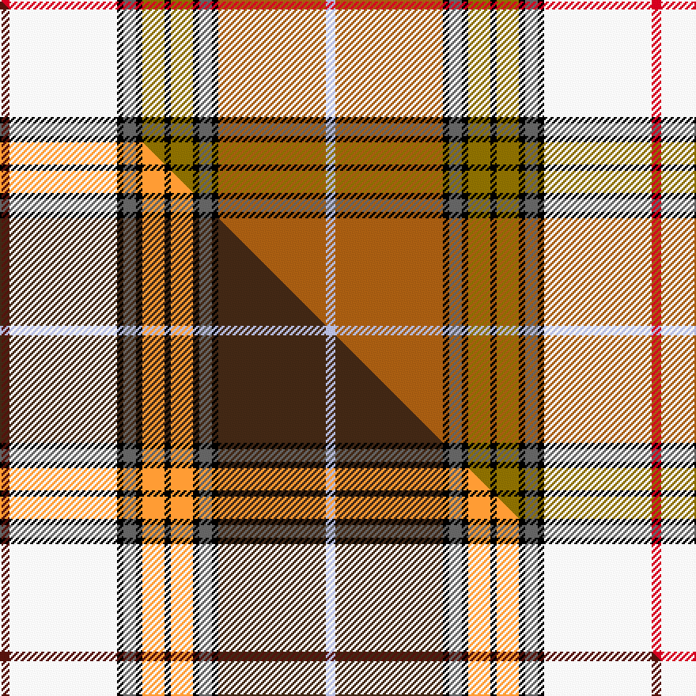

This is one **variant** — a specific cloth: this exact thread count and colourway, with its own
provenance below. It is one weaving of the [sett](/setts/r3w34k2n4k2y7k2y7k2n4k2o34lb3/) (the scale-free proportion — the
same cloth at any scale or shade), whose colour order is pattern [RWKBKGKGKBKRW](/stripes/rwkbkgkgkbkrw/).

Part of the [Buchanan Dress](/tartans/b/bu/buchanan-dress-3/) tartan — the named design grouping this sett with its other cloths.

Sourced from weddslist.  It is a [13 stripe tartan](/stripes/stripes13/).

Original link [http://www.weddslist.com/cgi-bin/tartans/pg.pl?source=sts](http://www.weddslist.com/cgi-bin/tartans/pg.pl?source=sts)

Dataset <small>— provenance for this record, inherited from the source manifest</small>

<dl class="dataset-prov">
<dt>source</dt><dd><a href="/sources/weddslist/">Weddslist</a></dd>
<dt>data captured from</dt><dd><a href="https://github.com/thetartan/tartan-database/blob/master/data/weddslist/data.csv">https://github.com/thetartan/tartan-database/blob/master/data/weddslist/data.csv</a></dd>
<dt>data date</dt><dd>2016-11-17 <small>(dataset default)</small></dd>
<dt>licence</dt><dd><a href="https://creativecommons.org/licenses/by-nc-nd/4.0/">CC BY-NC-ND 4.0</a></dd>
</dl>

Capture chain <small>— the hands this data passed through, oldest first; each capture carries its own licence</small>

<ol class="capture-chain">
<li><a href="https://www.weddslist.com/tartans/">Weddslist</a> <small>the living privately compiled reference</small></li>
<li><a href="https://github.com/thetartan/tartan-database">thetartan/tartan-database</a> <small>2016-2017</small> · <a href="https://creativecommons.org/licenses/by-nc-nd/4.0/">CC BY-NC-ND 4.0</a> <small>Levko Kravets's frozen compilation — the capture we vendored, and where its CC licence text came from</small></li>
<li>this dictionary <small>captured 2026-06-10 · commit 5bf86c7566</small> <small>each re-capture is a git commit to data/sources</small></li>
</ol>

## Thread count
R/6 W68 K4 N8 K4 Y14 K4 Y14 K4 N8 K4 O68 LB/6

One full sett is **412 threads**.

## Palette
<table><thead><tr><th>Colour</th><th>Shade</th><th>OKLCh</th></tr></thead><tbody><tr><td>LB</td><td><code style="background-color:#B5BBDE;">#B5BBDE</code> <small style="color:#888">#B5BBDE</small></td><td><small style="color:#888">oklch(79.9% 0.050 277.6)</small></td></tr><tr><td>K</td><td><code style="background-color:#000000;">#000000</code> <small style="color:#888">#000000</small></td><td><small style="color:#888">oklch(0.0% 0.000 0.0)</small></td></tr><tr><td>W</td><td><code style="background-color:#F7F7F7;">#F7F7F7</code> <small style="color:#888">#F7F7F7</small></td><td><small style="color:#888">oklch(97.6% 0.000 89.9)</small></td></tr><tr><td>O</td><td><code style="background-color:#A65C11;">#A65C11</code> <small style="color:#888">#A65C11</small></td><td><small style="color:#888">oklch(55.0% 0.125 58.3)</small></td></tr><tr><td>N</td><td><code style="background-color:#636363;">#636363</code> <small style="color:#888">#636363</small></td><td><small style="color:#888">oklch(50.0% 0.000 89.9)</small></td></tr><tr><td>R</td><td><code style="background-color:#D60020;">#D60020</code> <small style="color:#888">#D60020</small></td><td><small style="color:#888">oklch(55.2% 0.224 25.5)</small></td></tr><tr><td>Y</td><td><code style="background-color:#8B6E00;">#8B6E00</code> <small style="color:#888">#8B6E00</small></td><td><small style="color:#888">oklch(55.1% 0.113 90.4)</small></td></tr></tbody></table>

# Sample pattern

## Compared to the master

This cloth is one sett of its design; the master sett (the exemplar the design is anchored on) is below for comparison.

Its **ΔTartan distance** from the master is **0.67** — the same measure the nearest-tartans table ranks by (0 is identical; a re-scale of the same cloth is near 0, a recolour or a different proportion further).

<figure class="master-compare" style="margin:0">

this sett
master sett ★

<figcaption style="color:#888;font-size:smaller">One weave of this sett against the <a href="/setts/dr3w34k2n4k2lo7k2lo7k2n4k2do34lb3/">master sett ★</a>, split on the diagonal: a shared proportion runs seamlessly across it with only the shades shifting; a different proportion breaks on it.</figcaption>
</figure>

## Nearest tartan variants

The nearest existing variants by ΔTartan distance, with this cloth at the top so the swatches line up against it.

ΔTartan

Threads

Variant

Sett

—

412

<a href="/variants/s13/r3w34k2n4k2y7k2y7k2n4k2o34lb3~x2/">Buchanan, dress</a>

<a href="/ttd/edit/#slug=dr3w34k2n4k2lo7k2lo7k2n4k2do34lb3~x2&amp;base=r3w34k2n4k2y7k2y7k2n4k2o34lb3~x2" title="compare in the TTD">0.67</a>

412

<a href="/variants/s13/dr3w34k2n4k2lo7k2lo7k2n4k2do34lb3~x2/">Buchanan Dress (Fashion)</a>

<a href="/ttd/edit/#slug=k2r16w1db2w1y3w2y3w1db2w1g16lb2~x2&amp;base=r3w34k2n4k2y7k2y7k2n4k2o34lb3~x2" title="compare in the TTD">1.58</a>

200

<a href="/variants/s13/k2r16w1db2w1y3w2y3w1db2w1g16lb2~x2/">Gibbs Gibson Family Tartan</a>

<a href="/ttd/edit/#slug=r3w34k2n4k2y7k2y7k2n4k2dy34lb3~x2&amp;base=r3w34k2n4k2y7k2y7k2n4k2o34lb3~x2" title="compare in the TTD">2.00</a>

412

<a href="/variants/s13/r3w34k2n4k2y7k2y7k2n4k2dy34lb3~x2/">Buchanan Dress Clan Tartan</a>

<a href="/ttd/edit/#slug=r30b2k6b2g17y7w2k2w2y4lb7w2k6w6~x2&amp;base=r3w34k2n4k2y7k2y7k2n4k2o34lb3~x2" title="compare in the TTD">2.39</a>

308

<a href="/variants/s14/r30b2k6b2g17y7w2k2w2y4lb7w2k6w6~x2/">Dundee</a>

<a href="/ttd/edit/#slug=r30ri2k6ri2g17y7w2k2w2y4lb7w2k6w6~x2~r2109032-ri2406019&amp;base=r3w34k2n4k2y7k2y7k2n4k2o34lb3~x2" title="compare in the TTD">2.47</a>

308

<a href="/variants/s14/r30ri2k6ri2g17y7w2k2w2y4lb7w2k6w6~x2~r2109032-ri2406019/">Dundee District Tartan</a>

<a href="/ttd/edit/#slug=ri30r2k6r2g17y7w2k2w2y4lb7w2k6w6~x2~ri2209032-r2208029&amp;base=r3w34k2n4k2y7k2y7k2n4k2o34lb3~x2" title="compare in the TTD">2.48</a>

308

<a href="/variants/s14/ri30r2k6r2g17y7w2k2w2y4lb7w2k6w6~x2~ri2209032-r2208029/">Dundee #2</a>

<a href="/ttd/edit/#slug=w2r16k1lb2k1y4k1lb2k1g16lb1~x2&amp;base=r3w34k2n4k2y7k2y7k2n4k2o34lb3~x2" title="compare in the TTD">2.75</a>

182

<a href="/variants/s11/w2r16k1lb2k1y4k1lb2k1g16lb1~x2/">Baxter of Balgavies</a>

<a href="/ttd/edit/#slug=w2r16k1lb2k1y4k1lb2k1g16lb1~x4&amp;base=r3w34k2n4k2y7k2y7k2n4k2o34lb3~x2" title="compare in the TTD">2.75</a>

364

<a href="/variants/s11/w2r16k1lb2k1y4k1lb2k1g16lb1~x4/">Baxter (Clan)</a>

<a href="/ttd/edit/#slug=w2r16k1t2k1ly4k1ly4k1t2k1g16t1~x4&amp;base=r3w34k2n4k2y7k2y7k2n4k2o34lb3~x2" title="compare in the TTD">2.81</a>

404

<a href="/variants/s13/w2r16k1t2k1ly4k1ly4k1t2k1g16t1~x4/">Buchanan</a>

<a href="/ttd/edit/#slug=r4o2w2o23w2o2r4o2w2o2w12db6y2k4n2w2~x2&amp;base=r3w34k2n4k2y7k2y7k2n4k2o34lb3~x2" title="compare in the TTD">2.82</a>

280

<a href="/variants/s16/r4o2w2o23w2o2r4o2w2o2w12db6y2k4n2w2~x2/">Palmer, General W.J.</a>

## Neighbour map

Every grey dot is one of 13621 variants placed by the first two principal components of the ΔTartan feature space (42% of its variance). Red is this tartan; blue dots are its nearest — click one to open its page. The map is a flat projection of a many-dimensional space — [how to read it](/posts/neighbourhood-maps/).

<svg viewBox="0 0 640 380" role="img" style="max-width:100%;height:auto;border:1px solid #e0e0e0;border-radius:4px;display:block" xmlns="http://www.w3.org/2000/svg"><image href="/nn/cloud.v1.png" width="640" height="380"/><a href="/variants/s13/dr3w34k2n4k2lo7k2lo7k2n4k2do34lb3~x2/"><circle cx="89.9" cy="65.6" r="4" fill="#3465a4"><title>Buchanan Dress (Fashion)</title></circle></a><a href="/variants/s13/k2r16w1db2w1y3w2y3w1db2w1g16lb2~x2/"><circle cx="100.1" cy="79.1" r="4" fill="#3465a4"><title>Gibbs Gibson Family Tartan</title></circle></a><a href="/variants/s13/r3w34k2n4k2y7k2y7k2n4k2dy34lb3~x2/"><circle cx="87.3" cy="64.9" r="4" fill="#3465a4"><title>Buchanan Dress Clan Tartan</title></circle></a><a href="/variants/s14/r30b2k6b2g17y7w2k2w2y4lb7w2k6w6~x2/"><circle cx="65.8" cy="84.1" r="4" fill="#3465a4"><title>Dundee</title></circle></a><a href="/variants/s14/r30ri2k6ri2g17y7w2k2w2y4lb7w2k6w6~x2~r2109032-ri2406019/"><circle cx="60.8" cy="79.9" r="4" fill="#3465a4"><title>Dundee District Tartan</title></circle></a><a href="/variants/s14/ri30r2k6r2g17y7w2k2w2y4lb7w2k6w6~x2~ri2209032-r2208029/"><circle cx="60.4" cy="79.2" r="4" fill="#3465a4"><title>Dundee #2</title></circle></a><a href="/variants/s11/w2r16k1lb2k1y4k1lb2k1g16lb1~x2/"><circle cx="143.2" cy="96.7" r="4" fill="#3465a4"><title>Baxter of Balgavies</title></circle></a><a href="/variants/s11/w2r16k1lb2k1y4k1lb2k1g16lb1~x4/"><circle cx="143.2" cy="96.7" r="4" fill="#3465a4"><title>Baxter (Clan)</title></circle></a><a href="/variants/s13/w2r16k1t2k1ly4k1ly4k1t2k1g16t1~x4/"><circle cx="114.0" cy="90.7" r="4" fill="#3465a4"><title>Buchanan</title></circle></a><a href="/variants/s16/r4o2w2o23w2o2r4o2w2o2w12db6y2k4n2w2~x2/"><circle cx="126.9" cy="82.3" r="4" fill="#3465a4"><title>Palmer, General W.J.</title></circle></a><circle cx="99.8" cy="67.6" r="5" fill="#c00000"/><text x="320" y="376" text-anchor="middle" font-size="11" fill="#999">ground</text><text x="11" y="190" text-anchor="middle" font-size="11" fill="#999" transform="rotate(-90 11 190)">complexity</text></svg>

ID: /variants/s13/r3w34k2n4k2y7k2y7k2n4k2o34lb3~x2/
