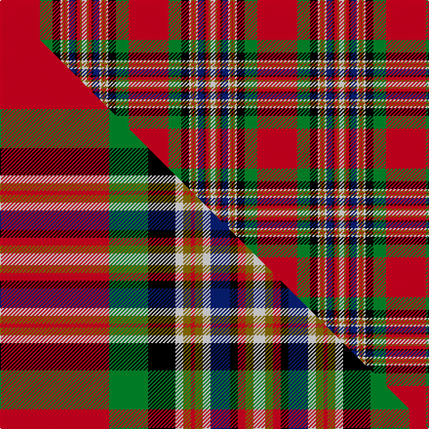

This page is one **sett** — a single exact thread-count. It belongs to the [tartan](/setts/r41g13k8w2y2r1y2w2db6k2r3y2w5/)
(the same proportion at any scale), whose colour order is pattern [RGKWGRGWBKRGW](/stripes/rgkwgrgwbkrgw/).

Part of the [MacGill](/tartans/macgill/) tartan — the named design grouping this sett with its other cloths.

Sourced from weddslist.  It is a [13 stripe tartan](/stripes/stripes13/).

Original link http://www.weddslist.com/cgi-bin/tartans/pg.pl?source=rb

## Thread count
R/41 G13 K8 W2 Y2 R1 Y2 W2 DB6 K2 R3 Y2 W/5

One full sett is **132 threads**.

## Palette
<table><thead><tr><th>Colour</th><th>Shade</th><th>OKLCh</th></tr></thead><tbody><tr><td>DB</td><td><code style="background-color:#082077;">#082077</code> <small style="color:#888">#082077</small></td><td><small style="color:#888">oklch(30.0% 0.149 265.1)</small></td></tr><tr><td>G</td><td><code style="background-color:#008B2A;">#008B2A</code> <small style="color:#888">#008B2A</small></td><td><small style="color:#888">oklch(55.4% 0.170 145.9)</small></td></tr><tr><td>K</td><td><code style="background-color:#000000;">#000000</code> <small style="color:#888">#000000</small></td><td><small style="color:#888">oklch(0.0% 0.000 0.0)</small></td></tr><tr><td>W</td><td><code style="background-color:#F7F7F7;">#F7F7F7</code> <small style="color:#888">#F7F7F7</small></td><td><small style="color:#888">oklch(97.6% 0.000 89.9)</small></td></tr><tr><td>R</td><td><code style="background-color:#D60020;">#D60020</code> <small style="color:#888">#D60020</small></td><td><small style="color:#888">oklch(55.2% 0.224 25.5)</small></td></tr><tr><td>Y</td><td><code style="background-color:#8B6E00;">#8B6E00</code> <small style="color:#888">#8B6E00</small></td><td><small style="color:#888">oklch(55.1% 0.113 90.4)</small></td></tr></tbody></table>

# Sample pattern

## Compared to the master

This cloth is one sett of its design; the master sett (the exemplar the design is anchored on) is below for comparison.

Its **ΔTartan distance** from the master is **0.88** — the same measure the nearest-tartans table ranks by (0 is identical; a re-scale of the same cloth is near 0, a recolour or a different proportion further).

<figure class="master-compare" style="margin:0">

this sett
master sett ★

<figcaption style="color:#888;font-size:smaller">One weave of this sett against the <a href="/setts/r28g10k7w2y2r1y2w2db5k2r2y2w3/">master sett ★</a>, split on the diagonal: a shared proportion runs seamlessly across it with only the shades shifting; a different proportion breaks on it.</figcaption>
</figure>

## Nearest tartan variants

The nearest existing variants by ΔTartan distance, with this cloth at the top so the swatches line up against it.

ΔTartan

Threads

Variant

Sett

—

132

<a href="/variants/s13/r41g13k8w2y2r1y2w2db6k2r3y2w5/">MacGill</a>

<a href="/ttd/edit/#slug=r28g10k7w2y2r1y2w2db5k2r2y2w3~x4&amp;base=r41g13k8w2y2r1y2w2db6k2r3y2w5" title="compare in the TTD">0.30</a>

420

<a href="/variants/s13/r28g10k7w2y2r1y2w2db5k2r2y2w3~x4/">MacGill</a>

<a href="/ttd/edit/#slug=r47g16k8w3y3r2y3w3db6k3r4y4w3~x2&amp;base=r41g13k8w2y2r1y2w2db6k2r3y2w5" title="compare in the TTD">0.45</a>

320

<a href="/variants/s13/r47g16k8w3y3r2y3w3db6k3r4y4w3~x2/">MacGill Clan Tartan</a>

<a href="/ttd/edit/#slug=r48g16k8w3y3r2o3w3db8k1r4y4w3~x2&amp;base=r41g13k8w2y2r1y2w2db6k2r3y2w5" title="compare in the TTD">0.56</a>

322

<a href="/variants/s13/r48g16k8w3y3r2o3w3db8k1r4y4w3~x2/">MacGill</a>

<a href="/ttd/edit/#slug=r60k2w1g16w2y3r3k1r3y3w2lb16k4r4y6w2~x2&amp;base=r41g13k8w2y2r1y2w2db6k2r3y2w5" title="compare in the TTD">2.62</a>

388

<a href="/variants/s16/r60k2w1g16w2y3r3k1r3y3w2lb16k4r4y6w2~x2/">Clan Chattan D</a>

<a href="/ttd/edit/#slug=r60k2w1g16w2y3r3k1r3y3w2lb16k4r4y6w2&amp;base=r41g13k8w2y2r1y2w2db6k2r3y2w5" title="compare in the TTD">2.62</a>

194

<a href="/variants/s16/r60k2w1g16w2y3r3k1r3y3w2lb16k4r4y6w2/">Clan Chattan D</a>

<a href="/ttd/edit/#slug=r122k4w2g32w4ly7r7k2r7ly7w4lb32k8r8ly12w4&amp;base=r41g13k8w2y2r1y2w2db6k2r3y2w5" title="compare in the TTD">2.63</a>

398

<a href="/variants/s16/r122k4w2g32w4ly7r7k2r7ly7w4lb32k8r8ly12w4/">Chattan (Clan)</a>

<a href="/ttd/edit/#slug=r122k4w2g32w4y7r7k2r7y7w4lb32k8r8y12w4~x2&amp;base=r41g13k8w2y2r1y2w2db6k2r3y2w5" title="compare in the TTD">2.63</a>

796

<a href="/variants/s16/r122k4w2g32w4y7r7k2r7y7w4lb32k8r8y12w4~x2/">Clan Chattan</a>

<a href="/ttd/edit/#slug=r122k4w2g32w4y7r7k2r7y7w4lb32k8r8y12w4&amp;base=r41g13k8w2y2r1y2w2db6k2r3y2w5" title="compare in the TTD">2.63</a>

398

<a href="/variants/s16/r122k4w2g32w4y7r7k2r7y7w4lb32k8r8y12w4/">Clan Chattan</a>

## Neighbour map

Every grey dot is one of 13620 variants placed by the first two principal components of the ΔTartan feature space (42% of its variance). Red is this tartan; blue dots are its nearest — click one to open its page.

<svg viewBox="0 0 640 380" role="img" style="max-width:100%;height:auto;border:1px solid #e0e0e0;border-radius:4px;display:block" xmlns="http://www.w3.org/2000/svg"><image href="/nn/cloud.v1.png" width="640" height="380"/><a href="/variants/s13/r28g10k7w2y2r1y2w2db5k2r2y2w3~x4/"><circle cx="183.2" cy="53.8" r="4" fill="#3465a4"><title>MacGill</title></circle></a><a href="/variants/s13/r47g16k8w3y3r2y3w3db6k3r4y4w3~x2/"><circle cx="217.9" cy="54.6" r="4" fill="#3465a4"><title>MacGill Clan Tartan</title></circle></a><a href="/variants/s13/r48g16k8w3y3r2o3w3db8k1r4y4w3~x2/"><circle cx="229.0" cy="14.7" r="4" fill="#3465a4"><title>MacGill</title></circle></a><a href="/variants/s16/r60k2w1g16w2y3r3k1r3y3w2lb16k4r4y6w2~x2/"><circle cx="290.9" cy="14.0" r="4" fill="#3465a4"><title>Clan Chattan D</title></circle></a><a href="/variants/s16/r60k2w1g16w2y3r3k1r3y3w2lb16k4r4y6w2/"><circle cx="290.9" cy="14.0" r="4" fill="#3465a4"><title>Clan Chattan D</title></circle></a><a href="/variants/s16/r122k4w2g32w4ly7r7k2r7ly7w4lb32k8r8ly12w4/"><circle cx="287.1" cy="14.0" r="4" fill="#3465a4"><title>Chattan (Clan)</title></circle></a><a href="/variants/s16/r122k4w2g32w4y7r7k2r7y7w4lb32k8r8y12w4~x2/"><circle cx="293.3" cy="14.0" r="4" fill="#3465a4"><title>Clan Chattan</title></circle></a><a href="/variants/s16/r122k4w2g32w4y7r7k2r7y7w4lb32k8r8y12w4/"><circle cx="293.3" cy="14.0" r="4" fill="#3465a4"><title>Clan Chattan</title></circle></a><circle cx="233.2" cy="30.1" r="5" fill="#c00000"/><text x="320" y="376" text-anchor="middle" font-size="11" fill="#999">ground</text><text x="11" y="190" text-anchor="middle" font-size="11" fill="#999" transform="rotate(-90 11 190)">complexity</text></svg>

ID: /variants/s13/r41g13k8w2y2r1y2w2db6k2r3y2w5/
