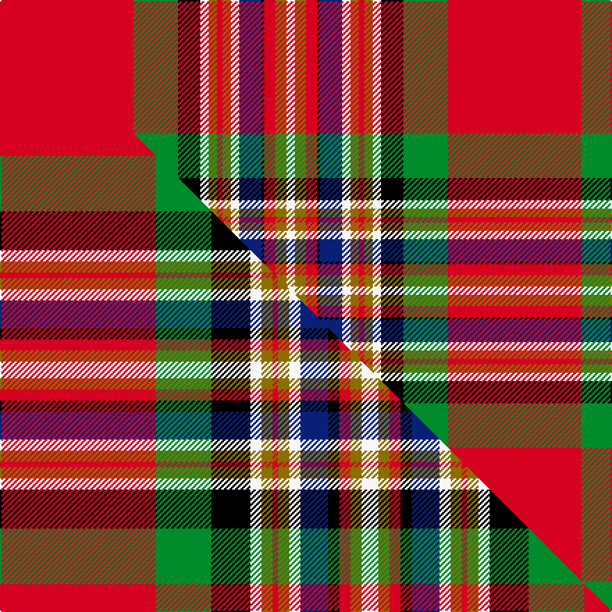

This is one **variant** — a specific cloth: this exact thread count and colourway, with its own
provenance below. It is one weaving of the [sett](/setts/r48g16k8w3y3r2o3w3db8k1r4y4w3/) (the scale-free proportion — the
same cloth at any scale or shade), whose colour order is pattern [RGKWGRRWBKRGW](/stripes/rgkwgrrwbkrgw/).

Part of the [MacGill](/tartans/macgill/) tartan — the named design grouping this sett with its other cloths.

Sourced from weddslist.  It is a [13 stripe tartan](/stripes/stripes13/).

Original link [http://www.weddslist.com/cgi-bin/tartans/pg.pl?source=sts](http://www.weddslist.com/cgi-bin/tartans/pg.pl?source=sts)

Dataset <small>— provenance for this record, inherited from the source manifest</small>

<dl class="dataset-prov">
<dt>source</dt><dd><a href="/sources/weddslist/">Weddslist</a></dd>
<dt>data captured from</dt><dd><a href="https://github.com/thetartan/tartan-database/blob/master/data/weddslist/data.csv">https://github.com/thetartan/tartan-database/blob/master/data/weddslist/data.csv</a></dd>
<dt>data date</dt><dd>2016-11-17 <small>(dataset default)</small></dd>
<dt>licence</dt><dd><a href="https://creativecommons.org/licenses/by-nc-nd/4.0/">CC BY-NC-ND 4.0</a></dd>
</dl>

Capture chain <small>— the hands this data passed through, oldest first; each capture carries its own licence</small>

<ol class="capture-chain">
<li><a href="https://www.weddslist.com/tartans/">Weddslist</a> <small>the living privately compiled reference</small></li>
<li><a href="https://github.com/thetartan/tartan-database">thetartan/tartan-database</a> <small>2016-2017</small> · <a href="https://creativecommons.org/licenses/by-nc-nd/4.0/">CC BY-NC-ND 4.0</a> <small>Levko Kravets's frozen compilation — the capture we vendored, and where its CC licence text came from</small></li>
<li>this dictionary <small>captured 2026-06-10 · commit 5bf86c7566</small> <small>each re-capture is a git commit to data/sources</small></li>
</ol>

## Thread count
R/96 G32 K16 W6 Y6 R4 O6 W6 DB16 K2 R8 Y8 W/6

One full sett is **322 threads**.

## Palette
<table><thead><tr><th>Colour</th><th>Shade</th><th>OKLCh</th></tr></thead><tbody><tr><td>DB</td><td><code style="background-color:#082077;">#082077</code> <small style="color:#888">#082077</small></td><td><small style="color:#888">oklch(30.0% 0.149 265.1)</small></td></tr><tr><td>G</td><td><code style="background-color:#008B2A;">#008B2A</code> <small style="color:#888">#008B2A</small></td><td><small style="color:#888">oklch(55.4% 0.170 145.9)</small></td></tr><tr><td>K</td><td><code style="background-color:#000000;">#000000</code> <small style="color:#888">#000000</small></td><td><small style="color:#888">oklch(0.0% 0.000 0.0)</small></td></tr><tr><td>W</td><td><code style="background-color:#F7F7F7;">#F7F7F7</code> <small style="color:#888">#F7F7F7</small></td><td><small style="color:#888">oklch(97.6% 0.000 89.9)</small></td></tr><tr><td>O</td><td><code style="background-color:#A65C11;">#A65C11</code> <small style="color:#888">#A65C11</small></td><td><small style="color:#888">oklch(55.0% 0.125 58.3)</small></td></tr><tr><td>R</td><td><code style="background-color:#D60020;">#D60020</code> <small style="color:#888">#D60020</small></td><td><small style="color:#888">oklch(55.2% 0.224 25.5)</small></td></tr><tr><td>Y</td><td><code style="background-color:#8B6E00;">#8B6E00</code> <small style="color:#888">#8B6E00</small></td><td><small style="color:#888">oklch(55.1% 0.113 90.4)</small></td></tr></tbody></table>

# Sample pattern

## Compared to the master

This cloth is one sett of its design; the master sett (the exemplar the design is anchored on) is below for comparison.

Its **ΔTartan distance** from the master is **0.74** — the same measure the nearest-tartans table ranks by (0 is identical; a re-scale of the same cloth is near 0, a recolour or a different proportion further).

<figure class="master-compare" style="margin:0">

this sett
master sett ★

<figcaption style="color:#888;font-size:smaller">One weave of this sett against the <a href="/setts/r28g10k7w2y2r1y2w2db5k2r2y2w3/">master sett ★</a>, split on the diagonal: a shared proportion runs seamlessly across it with only the shades shifting; a different proportion breaks on it.</figcaption>
</figure>

## Nearest tartan variants

The nearest existing variants by ΔTartan distance, with this cloth at the top so the swatches line up against it.

ΔTartan

Threads

Variant

Sett

—

322

<a href="/variants/s13/r48g16k8w3y3r2o3w3db8k1r4y4w3~x2/">MacGill</a>

<a href="/ttd/edit/#slug=r41g13k8w2y2r1y2w2db6k2r3y2w5&amp;base=r48g16k8w3y3r2o3w3db8k1r4y4w3~x2" title="compare in the TTD">0.57</a>

132

<a href="/variants/s13/r41g13k8w2y2r1y2w2db6k2r3y2w5/">MacGill</a>

<a href="/ttd/edit/#slug=r28g10k7w2y2r1y2w2db5k2r2y2w3~x4&amp;base=r48g16k8w3y3r2o3w3db8k1r4y4w3~x2" title="compare in the TTD">0.74</a>

420

<a href="/variants/s13/r28g10k7w2y2r1y2w2db5k2r2y2w3~x4/">MacGill</a>

<a href="/ttd/edit/#slug=r47g16k8w3y3r2y3w3db6k3r4y4w3~x2&amp;base=r48g16k8w3y3r2o3w3db8k1r4y4w3~x2" title="compare in the TTD">0.81</a>

320

<a href="/variants/s13/r47g16k8w3y3r2y3w3db6k3r4y4w3~x2/">MacGill Clan Tartan</a>

<a href="/ttd/edit/#slug=r11lb3db18y1db2w1k1g18r3k1r2k3r2k1r40k1r2k3~x2&amp;base=r48g16k8w3y3r2o3w3db8k1r4y4w3~x2" title="compare in the TTD">2.22</a>

424

<a href="/variants/s18/r11lb3db18y1db2w1k1g18r3k1r2k3r2k1r40k1r2k3~x2/">MacRae of Ardentoul Artifact Tartan</a>

<a href="/ttd/edit/#slug=db3r2db2r35ly2db3k2db5k4g13k1w3~x2&amp;base=r48g16k8w3y3r2o3w3db8k1r4y4w3~x2" title="compare in the TTD">2.44</a>

288

<a href="/variants/s12/db3r2db2r35ly2db3k2db5k4g13k1w3~x2/">Celtic Nations (Fashion)</a>

<a href="/ttd/edit/#slug=r40g16y2k8lb4w1db5w2~x2&amp;base=r48g16k8w3y3r2o3w3db8k1r4y4w3~x2" title="compare in the TTD">2.50</a>

228

<a href="/variants/s8/r40g16y2k8lb4w1db5w2~x2/">Caledonian Society Ancient Artifact Tartan</a>

<a href="/ttd/edit/#slug=db3r2db2r35dy2db3k2db5k4g13k1w3~x2&amp;base=r48g16k8w3y3r2o3w3db8k1r4y4w3~x2" title="compare in the TTD">2.54</a>

288

<a href="/variants/s12/db3r2db2r35dy2db3k2db5k4g13k1w3~x2/">Celtic Nations</a>

<a href="/ttd/edit/#slug=r40g16lyi2k8ly4w1db5w2~x2~lyi3307090-ly2602166&amp;base=r48g16k8w3y3r2o3w3db8k1r4y4w3~x2" title="compare in the TTD">2.56</a>

228

<a href="/variants/s8/r40g16ly2k8y4w1db5w2~x2~ly3307090-y2602166/">Caledonian Soc., Ancient (Artefact)</a>

<a href="/ttd/edit/#slug=r120k4w2g32w4k7r7k2r7k7w4lb32k8r8k12w4&amp;base=r48g16k8w3y3r2o3w3db8k1r4y4w3~x2" title="compare in the TTD">2.61</a>

396

<a href="/variants/s16/r120k4w2g32w4k7r7k2r7k7w4lb32k8r8k12w4/">Chattan, Clan</a>

<a href="/ttd/edit/#slug=r29k1lo3dg6w6r3k1r3w2dg3db5k3y5w5k4~x2&amp;base=r48g16k8w3y3r2o3w3db8k1r4y4w3~x2" title="compare in the TTD">2.73</a>

250

<a href="/variants/s15/r29k1lo3dg6w6r3k1r3w2dg3db5k3y5w5k4~x2/">Elmore (Personal)</a>

## Neighbour map

Every grey dot is one of 13621 variants placed by the first two principal components of the ΔTartan feature space (42% of its variance). Red is this tartan; blue dots are its nearest — click one to open its page.

<svg viewBox="0 0 640 380" role="img" style="max-width:100%;height:auto;border:1px solid #e0e0e0;border-radius:4px;display:block" xmlns="http://www.w3.org/2000/svg"><image href="/nn/cloud.v1.png" width="640" height="380"/><a href="/variants/s13/r41g13k8w2y2r1y2w2db6k2r3y2w5/"><circle cx="233.1" cy="30.0" r="4" fill="#3465a4"><title>MacGill</title></circle></a><a href="/variants/s13/r28g10k7w2y2r1y2w2db5k2r2y2w3~x4/"><circle cx="183.1" cy="53.7" r="4" fill="#3465a4"><title>MacGill</title></circle></a><a href="/variants/s13/r47g16k8w3y3r2y3w3db6k3r4y4w3~x2/"><circle cx="217.8" cy="54.5" r="4" fill="#3465a4"><title>MacGill Clan Tartan</title></circle></a><a href="/variants/s18/r11lb3db18y1db2w1k1g18r3k1r2k3r2k1r40k1r2k3~x2/"><circle cx="240.1" cy="14.0" r="4" fill="#3465a4"><title>MacRae of Ardentoul Artifact Tartan</title></circle></a><a href="/variants/s12/db3r2db2r35ly2db3k2db5k4g13k1w3~x2/"><circle cx="232.1" cy="44.5" r="4" fill="#3465a4"><title>Celtic Nations (Fashion)</title></circle></a><a href="/variants/s8/r40g16y2k8lb4w1db5w2~x2/"><circle cx="233.3" cy="53.6" r="4" fill="#3465a4"><title>Caledonian Society Ancient Artifact Tartan</title></circle></a><a href="/variants/s12/db3r2db2r35dy2db3k2db5k4g13k1w3~x2/"><circle cx="234.1" cy="44.9" r="4" fill="#3465a4"><title>Celtic Nations</title></circle></a><a href="/variants/s8/r40g16ly2k8y4w1db5w2~x2~ly3307090-y2602166/"><circle cx="235.7" cy="55.3" r="4" fill="#3465a4"><title>Caledonian Soc., Ancient (Artefact)</title></circle></a><a href="/variants/s16/r120k4w2g32w4k7r7k2r7k7w4lb32k8r8k12w4/"><circle cx="262.3" cy="14.0" r="4" fill="#3465a4"><title>Chattan, Clan</title></circle></a><a href="/variants/s15/r29k1lo3dg6w6r3k1r3w2dg3db5k3y5w5k4~x2/"><circle cx="147.0" cy="36.0" r="4" fill="#3465a4"><title>Elmore (Personal)</title></circle></a><circle cx="228.8" cy="14.5" r="5" fill="#c00000"/><text x="320" y="376" text-anchor="middle" font-size="11" fill="#999">ground</text><text x="11" y="190" text-anchor="middle" font-size="11" fill="#999" transform="rotate(-90 11 190)">complexity</text></svg>

ID: /variants/s13/r48g16k8w3y3r2o3w3db8k1r4y4w3~x2/
