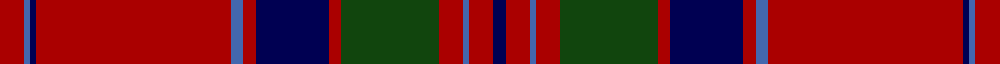

This page is one **sett** — a single exact thread-count. It belongs to the [tartan](/setts/r4b1db1r32b2r2db12r2dg16r4b1r4db2/)
(the same proportion at any scale), whose colour order is pattern [BRBRGRBRBRBBR](/stripes/brbrgrbrbrbbr/).

Part of the [MacGillivray](/tartans/macgillivray/) tartan — the named design grouping this sett with its other cloths.

Sourced from weddslist.  It is a [13 stripe tartan](/stripes/stripes13/).

Original link http://www.weddslist.com/cgi-bin/tartans/pg.pl?source=tinsel

## Also known as

This cloth is also recorded under:

- MacGillivray #2
- MacGillivray #3
- MacGillivray Hunting
- McGillivray, Pauline

## Thread count
DR/8 B2 DB2 DR64 B4 DR4 DB24 DR4 DG32 DR8 B2 DR8 DB/4

One full sett is **320 threads**.

## Palette

Palette: <strong>custom</strong>
<table><thead><tr><th>Colour</th><th>Threads</th><th>Shade</th><th>Base</th><th>OKLCh</th></tr></thead><tbody><tr><td>DR/</td><td style="text-align:right;font-variant-numeric:tabular-nums">8</td><td><code style="background-color:#AA0000;">#AA0000</code> <small style="color:#888">#AA0000</small></td><td>R <code style="background-color:#CC0000;">#CC0000</code></td><td><small style="color:#888">oklch(46.3% 0.190 29.2)</small></td></tr><tr><td>B</td><td style="text-align:right;font-variant-numeric:tabular-nums">2</td><td><code style="background-color:#4367AE;">#4367AE</code> <small style="color:#888">#4367AE</small></td><td>B <code style="background-color:#2A418A;">#2A418A</code></td><td><small style="color:#888">oklch(52.2% 0.120 262.7)</small></td></tr><tr><td>DB</td><td style="text-align:right;font-variant-numeric:tabular-nums">2</td><td><code style="background-color:#000052;">#000052</code> <small style="color:#888">#000052</small></td><td>B <code style="background-color:#2A418A;">#2A418A</code></td><td><small style="color:#888">oklch(19.8% 0.137 264.1)</small></td></tr><tr><td>DR</td><td style="text-align:right;font-variant-numeric:tabular-nums">64</td><td><code style="background-color:#AA0000;">#AA0000</code> <small style="color:#888">#AA0000</small></td><td>R <code style="background-color:#CC0000;">#CC0000</code></td><td><small style="color:#888">oklch(46.3% 0.190 29.2)</small></td></tr><tr><td>B</td><td style="text-align:right;font-variant-numeric:tabular-nums">4</td><td><code style="background-color:#4367AE;">#4367AE</code> <small style="color:#888">#4367AE</small></td><td>B <code style="background-color:#2A418A;">#2A418A</code></td><td><small style="color:#888">oklch(52.2% 0.120 262.7)</small></td></tr><tr><td>DR</td><td style="text-align:right;font-variant-numeric:tabular-nums">4</td><td><code style="background-color:#AA0000;">#AA0000</code> <small style="color:#888">#AA0000</small></td><td>R <code style="background-color:#CC0000;">#CC0000</code></td><td><small style="color:#888">oklch(46.3% 0.190 29.2)</small></td></tr><tr><td>DB</td><td style="text-align:right;font-variant-numeric:tabular-nums">24</td><td><code style="background-color:#000052;">#000052</code> <small style="color:#888">#000052</small></td><td>B <code style="background-color:#2A418A;">#2A418A</code></td><td><small style="color:#888">oklch(19.8% 0.137 264.1)</small></td></tr><tr><td>DR</td><td style="text-align:right;font-variant-numeric:tabular-nums">4</td><td><code style="background-color:#AA0000;">#AA0000</code> <small style="color:#888">#AA0000</small></td><td>R <code style="background-color:#CC0000;">#CC0000</code></td><td><small style="color:#888">oklch(46.3% 0.190 29.2)</small></td></tr><tr><td>DG</td><td style="text-align:right;font-variant-numeric:tabular-nums">32</td><td><code style="background-color:#11450D;">#11450D</code> <small style="color:#888">#11450D</small></td><td>G <code style="background-color:#006100;">#006100</code></td><td><small style="color:#888">oklch(34.4% 0.101 142.1)</small></td></tr><tr><td>DR</td><td style="text-align:right;font-variant-numeric:tabular-nums">8</td><td><code style="background-color:#AA0000;">#AA0000</code> <small style="color:#888">#AA0000</small></td><td>R <code style="background-color:#CC0000;">#CC0000</code></td><td><small style="color:#888">oklch(46.3% 0.190 29.2)</small></td></tr><tr><td>B</td><td style="text-align:right;font-variant-numeric:tabular-nums">2</td><td><code style="background-color:#4367AE;">#4367AE</code> <small style="color:#888">#4367AE</small></td><td>B <code style="background-color:#2A418A;">#2A418A</code></td><td><small style="color:#888">oklch(52.2% 0.120 262.7)</small></td></tr><tr><td>DR</td><td style="text-align:right;font-variant-numeric:tabular-nums">8</td><td><code style="background-color:#AA0000;">#AA0000</code> <small style="color:#888">#AA0000</small></td><td>R <code style="background-color:#CC0000;">#CC0000</code></td><td><small style="color:#888">oklch(46.3% 0.190 29.2)</small></td></tr><tr><td>DB/</td><td style="text-align:right;font-variant-numeric:tabular-nums">4</td><td><code style="background-color:#000052;">#000052</code> <small style="color:#888">#000052</small></td><td>B <code style="background-color:#2A418A;">#2A418A</code></td><td><small style="color:#888">oklch(19.8% 0.137 264.1)</small></td></tr></tbody></table>

## Compared to the master

This cloth is one sett of its design; the master sett (the exemplar the design is anchored on) is below for comparison.

<figure style="margin:0"><figcaption style="color:#888;font-size:smaller">this sett</figcaption></figure>
<figure style="margin:0"><figcaption style="color:#888;font-size:smaller"><a href="/setts/g19r7g7r7g7r14db3r3g19r3db3r66db7r14/">master sett →</a></figcaption></figure>

## Nearest tartans

The nearest existing variants by ΔTartan distance, with this tartan at the top so the swatches line up against it.

ΔTartan

Tartan

Sett

—

<a href="/ttd/edit/#slug=r4b1db1r32b2r2db12r2dg16r4b1r4db2~x2">MacGillivray</a> <a class="nn-out" href="/variants/s13/r4b1db1r32b2r2db12r2dg16r4b1r4db2~x2/" title="open its dictionary page">↗</a>

0.00

<a href="/ttd/edit/#slug=r4b1db1r32b2r2db12r2dg16r4b1r4db2&amp;base=r4b1db1r32b2r2db12r2dg16r4b1r4db2~x2">MacGillivray</a> <a class="nn-out" href="/variants/s13/r4b1db1r32b2r2db12r2dg16r4b1r4db2/" title="open its dictionary page">↗</a>

0.55

<a href="/ttd/edit/#slug=r6db2r2dg24r2dg2r2db8r2b1r32db2r2db1r6~x2&amp;base=r4b1db1r32b2r2db12r2dg16r4b1r4db2~x2">Grant</a> <a class="nn-out" href="/variants/s15/r6db2r2dg24r2dg2r2db8r2b1r32db2r2db1r6~x2/" title="open its dictionary page">↗</a>

0.84

<a href="/ttd/edit/#slug=dg2r2db1r24b1db6r3dg12r4db1~x2&amp;base=r4b1db1r32b2r2db12r2dg16r4b1r4db2~x2">MacDonell of Keppoch</a> <a class="nn-out" href="/variants/s10/dg2r2db1r24b1db6r3dg12r4db1~x2/" title="open its dictionary page">↗</a>

0.84

<a href="/ttd/edit/#slug=dg2r2db1r24b1db6r3dg12r4db1&amp;base=r4b1db1r32b2r2db12r2dg16r4b1r4db2~x2">MacDonell of Keppoch</a> <a class="nn-out" href="/variants/s10/dg2r2db1r24b1db6r3dg12r4db1/" title="open its dictionary page">↗</a>

0.91

<a href="/ttd/edit/#slug=r6db2r2dg24r2db2r2db8r2lb1r32db2r2db1r6~x2&amp;base=r4b1db1r32b2r2db12r2dg16r4b1r4db2~x2">Grant</a> <a class="nn-out" href="/variants/s15/r6db2r2dg24r2db2r2db8r2lb1r32db2r2db1r6~x2/" title="open its dictionary page">↗</a>

0.93

<a href="/variants/s16/r12g6k6g2k1g1k6r24w2~x2/">Hunter of Bute (Personal)</a>

0.93

<a href="/ttd/edit/#slug=r3dp1r1dg21r3dp18r35dp1ly1r4dg1&amp;base=r4b1db1r32b2r2db12r2dg16r4b1r4db2~x2">MacPherson Of Cluny</a> <a class="nn-out" href="/variants/s11/r3dp1r1dg21r3dp18r35dp1ly1r4dg1/" title="open its dictionary page">↗</a>

0.96

<a href="/ttd/edit/#slug=r6db2r2g24r2g2r2db8r2t2r32db2r2db1r6~x2&amp;base=r4b1db1r32b2r2db12r2dg16r4b1r4db2~x2">Grant or Drummond Clan Tartan</a> <a class="nn-out" href="/variants/s15/r6db2r2g24r2g2r2db8r2t2r32db2r2db1r6~x2/" title="open its dictionary page">↗</a>

0.97

<a href="/ttd/edit/#slug=r4t1db1r32t2r2db12r2g16r4t1r4db2~x2&amp;base=r4b1db1r32b2r2db12r2dg16r4b1r4db2~x2">MacGillivray</a> <a class="nn-out" href="/variants/s13/r4t1db1r32t2r2db12r2g16r4t1r4db2~x2/" title="open its dictionary page">↗</a>

1.06

<a href="/ttd/edit/#slug=r4lb1db1r32lb2r2db12r2dg16r4lb1r4db2&amp;base=r4b1db1r32b2r2db12r2dg16r4b1r4db2~x2">MacGillivray</a> <a class="nn-out" href="/variants/s13/r4lb1db1r32lb2r2db12r2dg16r4lb1r4db2/" title="open its dictionary page">↗</a>

## Neighbour map

Every grey dot is one of 14360 variants placed by the first two principal components of the ΔTartan feature space (44% of its variance). Red is this tartan; blue dots are its nearest — click one to open its page.

<svg viewBox="0 0 640 380" role="img" style="max-width:100%;height:auto;border:1px solid #e0e0e0;border-radius:4px;display:block" xmlns="http://www.w3.org/2000/svg"><image href="/nn/cloud.v1.png" width="640" height="380"/><a href="/variants/s13/r4b1db1r32b2r2db12r2dg16r4b1r4db2/"><circle cx="389.9" cy="106.0" r="4" fill="#3465a4"><title>MacGillivray</title></circle></a><a href="/variants/s15/r6db2r2dg24r2dg2r2db8r2b1r32db2r2db1r6~x2/"><circle cx="402.8" cy="100.9" r="4" fill="#3465a4"><title>Grant</title></circle></a><a href="/variants/s10/dg2r2db1r24b1db6r3dg12r4db1~x2/"><circle cx="397.3" cy="136.4" r="4" fill="#3465a4"><title>MacDonell of Keppoch</title></circle></a><a href="/variants/s10/dg2r2db1r24b1db6r3dg12r4db1/"><circle cx="397.3" cy="136.4" r="4" fill="#3465a4"><title>MacDonell of Keppoch</title></circle></a><a href="/variants/s15/r6db2r2dg24r2db2r2db8r2lb1r32db2r2db1r6~x2/"><circle cx="376.2" cy="84.3" r="4" fill="#3465a4"><title>Grant</title></circle></a><a href="/variants/s16/r12g6k6g2k1g1k6r24w2~x2/"><circle cx="357.2" cy="126.0" r="4" fill="#3465a4"><title>Hunter of Bute (Personal)</title></circle></a><a href="/variants/s11/r3dp1r1dg21r3dp18r35dp1ly1r4dg1/"><circle cx="367.7" cy="103.7" r="4" fill="#3465a4"><title>MacPherson Of Cluny</title></circle></a><a href="/variants/s15/r6db2r2g24r2g2r2db8r2t2r32db2r2db1r6~x2/"><circle cx="389.9" cy="92.9" r="4" fill="#3465a4"><title>Grant or Drummond Clan Tartan</title></circle></a><a href="/variants/s13/r4t1db1r32t2r2db12r2g16r4t1r4db2~x2/"><circle cx="394.4" cy="103.1" r="4" fill="#3465a4"><title>MacGillivray</title></circle></a><a href="/variants/s13/r4lb1db1r32lb2r2db12r2dg16r4lb1r4db2/"><circle cx="363.5" cy="87.7" r="4" fill="#3465a4"><title>MacGillivray</title></circle></a><circle cx="389.9" cy="106.0" r="5" fill="#c00000"/></svg>

ID: /variants/s13/r4b1db1r32b2r2db12r2dg16r4b1r4db2~x2/
