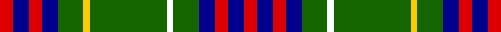

This page is one **sett** — a single exact thread-count. It belongs to the [tartan](/setts/r4db5r4db5g8w2g24ly2g8db5r4db5r4/)
(the same proportion at any scale), whose colour order is pattern [RBRBGWGYGBRBR](/stripes/rbrbgwgygbrbr/).

Sourced from register-of-tartans.  It is a [13 stripe tartan](/stripes/stripes13/).

Original link https://www.tartanregister.gov.uk/tartanDetails.aspx?ref=11315

## Register references

External register numbers recorded for this tartan.

- Scottish Register of Tartans: [11315](https://www.tartanregister.gov.uk/tartanDetails.aspx?ref=11315)

## Thread count
R/8 DB10 R8 DB10 G16 Y4 G48 W4 G16 DB10 R8 DB10 R/8

One full sett is **304 threads**.

## Palette

Palette: <strong>Tartan Register</strong>
<table><thead><tr><th>Colour</th><th>Threads</th><th>Shade</th><th>Base</th><th>OKLCh</th></tr></thead><tbody><tr><td>R/</td><td style="text-align:right;font-variant-numeric:tabular-nums">8</td><td><code style="background-color:#DC0000;">#DC0000</code> <small style="color:#888">#DC0000</small></td><td>R <code style="background-color:#CC0000;">#CC0000</code></td><td><small style="color:#888">oklch(56.2% 0.230 29.2)</small></td></tr><tr><td>DB</td><td style="text-align:right;font-variant-numeric:tabular-nums">10</td><td><code style="background-color:#00008C;">#00008C</code> <small style="color:#888">#00008C</small></td><td>B <code style="background-color:#2A418A;">#2A418A</code></td><td><small style="color:#888">oklch(28.9% 0.200 264.1)</small></td></tr><tr><td>R</td><td style="text-align:right;font-variant-numeric:tabular-nums">8</td><td><code style="background-color:#DC0000;">#DC0000</code> <small style="color:#888">#DC0000</small></td><td>R <code style="background-color:#CC0000;">#CC0000</code></td><td><small style="color:#888">oklch(56.2% 0.230 29.2)</small></td></tr><tr><td>DB</td><td style="text-align:right;font-variant-numeric:tabular-nums">10</td><td><code style="background-color:#00008C;">#00008C</code> <small style="color:#888">#00008C</small></td><td>B <code style="background-color:#2A418A;">#2A418A</code></td><td><small style="color:#888">oklch(28.9% 0.200 264.1)</small></td></tr><tr><td>G</td><td style="text-align:right;font-variant-numeric:tabular-nums">16</td><td><code style="background-color:#146400;">#146400</code> <small style="color:#888">#146400</small></td><td>G <code style="background-color:#006100;">#006100</code></td><td><small style="color:#888">oklch(43.9% 0.144 140.9)</small></td></tr><tr><td>Y</td><td style="text-align:right;font-variant-numeric:tabular-nums">4</td><td><code style="background-color:#FCCC00;">#FCCC00</code> <small style="color:#888">#FCCC00</small></td><td>Y <code style="background-color:#F2BF00;">#F2BF00</code></td><td><small style="color:#888">oklch(86.2% 0.176 91.5)</small></td></tr><tr><td>G</td><td style="text-align:right;font-variant-numeric:tabular-nums">48</td><td><code style="background-color:#146400;">#146400</code> <small style="color:#888">#146400</small></td><td>G <code style="background-color:#006100;">#006100</code></td><td><small style="color:#888">oklch(43.9% 0.144 140.9)</small></td></tr><tr><td>W</td><td style="text-align:right;font-variant-numeric:tabular-nums">4</td><td><code style="background-color:#FFFFFF;">#FFFFFF</code> <small style="color:#888">#FFFFFF</small></td><td>W <code style="background-color:#F7F7F7;">#F7F7F7</code></td><td><small style="color:#888">oklch(100.0% 0.000 89.9)</small></td></tr><tr><td>G</td><td style="text-align:right;font-variant-numeric:tabular-nums">16</td><td><code style="background-color:#146400;">#146400</code> <small style="color:#888">#146400</small></td><td>G <code style="background-color:#006100;">#006100</code></td><td><small style="color:#888">oklch(43.9% 0.144 140.9)</small></td></tr><tr><td>DB</td><td style="text-align:right;font-variant-numeric:tabular-nums">10</td><td><code style="background-color:#00008C;">#00008C</code> <small style="color:#888">#00008C</small></td><td>B <code style="background-color:#2A418A;">#2A418A</code></td><td><small style="color:#888">oklch(28.9% 0.200 264.1)</small></td></tr><tr><td>R</td><td style="text-align:right;font-variant-numeric:tabular-nums">8</td><td><code style="background-color:#DC0000;">#DC0000</code> <small style="color:#888">#DC0000</small></td><td>R <code style="background-color:#CC0000;">#CC0000</code></td><td><small style="color:#888">oklch(56.2% 0.230 29.2)</small></td></tr><tr><td>DB</td><td style="text-align:right;font-variant-numeric:tabular-nums">10</td><td><code style="background-color:#00008C;">#00008C</code> <small style="color:#888">#00008C</small></td><td>B <code style="background-color:#2A418A;">#2A418A</code></td><td><small style="color:#888">oklch(28.9% 0.200 264.1)</small></td></tr><tr><td>R/</td><td style="text-align:right;font-variant-numeric:tabular-nums">8</td><td><code style="background-color:#DC0000;">#DC0000</code> <small style="color:#888">#DC0000</small></td><td>R <code style="background-color:#CC0000;">#CC0000</code></td><td><small style="color:#888">oklch(56.2% 0.230 29.2)</small></td></tr></tbody></table>

## Nearest tartans

The nearest existing variants by ΔTartan distance, with this tartan at the top so the swatches line up against it.

ΔTartan

Tartan

Sett

—

<a href="/ttd/edit/#slug=r4db5r4db5g8w2g24ly2g8db5r4db5r4~x2">Clackson Hunting (Personal)</a> <a class="nn-out" href="/variants/s13/r4db5r4db5g8w2g24ly2g8db5r4db5r4~x2/" title="open its dictionary page">↗</a>

0.69

<a href="/ttd/edit/#slug=w1r2g10r2g2k8g2db8g2r2g10r2w1~x4&amp;base=r4db5r4db5g8w2g24ly2g8db5r4db5r4~x2">Reid, Green</a> <a class="nn-out" href="/variants/s13/w1r2g10r2g2k8g2db8g2r2g10r2w1~x4/" title="open its dictionary page">↗</a>

0.80

<a href="/ttd/edit/#slug=w1r2g10r2g2k8g2db8g2r2g10r2w1~x2&amp;base=r4db5r4db5g8w2g24ly2g8db5r4db5r4~x2">Reid Family Tartan</a> <a class="nn-out" href="/variants/s13/w1r2g10r2g2k8g2db8g2r2g10r2w1~x2/" title="open its dictionary page">↗</a>

0.87

<a href="/ttd/edit/#slug=g16k3g20w2r3k2r3w2g2db18k2r4w2g3~x2&amp;base=r4db5r4db5g8w2g24ly2g8db5r4db5r4~x2">MacFarlane Hunting Clan Tartan</a> <a class="nn-out" href="/variants/s14/g16k3g20w2r3k2r3w2g2db18k2r4w2g3~x2/" title="open its dictionary page">↗</a>

0.88

<a href="/variants/s16/k11w4n12k2g3ly1n12w4k11~x2/">Hancock Personal Tartan</a>

0.99

<a href="/ttd/edit/#slug=g22r4g2r2g2r4g12k12r2db10r4db4ly3~x2&amp;base=r4db5r4db5g8w2g24ly2g8db5r4db5r4~x2">Cochrane, -1974</a> <a class="nn-out" href="/variants/s13/g22r4g2r2g2r4g12k12r2db10r4db4ly3~x2/" title="open its dictionary page">↗</a>

1.01

<a href="/ttd/edit/#slug=w5n3w3n20k15n10g2n2g3n2g3n6lp3n4lp5~x2&amp;base=r4db5r4db5g8w2g24ly2g8db5r4db5r4~x2">Thistle Dubh</a> <a class="nn-out" href="/variants/s15/w5n3w3n20k15n10g2n2g3n2g3n6lp3n4lp5~x2/" title="open its dictionary page">↗</a>

1.05

<a href="/ttd/edit/#slug=r2db8k1g2k1g4k1g2k1db8ly2~x2&amp;base=r4db5r4db5g8w2g24ly2g8db5r4db5r4~x2">MacCainsh</a> <a class="nn-out" href="/variants/s11/r2db8k1g2k1g4k1g2k1db8ly2~x2/" title="open its dictionary page">↗</a>

1.07

<a href="/ttd/edit/#slug=r4k2ly13lo3k22r2k2w13k7r3k7w4~x2&amp;base=r4db5r4db5g8w2g24ly2g8db5r4db5r4~x2">Tyrone County Crest (Fashion)</a> <a class="nn-out" href="/variants/s12/r4k2ly13lo3k22r2k2w13k7r3k7w4~x2/" title="open its dictionary page">↗</a>

1.12

<a href="/ttd/edit/#slug=g16r2g2r1g3r1g2r2g12k12r1db16r2db8ly2~x2&amp;base=r4db5r4db5g8w2g24ly2g8db5r4db5r4~x2">Cochrane</a> <a class="nn-out" href="/variants/s15/g16r2g2r1g3r1g2r2g12k12r1db16r2db8ly2~x2/" title="open its dictionary page">↗</a>

1.15

<a href="/ttd/edit/#slug=o14db5dg25db5w2dg11db7w5dg6o5~x2&amp;base=r4db5r4db5g8w2g24ly2g8db5r4db5r4~x2">Kerry County, Crest Range</a> <a class="nn-out" href="/variants/s10/o14db5dg25db5w2dg11db7w5dg6o5~x2/" title="open its dictionary page">↗</a>

## Neighbour map

Every grey dot is one of 14360 variants placed by the first two principal components of the ΔTartan feature space (44% of its variance). Red is this tartan; blue dots are its nearest — click one to open its page.

<svg viewBox="0 0 640 380" role="img" style="max-width:100%;height:auto;border:1px solid #e0e0e0;border-radius:4px;display:block" xmlns="http://www.w3.org/2000/svg"><image href="/nn/cloud.v1.png" width="640" height="380"/><a href="/variants/s13/w1r2g10r2g2k8g2db8g2r2g10r2w1~x4/"><circle cx="208.4" cy="163.6" r="4" fill="#3465a4"><title>Reid, Green</title></circle></a><a href="/variants/s13/w1r2g10r2g2k8g2db8g2r2g10r2w1~x2/"><circle cx="214.0" cy="165.8" r="4" fill="#3465a4"><title>Reid Family Tartan</title></circle></a><a href="/variants/s14/g16k3g20w2r3k2r3w2g2db18k2r4w2g3~x2/"><circle cx="224.1" cy="141.8" r="4" fill="#3465a4"><title>MacFarlane Hunting Clan Tartan</title></circle></a><a href="/variants/s16/k11w4n12k2g3ly1n12w4k11~x2/"><circle cx="188.1" cy="148.3" r="4" fill="#3465a4"><title>Hancock Personal Tartan</title></circle></a><a href="/variants/s13/g22r4g2r2g2r4g12k12r2db10r4db4ly3~x2/"><circle cx="177.3" cy="145.5" r="4" fill="#3465a4"><title>Cochrane, -1974</title></circle></a><a href="/variants/s15/w5n3w3n20k15n10g2n2g3n2g3n6lp3n4lp5~x2/"><circle cx="229.2" cy="145.5" r="4" fill="#3465a4"><title>Thistle Dubh</title></circle></a><a href="/variants/s11/r2db8k1g2k1g4k1g2k1db8ly2~x2/"><circle cx="199.2" cy="172.8" r="4" fill="#3465a4"><title>MacCainsh</title></circle></a><a href="/variants/s12/r4k2ly13lo3k22r2k2w13k7r3k7w4~x2/"><circle cx="180.6" cy="139.5" r="4" fill="#3465a4"><title>Tyrone County Crest (Fashion)</title></circle></a><a href="/variants/s15/g16r2g2r1g3r1g2r2g12k12r1db16r2db8ly2~x2/"><circle cx="189.7" cy="124.3" r="4" fill="#3465a4"><title>Cochrane</title></circle></a><a href="/variants/s10/o14db5dg25db5w2dg11db7w5dg6o5~x2/"><circle cx="225.2" cy="185.1" r="4" fill="#3465a4"><title>Kerry County, Crest Range</title></circle></a><circle cx="218.4" cy="147.4" r="5" fill="#c00000"/></svg>

ID: /variants/s13/r4db5r4db5g8w2g24ly2g8db5r4db5r4~x2/
