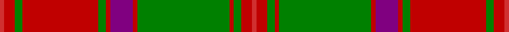

This page is one **sett** — a single exact thread-count. It belongs to the [tartan](/setts/r4ri10g7ri70g7ri4p21ri4g85ri4g7ri10r4/)
(the same proportion at any scale), whose colour order is pattern [RRGRGRBRGRGRR](/stripes/rrgrgrbrgrgrr/).

Part of the [Crieff](/tartans/crieff/) tartan — the named design grouping this sett with its other cloths.

Sourced from weddslist.  It is a [13 stripe tartan](/stripes/stripes13/).

Original link http://www.weddslist.com/cgi-bin/tartans/pg.pl?source=sts

## Thread count
R/4 Ra10 G7 Ra70 G7 Ra4 P21 Ra4 G85 Ra4 G7 Ra10 R/4

One full sett is **466 threads**.

## Palette

Palette: <strong>custom</strong>
<table><thead><tr><th>Colour</th><th>Threads</th><th>Shade</th><th>Base</th><th>OKLCh</th></tr></thead><tbody><tr><td>R/</td><td style="text-align:right;font-variant-numeric:tabular-nums">4</td><td><code style="background-color:#D03030;">#D03030</code> <small style="color:#888">#D03030</small></td><td>R <code style="background-color:#CC0000;">#CC0000</code></td><td><small style="color:#888">oklch(56.4% 0.196 26.2)</small></td></tr><tr><td>Ra</td><td style="text-align:right;font-variant-numeric:tabular-nums">10</td><td><code style="background-color:#C00000;">#C00000</code> <small style="color:#888">#C00000</small></td><td>R <code style="background-color:#CC0000;">#CC0000</code></td><td><small style="color:#888">oklch(50.7% 0.208 29.2)</small></td></tr><tr><td>G</td><td style="text-align:right;font-variant-numeric:tabular-nums">7</td><td><code style="background-color:#008000;">#008000</code> <small style="color:#888">#008000</small></td><td>G <code style="background-color:#006100;">#006100</code></td><td><small style="color:#888">oklch(52.0% 0.177 142.5)</small></td></tr><tr><td>Ra</td><td style="text-align:right;font-variant-numeric:tabular-nums">70</td><td><code style="background-color:#C00000;">#C00000</code> <small style="color:#888">#C00000</small></td><td>R <code style="background-color:#CC0000;">#CC0000</code></td><td><small style="color:#888">oklch(50.7% 0.208 29.2)</small></td></tr><tr><td>G</td><td style="text-align:right;font-variant-numeric:tabular-nums">7</td><td><code style="background-color:#008000;">#008000</code> <small style="color:#888">#008000</small></td><td>G <code style="background-color:#006100;">#006100</code></td><td><small style="color:#888">oklch(52.0% 0.177 142.5)</small></td></tr><tr><td>Ra</td><td style="text-align:right;font-variant-numeric:tabular-nums">4</td><td><code style="background-color:#C00000;">#C00000</code> <small style="color:#888">#C00000</small></td><td>R <code style="background-color:#CC0000;">#CC0000</code></td><td><small style="color:#888">oklch(50.7% 0.208 29.2)</small></td></tr><tr><td>P</td><td style="text-align:right;font-variant-numeric:tabular-nums">21</td><td><code style="background-color:#800080;">#800080</code> <small style="color:#888">#800080</small></td><td>B <code style="background-color:#2A418A;">#2A418A</code></td><td><small style="color:#888">oklch(42.1% 0.193 328.4)</small></td></tr><tr><td>Ra</td><td style="text-align:right;font-variant-numeric:tabular-nums">4</td><td><code style="background-color:#C00000;">#C00000</code> <small style="color:#888">#C00000</small></td><td>R <code style="background-color:#CC0000;">#CC0000</code></td><td><small style="color:#888">oklch(50.7% 0.208 29.2)</small></td></tr><tr><td>G</td><td style="text-align:right;font-variant-numeric:tabular-nums">85</td><td><code style="background-color:#008000;">#008000</code> <small style="color:#888">#008000</small></td><td>G <code style="background-color:#006100;">#006100</code></td><td><small style="color:#888">oklch(52.0% 0.177 142.5)</small></td></tr><tr><td>Ra</td><td style="text-align:right;font-variant-numeric:tabular-nums">4</td><td><code style="background-color:#C00000;">#C00000</code> <small style="color:#888">#C00000</small></td><td>R <code style="background-color:#CC0000;">#CC0000</code></td><td><small style="color:#888">oklch(50.7% 0.208 29.2)</small></td></tr><tr><td>G</td><td style="text-align:right;font-variant-numeric:tabular-nums">7</td><td><code style="background-color:#008000;">#008000</code> <small style="color:#888">#008000</small></td><td>G <code style="background-color:#006100;">#006100</code></td><td><small style="color:#888">oklch(52.0% 0.177 142.5)</small></td></tr><tr><td>Ra</td><td style="text-align:right;font-variant-numeric:tabular-nums">10</td><td><code style="background-color:#C00000;">#C00000</code> <small style="color:#888">#C00000</small></td><td>R <code style="background-color:#CC0000;">#CC0000</code></td><td><small style="color:#888">oklch(50.7% 0.208 29.2)</small></td></tr><tr><td>R/</td><td style="text-align:right;font-variant-numeric:tabular-nums">4</td><td><code style="background-color:#D03030;">#D03030</code> <small style="color:#888">#D03030</small></td><td>R <code style="background-color:#CC0000;">#CC0000</code></td><td><small style="color:#888">oklch(56.4% 0.196 26.2)</small></td></tr></tbody></table>

## Compared to the master

This cloth is one sett of its design; the master sett (the exemplar the design is anchored on) is below for comparison.

<figure style="margin:0"><figcaption style="color:#888;font-size:smaller">this sett</figcaption></figure>
<figure style="margin:0"><figcaption style="color:#888;font-size:smaller"><a href="/setts/ri2r6g4r70g4r2dp21r2g85r2g4r6ri2/">master sett →</a></figcaption></figure>

## Nearest tartans

The nearest existing variants by ΔTartan distance, with this tartan at the top so the swatches line up against it.

ΔTartan

Tartan

Sett

—

<a href="/ttd/edit/#slug=r4ri10g7ri70g7ri4p21ri4g85ri4g7ri10r4">Crieff</a> <a class="nn-out" href="/variants/s13/r4ri10g7ri70g7ri4p21ri4g85ri4g7ri10r4/" title="open its dictionary page">↗</a>

0.45

<a href="/ttd/edit/#slug=ri4r10g7r70g7r4dp21r4g85r4g7r10ri4&amp;base=r4ri10g7ri70g7ri4p21ri4g85ri4g7ri10r4">Crieff District Tartan</a> <a class="nn-out" href="/variants/s13/ri4r10g7r70g7r4dp21r4g85r4g7r10ri4/" title="open its dictionary page">↗</a>

0.79

<a href="/ttd/edit/#slug=g6r2g2r24t1db1r2db12r2db1t1r2g24r2~x2&amp;base=r4ri10g7ri70g7ri4p21ri4g85ri4g7ri10r4">Unidentified, coat</a> <a class="nn-out" href="/variants/s14/g6r2g2r24t1db1r2db12r2db1t1r2g24r2~x2/" title="open its dictionary page">↗</a>

0.88

<a href="/ttd/edit/#slug=r3db2t1r2g24r4g2r2db8r2g2r24db2t1r2g2~x2&amp;base=r4ri10g7ri70g7ri4p21ri4g85ri4g7ri10r4">Stewart of Appin - 1906</a> <a class="nn-out" href="/variants/s16/r3db2t1r2g24r4g2r2db8r2g2r24db2t1r2g2~x2/" title="open its dictionary page">↗</a>

0.95

<a href="/ttd/edit/#slug=r2dg1ly1dg12r1dg1r1dg4r17dg3r2dg1r2lr2~x4&amp;base=r4ri10g7ri70g7ri4p21ri4g85ri4g7ri10r4">Hayes (Fashion)</a> <a class="nn-out" href="/variants/s14/r2dg1ly1dg12r1dg1r1dg4r17dg3r2dg1r2lr2~x4/" title="open its dictionary page">↗</a>

0.96

<a href="/ttd/edit/#slug=g38r3g3r3db9r3t2r40db3r3db2r6~x2&amp;base=r4ri10g7ri70g7ri4p21ri4g85ri4g7ri10r4">MacLintock</a> <a class="nn-out" href="/variants/s12/g38r3g3r3db9r3t2r40db3r3db2r6~x2/" title="open its dictionary page">↗</a>

1.03

<a href="/ttd/edit/#slug=g36r3g3r3db9r3t2r40db3r3db2r6~x2&amp;base=r4ri10g7ri70g7ri4p21ri4g85ri4g7ri10r4">MacLintock - 1880 (Clan)</a> <a class="nn-out" href="/variants/s12/g36r3g3r3db9r3t2r40db3r3db2r6~x2/" title="open its dictionary page">↗</a>

1.07

<a href="/ttd/edit/#slug=r6db1r1g28r4db8w1r32g1r4g2~x2&amp;base=r4ri10g7ri70g7ri4p21ri4g85ri4g7ri10r4">MacDonell of Keppoch</a> <a class="nn-out" href="/variants/s11/r6db1r1g28r4db8w1r32g1r4g2~x2/" title="open its dictionary page">↗</a>

1.08

<a href="/ttd/edit/#slug=r3dg2ly1dg18r1dg1r1dg6r24dg2r1k1r1w3~x2&amp;base=r4ri10g7ri70g7ri4p21ri4g85ri4g7ri10r4">Hay - 1842 (Clan)</a> <a class="nn-out" href="/variants/s14/r3dg2ly1dg18r1dg1r1dg6r24dg2r1k1r1w3~x2/" title="open its dictionary page">↗</a>

1.09

<a href="/ttd/edit/#slug=g2r3g2r52g2r2db28r2g42r2g2r3g2~x2&amp;base=r4ri10g7ri70g7ri4p21ri4g85ri4g7ri10r4">MacQuarrie 3</a> <a class="nn-out" href="/variants/s13/g2r3g2r52g2r2db28r2g42r2g2r3g2~x2/" title="open its dictionary page">↗</a>

1.10

<a href="/ttd/edit/#slug=dg6r2dg2r24t1db1r2db12r2db1t1r2dg24r2~x2&amp;base=r4ri10g7ri70g7ri4p21ri4g85ri4g7ri10r4">Unidentified Coat</a> <a class="nn-out" href="/variants/s14/dg6r2dg2r24t1db1r2db12r2db1t1r2dg24r2~x2/" title="open its dictionary page">↗</a>

## Neighbour map

Every grey dot is one of 14360 variants placed by the first two principal components of the ΔTartan feature space (44% of its variance). Red is this tartan; blue dots are its nearest — click one to open its page.

<svg viewBox="0 0 640 380" role="img" style="max-width:100%;height:auto;border:1px solid #e0e0e0;border-radius:4px;display:block" xmlns="http://www.w3.org/2000/svg"><image href="/nn/cloud.v1.png" width="640" height="380"/><a href="/variants/s13/ri4r10g7r70g7r4dp21r4g85r4g7r10ri4/"><circle cx="335.1" cy="118.1" r="4" fill="#3465a4"><title>Crieff District Tartan</title></circle></a><a href="/variants/s14/g6r2g2r24t1db1r2db12r2db1t1r2g24r2~x2/"><circle cx="297.5" cy="111.8" r="4" fill="#3465a4"><title>Unidentified, coat</title></circle></a><a href="/variants/s16/r3db2t1r2g24r4g2r2db8r2g2r24db2t1r2g2~x2/"><circle cx="325.8" cy="102.1" r="4" fill="#3465a4"><title>Stewart of Appin - 1906</title></circle></a><a href="/variants/s14/r2dg1ly1dg12r1dg1r1dg4r17dg3r2dg1r2lr2~x4/"><circle cx="346.1" cy="124.7" r="4" fill="#3465a4"><title>Hayes (Fashion)</title></circle></a><a href="/variants/s12/g38r3g3r3db9r3t2r40db3r3db2r6~x2/"><circle cx="336.8" cy="117.0" r="4" fill="#3465a4"><title>MacLintock</title></circle></a><a href="/variants/s12/g36r3g3r3db9r3t2r40db3r3db2r6~x2/"><circle cx="339.9" cy="117.2" r="4" fill="#3465a4"><title>MacLintock - 1880 (Clan)</title></circle></a><a href="/variants/s11/r6db1r1g28r4db8w1r32g1r4g2~x2/"><circle cx="377.4" cy="109.7" r="4" fill="#3465a4"><title>MacDonell of Keppoch</title></circle></a><a href="/variants/s14/r3dg2ly1dg18r1dg1r1dg6r24dg2r1k1r1w3~x2/"><circle cx="333.9" cy="85.0" r="4" fill="#3465a4"><title>Hay - 1842 (Clan)</title></circle></a><a href="/variants/s13/g2r3g2r52g2r2db28r2g42r2g2r3g2~x2/"><circle cx="341.7" cy="118.2" r="4" fill="#3465a4"><title>MacQuarrie 3</title></circle></a><a href="/variants/s14/dg6r2dg2r24t1db1r2db12r2db1t1r2dg24r2~x2/"><circle cx="297.4" cy="109.1" r="4" fill="#3465a4"><title>Unidentified Coat</title></circle></a><circle cx="327.0" cy="114.6" r="5" fill="#c00000"/></svg>

ID: /variants/s13/r4ri10g7ri70g7ri4p21ri4g85ri4g7ri10r4/
