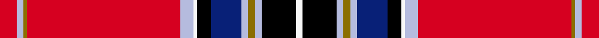

This is one **variant** — a specific cloth: this exact thread count and colourway, with its own
provenance below. It is one weaving of the [sett](/setts/r5lb2y1r45lb4w1k4db9lb2y2lb2k10w2/) (the scale-free proportion — the
same cloth at any scale or shade), whose colour order is pattern [RWGRWWKBWGWKW](/stripes/rwgrwwkbwgwkw/).

Part of the [Stratford Police Pipe Band](/tartans/s/st/stratford-police-pipe-band/) tartan — the named design grouping this sett with its other cloths.

Sourced from register-of-tartans.  It is a [13 stripe tartan](/stripes/stripes13/).

Original link [https://www.tartanregister.gov.uk/tartanDetails.aspx?ref=10638](https://www.tartanregister.gov.uk/tartanDetails.aspx?ref=10638)

## Provenance

Earliest known date: 14/06/2012 Designed by Scott Baughman for the Stratford Police Pipe Band also known as Perth County Pipe Band Incorporated. Colours: blue white and gold are for the city of Stratford; red and black are for the Stratford Police Service, Ontario.

2 attestations — the source records this cloth was collapsed from (oldest owns this page)

<ul>
<li>14/06/2012 — Stratford Police Pipe Band (Ontario) (register-of-tartans, <a href="https://www.tartanregister.gov.uk/tartanDetails.aspx?ref=10638">record</a>)  <em>Designed by Scott Baughman for the Stratford Police Pipe Band also known as Perth County Pipe Band Incorporated. Colours: blue white and gold are for the city of Stratford; red and black are for the Stratford Police Service, Ontario.</em></li>
<li>14/06/2012 — Stratford Police Pipe Band Corporate Tartan (house-of-tartan, <a href="http://www.house-of-tartan.scotland.net/house/TartanViewjs.asp?colr=Def&tnam=10638">record</a>) </li>
</ul>

Dataset <small>— provenance for this record, inherited from the source manifest</small>

<dl class="dataset-prov">
<dt>source</dt><dd><a href="/sources/register-of-tartans/">Scottish Register of Tartans</a></dd>
<dt>data captured from</dt><dd><a href="https://github.com/thetartan/tartan-database/blob/master/data/register-of-tartans/data.csv">https://github.com/thetartan/tartan-database/blob/master/data/register-of-tartans/data.csv</a></dd>
<dt>data date</dt><dd>14/06/2012 <small>(this record)</small></dd>
<dt>licence</dt><dd><a href="https://www.tartanregister.gov.uk/copyright">Crown copyright</a></dd>
</dl>

Capture chain <small>— the hands this data passed through, oldest first; each capture carries its own licence</small>

<ol class="capture-chain">
<li><a href="https://www.tartanregister.gov.uk/">Scottish Register of Tartans</a> · <a href="https://www.tartanregister.gov.uk/copyright">Crown copyright</a> <small>the living register — still published by National Records of Scotland</small></li>
<li><a href="https://github.com/thetartan/tartan-database">thetartan/tartan-database</a> <small>2016-2017</small> · <a href="https://creativecommons.org/licenses/by-nc-nd/4.0/">CC BY-NC-ND 4.0</a> <small>Levko Kravets's frozen compilation — the capture we vendored, and where its CC licence text came from</small></li>
<li>this dictionary <small>captured 2026-06-10 · commit 5bf86c7566</small> <small>each re-capture is a git commit to data/sources</small></li>
</ol>

## Register references

External register numbers recorded for this tartan.

- Scottish Register of Tartans: [10638](https://www.tartanregister.gov.uk/tartanDetails.aspx?ref=10638)

## Thread count
R/10 LB4 Y2 R90 LB8 W2 K8 DB18 LB4 Y4 LB4 K20 W/4

One full sett is **342 threads**.

## Palette
<table><thead><tr><th>Colour</th><th>Shade</th><th>OKLCh</th></tr></thead><tbody><tr><td>LB</td><td><code style="background-color:#B5BBDE;">#B5BBDE</code> <small style="color:#888">#B5BBDE</small></td><td><small style="color:#888">oklch(79.9% 0.050 277.6)</small></td></tr><tr><td>K</td><td><code style="background-color:#000000;">#000000</code> <small style="color:#888">#000000</small></td><td><small style="color:#888">oklch(0.0% 0.000 0.0)</small></td></tr><tr><td>DB</td><td><code style="background-color:#082077;">#082077</code> <small style="color:#888">#082077</small></td><td><small style="color:#888">oklch(30.0% 0.149 265.1)</small></td></tr><tr><td>R</td><td><code style="background-color:#D60020;">#D60020</code> <small style="color:#888">#D60020</small></td><td><small style="color:#888">oklch(55.2% 0.224 25.5)</small></td></tr><tr><td>W</td><td><code style="background-color:#F7F7F7;">#F7F7F7</code> <small style="color:#888">#F7F7F7</small></td><td><small style="color:#888">oklch(97.6% 0.000 89.9)</small></td></tr><tr><td>Y</td><td><code style="background-color:#8B6E00;">#8B6E00</code> <small style="color:#888">#8B6E00</small></td><td><small style="color:#888">oklch(55.1% 0.113 90.4)</small></td></tr></tbody></table>

# Sample pattern

## Nearest tartan variants

The nearest existing variants by ΔTartan distance, with this cloth at the top so the swatches line up against it.

ΔTartan

Threads

Variant

Sett

—

342

<a href="/variants/s13/r5lb2y1r45lb4w1k4db9lb2y2lb2k10w2~x2/">Stratford Police Pipe Band (Ontario)</a>

<a href="/ttd/edit/#slug=r5t2ly1r45t4w1k4ti9t2ly2t2k10w2~x2~t2405244-ti2503227&amp;base=r5lb2y1r45lb4w1k4db9lb2y2lb2k10w2~x2" title="compare in the TTD">1.50</a>

342

<a href="/variants/s13/r5t2ly1r45t4w1k4ti9t2ly2t2k10w2~x2~t2405244-ti2503227/">Stratford Police PB (Corporate)</a>

<a href="/ttd/edit/#slug=r5db2ly1r46db4w1k5lb9db2ly2db2k10w2~x2&amp;base=r5lb2y1r45lb4w1k4db9lb2y2lb2k10w2~x2" title="compare in the TTD">1.57</a>

350

<a href="/variants/s13/r5db2ly1r46db4w1k5lb9db2ly2db2k10w2~x2/">Stratford City Police PB (Corp)</a>

<a href="/ttd/edit/#slug=r120k4w2g32w4k7r7k2r7k7w4lb32k8r8k12w4&amp;base=r5lb2y1r45lb4w1k4db9lb2y2lb2k10w2~x2" title="compare in the TTD">2.13</a>

396

<a href="/variants/s16/r120k4w2g32w4k7r7k2r7k7w4lb32k8r8k12w4/">Chattan, Clan</a>

<a href="/ttd/edit/#slug=r42k1dg12w2r3k1r3w2dg2dp12k4r3w4dg3~x2&amp;base=r5lb2y1r45lb4w1k4db9lb2y2lb2k10w2~x2" title="compare in the TTD">2.34</a>

286

<a href="/variants/s14/r42k1dg12w2r3k1r3w2dg2dp12k4r3w4dg3~x2/">MacFarlane (Lord Lyon sett)</a>

<a href="/ttd/edit/#slug=r98k3dg21w5r5k2r5w5dg2db21k7r7w8dg4&amp;base=r5lb2y1r45lb4w1k4db9lb2y2lb2k10w2~x2" title="compare in the TTD">2.38</a>

284

<a href="/variants/s14/r98k3dg21w5r5k2r5w5dg2db21k7r7w8dg4/">MacFarlane Red (Clan)</a>

<a href="/ttd/edit/#slug=r98k3dg21w5r5k2r5w5dg2dt21k7r7w8dg4~dt1204274&amp;base=r5lb2y1r45lb4w1k4db9lb2y2lb2k10w2~x2" title="compare in the TTD">2.43</a>

284

<a href="/variants/s14/r98k3dg21w5r5k2r5w5dg2db21k7r7w8dg4~db1204274/">MacFarlane Red</a>

<a href="/ttd/edit/#slug=g2r30db4r4k6y1k1w1k1g10r4k1r1w1~x2&amp;base=r5lb2y1r45lb4w1k4db9lb2y2lb2k10w2~x2" title="compare in the TTD">2.46</a>

262

<a href="/variants/s14/g2r30db4r4k6y1k1w1k1g10r4k1r1w1~x2/">Stuart/Stewart</a>

<a href="/ttd/edit/#slug=r103k8g16w4r9k3r9w4g7db41k14r14w10g6&amp;base=r5lb2y1r45lb4w1k4db9lb2y2lb2k10w2~x2" title="compare in the TTD">2.62</a>

387

<a href="/variants/s14/r103k8g16w4r9k3r9w4g7db41k14r14w10g6/">MacFarlane Red Artifact Tartan</a>

<a href="/ttd/edit/#slug=g7r122db17r12k12y3k4w3g48r16k4r6w5&amp;base=r5lb2y1r45lb4w1k4db9lb2y2lb2k10w2~x2" title="compare in the TTD">2.63</a>

506

<a href="/variants/s13/g7r122db17r12k12y3k4w3g48r16k4r6w5/">Stuart/Stewart of Rothesay</a>

<a href="/ttd/edit/#slug=r41g13k8w2y2r1y2w2db6k2r3y2w5&amp;base=r5lb2y1r45lb4w1k4db9lb2y2lb2k10w2~x2" title="compare in the TTD">2.65</a>

132

<a href="/variants/s13/r41g13k8w2y2r1y2w2db6k2r3y2w5/">MacGill</a>

## Neighbour map

Every grey dot is one of 13621 variants placed by the first two principal components of the ΔTartan feature space (42% of its variance). Red is this tartan; blue dots are its nearest — click one to open its page. The map is a flat projection of a many-dimensional space — [how to read it](/posts/neighbourhood-maps/).

<svg viewBox="0 0 640 380" role="img" style="max-width:100%;height:auto;border:1px solid #e0e0e0;border-radius:4px;display:block" xmlns="http://www.w3.org/2000/svg"><image href="/nn/cloud.v1.png" width="640" height="380"/><a href="/variants/s13/r5t2ly1r45t4w1k4ti9t2ly2t2k10w2~x2~t2405244-ti2503227/"><circle cx="288.6" cy="22.5" r="4" fill="#3465a4"><title>Stratford Police PB (Corporate)</title></circle></a><a href="/variants/s13/r5db2ly1r46db4w1k5lb9db2ly2db2k10w2~x2/"><circle cx="283.6" cy="18.9" r="4" fill="#3465a4"><title>Stratford City Police PB (Corp)</title></circle></a><a href="/variants/s16/r120k4w2g32w4k7r7k2r7k7w4lb32k8r8k12w4/"><circle cx="262.3" cy="14.0" r="4" fill="#3465a4"><title>Chattan, Clan</title></circle></a><a href="/variants/s14/r42k1dg12w2r3k1r3w2dg2dp12k4r3w4dg3~x2/"><circle cx="288.3" cy="37.4" r="4" fill="#3465a4"><title>MacFarlane (Lord Lyon sett)</title></circle></a><a href="/variants/s14/r98k3dg21w5r5k2r5w5dg2db21k7r7w8dg4/"><circle cx="326.9" cy="21.0" r="4" fill="#3465a4"><title>MacFarlane Red (Clan)</title></circle></a><a href="/variants/s14/r98k3dg21w5r5k2r5w5dg2db21k7r7w8dg4~db1204274/"><circle cx="328.5" cy="21.1" r="4" fill="#3465a4"><title>MacFarlane Red</title></circle></a><a href="/variants/s14/g2r30db4r4k6y1k1w1k1g10r4k1r1w1~x2/"><circle cx="280.9" cy="34.9" r="4" fill="#3465a4"><title>Stuart/Stewart</title></circle></a><a href="/variants/s14/r103k8g16w4r9k3r9w4g7db41k14r14w10g6/"><circle cx="267.6" cy="49.2" r="4" fill="#3465a4"><title>MacFarlane Red Artifact Tartan</title></circle></a><a href="/variants/s13/g7r122db17r12k12y3k4w3g48r16k4r6w5/"><circle cx="318.3" cy="28.4" r="4" fill="#3465a4"><title>Stuart/Stewart of Rothesay</title></circle></a><a href="/variants/s13/r41g13k8w2y2r1y2w2db6k2r3y2w5/"><circle cx="233.0" cy="30.0" r="4" fill="#3465a4"><title>MacGill</title></circle></a><circle cx="286.4" cy="20.6" r="5" fill="#c00000"/><text x="320" y="376" text-anchor="middle" font-size="11" fill="#999">ground</text><text x="11" y="190" text-anchor="middle" font-size="11" fill="#999" transform="rotate(-90 11 190)">complexity</text></svg>

ID: /variants/s13/r5lb2y1r45lb4w1k4db9lb2y2lb2k10w2~x2/
