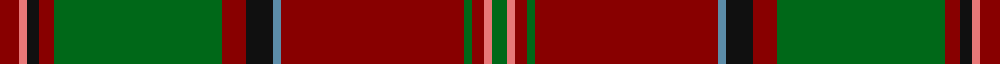

This page is one **sett** — a single exact thread-count. It belongs to the [tartan](/setts/r5ri2k3r4g43r6k7t2r47g2r3ri2g4/)
(the same proportion at any scale), whose colour order is pattern [GRRGRBKRGRKRR](/stripes/grrgrbkrgrkrr/).

Part of the [Glen Coe](/tartans/glen-coe/) tartan — the named design grouping this sett with its other cloths.

Sourced from tartans-authority.  It is a [13 stripe tartan](/stripes/stripes13/).

Original link http://www.tartansauthority.com/tartan-ferret/display/3850/

## Also known as

This cloth is also recorded under:

- Glen Coe #1
- Glen Coe #2
- Glen Coe #3
- Glencoe

2 attestations — the source records this cloth was collapsed from (oldest owns this page)

<ul>
<li>pre 2002 — Glen Coe (District) (tartans-authority, <a href="http://www.tartansauthority.com/tartan-ferret/display/3850/">record</a>)</li>
<li>undated — Glen Coe (register-of-tartans, <a href="https://www.tartanregister.gov.uk/tartanDetails.aspx?ref=4839">record</a>)</li>
</ul>

## Register references

External register numbers recorded for this tartan.

- Scottish Register of Tartans: [4839](https://www.tartanregister.gov.uk/tartanDetails.aspx?ref=4839)
- Scottish Tartans Authority (ITI): 3850

## Thread count
DR/10 LR4 K6 DR8 G86 DR12 K14 B4 DR94 G4 DR6 LR4 G/8

One full sett is **502 threads**.

## Palette

Palette: <strong>Tartan Register</strong>
<table><thead><tr><th>Colour</th><th>Threads</th><th>Shade</th><th>Base</th><th>OKLCh</th></tr></thead><tbody><tr><td>DR/</td><td style="text-align:right;font-variant-numeric:tabular-nums">10</td><td><code style="background-color:#880000;">#880000</code> <small style="color:#888">#880000</small></td><td>R <code style="background-color:#CC0000;">#CC0000</code></td><td><small style="color:#888">oklch(39.4% 0.162 29.2)</small></td></tr><tr><td>LR</td><td style="text-align:right;font-variant-numeric:tabular-nums">4</td><td><code style="background-color:#E87878;">#E87878</code> <small style="color:#888">#E87878</small></td><td>R <code style="background-color:#CC0000;">#CC0000</code></td><td><small style="color:#888">oklch(70.0% 0.139 21.2)</small></td></tr><tr><td>K</td><td style="text-align:right;font-variant-numeric:tabular-nums">6</td><td><code style="background-color:#101010;">#101010</code> <small style="color:#888">#101010</small></td><td>K <code style="background-color:#000000;">#000000</code></td><td><small style="color:#888">oklch(17.3% 0.000 89.9)</small></td></tr><tr><td>DR</td><td style="text-align:right;font-variant-numeric:tabular-nums">8</td><td><code style="background-color:#880000;">#880000</code> <small style="color:#888">#880000</small></td><td>R <code style="background-color:#CC0000;">#CC0000</code></td><td><small style="color:#888">oklch(39.4% 0.162 29.2)</small></td></tr><tr><td>G</td><td style="text-align:right;font-variant-numeric:tabular-nums">86</td><td><code style="background-color:#006818;">#006818</code> <small style="color:#888">#006818</small></td><td>G <code style="background-color:#006100;">#006100</code></td><td><small style="color:#888">oklch(45.0% 0.142 145.0)</small></td></tr><tr><td>DR</td><td style="text-align:right;font-variant-numeric:tabular-nums">12</td><td><code style="background-color:#880000;">#880000</code> <small style="color:#888">#880000</small></td><td>R <code style="background-color:#CC0000;">#CC0000</code></td><td><small style="color:#888">oklch(39.4% 0.162 29.2)</small></td></tr><tr><td>K</td><td style="text-align:right;font-variant-numeric:tabular-nums">14</td><td><code style="background-color:#101010;">#101010</code> <small style="color:#888">#101010</small></td><td>K <code style="background-color:#000000;">#000000</code></td><td><small style="color:#888">oklch(17.3% 0.000 89.9)</small></td></tr><tr><td>B</td><td style="text-align:right;font-variant-numeric:tabular-nums">4</td><td><code style="background-color:#5C8CA8;">#5C8CA8</code> <small style="color:#888">#5C8CA8</small></td><td>B <code style="background-color:#2A418A;">#2A418A</code></td><td><small style="color:#888">oklch(61.7% 0.067 235.0)</small></td></tr><tr><td>DR</td><td style="text-align:right;font-variant-numeric:tabular-nums">94</td><td><code style="background-color:#880000;">#880000</code> <small style="color:#888">#880000</small></td><td>R <code style="background-color:#CC0000;">#CC0000</code></td><td><small style="color:#888">oklch(39.4% 0.162 29.2)</small></td></tr><tr><td>G</td><td style="text-align:right;font-variant-numeric:tabular-nums">4</td><td><code style="background-color:#006818;">#006818</code> <small style="color:#888">#006818</small></td><td>G <code style="background-color:#006100;">#006100</code></td><td><small style="color:#888">oklch(45.0% 0.142 145.0)</small></td></tr><tr><td>DR</td><td style="text-align:right;font-variant-numeric:tabular-nums">6</td><td><code style="background-color:#880000;">#880000</code> <small style="color:#888">#880000</small></td><td>R <code style="background-color:#CC0000;">#CC0000</code></td><td><small style="color:#888">oklch(39.4% 0.162 29.2)</small></td></tr><tr><td>LR</td><td style="text-align:right;font-variant-numeric:tabular-nums">4</td><td><code style="background-color:#E87878;">#E87878</code> <small style="color:#888">#E87878</small></td><td>R <code style="background-color:#CC0000;">#CC0000</code></td><td><small style="color:#888">oklch(70.0% 0.139 21.2)</small></td></tr><tr><td>G/</td><td style="text-align:right;font-variant-numeric:tabular-nums">8</td><td><code style="background-color:#006818;">#006818</code> <small style="color:#888">#006818</small></td><td>G <code style="background-color:#006100;">#006100</code></td><td><small style="color:#888">oklch(45.0% 0.142 145.0)</small></td></tr></tbody></table>

## Compared to the master

This cloth is one sett of its design; the master sett (the exemplar the design is anchored on) is below for comparison.

<figure style="margin:0"><figcaption style="color:#888;font-size:smaller">this sett</figcaption></figure>
<figure style="margin:0"><figcaption style="color:#888;font-size:smaller"><a href="/setts/k37w9k3g9w3/">master sett →</a></figcaption></figure>

## Nearest tartans

The nearest existing variants by ΔTartan distance, with this tartan at the top so the swatches line up against it.

ΔTartan

Tartan

Sett

—

<a href="/ttd/edit/#slug=r5ri2k3r4g43r6k7t2r47g2r3ri2g4~x2">Glen Coe (District)</a> <a class="nn-out" href="/variants/s13/r5ri2k3r4g43r6k7t2r47g2r3ri2g4~x2/" title="open its dictionary page">↗</a>

1.04

<a href="/ttd/edit/#slug=dg3ri1r2dg2r16lb1db4r3dg13r1db1ri1r3~x2&amp;base=r5ri2k3r4g43r6k7t2r47g2r3ri2g4~x2">MacDonald of Glencoe</a> <a class="nn-out" href="/variants/s13/dg3ri1r2dg2r16lb1db4r3dg13r1db1ri1r3~x2/" title="open its dictionary page">↗</a>

1.23

<a href="/ttd/edit/#slug=r6dg4ly2dg36r2dg2r2dg12r48dg4r2k1r2lr6~x2&amp;base=r5ri2k3r4g43r6k7t2r47g2r3ri2g4~x2">Hay</a> <a class="nn-out" href="/variants/s14/r6dg4ly2dg36r2dg2r2dg12r48dg4r2k1r2lr6~x2/" title="open its dictionary page">↗</a>

1.23

<a href="/ttd/edit/#slug=r5ly1db2r2g30r5db10t1r42g2r4ly1g4~x2&amp;base=r5ri2k3r4g43r6k7t2r47g2r3ri2g4~x2">MacDonald, of Glencoe</a> <a class="nn-out" href="/variants/s13/r5ly1db2r2g30r5db10t1r42g2r4ly1g4~x2/" title="open its dictionary page">↗</a>

1.25

<a href="/ttd/edit/#slug=ri4r10g7r70g7r4dp21r4g85r4g7r10ri4&amp;base=r5ri2k3r4g43r6k7t2r47g2r3ri2g4~x2">Crieff District Tartan</a> <a class="nn-out" href="/variants/s13/ri4r10g7r70g7r4dp21r4g85r4g7r10ri4/" title="open its dictionary page">↗</a>

1.26

<a href="/ttd/edit/#slug=ri7r2db2ri2g32ri6db12ri41g2ri5r2g5~x2&amp;base=r5ri2k3r4g43r6k7t2r47g2r3ri2g4~x2">MacDonald of Glenaladale</a> <a class="nn-out" href="/variants/s12/ri7r2db2ri2g32ri6db12ri41g2ri5r2g5~x2/" title="open its dictionary page">↗</a>

1.26

<a href="/ttd/edit/#slug=r6k2r2k4r2k2r6g18r2lo1r2k2r10w1r2~x4&amp;base=r5ri2k3r4g43r6k7t2r47g2r3ri2g4~x2">Ainslie #2</a> <a class="nn-out" href="/variants/s15/r6k2r2k4r2k2r6g18r2lo1r2k2r10w1r2~x4/" title="open its dictionary page">↗</a>

1.27

<a href="/ttd/edit/#slug=n19do2m1dr3w1dr1w1dr1do6n3dr1do3w1~x4&amp;base=r5ri2k3r4g43r6k7t2r47g2r3ri2g4~x2">Leando Hunting (Personal)</a> <a class="nn-out" href="/variants/s13/n19do2m1dr3w1dr1w1dr1do6n3dr1do3w1~x4/" title="open its dictionary page">↗</a>

1.27

<a href="/ttd/edit/#slug=r3dg2ly1dg18r1dg1r1dg6r24dg2r1k1r1w3~x2&amp;base=r5ri2k3r4g43r6k7t2r47g2r3ri2g4~x2">Hay - 1842 (Clan)</a> <a class="nn-out" href="/variants/s14/r3dg2ly1dg18r1dg1r1dg6r24dg2r1k1r1w3~x2/" title="open its dictionary page">↗</a>

1.28

<a href="/ttd/edit/#slug=r24lr1db2r4dg32r4db2lr1r4db6r4lr1db2r32dg2dr3dg6~x2&amp;base=r5ri2k3r4g43r6k7t2r47g2r3ri2g4~x2">Dalzell</a> <a class="nn-out" href="/variants/s17/r24lr1db2r4dg32r4db2lr1r4db6r4lr1db2r32dg2dr3dg6~x2/" title="open its dictionary page">↗</a>

1.29

<a href="/ttd/edit/#slug=ri6r1db2ri2g40ri6db13t1ri48g2ri4r1g4~x2&amp;base=r5ri2k3r4g43r6k7t2r47g2r3ri2g4~x2">MacDonald of Glencoe</a> <a class="nn-out" href="/variants/s13/ri6r1db2ri2g40ri6db13t1ri48g2ri4r1g4~x2/" title="open its dictionary page">↗</a>

## Neighbour map

Every grey dot is one of 14360 variants placed by the first two principal components of the ΔTartan feature space (44% of its variance). Red is this tartan; blue dots are its nearest — click one to open its page.

<svg viewBox="0 0 640 380" role="img" style="max-width:100%;height:auto;border:1px solid #e0e0e0;border-radius:4px;display:block" xmlns="http://www.w3.org/2000/svg"><image href="/nn/cloud.v1.png" width="640" height="380"/><a href="/variants/s13/dg3ri1r2dg2r16lb1db4r3dg13r1db1ri1r3~x2/"><circle cx="320.2" cy="138.6" r="4" fill="#3465a4"><title>MacDonald of Glencoe</title></circle></a><a href="/variants/s14/r6dg4ly2dg36r2dg2r2dg12r48dg4r2k1r2lr6~x2/"><circle cx="380.7" cy="73.8" r="4" fill="#3465a4"><title>Hay</title></circle></a><a href="/variants/s13/r5ly1db2r2g30r5db10t1r42g2r4ly1g4~x2/"><circle cx="371.0" cy="78.6" r="4" fill="#3465a4"><title>MacDonald, of Glencoe</title></circle></a><a href="/variants/s13/ri4r10g7r70g7r4dp21r4g85r4g7r10ri4/"><circle cx="335.1" cy="118.1" r="4" fill="#3465a4"><title>Crieff District Tartan</title></circle></a><a href="/variants/s12/ri7r2db2ri2g32ri6db12ri41g2ri5r2g5~x2/"><circle cx="350.4" cy="135.2" r="4" fill="#3465a4"><title>MacDonald of Glenaladale</title></circle></a><a href="/variants/s15/r6k2r2k4r2k2r6g18r2lo1r2k2r10w1r2~x4/"><circle cx="302.5" cy="127.1" r="4" fill="#3465a4"><title>Ainslie #2</title></circle></a><a href="/variants/s13/n19do2m1dr3w1dr1w1dr1do6n3dr1do3w1~x4/"><circle cx="320.3" cy="115.5" r="4" fill="#3465a4"><title>Leando Hunting (Personal)</title></circle></a><a href="/variants/s14/r3dg2ly1dg18r1dg1r1dg6r24dg2r1k1r1w3~x2/"><circle cx="333.9" cy="85.0" r="4" fill="#3465a4"><title>Hay - 1842 (Clan)</title></circle></a><a href="/variants/s17/r24lr1db2r4dg32r4db2lr1r4db6r4lr1db2r32dg2dr3dg6~x2/"><circle cx="370.3" cy="84.7" r="4" fill="#3465a4"><title>Dalzell</title></circle></a><a href="/variants/s13/ri6r1db2ri2g40ri6db13t1ri48g2ri4r1g4~x2/"><circle cx="370.8" cy="75.5" r="4" fill="#3465a4"><title>MacDonald of Glencoe</title></circle></a><circle cx="354.9" cy="107.5" r="5" fill="#c00000"/></svg>

ID: /variants/s13/r5ri2k3r4g43r6k7t2r47g2r3ri2g4~x2/
