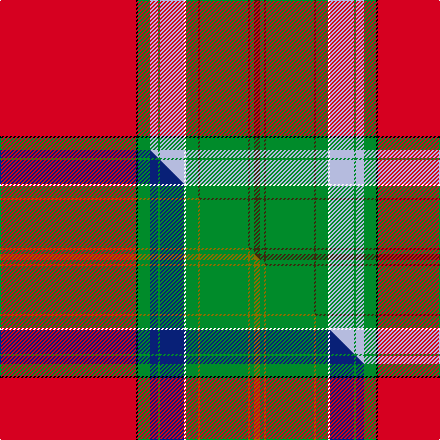

This page is one **sett** — a single exact thread-count. It belongs to the [tartan](/setts/r68k1g6lb4g1lb12w1g6dy1g24dy1g2dy3/)
(the same proportion at any scale), whose colour order is pattern [GGGGGGWWGWGKR](/stripes/ggggggwwgwgkr/).

Part of the [Ellis Island](/tartans/ellis-island/) tartan — the named design grouping this sett with its other cloths.

Sourced from tartans-authority.  It is a [13 stripe tartan](/stripes/stripes13/).

Original link http://www.tartansauthority.com/tartan-ferret/display/10364/

## Register references

External register numbers recorded for this tartan.

- Scottish Register of Tartans: [10364](https://www.tartanregister.gov.uk/tartanDetails?ref=10364)
- Scottish Tartans Authority (ITI): 10364

## Thread count
R/136 K2 G12 LB8 G2 LB24 W2 G12 DY2 G48 DY2 G4 DY/6

One full sett is **378 threads**.

## Palette
<table><thead><tr><th>Colour</th><th>Shade</th><th>OKLCh</th></tr></thead><tbody><tr><td>LB</td><td><code style="background-color:#B5BBDE;">#B5BBDE</code> <small style="color:#888">#B5BBDE</small></td><td><small style="color:#888">oklch(79.9% 0.050 277.6)</small></td></tr><tr><td>R</td><td><code style="background-color:#D60020;">#D60020</code> <small style="color:#888">#D60020</small></td><td><small style="color:#888">oklch(55.2% 0.224 25.5)</small></td></tr><tr><td>G</td><td><code style="background-color:#008B2A;">#008B2A</code> <small style="color:#888">#008B2A</small></td><td><small style="color:#888">oklch(55.4% 0.170 145.9)</small></td></tr><tr><td>K</td><td><code style="background-color:#000000;">#000000</code> <small style="color:#888">#000000</small></td><td><small style="color:#888">oklch(0.0% 0.000 0.0)</small></td></tr><tr><td>W</td><td><code style="background-color:#F7F7F7;">#F7F7F7</code> <small style="color:#888">#F7F7F7</small></td><td><small style="color:#888">oklch(97.6% 0.000 89.9)</small></td></tr><tr><td>DY</td><td><code style="background-color:#3A2B0D;">#3A2B0D</code> <small style="color:#888">#3A2B0D</small></td><td><small style="color:#888">oklch(30.0% 0.049 82.0)</small></td></tr></tbody></table>

# Sample pattern

## Compared to the master

This cloth is one sett of its design; the master sett (the exemplar the design is anchored on) is below for comparison.

Its **ΔTartan distance** from the master is **0.44** — the same measure the nearest-tartans table ranks by (0 is identical; a re-scale of the same cloth is near 0, a recolour or a different proportion further).

<figure class="master-compare" style="margin:0">

this sett
master sett ★

<figcaption style="color:#888;font-size:smaller">One weave of this sett against the <a href="/setts/r68k1g6db4g1db12w1g6y1g24y1g2y3/">master sett ★</a>, split on the diagonal: a shared proportion runs seamlessly across it with only the shades shifting; a different proportion breaks on it.</figcaption>
</figure>

## Nearest tartan variants

The nearest existing variants by ΔTartan distance, with this cloth at the top so the swatches line up against it.

ΔTartan

Threads

Variant

Sett

—

378

<a href="/variants/s13/r68k1g6lb4g1lb12w1g6dy1g24dy1g2dy3~x2/">Ellis Island (District)</a>

<a href="/ttd/edit/#slug=r68k1g6db4g1db12w1g6y1g24y1g2y3~x2&amp;base=r68k1g6lb4g1lb12w1g6dy1g24dy1g2dy3~x2" title="compare in the TTD">0.00</a>

378

<a href="/variants/s13/r68k1g6db4g1db12w1g6y1g24y1g2y3~x2/">Ellis Island</a>

<a href="/ttd/edit/#slug=r68k1g6lb4g1lb12w1g6dy1g24dy1g2dy3~x2~g2203152&amp;base=r68k1g6lb4g1lb12w1g6dy1g24dy1g2dy3~x2" title="compare in the TTD">0.00</a>

378

<a href="/variants/s13/r68k1g6lb4g1lb12w1g6dy1g24dy1g2dy3~x2~g2203152/">Ellis Island American District Tartan</a>

## Neighbour map

Every grey dot is one of 13620 variants placed by the first two principal components of the ΔTartan feature space (42% of its variance). Red is this tartan; blue dots are its nearest — click one to open its page.

<svg viewBox="0 0 640 380" role="img" style="max-width:100%;height:auto;border:1px solid #e0e0e0;border-radius:4px;display:block" xmlns="http://www.w3.org/2000/svg"><image href="/nn/cloud.v1.png" width="640" height="380"/><a href="/variants/s13/r68k1g6db4g1db12w1g6y1g24y1g2y3~x2/"><circle cx="314.5" cy="25.3" r="4" fill="#3465a4"><title>Ellis Island</title></circle></a><a href="/variants/s13/r68k1g6lb4g1lb12w1g6dy1g24dy1g2dy3~x2~g2203152/"><circle cx="336.7" cy="30.9" r="4" fill="#3465a4"><title>Ellis Island American District Tartan</title></circle></a><circle cx="317.7" cy="26.5" r="5" fill="#c00000"/><text x="320" y="376" text-anchor="middle" font-size="11" fill="#999">ground</text><text x="11" y="190" text-anchor="middle" font-size="11" fill="#999" transform="rotate(-90 11 190)">complexity</text></svg>

ID: /variants/s13/r68k1g6lb4g1lb12w1g6dy1g24dy1g2dy3~x2/
