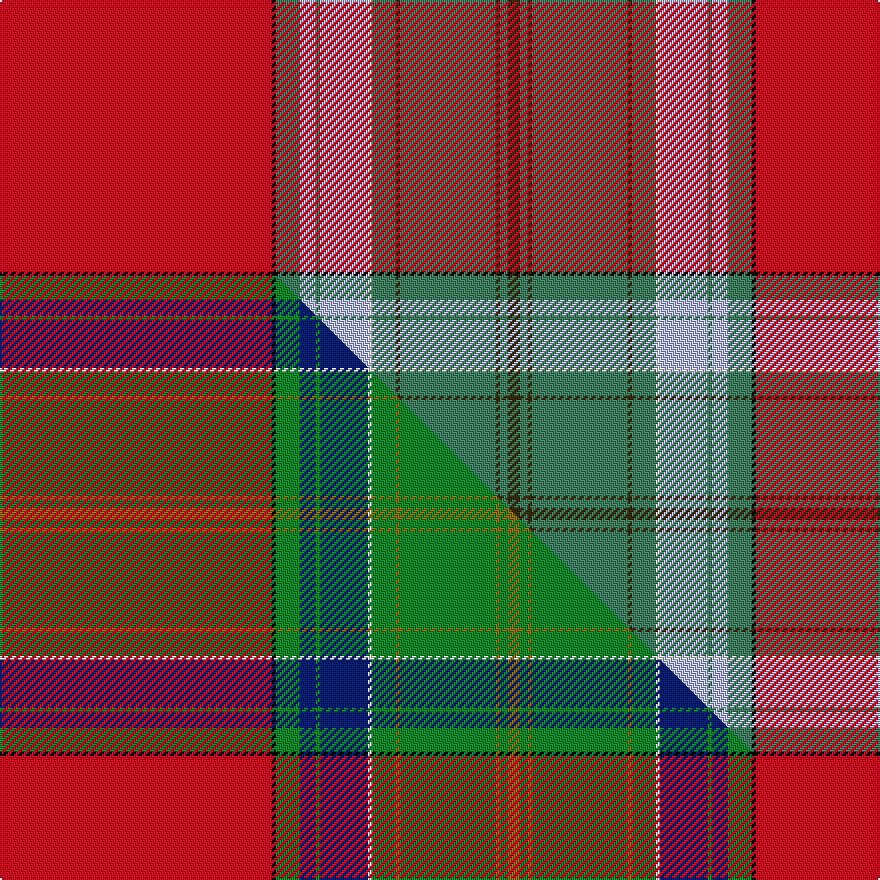

This is one **variant** — a specific cloth: this exact thread count and colourway, with its own
provenance below. It is one weaving of the [sett](/setts/r68k1g6lb4g1lb12w1g6dy1g24dy1g2dy3/) (the scale-free proportion — the
same cloth at any scale or shade), whose colour order is pattern [GGGGGGWWGWGKR](/stripes/ggggggwwgwgkr/).

Part of the [Ellis Island](/tartans/e/el/ellis-island/) tartan — the named design grouping this sett with its other cloths.

Sourced from house-of-tartan.  It is a [13 stripe tartan](/stripes/stripes13/).

Original link [http://www.house-of-tartan.scotland.net/house/TartanViewjs.asp?colr=Def&tnam=10364](http://www.house-of-tartan.scotland.net/house/TartanViewjs.asp?colr=Def&tnam=10364)

## Provenance

Earliest known date: 06/02/10 The Ellis Island tartan has been designed by Matt Newsome, curator of the Scottish Tartans Museum in Franklin, NC, primarily for use by all Americans with ancestors who came to America through Ellis Island regardless of ethnic origin and to commemorate the 10th annual observance of National Tartan Day at the Ellis Island Immigration Museum. It was commissioned by the Clan Currie Society who hold the copyright. Proceeds from the sale of the tartan will benefit the Save Ellis Island Foundation and the Clan Currie Society.

Dataset <small>— provenance for this record, inherited from the source manifest</small>

<dl class="dataset-prov">
<dt>source</dt><dd><a href="/sources/house-of-tartan/">House of Tartan</a></dd>
<dt>data captured from</dt><dd><a href="https://github.com/thetartan/tartan-database/blob/master/data/house-of-tartan/data.csv">https://github.com/thetartan/tartan-database/blob/master/data/house-of-tartan/data.csv</a></dd>
<dt>data date</dt><dd>2017-01-10 <small>(dataset default)</small></dd>
<dt>licence</dt><dd><a href="https://creativecommons.org/licenses/by-nc-nd/4.0/">CC BY-NC-ND 4.0</a></dd>
</dl>

Capture chain <small>— the hands this data passed through, oldest first; each capture carries its own licence</small>

<ol class="capture-chain">
<li><a href="http://www.house-of-tartan.scotland.net/">House of Tartan</a> <small>the weaver/retailer's database — the site is now offline; the URL is kept as the ultimate source's identity</small></li>
<li><a href="https://github.com/thetartan/tartan-database">thetartan/tartan-database</a> <small>2016-2017</small> · <a href="https://creativecommons.org/licenses/by-nc-nd/4.0/">CC BY-NC-ND 4.0</a> <small>Levko Kravets's frozen compilation — the capture we vendored, and where its CC licence text came from</small></li>
<li>this dictionary <small>captured 2026-06-10 · commit 5bf86c7566</small> <small>each re-capture is a git commit to data/sources</small></li>
</ol>

## Thread count
R/136 K2 G12 LB8 G2 LB24 W2 G12 DY2 G48 DY2 G4 DY/6

One full sett is **378 threads**.

## Palette
<table><thead><tr><th>Colour</th><th>Shade</th><th>OKLCh</th></tr></thead><tbody><tr><td>LB</td><td><code style="background-color:#B5BBDE;">#B5BBDE</code> <small style="color:#888">#B5BBDE</small></td><td><small style="color:#888">oklch(79.9% 0.050 277.6)</small></td></tr><tr><td>DB</td><td><code style="background-color:#082077;">#082077</code> <small style="color:#888">#082077</small></td><td><small style="color:#888">oklch(30.0% 0.149 265.1)</small></td></tr><tr><td>R</td><td><code style="background-color:#D60020;">#D60020</code> <small style="color:#888">#D60020</small></td><td><small style="color:#888">oklch(55.2% 0.224 25.5)</small></td></tr><tr><td>DY</td><td><code style="background-color:#3A2B0D;">#3A2B0D</code> <small style="color:#888">#3A2B0D</small></td><td><small style="color:#888">oklch(30.0% 0.049 82.0)</small></td></tr><tr><td>G</td><td><code style="background-color:#408060;">#408060</code> <small style="color:#888">#408060</small></td><td><small style="color:#888">oklch(54.8% 0.084 160.1)</small></td></tr><tr><td>DG</td><td><code style="background-color:#006818;">#006818</code> <small style="color:#888">#006818</small></td><td><small style="color:#888">oklch(45.0% 0.142 145.0)</small></td></tr><tr><td>K</td><td><code style="background-color:#000000;">#000000</code> <small style="color:#888">#000000</small></td><td><small style="color:#888">oklch(0.0% 0.000 0.0)</small></td></tr><tr><td>O</td><td><code style="background-color:#A65C11;">#A65C11</code> <small style="color:#888">#A65C11</small></td><td><small style="color:#888">oklch(55.0% 0.125 58.3)</small></td></tr><tr><td>W</td><td><code style="background-color:#F7F7F7;">#F7F7F7</code> <small style="color:#888">#F7F7F7</small></td><td><small style="color:#888">oklch(97.6% 0.000 89.9)</small></td></tr></tbody></table>

# Sample pattern

## Compared to the master

This cloth is one sett of its design; the master sett (the exemplar the design is anchored on) is below for comparison.

Its **ΔTartan distance** from the master is **0.16** — the same measure the nearest-tartans table ranks by (0 is identical; a re-scale of the same cloth is near 0, a recolour or a different proportion further).

<figure class="master-compare" style="margin:0">

this sett
master sett ★

<figcaption style="color:#888;font-size:smaller">One weave of this sett against the <a href="/setts/r68k1g6db4g1db12w1g6y1g24y1g2y3/">master sett ★</a>, split on the diagonal: a shared proportion runs seamlessly across it with only the shades shifting; a different proportion breaks on it.</figcaption>
</figure>

## Nearest tartan variants

The nearest existing variants by ΔTartan distance, with this cloth at the top so the swatches line up against it.

ΔTartan

Threads

Variant

Sett

—

378

<a href="/variants/s13/r68k1g6lb4g1lb12w1g6dy1g24dy1g2dy3~x2~g2203152/">Ellis Island American District Tartan</a>

<a href="/ttd/edit/#slug=r68k1g6lb4g1lb12w1g6dy1g24dy1g2dy3~x2&amp;base=r68k1g6lb4g1lb12w1g6dy1g24dy1g2dy3~x2~g2203152" title="compare in the TTD">0.06</a>

378

<a href="/variants/s13/r68k1g6lb4g1lb12w1g6dy1g24dy1g2dy3~x2/">Ellis Island (District)</a>

<a href="/ttd/edit/#slug=r68k1g6db4g1db12w1g6y1g24y1g2y3~x2&amp;base=r68k1g6lb4g1lb12w1g6dy1g24dy1g2dy3~x2~g2203152" title="compare in the TTD">0.16</a>

378

<a href="/variants/s13/r68k1g6db4g1db12w1g6y1g24y1g2y3~x2/">Ellis Island</a>

<a href="/ttd/edit/#slug=r160k2w1g36y9r4k1r4y9lb36k9r9y9r4lb3~x2&amp;base=r68k1g6lb4g1lb12w1g6dy1g24dy1g2dy3~x2~g2203152" title="compare in the TTD">2.51</a>

858

<a href="/variants/s15/r160k2w1g36y9r4k1r4y9lb36k9r9y9r4lb3~x2/">MacPherson, The Crubin Plaid</a>

<a href="/ttd/edit/#slug=r122k4w2g32w4y7r7k2r7y7w4lb32k8r8y12w4~x2&amp;base=r68k1g6lb4g1lb12w1g6dy1g24dy1g2dy3~x2~g2203152" title="compare in the TTD">2.57</a>

796

<a href="/variants/s16/r122k4w2g32w4y7r7k2r7y7w4lb32k8r8y12w4~x2/">Clan Chattan</a>

<a href="/ttd/edit/#slug=r122k4w2g32w4y7r7k2r7y7w4lb32k8r8y12w4&amp;base=r68k1g6lb4g1lb12w1g6dy1g24dy1g2dy3~x2~g2203152" title="compare in the TTD">2.57</a>

398

<a href="/variants/s16/r122k4w2g32w4y7r7k2r7y7w4lb32k8r8y12w4/">Clan Chattan</a>

<a href="/ttd/edit/#slug=r94k3w2g21w3y3r5k2r5y3w3n21k7r7y8w4~x2&amp;base=r68k1g6lb4g1lb12w1g6dy1g24dy1g2dy3~x2~g2203152" title="compare in the TTD">2.58</a>

568

<a href="/variants/s16/r94k3w2g21w3y3r5k2r5y3w3n21k7r7y8w4~x2/">MacKintosh 8</a>

<a href="/ttd/edit/#slug=y9k1lb4k1r40k1n4g9y1~x2&amp;base=r68k1g6lb4g1lb12w1g6dy1g24dy1g2dy3~x2~g2203152" title="compare in the TTD">2.58</a>

260

<a href="/variants/s9/y9k1lb4k1r40k1n4g9y1~x2/">Kings Mountain 1780 (Commemorative)</a>

<a href="/ttd/edit/#slug=r60k2w1g16w2y3r3k1r3y3w2lb16k4r4y6w2~x2&amp;base=r68k1g6lb4g1lb12w1g6dy1g24dy1g2dy3~x2~g2203152" title="compare in the TTD">2.62</a>

388

<a href="/variants/s16/r60k2w1g16w2y3r3k1r3y3w2lb16k4r4y6w2~x2/">Clan Chattan D</a>

<a href="/ttd/edit/#slug=r60k2w1g16w2y3r3k1r3y3w2lb16k4r4y6w2&amp;base=r68k1g6lb4g1lb12w1g6dy1g24dy1g2dy3~x2~g2203152" title="compare in the TTD">2.62</a>

194

<a href="/variants/s16/r60k2w1g16w2y3r3k1r3y3w2lb16k4r4y6w2/">Clan Chattan D</a>

<a href="/ttd/edit/#slug=r320k4w2g72ly18r8k2r8ly18lb72k18r3ly18r8lb14&amp;base=r68k1g6lb4g1lb12w1g6dy1g24dy1g2dy3~x2~g2203152" title="compare in the TTD">2.67</a>

836

<a href="/variants/s15/r320k4w2g72ly18r8k2r8ly18lb72k18r3ly18r8lb14/">Crubin Plaid (MacPherson)</a>

## Neighbour map

Every grey dot is one of 13656 variants placed by the first two principal components of the ΔTartan feature space (42% of its variance). Red is this tartan; blue dots are its nearest — click one to open its page. The map is a flat projection of a many-dimensional space — [how to read it](/posts/neighbourhood-maps/).

<svg viewBox="0 0 640 380" role="img" style="max-width:100%;height:auto;border:1px solid #e0e0e0;border-radius:4px;display:block" xmlns="http://www.w3.org/2000/svg"><image href="/nn/cloud.v1.png" width="640" height="380"/><a href="/variants/s13/r68k1g6lb4g1lb12w1g6dy1g24dy1g2dy3~x2/"><circle cx="318.0" cy="26.2" r="4" fill="#3465a4"><title>Ellis Island (District)</title></circle></a><a href="/variants/s13/r68k1g6db4g1db12w1g6y1g24y1g2y3~x2/"><circle cx="314.8" cy="25.1" r="4" fill="#3465a4"><title>Ellis Island</title></circle></a><a href="/variants/s15/r160k2w1g36y9r4k1r4y9lb36k9r9y9r4lb3~x2/"><circle cx="362.2" cy="14.0" r="4" fill="#3465a4"><title>MacPherson, The Crubin Plaid</title></circle></a><a href="/variants/s16/r122k4w2g32w4y7r7k2r7y7w4lb32k8r8y12w4~x2/"><circle cx="293.6" cy="14.0" r="4" fill="#3465a4"><title>Clan Chattan</title></circle></a><a href="/variants/s16/r122k4w2g32w4y7r7k2r7y7w4lb32k8r8y12w4/"><circle cx="293.6" cy="14.0" r="4" fill="#3465a4"><title>Clan Chattan</title></circle></a><a href="/variants/s16/r94k3w2g21w3y3r5k2r5y3w3n21k7r7y8w4~x2/"><circle cx="319.6" cy="14.0" r="4" fill="#3465a4"><title>MacKintosh 8</title></circle></a><a href="/variants/s9/y9k1lb4k1r40k1n4g9y1~x2/"><circle cx="339.1" cy="60.0" r="4" fill="#3465a4"><title>Kings Mountain 1780 (Commemorative)</title></circle></a><a href="/variants/s16/r60k2w1g16w2y3r3k1r3y3w2lb16k4r4y6w2~x2/"><circle cx="291.2" cy="14.0" r="4" fill="#3465a4"><title>Clan Chattan D</title></circle></a><a href="/variants/s16/r60k2w1g16w2y3r3k1r3y3w2lb16k4r4y6w2/"><circle cx="291.2" cy="14.0" r="4" fill="#3465a4"><title>Clan Chattan D</title></circle></a><a href="/variants/s15/r320k4w2g72ly18r8k2r8ly18lb72k18r3ly18r8lb14/"><circle cx="339.9" cy="14.0" r="4" fill="#3465a4"><title>Crubin Plaid (MacPherson)</title></circle></a><circle cx="337.0" cy="30.7" r="5" fill="#c00000"/><text x="320" y="376" text-anchor="middle" font-size="11" fill="#999">ground</text><text x="11" y="190" text-anchor="middle" font-size="11" fill="#999" transform="rotate(-90 11 190)">complexity</text></svg>

ID: /variants/s13/r68k1g6lb4g1lb12w1g6dy1g24dy1g2dy3~x2~g2203152/
