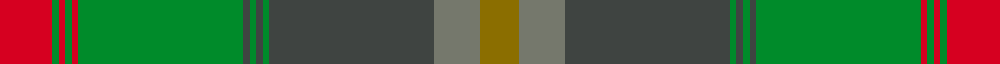

This is one **variant** — a specific cloth: this exact thread count and colourway, with its own
provenance below. It is one weaving of the [sett](/tartans/j/jo/johansson-christian/) (the scale-free proportion — the
same cloth at any scale or shade), whose colour order is pattern [GGBGBGBGRGRGR](/stripes/ggbgbgbgrgrgr/).

Part of the [Johansson , Christian](/tartans/j/jo/johansson-christian/) tartan — the named design grouping this sett with its other cloths.

Sourced from register-of-tartans.  It is a [13 stripe tartan](/stripes/stripes13/).

Original link [https://www.tartanregister.gov.uk/tartanDetails.aspx?ref=10457](https://www.tartanregister.gov.uk/tartanDetails.aspx?ref=10457)

Dataset <small>— provenance for this record, inherited from the source manifest</small>

<dl class="dataset-prov">
<dt>source</dt><dd><a href="/sources/register-of-tartans/">Scottish Register of Tartans</a></dd>
<dt>data captured from</dt><dd><a href="https://github.com/thetartan/tartan-database/blob/master/data/register-of-tartans/data.csv">https://github.com/thetartan/tartan-database/blob/master/data/register-of-tartans/data.csv</a></dd>
<dt>data date</dt><dd>06/07/2011 <small>(this record)</small></dd>
<dt>licence</dt><dd><a href="https://www.tartanregister.gov.uk/copyright">Crown copyright</a></dd>
</dl>

Capture chain <small>— the hands this data passed through, oldest first; each capture carries its own licence</small>

<ol class="capture-chain">
<li><a href="https://www.tartanregister.gov.uk/">Scottish Register of Tartans</a> · <a href="https://www.tartanregister.gov.uk/copyright">Crown copyright</a> <small>the living register — still published by National Records of Scotland</small></li>
<li><a href="https://github.com/thetartan/tartan-database">thetartan/tartan-database</a> <small>2016-2017</small> · <a href="https://creativecommons.org/licenses/by-nc-nd/4.0/">CC BY-NC-ND 4.0</a> <small>Levko Kravets's frozen compilation — the capture we vendored, and where its CC licence text came from</small></li>
<li>this dictionary <small>captured 2026-06-10 · commit 5bf86c7566</small> <small>each re-capture is a git commit to data/sources</small></li>
</ol>

## Register references

External register numbers recorded for this tartan.

- Scottish Register of Tartans: [10457](https://www.tartanregister.gov.uk/tartanDetails.aspx?ref=10457)

## Thread count
R/16 G2 R2 G2 R2 G50 DT2 G2 DT2 G2 DT50 Yi14 Y/12

One full sett is **288 threads**.

## Palette
<table><thead><tr><th>Colour</th><th>Shade</th><th>OKLCh</th></tr></thead><tbody><tr><td>Y</td><td><code style="background-color:#8B6E00;">#8B6E00</code> <small style="color:#888">#8B6E00</small></td><td><small style="color:#888">oklch(55.1% 0.113 90.4)</small></td></tr><tr><td>R</td><td><code style="background-color:#D60020;">#D60020</code> <small style="color:#888">#D60020</small></td><td><small style="color:#888">oklch(55.2% 0.224 25.5)</small></td></tr><tr><td>G</td><td><code style="background-color:#008B2A;">#008B2A</code> <small style="color:#888">#008B2A</small></td><td><small style="color:#888">oklch(55.4% 0.170 145.9)</small></td></tr><tr><td>DT</td><td><code style="background-color:#3F4441;">#3F4441</code> <small style="color:#888">#3F4441</small></td><td><small style="color:#888">oklch(38.1% 0.008 159.7)</small></td></tr><tr><td>Y</td><td><code style="background-color:#75786C;">#75786C</code> <small style="color:#888">#75786C</small></td><td><small style="color:#888">oklch(56.6% 0.018 118.4)</small></td></tr></tbody></table>

# Sample pattern

## Nearest tartan variants

The nearest existing variants by ΔTartan distance, with this cloth at the top so the swatches line up against it.

ΔTartan

Threads

Variant

Sett

—

288

<a href="/variants/s13/r8g1r1g1r1g25dt1g1dt1g1dt25yi7y6~x2~dt1500000-yi2301120/">Johansson (Aneby, Sweden), Christian (Personal)</a>

<a href="/ttd/edit/#slug=dr8g1dr1g1dr1g25n1g1n1g1n25o7ly6~x2~n1900000-o2500000&amp;base=r8g1r1g1r1g25dt1g1dt1g1dt25yi7y6~x2~dt1500000-yi2301120" title="compare in the TTD">0.41</a>

288

<a href="/variants/s13/dr8g1dr1g1dr1g25n1g1n1g1n25o7ly6~x2~n1900000-o2500000/">Johansson (Personal)</a>

<a href="/ttd/edit/#slug=n66m3g3m3g16dr8g3dr3r4~x2&amp;base=r8g1r1g1r1g25dt1g1dt1g1dt25yi7y6~x2~dt1500000-yi2301120" title="compare in the TTD">2.54</a>

296

<a href="/variants/s9/n66m3g3m3g16dr8g3dr3r4~x2/">Scottish National Hunting</a>

<a href="/ttd/edit/#slug=o2dg3dy18o2dy2o21g2dg2g2dg24lo2~x2&amp;base=r8g1r1g1r1g25dt1g1dt1g1dt25yi7y6~x2~dt1500000-yi2301120" title="compare in the TTD">3.27</a>

312

<a href="/variants/s11/o2dg3dy18o2dy2o21g2dg2g2dg24lo2~x2/">Methven</a>

<a href="/ttd/edit/#slug=t5w1o9t5r4t5g20y1g1y1~x4&amp;base=r8g1r1g1r1g25dt1g1dt1g1dt25yi7y6~x2~dt1500000-yi2301120" title="compare in the TTD">3.50</a>

392

<a href="/variants/s10/t5w1o9t5r4t5g20y1g1y1~x4/">Hobkirk</a>

<a href="/ttd/edit/#slug=y15r3y3r1y35g5w2db2g35r1g3r3g15y5w2db2~x2&amp;base=r8g1r1g1r1g25dt1g1dt1g1dt25yi7y6~x2~dt1500000-yi2301120" title="compare in the TTD">3.68</a>

494

<a href="/variants/s16/y15r3y3r1y35g5w2db2g35r1g3r3g15y5w2db2~x2/">Keilar (2013)</a>

<a href="/ttd/edit/#slug=lb5g5k4n31dg3n3dg62n3dg3n31k4g5lb5r3~x2~g2408144-dg1806142&amp;base=r8g1r1g1r1g25dt1g1dt1g1dt25yi7y6~x2~dt1500000-yi2301120" title="compare in the TTD">3.75</a>

652

<a href="/variants/s14/lb5g5k4n31dg3n3dg62n3dg3n31k4g5lb5r3~x2~g2408144-dg1806142/">Sheffield, City of</a>

<a href="/ttd/edit/#slug=w2y1r3g20r1y1r3y2dy14ly2r2ly2~x2~g1903114-ly2706114&amp;base=r8g1r1g1r1g25dt1g1dt1g1dt25yi7y6~x2~dt1500000-yi2301120" title="compare in the TTD">3.82</a>

204

<a href="/variants/s12/w2y1r3g20r1y1r3y2dy14ly2r2ly2~x2~g1903114-ly2706114/">Flodden</a>

<a href="/ttd/edit/#slug=y23o4dy6dg6y4lb1y4~x4&amp;base=r8g1r1g1r1g25dt1g1dt1g1dt25yi7y6~x2~dt1500000-yi2301120" title="compare in the TTD">3.83</a>

276

<a href="/variants/s7/y23o4dy6dg6y4lb1y4~x4/">Tricor</a>

<a href="/ttd/edit/#slug=g9b3g4o3g3o4g3dg11oi30b3oi4g3~x2~o2102055-oi2104058&amp;base=r8g1r1g1r1g25dt1g1dt1g1dt25yi7y6~x2~dt1500000-yi2301120" title="compare in the TTD">3.88</a>

296

<a href="/variants/s12/g9b3g4o3g3o4g3dg11oi30b3oi4g3~x2~o2102055-oi2104058/">Harmony 5</a>

## Neighbour map

Every grey dot is one of 13657 variants placed by the first two principal components of the ΔTartan feature space (42% of its variance). Red is this tartan; blue dots are its nearest — click one to open its page. The map is a flat projection of a many-dimensional space — [how to read it](/posts/neighbourhood-maps/).

<svg viewBox="0 0 640 380" role="img" style="max-width:100%;height:auto;border:1px solid #e0e0e0;border-radius:4px;display:block" xmlns="http://www.w3.org/2000/svg"><image href="/nn/cloud.v1.png" width="640" height="380"/><a href="/variants/s13/dr8g1dr1g1dr1g25n1g1n1g1n25o7ly6~x2~n1900000-o2500000/"><circle cx="298.3" cy="136.5" r="4" fill="#3465a4"><title>Johansson (Personal)</title></circle></a><a href="/variants/s9/n66m3g3m3g16dr8g3dr3r4~x2/"><circle cx="341.2" cy="115.2" r="4" fill="#3465a4"><title>Scottish National Hunting</title></circle></a><a href="/variants/s11/o2dg3dy18o2dy2o21g2dg2g2dg24lo2~x2/"><circle cx="277.2" cy="176.9" r="4" fill="#3465a4"><title>Methven</title></circle></a><a href="/variants/s10/t5w1o9t5r4t5g20y1g1y1~x4/"><circle cx="290.7" cy="145.3" r="4" fill="#3465a4"><title>Hobkirk</title></circle></a><a href="/variants/s16/y15r3y3r1y35g5w2db2g35r1g3r3g15y5w2db2~x2/"><circle cx="386.4" cy="127.2" r="4" fill="#3465a4"><title>Keilar (2013)</title></circle></a><a href="/variants/s14/lb5g5k4n31dg3n3dg62n3dg3n31k4g5lb5r3~x2~g2408144-dg1806142/"><circle cx="276.2" cy="108.7" r="4" fill="#3465a4"><title>Sheffield, City of</title></circle></a><a href="/variants/s12/w2y1r3g20r1y1r3y2dy14ly2r2ly2~x2~g1903114-ly2706114/"><circle cx="244.2" cy="120.8" r="4" fill="#3465a4"><title>Flodden</title></circle></a><a href="/variants/s7/y23o4dy6dg6y4lb1y4~x4/"><circle cx="353.2" cy="166.3" r="4" fill="#3465a4"><title>Tricor</title></circle></a><a href="/variants/s12/g9b3g4o3g3o4g3dg11oi30b3oi4g3~x2~o2102055-oi2104058/"><circle cx="318.3" cy="198.0" r="4" fill="#3465a4"><title>Harmony 5</title></circle></a><circle cx="308.6" cy="136.9" r="5" fill="#c00000"/><text x="320" y="376" text-anchor="middle" font-size="11" fill="#999">ground</text><text x="11" y="190" text-anchor="middle" font-size="11" fill="#999" transform="rotate(-90 11 190)">complexity</text></svg>

ID: /variants/s13/r8g1r1g1r1g25dt1g1dt1g1dt25yi7y6~x2~dt1500000-yi2301120/
