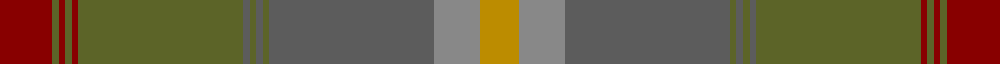

This page is one **sett** — a single exact thread-count. It belongs to the [tartan](/setts/r8y1r1y1r1y25n1y1n1y1n25o7lo6/)
(the same proportion at any scale), whose colour order is pattern [RGRGRGBGBGBRY](/stripes/rgrgrgbgbgbry/).

Sourced from tartans-authority.  It is a [13 stripe tartan](/stripes/stripes13/).

Original link http://www.tartansauthority.com/tartan-ferret/display/10457/

## Register references

External register numbers recorded for this tartan.

- Scottish Register of Tartans: [10457](https://www.tartanregister.gov.uk/tartanDetails?ref=10457)
- Scottish Tartans Authority (ITI): 10457

## Thread count
DR/16 G2 DR2 G2 DR2 G50 N2 G2 N2 G2 N50 Na14 DY/12

One full sett is **288 threads**.

## Palette

Palette: <strong>Tartan Register</strong> <small style="color:#888">(4 of 5 colours)</small>
<table><thead><tr><th>Colour</th><th>Threads</th><th>Shade</th><th>Base</th><th>OKLCh</th></tr></thead><tbody><tr><td>DR/</td><td style="text-align:right;font-variant-numeric:tabular-nums">16</td><td><code style="background-color:#880000;">#880000</code> <small style="color:#888">#880000</small></td><td>R <code style="background-color:#CC0000;">#CC0000</code></td><td><small style="color:#888">oklch(39.4% 0.162 29.2)</small></td></tr><tr><td>G</td><td style="text-align:right;font-variant-numeric:tabular-nums">2</td><td><code style="background-color:#5C6428;">#5C6428</code> <small style="color:#888">#5C6428</small></td><td>G <code style="background-color:#006100;">#006100</code></td><td><small style="color:#888">oklch(48.3% 0.084 116.0)</small></td></tr><tr><td>DR</td><td style="text-align:right;font-variant-numeric:tabular-nums">2</td><td><code style="background-color:#880000;">#880000</code> <small style="color:#888">#880000</small></td><td>R <code style="background-color:#CC0000;">#CC0000</code></td><td><small style="color:#888">oklch(39.4% 0.162 29.2)</small></td></tr><tr><td>G</td><td style="text-align:right;font-variant-numeric:tabular-nums">2</td><td><code style="background-color:#5C6428;">#5C6428</code> <small style="color:#888">#5C6428</small></td><td>G <code style="background-color:#006100;">#006100</code></td><td><small style="color:#888">oklch(48.3% 0.084 116.0)</small></td></tr><tr><td>DR</td><td style="text-align:right;font-variant-numeric:tabular-nums">2</td><td><code style="background-color:#880000;">#880000</code> <small style="color:#888">#880000</small></td><td>R <code style="background-color:#CC0000;">#CC0000</code></td><td><small style="color:#888">oklch(39.4% 0.162 29.2)</small></td></tr><tr><td>G</td><td style="text-align:right;font-variant-numeric:tabular-nums">50</td><td><code style="background-color:#5C6428;">#5C6428</code> <small style="color:#888">#5C6428</small></td><td>G <code style="background-color:#006100;">#006100</code></td><td><small style="color:#888">oklch(48.3% 0.084 116.0)</small></td></tr><tr><td>N</td><td style="text-align:right;font-variant-numeric:tabular-nums">2</td><td><code style="background-color:#5C5C5C;">#5C5C5C</code> <small style="color:#888">#5C5C5C</small></td><td>B <code style="background-color:#2A418A;">#2A418A</code></td><td><small style="color:#888">oklch(47.5% 0.000 89.9)</small></td></tr><tr><td>G</td><td style="text-align:right;font-variant-numeric:tabular-nums">2</td><td><code style="background-color:#5C6428;">#5C6428</code> <small style="color:#888">#5C6428</small></td><td>G <code style="background-color:#006100;">#006100</code></td><td><small style="color:#888">oklch(48.3% 0.084 116.0)</small></td></tr><tr><td>N</td><td style="text-align:right;font-variant-numeric:tabular-nums">2</td><td><code style="background-color:#5C5C5C;">#5C5C5C</code> <small style="color:#888">#5C5C5C</small></td><td>B <code style="background-color:#2A418A;">#2A418A</code></td><td><small style="color:#888">oklch(47.5% 0.000 89.9)</small></td></tr><tr><td>G</td><td style="text-align:right;font-variant-numeric:tabular-nums">2</td><td><code style="background-color:#5C6428;">#5C6428</code> <small style="color:#888">#5C6428</small></td><td>G <code style="background-color:#006100;">#006100</code></td><td><small style="color:#888">oklch(48.3% 0.084 116.0)</small></td></tr><tr><td>N</td><td style="text-align:right;font-variant-numeric:tabular-nums">50</td><td><code style="background-color:#5C5C5C;">#5C5C5C</code> <small style="color:#888">#5C5C5C</small></td><td>B <code style="background-color:#2A418A;">#2A418A</code></td><td><small style="color:#888">oklch(47.5% 0.000 89.9)</small></td></tr><tr><td>Na</td><td style="text-align:right;font-variant-numeric:tabular-nums">14</td><td><code style="background-color:#888888;">#888888</code> <small style="color:#888">#888888</small></td><td>R <code style="background-color:#CC0000;">#CC0000</code></td><td><small style="color:#888">oklch(62.7% 0.000 89.9)</small></td></tr><tr><td>DY/</td><td style="text-align:right;font-variant-numeric:tabular-nums">12</td><td><code style="background-color:#BC8C00;">#BC8C00</code> <small style="color:#888">#BC8C00</small></td><td>Y <code style="background-color:#F2BF00;">#F2BF00</code></td><td><small style="color:#888">oklch(66.8% 0.137 84.1)</small></td></tr></tbody></table>

## Nearest tartans

The nearest existing variants by ΔTartan distance, with this tartan at the top so the swatches line up against it.

ΔTartan

Tartan

Sett

—

<a href="/ttd/edit/#slug=r8y1r1y1r1y25n1y1n1y1n25o7lo6~x2">Johansson (Personal)</a> <a class="nn-out" href="/variants/s13/r8y1r1y1r1y25n1y1n1y1n25o7lo6~x2/" title="open its dictionary page">↗</a>

0.46

<a href="/ttd/edit/#slug=o8y1o1y1o1y25dt1y1dt1y1dt25yi7lo6~x2&amp;base=r8y1r1y1r1y25n1y1n1y1n25o7lo6~x2">Johansson (Aneby, Sweden), Christian (Personal)</a> <a class="nn-out" href="/variants/s13/o8y1o1y1o1y25dt1y1dt1y1dt25yi7lo6~x2/" title="open its dictionary page">↗</a>

1.72

<a href="/variants/s12/y23o4dy6g6y4lb1y4~x4/">Tricor</a>

1.73

<a href="/variants/s9/r3k1y8lo1dyi7lo1y19dy25k1~x2/">The Broons (Corporate)</a>

2.01

<a href="/variants/s9/lb2dg2ni1dg30n10ni20dg1ni2lo1~x2/">Scottish Borderland (Fashion)</a>

2.03

<a href="/ttd/edit/#slug=r3k1yi8ly1dy7ly1yi19y25k1~x2&amp;base=r8y1r1y1r1y25n1y1n1y1n25o7lo6~x2">Broons, The (DC Thomson)</a> <a class="nn-out" href="/variants/s9/r3k1yi8ly1dy7ly1yi19y25k1~x2/" title="open its dictionary page">↗</a>

2.07

<a href="/ttd/edit/#slug=dg21k1r4k1dy21dg3dy3dg3dy21dg3lo4dg21dy3dg3dy3~x2&amp;base=r8y1r1y1r1y25n1y1n1y1n25o7lo6~x2">Ensign of Ontario (Fashion)</a> <a class="nn-out" href="/variants/s15/dg21k1r4k1dy21dg3dy3dg3dy21dg3lo4dg21dy3dg3dy3~x2/" title="open its dictionary page">↗</a>

2.08

<a href="/variants/s14/r3dy2r26dy4do6dy29do2lo3~x2/">Hyland Day (Personal)</a>

2.12

<a href="/variants/s16/dg3r15dgi2r2dg2r2dg18do2dg2do2dg2do27ki2do2ki6k2~x2/">Strathmore District Tartan</a>

2.15

<a href="/variants/s8/k3n3k3n21ni21k3ni3lr1~x2/">Granite City (Fashion)</a>

2.15

<a href="/variants/s10/o5n3o22r3n6ni17r2ni4r2ni4~x2/">Clyde</a>

## Neighbour map

Every grey dot is one of 14360 variants placed by the first two principal components of the ΔTartan feature space (44% of its variance). Red is this tartan; blue dots are its nearest — click one to open its page.

<svg viewBox="0 0 640 380" role="img" style="max-width:100%;height:auto;border:1px solid #e0e0e0;border-radius:4px;display:block" xmlns="http://www.w3.org/2000/svg"><image href="/nn/cloud.v1.png" width="640" height="380"/><a href="/variants/s13/o8y1o1y1o1y25dt1y1dt1y1dt25yi7lo6~x2/"><circle cx="340.5" cy="152.7" r="4" fill="#3465a4"><title>Johansson (Aneby, Sweden), Christian (Personal)</title></circle></a><a href="/variants/s12/y23o4dy6g6y4lb1y4~x4/"><circle cx="384.8" cy="190.3" r="4" fill="#3465a4"><title>Tricor</title></circle></a><a href="/variants/s9/r3k1y8lo1dyi7lo1y19dy25k1~x2/"><circle cx="375.7" cy="185.2" r="4" fill="#3465a4"><title>The Broons (Corporate)</title></circle></a><a href="/variants/s9/lb2dg2ni1dg30n10ni20dg1ni2lo1~x2/"><circle cx="415.0" cy="184.6" r="4" fill="#3465a4"><title>Scottish Borderland (Fashion)</title></circle></a><a href="/variants/s9/r3k1yi8ly1dy7ly1yi19y25k1~x2/"><circle cx="321.2" cy="153.6" r="4" fill="#3465a4"><title>Broons, The (DC Thomson)</title></circle></a><a href="/variants/s15/dg21k1r4k1dy21dg3dy3dg3dy21dg3lo4dg21dy3dg3dy3~x2/"><circle cx="406.3" cy="189.8" r="4" fill="#3465a4"><title>Ensign of Ontario (Fashion)</title></circle></a><a href="/variants/s14/r3dy2r26dy4do6dy29do2lo3~x2/"><circle cx="348.8" cy="187.5" r="4" fill="#3465a4"><title>Hyland Day (Personal)</title></circle></a><a href="/variants/s16/dg3r15dgi2r2dg2r2dg18do2dg2do2dg2do27ki2do2ki6k2~x2/"><circle cx="300.6" cy="166.9" r="4" fill="#3465a4"><title>Strathmore District Tartan</title></circle></a><a href="/variants/s8/k3n3k3n21ni21k3ni3lr1~x2/"><circle cx="395.4" cy="224.9" r="4" fill="#3465a4"><title>Granite City (Fashion)</title></circle></a><a href="/variants/s10/o5n3o22r3n6ni17r2ni4r2ni4~x2/"><circle cx="338.3" cy="236.9" r="4" fill="#3465a4"><title>Clyde</title></circle></a><circle cx="348.7" cy="157.5" r="5" fill="#c00000"/></svg>

ID: /variants/s13/r8y1r1y1r1y25n1y1n1y1n25o7lo6~x2/
