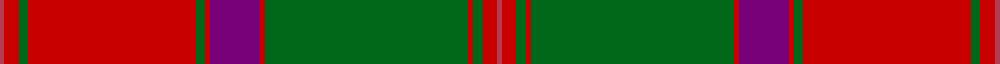

This page is one **sett** — a single exact thread-count. It belongs to the [tartan](/setts/ri2r6g4r70g4r2dp21r2g85r2g4r6ri2/)
(the same proportion at any scale), whose colour order is pattern [RRGRGRBRGRGRR](/stripes/rrgrgrbrgrgrr/).

Part of the [Crieff](/tartans/crieff/) tartan — the named design grouping this sett with its other cloths.

Sourced from register-of-tartans.  It is a [13 stripe tartan](/stripes/stripes13/).

Original link https://www.tartanregister.gov.uk/tartanDetails.aspx?ref=803

2 attestations — the source records this cloth was collapsed from (oldest owns this page)

<ul>
<li>01/01/1797 — Crieff (register-of-tartans, <a href="https://www.tartanregister.gov.uk/tartanDetails.aspx?ref=803">record</a>)</li>
<li>1797 — Crieff (District) (tartans-authority, <a href="http://www.tartansauthority.com/tartan-ferret/display/1636/">record</a>)</li>
</ul>

## Register references

External register numbers recorded for this tartan.

- Scottish Register of Tartans: [803](https://www.tartanregister.gov.uk/tartanDetails.aspx?ref=803)
- Scottish Tartans Authority (ITI): 1636
- Scottish Tartans World Register: 1636

## Thread count
R/2 Ra6 G4 Ra70 G4 Ra2 P21 Ra2 G85 Ra2 G4 Ra6 R/2

One full sett is **416 threads**.

## Palette

Palette: <strong>Tartan Register</strong> <small style="color:#888">(3 of 4 colours)</small>
<table><thead><tr><th>Colour</th><th>Threads</th><th>Shade</th><th>Base</th><th>OKLCh</th></tr></thead><tbody><tr><td>R/</td><td style="text-align:right;font-variant-numeric:tabular-nums">2</td><td><code style="background-color:#B43C50;">#B43C50</code> <small style="color:#888">#B43C50</small></td><td>R <code style="background-color:#CC0000;">#CC0000</code></td><td><small style="color:#888">oklch(53.3% 0.155 14.4)</small></td></tr><tr><td>Ra</td><td style="text-align:right;font-variant-numeric:tabular-nums">6</td><td><code style="background-color:#C80000;">#C80000</code> <small style="color:#888">#C80000</small></td><td>R <code style="background-color:#CC0000;">#CC0000</code></td><td><small style="color:#888">oklch(52.3% 0.215 29.2)</small></td></tr><tr><td>G</td><td style="text-align:right;font-variant-numeric:tabular-nums">4</td><td><code style="background-color:#006818;">#006818</code> <small style="color:#888">#006818</small></td><td>G <code style="background-color:#006100;">#006100</code></td><td><small style="color:#888">oklch(45.0% 0.142 145.0)</small></td></tr><tr><td>Ra</td><td style="text-align:right;font-variant-numeric:tabular-nums">70</td><td><code style="background-color:#C80000;">#C80000</code> <small style="color:#888">#C80000</small></td><td>R <code style="background-color:#CC0000;">#CC0000</code></td><td><small style="color:#888">oklch(52.3% 0.215 29.2)</small></td></tr><tr><td>G</td><td style="text-align:right;font-variant-numeric:tabular-nums">4</td><td><code style="background-color:#006818;">#006818</code> <small style="color:#888">#006818</small></td><td>G <code style="background-color:#006100;">#006100</code></td><td><small style="color:#888">oklch(45.0% 0.142 145.0)</small></td></tr><tr><td>Ra</td><td style="text-align:right;font-variant-numeric:tabular-nums">2</td><td><code style="background-color:#C80000;">#C80000</code> <small style="color:#888">#C80000</small></td><td>R <code style="background-color:#CC0000;">#CC0000</code></td><td><small style="color:#888">oklch(52.3% 0.215 29.2)</small></td></tr><tr><td>P</td><td style="text-align:right;font-variant-numeric:tabular-nums">21</td><td><code style="background-color:#780078;">#780078</code> <small style="color:#888">#780078</small></td><td>B <code style="background-color:#2A418A;">#2A418A</code></td><td><small style="color:#888">oklch(40.2% 0.185 328.4)</small></td></tr><tr><td>Ra</td><td style="text-align:right;font-variant-numeric:tabular-nums">2</td><td><code style="background-color:#C80000;">#C80000</code> <small style="color:#888">#C80000</small></td><td>R <code style="background-color:#CC0000;">#CC0000</code></td><td><small style="color:#888">oklch(52.3% 0.215 29.2)</small></td></tr><tr><td>G</td><td style="text-align:right;font-variant-numeric:tabular-nums">85</td><td><code style="background-color:#006818;">#006818</code> <small style="color:#888">#006818</small></td><td>G <code style="background-color:#006100;">#006100</code></td><td><small style="color:#888">oklch(45.0% 0.142 145.0)</small></td></tr><tr><td>Ra</td><td style="text-align:right;font-variant-numeric:tabular-nums">2</td><td><code style="background-color:#C80000;">#C80000</code> <small style="color:#888">#C80000</small></td><td>R <code style="background-color:#CC0000;">#CC0000</code></td><td><small style="color:#888">oklch(52.3% 0.215 29.2)</small></td></tr><tr><td>G</td><td style="text-align:right;font-variant-numeric:tabular-nums">4</td><td><code style="background-color:#006818;">#006818</code> <small style="color:#888">#006818</small></td><td>G <code style="background-color:#006100;">#006100</code></td><td><small style="color:#888">oklch(45.0% 0.142 145.0)</small></td></tr><tr><td>Ra</td><td style="text-align:right;font-variant-numeric:tabular-nums">6</td><td><code style="background-color:#C80000;">#C80000</code> <small style="color:#888">#C80000</small></td><td>R <code style="background-color:#CC0000;">#CC0000</code></td><td><small style="color:#888">oklch(52.3% 0.215 29.2)</small></td></tr><tr><td>R/</td><td style="text-align:right;font-variant-numeric:tabular-nums">2</td><td><code style="background-color:#B43C50;">#B43C50</code> <small style="color:#888">#B43C50</small></td><td>R <code style="background-color:#CC0000;">#CC0000</code></td><td><small style="color:#888">oklch(53.3% 0.155 14.4)</small></td></tr></tbody></table>

## Nearest tartans

The nearest existing variants by ΔTartan distance, with this tartan at the top so the swatches line up against it.

ΔTartan

Tartan

Sett

—

<a href="/ttd/edit/#slug=ri2r6g4r70g4r2dp21r2g85r2g4r6ri2">Crieff</a> <a class="nn-out" href="/variants/s13/ri2r6g4r70g4r2dp21r2g85r2g4r6ri2/" title="open its dictionary page">↗</a>

0.74

<a href="/ttd/edit/#slug=r7db1r2db2r35lb2r2db10r2g2r2g37r3db2r6~x2&amp;base=ri2r6g4r70g4r2dp21r2g85r2g4r6ri2">Drummond of Megginch - 2023 BertieLexa</a> <a class="nn-out" href="/variants/s15/r7db1r2db2r35lb2r2db10r2g2r2g37r3db2r6~x2/" title="open its dictionary page">↗</a>

0.75

<a href="/ttd/edit/#slug=r15dp1r2dp2r78lt1r2dp21r3g2r3g89r2dp2r10&amp;base=ri2r6g4r70g4r2dp21r2g85r2g4r6ri2">Bruce - 1819 (New)</a> <a class="nn-out" href="/variants/s15/r15dp1r2dp2r78lt1r2dp21r3g2r3g89r2dp2r10/" title="open its dictionary page">↗</a>

1.01

<a href="/variants/s10/o64dg4dyi1dg4dyi1dg4dyi64dy2dyi2dy8~x2/">Connacht</a>

1.05

<a href="/variants/s12/r60db2g24r8db2t3db2/">Unidentified Cant #12</a>

1.09

<a href="/ttd/edit/#slug=r6db1r1g28r4db8w1r32g1r4g2~x2&amp;base=ri2r6g4r70g4r2dp21r2g85r2g4r6ri2">MacDonell of Keppoch</a> <a class="nn-out" href="/variants/s11/r6db1r1g28r4db8w1r32g1r4g2~x2/" title="open its dictionary page">↗</a>

1.09

<a href="/ttd/edit/#slug=r6dg4ly2dg36r2dg2r2dg12r48dg4r2k1r2lr6~x2&amp;base=ri2r6g4r70g4r2dp21r2g85r2g4r6ri2">Hay</a> <a class="nn-out" href="/variants/s14/r6dg4ly2dg36r2dg2r2dg12r48dg4r2k1r2lr6~x2/" title="open its dictionary page">↗</a>

1.10

<a href="/variants/s14/r36g18r4g6k1lb2k1g2~x2/">Strang (Personal)</a>

1.14

<a href="/ttd/edit/#slug=ri4r10g7r70g7r4dp21r4g85r4g7r10ri4&amp;base=ri2r6g4r70g4r2dp21r2g85r2g4r6ri2">Crieff District Tartan</a> <a class="nn-out" href="/variants/s13/ri4r10g7r70g7r4dp21r4g85r4g7r10ri4/" title="open its dictionary page">↗</a>

1.15

<a href="/ttd/edit/#slug=ri6r1db2ri2g40ri6db13t1ri48g2ri4r1g4~x2&amp;base=ri2r6g4r70g4r2dp21r2g85r2g4r6ri2">MacDonald of Glencoe</a> <a class="nn-out" href="/variants/s13/ri6r1db2ri2g40ri6db13t1ri48g2ri4r1g4~x2/" title="open its dictionary page">↗</a>

1.16

<a href="/ttd/edit/#slug=r3db2t1r2g24r4g2r2db8r2g2r24db2t1r2g2~x2&amp;base=ri2r6g4r70g4r2dp21r2g85r2g4r6ri2">Stewart of Appin - 1906</a> <a class="nn-out" href="/variants/s16/r3db2t1r2g24r4g2r2db8r2g2r24db2t1r2g2~x2/" title="open its dictionary page">↗</a>

## Neighbour map

Every grey dot is one of 14360 variants placed by the first two principal components of the ΔTartan feature space (44% of its variance). Red is this tartan; blue dots are its nearest — click one to open its page.

<svg viewBox="0 0 640 380" role="img" style="max-width:100%;height:auto;border:1px solid #e0e0e0;border-radius:4px;display:block" xmlns="http://www.w3.org/2000/svg"><image href="/nn/cloud.v1.png" width="640" height="380"/><a href="/variants/s15/r7db1r2db2r35lb2r2db10r2g2r2g37r3db2r6~x2/"><circle cx="381.5" cy="92.6" r="4" fill="#3465a4"><title>Drummond of Megginch - 2023 BertieLexa</title></circle></a><a href="/variants/s15/r15dp1r2dp2r78lt1r2dp21r3g2r3g89r2dp2r10/"><circle cx="385.3" cy="60.9" r="4" fill="#3465a4"><title>Bruce - 1819 (New)</title></circle></a><a href="/variants/s10/o64dg4dyi1dg4dyi1dg4dyi64dy2dyi2dy8~x2/"><circle cx="381.2" cy="101.2" r="4" fill="#3465a4"><title>Connacht</title></circle></a><a href="/variants/s12/r60db2g24r8db2t3db2/"><circle cx="385.4" cy="105.3" r="4" fill="#3465a4"><title>Unidentified Cant #12</title></circle></a><a href="/variants/s11/r6db1r1g28r4db8w1r32g1r4g2~x2/"><circle cx="377.4" cy="109.7" r="4" fill="#3465a4"><title>MacDonell of Keppoch</title></circle></a><a href="/variants/s14/r6dg4ly2dg36r2dg2r2dg12r48dg4r2k1r2lr6~x2/"><circle cx="380.7" cy="73.8" r="4" fill="#3465a4"><title>Hay</title></circle></a><a href="/variants/s14/r36g18r4g6k1lb2k1g2~x2/"><circle cx="359.3" cy="99.6" r="4" fill="#3465a4"><title>Strang (Personal)</title></circle></a><a href="/variants/s13/ri4r10g7r70g7r4dp21r4g85r4g7r10ri4/"><circle cx="335.1" cy="118.1" r="4" fill="#3465a4"><title>Crieff District Tartan</title></circle></a><a href="/variants/s13/ri6r1db2ri2g40ri6db13t1ri48g2ri4r1g4~x2/"><circle cx="370.8" cy="75.5" r="4" fill="#3465a4"><title>MacDonald of Glencoe</title></circle></a><a href="/variants/s16/r3db2t1r2g24r4g2r2db8r2g2r24db2t1r2g2~x2/"><circle cx="325.8" cy="102.1" r="4" fill="#3465a4"><title>Stewart of Appin - 1906</title></circle></a><circle cx="376.5" cy="83.9" r="5" fill="#c00000"/></svg>

ID: /variants/s13/ri2r6g4r70g4r2dp21r2g85r2g4r6ri2/
