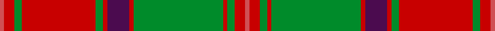
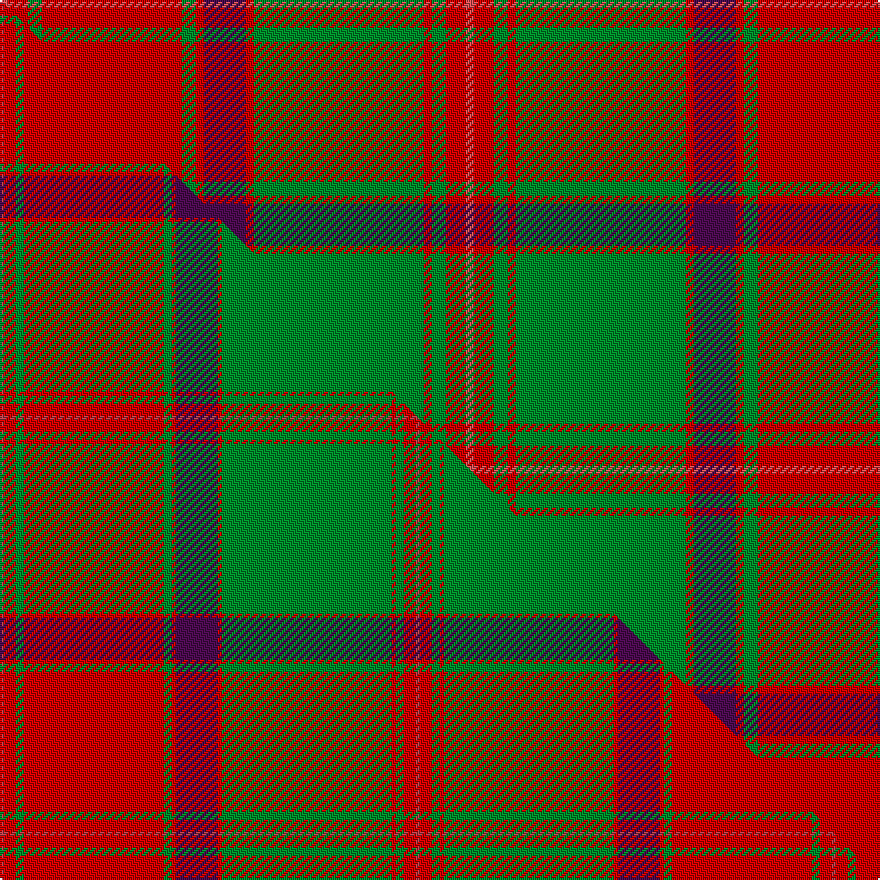

This is one **variant** — a specific cloth: this exact thread count and colourway, with its own
provenance below. It is one weaving of the [sett](/setts/ri4r10g7r70g7r4dp21r4g85r4g7r10ri4/) (the scale-free proportion — the
same cloth at any scale or shade), whose colour order is pattern [RRGRGRBRGRGRR](/stripes/rrgrgrbrgrgrr/).

Part of the [Crieff](/tartans/c/cr/crieff/) tartan — the named design grouping this sett with its other cloths.

Sourced from house-of-tartan.  It is a [13 stripe tartan](/stripes/stripes13/).

Original link [http://www.house-of-tartan.scotland.net/house/TartanViewjs.asp?colr=Def&tnam=1636](http://www.house-of-tartan.scotland.net/house/TartanViewjs.asp?colr=Def&tnam=1636)

## Provenance

Earliest known date: 1793 Wilson's accounts of 1793 mention the Crieff tartan with no details. A manuscript dated 1800 gives details of colour but it is not until the publication of the Key Pattern Book of 1819 that this sett is revealed in full. Crieff in Perthshire was the most famous of the cattle drovers 'trysts' prior to 1700. It is a very large sett which has been proportionately reduced for this illustration. The full threadcount: Light Red 4, Red 12, Green 8, R 140, G 8, R 4, Purple 42, R 4, G 170, R 4, G 8, R 12, LR 4.

Dataset <small>— provenance for this record, inherited from the source manifest</small>

<dl class="dataset-prov">
<dt>source</dt><dd><a href="/sources/house-of-tartan/">House of Tartan</a></dd>
<dt>data captured from</dt><dd><a href="https://github.com/thetartan/tartan-database/blob/master/data/house-of-tartan/data.csv">https://github.com/thetartan/tartan-database/blob/master/data/house-of-tartan/data.csv</a></dd>
<dt>data date</dt><dd>1793 <small>(this record)</small></dd>
<dt>licence</dt><dd><a href="https://creativecommons.org/licenses/by-nc-nd/4.0/">CC BY-NC-ND 4.0</a></dd>
</dl>

Capture chain <small>— the hands this data passed through, oldest first; each capture carries its own licence</small>

<ol class="capture-chain">
<li><a href="http://www.house-of-tartan.scotland.net/">House of Tartan</a> <small>the weaver/retailer's database — the site is now offline; the URL is kept as the ultimate source's identity</small></li>
<li><a href="https://github.com/thetartan/tartan-database">thetartan/tartan-database</a> <small>2016-2017</small> · <a href="https://creativecommons.org/licenses/by-nc-nd/4.0/">CC BY-NC-ND 4.0</a> <small>Levko Kravets's frozen compilation — the capture we vendored, and where its CC licence text came from</small></li>
<li>this dictionary <small>captured 2026-06-10 · commit 5bf86c7566</small> <small>each re-capture is a git commit to data/sources</small></li>
</ol>

## Thread count
Ri/4 R10 G7 R70 G7 R4 DP21 R4 G85 R4 G7 R10 Ri/4

One full sett is **466 threads**.

## Palette
<table><thead><tr><th>Colour</th><th>Shade</th><th>OKLCh</th></tr></thead><tbody><tr><td>R</td><td><code style="background-color:#D05054;">#D05054</code> <small style="color:#888">#D05054</small></td><td><small style="color:#888">oklch(60.2% 0.162 21.5)</small></td></tr><tr><td>G</td><td><code style="background-color:#008B2A;">#008B2A</code> <small style="color:#888">#008B2A</small></td><td><small style="color:#888">oklch(55.4% 0.170 145.9)</small></td></tr><tr><td>DP</td><td><code style="background-color:#4B0B4F;">#4B0B4F</code> <small style="color:#888">#4B0B4F</small></td><td><small style="color:#888">oklch(30.1% 0.125 325.4)</small></td></tr><tr><td>R</td><td><code style="background-color:#C80000;">#C80000</code> <small style="color:#888">#C80000</small></td><td><small style="color:#888">oklch(52.3% 0.215 29.2)</small></td></tr></tbody></table>

# Sample pattern

## Compared to the master

This cloth is one sett of its design; the master sett (the exemplar the design is anchored on) is below for comparison.

Its **ΔTartan distance** from the master is **2.42** — the same measure the nearest-tartans table ranks by (0 is identical; a re-scale of the same cloth is near 0, a recolour or a different proportion further).

<figure class="master-compare" style="margin:0">

this sett
master sett ★

<figcaption style="color:#888;font-size:smaller">One weave of this sett against the <a href="/setts/m2r6g4r70g4r2dp21r2g85r2g4r6m2/">master sett ★</a>, split on the diagonal: a shared proportion runs seamlessly across it with only the shades shifting; a different proportion breaks on it.</figcaption>
</figure>

## Nearest tartan variants

The nearest existing variants by ΔTartan distance, with this cloth at the top so the swatches line up against it.

ΔTartan

Threads

Variant

Sett

—

466

<a href="/variants/s13/ri4r10g7r70g7r4dp21r4g85r4g7r10ri4~ri2406019-r2109032/">Crieff District Tartan</a>

<a href="/ttd/edit/#slug=m2r6g4r70g4r2dp21r2g85r2g4r6m2~m2106019-r2109032&amp;base=ri4r10g7r70g7r4dp21r4g85r4g7r10ri4~ri2406019-r2109032" title="compare in the TTD">0.49</a>

416

<a href="/variants/s13/m2r6g4r70g4r2dp21r2g85r2g4r6m2~m2106019-r2109032/">Crieff</a>

<a href="/ttd/edit/#slug=b4r10g7r70g7r4dp21r4g85r4g7r10b4&amp;base=ri4r10g7r70g7r4dp21r4g85r4g7r10ri4~ri2406019-r2109032" title="compare in the TTD">0.61</a>

466

<a href="/variants/s13/b4r10g7r70g7r4dp21r4g85r4g7r10b4/">Crieff</a>

<a href="/ttd/edit/#slug=o10lb2g3lb2do24lb4do4o34do2lb3do2~x2&amp;base=ri4r10g7r70g7r4dp21r4g85r4g7r10ri4~ri2406019-r2109032" title="compare in the TTD">2.15</a>

336

<a href="/variants/s11/o10lb2g3lb2do24lb4do4o34do2lb3do2~x2/">Fort William (Fashion)</a>

<a href="/ttd/edit/#slug=r3db2r2g38r2g2r2db10r2lb2r37db2r2db2r3~x2&amp;base=ri4r10g7r70g7r4dp21r4g85r4g7r10ri4~ri2406019-r2109032" title="compare in the TTD">2.20</a>

432

<a href="/variants/s15/r3db2r2g38r2g2r2db10r2lb2r37db2r2db2r3~x2/">Grant and Drummond</a>

<a href="/ttd/edit/#slug=g38r3g3r3db9r3lb2r40db3r3db2r6~x2&amp;base=ri4r10g7r70g7r4dp21r4g85r4g7r10ri4~ri2406019-r2109032" title="compare in the TTD">2.26</a>

372

<a href="/variants/s12/g38r3g3r3db9r3lb2r40db3r3db2r6~x2/">MacLintock</a>

<a href="/ttd/edit/#slug=r3g3y1r18w1g21y1g1y3~x2&amp;base=ri4r10g7r70g7r4dp21r4g85r4g7r10ri4~ri2406019-r2109032" title="compare in the TTD">2.27</a>

196

<a href="/variants/s9/r3g3y1r18w1g21y1g1y3~x2/">MacDonald of Kingsburgh Clan Tartan</a>

<a href="/ttd/edit/#slug=g36lb2r2lb2r2lb2r30dg1r1dg4~x2&amp;base=ri4r10g7r70g7r4dp21r4g85r4g7r10ri4~ri2406019-r2109032" title="compare in the TTD">2.35</a>

248

<a href="/variants/s10/g36lb2r2lb2r2lb2r30dg1r1dg4~x2/">Connaught (Lochcarron)</a>

<a href="/ttd/edit/#slug=r7b2db2r2g32r6db12r41g2r5b2g5~x2&amp;base=ri4r10g7r70g7r4dp21r4g85r4g7r10ri4~ri2406019-r2109032" title="compare in the TTD">2.36</a>

448

<a href="/variants/s12/r7b2db2r2g32r6db12r41g2r5b2g5~x2/">MacDonald of Glenaladale</a>

<a href="/ttd/edit/#slug=g36r3g3r3db9r3lb2r40db3r3db2r6~x2&amp;base=ri4r10g7r70g7r4dp21r4g85r4g7r10ri4~ri2406019-r2109032" title="compare in the TTD">2.37</a>

368

<a href="/variants/s12/g36r3g3r3db9r3lb2r40db3r3db2r6~x2/">MacLintock Clan Tartan</a>

<a href="/ttd/edit/#slug=g6r2g2r24lb1db1r2db12r2db1lb1r2g24r2~x2&amp;base=ri4r10g7r70g7r4dp21r4g85r4g7r10ri4~ri2406019-r2109032" title="compare in the TTD">2.43</a>

312

<a href="/variants/s14/g6r2g2r24lb1db1r2db12r2db1lb1r2g24r2~x2/">Unidentified Coat</a>

## Neighbour map

Every grey dot is one of 13621 variants placed by the first two principal components of the ΔTartan feature space (42% of its variance). Red is this tartan; blue dots are its nearest — click one to open its page. The map is a flat projection of a many-dimensional space — [how to read it](/posts/neighbourhood-maps/).

<svg viewBox="0 0 640 380" role="img" style="max-width:100%;height:auto;border:1px solid #e0e0e0;border-radius:4px;display:block" xmlns="http://www.w3.org/2000/svg"><image href="/nn/cloud.v1.png" width="640" height="380"/><a href="/variants/s13/m2r6g4r70g4r2dp21r2g85r2g4r6m2~m2106019-r2109032/"><circle cx="360.9" cy="86.6" r="4" fill="#3465a4"><title>Crieff</title></circle></a><a href="/variants/s13/b4r10g7r70g7r4dp21r4g85r4g7r10b4/"><circle cx="321.4" cy="122.6" r="4" fill="#3465a4"><title>Crieff</title></circle></a><a href="/variants/s11/o10lb2g3lb2do24lb4do4o34do2lb3do2~x2/"><circle cx="342.6" cy="153.8" r="4" fill="#3465a4"><title>Fort William (Fashion)</title></circle></a><a href="/variants/s15/r3db2r2g38r2g2r2db10r2lb2r37db2r2db2r3~x2/"><circle cx="311.4" cy="104.3" r="4" fill="#3465a4"><title>Grant and Drummond</title></circle></a><a href="/variants/s12/g38r3g3r3db9r3lb2r40db3r3db2r6~x2/"><circle cx="329.4" cy="123.0" r="4" fill="#3465a4"><title>MacLintock</title></circle></a><a href="/variants/s9/r3g3y1r18w1g21y1g1y3~x2/"><circle cx="355.5" cy="152.6" r="4" fill="#3465a4"><title>MacDonald of Kingsburgh Clan Tartan</title></circle></a><a href="/variants/s10/g36lb2r2lb2r2lb2r30dg1r1dg4~x2/"><circle cx="340.0" cy="109.6" r="4" fill="#3465a4"><title>Connaught (Lochcarron)</title></circle></a><a href="/variants/s12/r7b2db2r2g32r6db12r41g2r5b2g5~x2/"><circle cx="329.6" cy="128.9" r="4" fill="#3465a4"><title>MacDonald of Glenaladale</title></circle></a><a href="/variants/s12/g36r3g3r3db9r3lb2r40db3r3db2r6~x2/"><circle cx="332.3" cy="123.1" r="4" fill="#3465a4"><title>MacLintock Clan Tartan</title></circle></a><a href="/variants/s14/g6r2g2r24lb1db1r2db12r2db1lb1r2g24r2~x2/"><circle cx="281.1" cy="114.7" r="4" fill="#3465a4"><title>Unidentified Coat</title></circle></a><circle cx="327.6" cy="123.6" r="5" fill="#c00000"/><text x="320" y="376" text-anchor="middle" font-size="11" fill="#999">ground</text><text x="11" y="190" text-anchor="middle" font-size="11" fill="#999" transform="rotate(-90 11 190)">complexity</text></svg>

ID: /variants/s13/ri4r10g7r70g7r4dp21r4g85r4g7r10ri4~ri2406019-r2109032/
