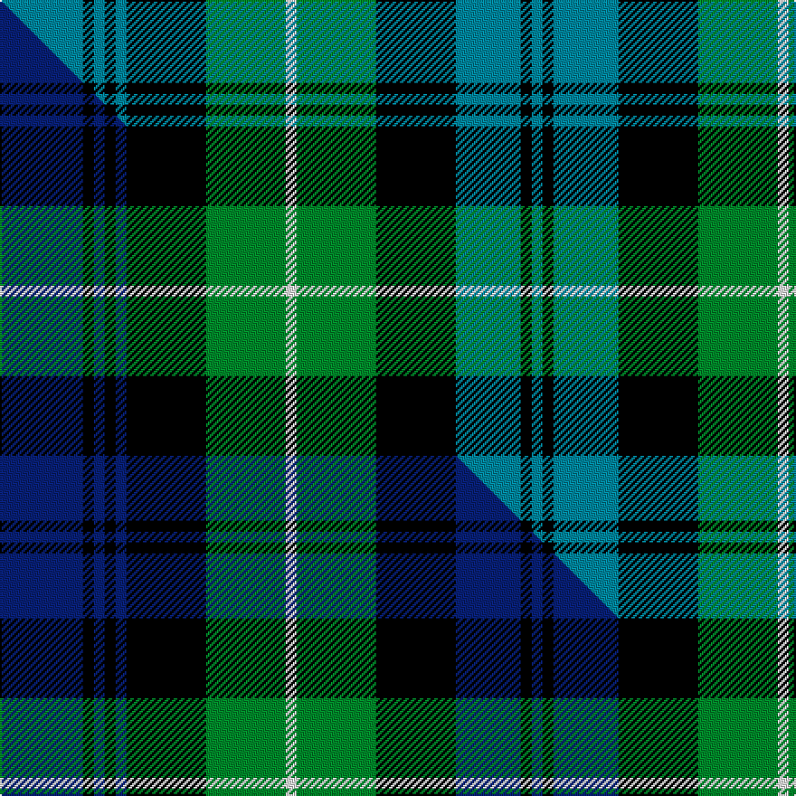

This page is one **sett** — a single exact thread-count. It belongs to the [tartan](/setts/t23k3t3k3t3k22g22w3g22k22t18k3t3/)
(the same proportion at any scale), whose colour order is pattern [BKBKBKGWGKBKB](/stripes/bkbkbkgwgkbkb/).

Part of the [Lamont](/tartans/lamont/) tartan — the named design grouping this sett with its other cloths.

Sourced from tartans-authority.  It is a [13 stripe tartan](/stripes/stripes13/).

Original link http://www.tartansauthority.com/tartan-ferret/display/216/

## Register references

External register numbers recorded for this tartan.

- Scottish Tartans Authority (ITI): 216

## Thread count
T/46 K6 T6 K6 T6 K44 G44 W6 G44 K44 T36 K6 T/6

One full sett is **548 threads**.

## Palette
<table><thead><tr><th>Colour</th><th>Shade</th><th>OKLCh</th></tr></thead><tbody><tr><td>T</td><td><code style="background-color:#00879F;">#00879F</code> <small style="color:#888">#00879F</small></td><td><small style="color:#888">oklch(57.4% 0.102 216.1)</small></td></tr><tr><td>G</td><td><code style="background-color:#008B2A;">#008B2A</code> <small style="color:#888">#008B2A</small></td><td><small style="color:#888">oklch(55.4% 0.170 145.9)</small></td></tr><tr><td>K</td><td><code style="background-color:#000000;">#000000</code> <small style="color:#888">#000000</small></td><td><small style="color:#888">oklch(0.0% 0.000 0.0)</small></td></tr><tr><td>W</td><td><code style="background-color:#F7F7F7;">#F7F7F7</code> <small style="color:#888">#F7F7F7</small></td><td><small style="color:#888">oklch(97.6% 0.000 89.9)</small></td></tr></tbody></table>

# Sample pattern

## Compared to the master

This cloth is one sett of its design; the master sett (the exemplar the design is anchored on) is below for comparison.

Its **ΔTartan distance** from the master is **1.04** — the same measure the nearest-tartans table ranks by (0 is identical; a re-scale of the same cloth is near 0, a recolour or a different proportion further).

<figure class="master-compare" style="margin:0">

this sett
master sett ★

<figcaption style="color:#888;font-size:smaller">One weave of this sett against the <a href="/setts/db23k3db3k3db3k22g22w3g22k22db18k3db3/">master sett ★</a>, split on the diagonal: a shared proportion runs seamlessly across it with only the shades shifting; a different proportion breaks on it.</figcaption>
</figure>

## Nearest variants

The nearest existing variants by ΔTartan distance, with this cloth at the top so the swatches line up against it.

ΔTartan

Threads

Variant

Sett

—

548

<a href="/variants/s13/t23k3t3k3t3k22g22w3g22k22t18k3t3~x2/">Lamont (Clan)</a>

<a href="/ttd/edit/#slug=db23k3db3k3db3k22g22w3g22k22db18k3db3~x2&amp;base=t23k3t3k3t3k22g22w3g22k22t18k3t3~x2" title="compare in the TTD">0.00</a>

548

<a href="/variants/s13/db23k3db3k3db3k22g22w3g22k22db18k3db3~x2/">Lamont #3</a>

<a href="/ttd/edit/#slug=db12k2db2k2db2k12g12y2g12k12db11k2db2&amp;base=t23k3t3k3t3k22g22w3g22k22t18k3t3~x2" title="compare in the TTD">0.52</a>

156

<a href="/variants/s13/db12k2db2k2db2k12g12y2g12k12db11k2db2/">Gordon</a>

<a href="/ttd/edit/#slug=db12k2db2k2db2k12g12y2g12k12db11k2db2~x2&amp;base=t23k3t3k3t3k22g22w3g22k22t18k3t3~x2" title="compare in the TTD">0.52</a>

312

<a href="/variants/s13/db12k2db2k2db2k12g12y2g12k12db11k2db2~x2/">Gordon</a>

<a href="/ttd/edit/#slug=db23k3db3k3db3k17g22y4g22k17db22k3db3~x2&amp;base=t23k3t3k3t3k22g22w3g22k22t18k3t3~x2" title="compare in the TTD">0.58</a>

528

<a href="/variants/s13/db23k3db3k3db3k17g22y4g22k17db22k3db3~x2/">Gordon (Clan)</a>

<a href="/ttd/edit/#slug=db6k1db1k1db1k6g6lb2g6k6db6k1g2~x4&amp;base=t23k3t3k3t3k22g22w3g22k22t18k3t3~x2" title="compare in the TTD">1.50</a>

328

<a href="/variants/s13/db6k1db1k1db1k6g6lb2g6k6db6k1g2~x4/">Cheape of Torosay #2 (Personal)</a>

<a href="/ttd/edit/#slug=t25k4t4k4t4k26g25r6g25k26t25k2r6~x2&amp;base=t23k3t3k3t3k22g22w3g22k22t18k3t3~x2" title="compare in the TTD">1.76</a>

666

<a href="/variants/s13/t25k4t4k4t4k26g25r6g25k26t25k2r6~x2/">Atholl (District)</a>

<a href="/ttd/edit/#slug=t25k4t4k4t4k26g25r9g25k26t25k2r9~x2&amp;base=t23k3t3k3t3k22g22w3g22k22t18k3t3~x2" title="compare in the TTD">1.76</a>

684

<a href="/variants/s13/t25k4t4k4t4k26g25r9g25k26t25k2r9~x2/">Atholl</a>

<a href="/ttd/edit/#slug=r3t10k10g10r3g10k10t2k2t2k2t5k2~x4&amp;base=t23k3t3k3t3k22g22w3g22k22t18k3t3~x2" title="compare in the TTD">2.25</a>

548

<a href="/variants/s13/r3t10k10g10r3g10k10t2k2t2k2t5k2~x4/">Blairgowrie High School (SA)</a>

<a href="/ttd/edit/#slug=r3t10k10g10r3g10k10t2k2t2k2t5k2~x2&amp;base=t23k3t3k3t3k22g22w3g22k22t18k3t3~x2" title="compare in the TTD">2.25</a>

274

<a href="/variants/s13/r3t10k10g10r3g10k10t2k2t2k2t5k2~x2/">Blairgowrie High School S.A. (Corp)</a>

<a href="/ttd/edit/#slug=db8k1db2k1db2k6g8k1w2k1g8k6db8k1db2~x4&amp;base=t23k3t3k3t3k22g22w3g22k22t18k3t3~x2" title="compare in the TTD">2.38</a>

416

<a href="/variants/s15/db8k1db2k1db2k6g8k1w2k1g8k6db8k1db2~x4/">Forbes</a>

## Neighbour map

Every grey dot is one of 13620 variants placed by the first two principal components of the ΔTartan feature space (42% of its variance). Red is this tartan; blue dots are its nearest — click one to open its page.

<svg viewBox="0 0 640 380" role="img" style="max-width:100%;height:auto;border:1px solid #e0e0e0;border-radius:4px;display:block" xmlns="http://www.w3.org/2000/svg"><image href="/nn/cloud.v1.png" width="640" height="380"/><a href="/variants/s13/db23k3db3k3db3k22g22w3g22k22db18k3db3~x2/"><circle cx="135.5" cy="181.4" r="4" fill="#3465a4"><title>Lamont #3</title></circle></a><a href="/variants/s13/db12k2db2k2db2k12g12y2g12k12db11k2db2/"><circle cx="128.4" cy="196.0" r="4" fill="#3465a4"><title>Gordon</title></circle></a><a href="/variants/s13/db12k2db2k2db2k12g12y2g12k12db11k2db2~x2/"><circle cx="128.4" cy="196.0" r="4" fill="#3465a4"><title>Gordon</title></circle></a><a href="/variants/s13/db23k3db3k3db3k17g22y4g22k17db22k3db3~x2/"><circle cx="145.2" cy="183.9" r="4" fill="#3465a4"><title>Gordon (Clan)</title></circle></a><a href="/variants/s13/db6k1db1k1db1k6g6lb2g6k6db6k1g2~x4/"><circle cx="105.1" cy="201.4" r="4" fill="#3465a4"><title>Cheape of Torosay #2 (Personal)</title></circle></a><a href="/variants/s13/t25k4t4k4t4k26g25r6g25k26t25k2r6~x2/"><circle cx="124.6" cy="163.6" r="4" fill="#3465a4"><title>Atholl (District)</title></circle></a><a href="/variants/s13/t25k4t4k4t4k26g25r9g25k26t25k2r9~x2/"><circle cx="113.7" cy="167.4" r="4" fill="#3465a4"><title>Atholl</title></circle></a><a href="/variants/s13/r3t10k10g10r3g10k10t2k2t2k2t5k2~x4/"><circle cx="93.4" cy="204.4" r="4" fill="#3465a4"><title>Blairgowrie High School (SA)</title></circle></a><a href="/variants/s13/r3t10k10g10r3g10k10t2k2t2k2t5k2~x2/"><circle cx="93.4" cy="204.4" r="4" fill="#3465a4"><title>Blairgowrie High School S.A. (Corp)</title></circle></a><a href="/variants/s15/db8k1db2k1db2k6g8k1w2k1g8k6db8k1db2~x4/"><circle cx="136.1" cy="173.6" r="4" fill="#3465a4"><title>Forbes</title></circle></a><circle cx="125.9" cy="182.0" r="5" fill="#c00000"/><text x="320" y="376" text-anchor="middle" font-size="11" fill="#999">ground</text><text x="11" y="190" text-anchor="middle" font-size="11" fill="#999" transform="rotate(-90 11 190)">complexity</text></svg>

ID: /variants/s13/t23k3t3k3t3k22g22w3g22k22t18k3t3~x2/
