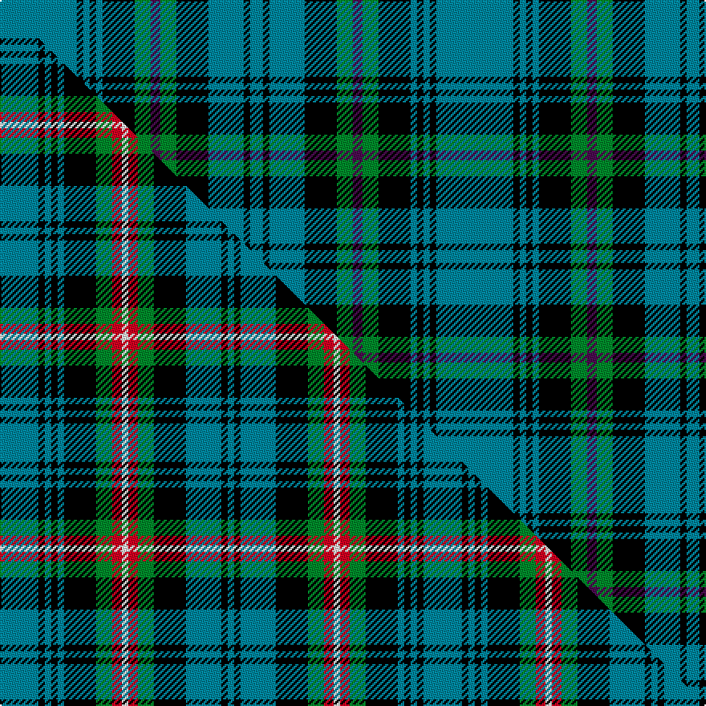

This is one **variant** — a specific cloth: this exact thread count and colourway, with its own
provenance below. It is one weaving of the [sett](/setts/t24k2t2k2t2k10g5dp3g5k10t11k2t4/) (the scale-free proportion — the
same cloth at any scale or shade), whose colour order is pattern [BKBKBKGBGKBKB](/stripes/bkbkbkgbgkbkb/).

Part of the [Blanton](/tartans/blanton/) tartan — the named design grouping this sett with its other cloths.

Sourced from register-of-tartans.  It is a [13 stripe tartan](/stripes/stripes13/).

Original link [https://www.tartanregister.gov.uk/tartanDetails.aspx?ref=297](https://www.tartanregister.gov.uk/tartanDetails.aspx?ref=297)

Dataset <small>— provenance for this record, inherited from the source manifest</small>

<dl class="dataset-prov">
<dt>source</dt><dd><a href="/sources/register-of-tartans/">Scottish Register of Tartans</a></dd>
<dt>data captured from</dt><dd><a href="https://github.com/thetartan/tartan-database/blob/master/data/register-of-tartans/data.csv">https://github.com/thetartan/tartan-database/blob/master/data/register-of-tartans/data.csv</a></dd>
<dt>data date</dt><dd>01/10/2000 <small>(this record)</small></dd>
<dt>licence</dt><dd><a href="https://www.tartanregister.gov.uk/copyright">Crown copyright</a></dd>
</dl>

Capture chain <small>— the hands this data passed through, oldest first; each capture carries its own licence</small>

<ol class="capture-chain">
<li><a href="https://www.tartanregister.gov.uk/">Scottish Register of Tartans</a> · <a href="https://www.tartanregister.gov.uk/copyright">Crown copyright</a> <small>the living register — still published by National Records of Scotland</small></li>
<li><a href="https://github.com/thetartan/tartan-database">thetartan/tartan-database</a> <small>2016-2017</small> · <a href="https://creativecommons.org/licenses/by-nc-nd/4.0/">CC BY-NC-ND 4.0</a> <small>Levko Kravets's frozen compilation — the capture we vendored, and where its CC licence text came from</small></li>
<li>this dictionary <small>captured 2026-06-10 · commit 5bf86c7566</small> <small>each re-capture is a git commit to data/sources</small></li>
</ol>

## Register references

External register numbers recorded for this tartan.

- Scottish Register of Tartans: [297](https://www.tartanregister.gov.uk/tartanDetails.aspx?ref=297)
- Scottish Tartans Authority (ITI): 4007
- Scottish Tartans World Register: 2864

## Thread count
T/48 K4 T4 K4 T4 K20 G10 DP6 G10 K20 T22 K4 T/8

One full sett is **272 threads**.

## Palette
<table><thead><tr><th>Colour</th><th>Shade</th><th>OKLCh</th></tr></thead><tbody><tr><td>T</td><td><code style="background-color:#00879F;">#00879F</code> <small style="color:#888">#00879F</small></td><td><small style="color:#888">oklch(57.4% 0.102 216.1)</small></td></tr><tr><td>G</td><td><code style="background-color:#008B2A;">#008B2A</code> <small style="color:#888">#008B2A</small></td><td><small style="color:#888">oklch(55.4% 0.170 145.9)</small></td></tr><tr><td>K</td><td><code style="background-color:#000000;">#000000</code> <small style="color:#888">#000000</small></td><td><small style="color:#888">oklch(0.0% 0.000 0.0)</small></td></tr><tr><td>DP</td><td><code style="background-color:#4B0B4F;">#4B0B4F</code> <small style="color:#888">#4B0B4F</small></td><td><small style="color:#888">oklch(30.1% 0.125 325.4)</small></td></tr></tbody></table>

# Sample pattern

## Compared to the master

This cloth is one sett of its design; the master sett (the exemplar the design is anchored on) is below for comparison.

Its **ΔTartan distance** from the master is **1.33** — the same measure the nearest-tartans table ranks by (0 is identical; a re-scale of the same cloth is near 0, a recolour or a different proportion further).

<figure class="master-compare" style="margin:0">

this sett
master sett ★

<figcaption style="color:#888;font-size:smaller">One weave of this sett against the <a href="/setts/t12k2t2k2t2k10g5r3w2r3g5k10t11k2t2/">master sett ★</a>, split on the diagonal: a shared proportion runs seamlessly across it with only the shades shifting; a different proportion breaks on it.</figcaption>
</figure>

## Nearest tartan variants

The nearest existing variants by ΔTartan distance, with this cloth at the top so the swatches line up against it.

ΔTartan

Threads

Variant

Sett

—

272

<a href="/variants/s13/t24k2t2k2t2k10g5dp3g5k10t11k2t4~x2/">Blanton</a>

<a href="/ttd/edit/#slug=t4k7ly3k3t34k17t4k5t4k7o11t5ly4~x2~ly2705081-o2503076&amp;base=t24k2t2k2t2k10g5dp3g5k10t11k2t4~x2" title="compare in the TTD">1.49</a>

416

<a href="/variants/s13/t4k7lyi3k3t34k17t4k5t4k7ly11t5lyi4~x2~lyi2705081-ly2503076/">State Seal of Oregon (Fashion)</a>

<a href="/ttd/edit/#slug=k6g3k3g28db4g4db10g4db4g4db24g5w3~x2&amp;base=t24k2t2k2t2k10g5dp3g5k10t11k2t4~x2" title="compare in the TTD">1.79</a>

390

<a href="/variants/s13/k6g3k3g28db4g4db10g4db4g4db24g5w3~x2/">Marthas Vineyard (District)</a>

<a href="/ttd/edit/#slug=t4dr12t4k14t36dr3t36k14t4dr12t4dr12k14t36ly3~x2&amp;base=t24k2t2k2t2k10g5dp3g5k10t11k2t4~x2" title="compare in the TTD">2.17</a>

818

<a href="/variants/s15/t4dr12t4k14t36dr3t36k14t4dr12t4dr12k14t36ly3~x2/">Cornwall</a>

<a href="/ttd/edit/#slug=t32k4t4k4t4k20g23w2t5w2g23k20t22k4t4&amp;base=t24k2t2k2t2k10g5dp3g5k10t11k2t4~x2" title="compare in the TTD">2.22</a>

310

<a href="/variants/s15/t32k4t4k4t4k20g23w2t5w2g23k20t22k4t4/">Lyon (Clan)</a>

<a href="/ttd/edit/#slug=r1g11k4db2k1db1k1db14k1db1k1db2k4g11w1~x4&amp;base=t24k2t2k2t2k10g5dp3g5k10t11k2t4~x2" title="compare in the TTD">2.33</a>

440

<a href="/variants/s15/r1g11k4db2k1db1k1db14k1db1k1db2k4g11w1~x4/">MacKenzie</a>

<a href="/ttd/edit/#slug=r4ki2g7ki15g3ki3g3ki7g28k7g6k2~ki0604259&amp;base=t24k2t2k2t2k10g5dp3g5k10t11k2t4~x2" title="compare in the TTD">2.41</a>

168

<a href="/variants/s12/r4ki2g7ki15g3ki3g3ki7g28k7g6k2~ki0604259/">Walker, hunting</a>

<a href="/ttd/edit/#slug=t18db2k2db2k1t2k8g1ly1g6k8t14k2g2~x2&amp;base=t24k2t2k2t2k10g5dp3g5k10t11k2t4~x2" title="compare in the TTD">2.47</a>

236

<a href="/variants/s14/t18db2k2db2k1t2k8g1ly1g6k8t14k2g2~x2/">Angove, the Black Swan (Name)</a>

<a href="/ttd/edit/#slug=db4lb2k2db12lb4g6k6g28k2lb2g3~x2&amp;base=t24k2t2k2t2k10g5dp3g5k10t11k2t4~x2" title="compare in the TTD">2.53</a>

270

<a href="/variants/s11/db4lb2k2db12lb4g6k6g28k2lb2g3~x2/">Hudson Hunting (Personal)</a>

<a href="/ttd/edit/#slug=g3t36k9r3k3r3k36r3k3r3k9t36g3t2~x2~g2408144&amp;base=t24k2t2k2t2k10g5dp3g5k10t11k2t4~x2" title="compare in the TTD">2.58</a>

598

<a href="/variants/s14/g3t36k9r3k3r3k36r3k3r3k9t36g3t2~x2~g2408144/">Home (Clans Originaux)</a>

<a href="/ttd/edit/#slug=w3k1t15k6t5k3t8k2t5y3w2y4k1w3~x2&amp;base=t24k2t2k2t2k10g5dp3g5k10t11k2t4~x2" title="compare in the TTD">2.61</a>

232

<a href="/variants/s14/w3k1t15k6t5k3t8k2t5y3w2y4k1w3~x2/">Avalon - Carroll House</a>

## Neighbour map

Every grey dot is one of 13621 variants placed by the first two principal components of the ΔTartan feature space (42% of its variance). Red is this tartan; blue dots are its nearest — click one to open its page.

<svg viewBox="0 0 640 380" role="img" style="max-width:100%;height:auto;border:1px solid #e0e0e0;border-radius:4px;display:block" xmlns="http://www.w3.org/2000/svg"><image href="/nn/cloud.v1.png" width="640" height="380"/><a href="/variants/s13/t4k7lyi3k3t34k17t4k5t4k7ly11t5lyi4~x2~lyi2705081-ly2503076/"><circle cx="203.6" cy="146.6" r="4" fill="#3465a4"><title>State Seal of Oregon (Fashion)</title></circle></a><a href="/variants/s13/k6g3k3g28db4g4db10g4db4g4db24g5w3~x2/"><circle cx="223.4" cy="160.4" r="4" fill="#3465a4"><title>Marthas Vineyard (District)</title></circle></a><a href="/variants/s15/t4dr12t4k14t36dr3t36k14t4dr12t4dr12k14t36ly3~x2/"><circle cx="269.1" cy="153.3" r="4" fill="#3465a4"><title>Cornwall</title></circle></a><a href="/variants/s15/t32k4t4k4t4k20g23w2t5w2g23k20t22k4t4/"><circle cx="171.5" cy="144.7" r="4" fill="#3465a4"><title>Lyon (Clan)</title></circle></a><a href="/variants/s15/r1g11k4db2k1db1k1db14k1db1k1db2k4g11w1~x4/"><circle cx="168.3" cy="114.9" r="4" fill="#3465a4"><title>MacKenzie</title></circle></a><a href="/variants/s12/r4ki2g7ki15g3ki3g3ki7g28k7g6k2~ki0604259/"><circle cx="244.5" cy="143.1" r="4" fill="#3465a4"><title>Walker, hunting</title></circle></a><a href="/variants/s14/t18db2k2db2k1t2k8g1ly1g6k8t14k2g2~x2/"><circle cx="206.6" cy="112.7" r="4" fill="#3465a4"><title>Angove, the Black Swan (Name)</title></circle></a><a href="/variants/s11/db4lb2k2db12lb4g6k6g28k2lb2g3~x2/"><circle cx="235.7" cy="139.6" r="4" fill="#3465a4"><title>Hudson Hunting (Personal)</title></circle></a><a href="/variants/s14/g3t36k9r3k3r3k36r3k3r3k9t36g3t2~x2~g2408144/"><circle cx="235.9" cy="105.8" r="4" fill="#3465a4"><title>Home (Clans Originaux)</title></circle></a><a href="/variants/s14/w3k1t15k6t5k3t8k2t5y3w2y4k1w3~x2/"><circle cx="215.0" cy="148.7" r="4" fill="#3465a4"><title>Avalon - Carroll House</title></circle></a><circle cx="229.1" cy="148.9" r="5" fill="#c00000"/><text x="320" y="376" text-anchor="middle" font-size="11" fill="#999">ground</text><text x="11" y="190" text-anchor="middle" font-size="11" fill="#999" transform="rotate(-90 11 190)">complexity</text></svg>

ID: /variants/s13/t24k2t2k2t2k10g5dp3g5k10t11k2t4~x2/
