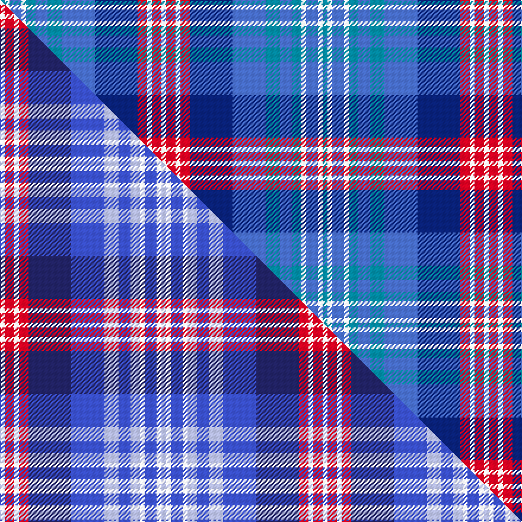

This page is one **sett** — a single exact thread-count. It belongs to the [tartan](/setts/t2w2b5w2t4b5t6b14db18r4w2r4w2/)
(the same proportion at any scale), whose colour order is pattern [BWBWBBBBBRWRW](/stripes/bwbwbbbbbrwrw/).

Part of the [Daughters of the American Revolution](/tartans/daughters-of-the-american-revolution/) tartan — the named design grouping this sett with its other cloths.

Sourced from house-of-tartan.  It is a [13 stripe tartan](/stripes/stripes13/).

Original link http://www.house-of-tartan.scotland.net/house/TartanViewjs.asp?colr=Def&tnam=11129

## Provenance

Earliest known date: 2014-05 The tartan was presented to the Society by Hope Vere Anderson, authorised by President General, Lynn Forney Young. The red and white stripes represent the red-white image of the DAR logo.

## Thread count
T/4 W4 B10 W4 T8 B10 T12 B28 DB36 R8 W4 R8 W/4

One full sett is **272 threads**.

## Palette
<table><thead><tr><th>Colour</th><th>Shade</th><th>OKLCh</th></tr></thead><tbody><tr><td>T</td><td><code style="background-color:#00879F;">#00879F</code> <small style="color:#888">#00879F</small></td><td><small style="color:#888">oklch(57.4% 0.102 216.1)</small></td></tr><tr><td>B</td><td><code style="background-color:#466CC8;">#466CC8</code> <small style="color:#888">#466CC8</small></td><td><small style="color:#888">oklch(55.1% 0.149 265.0)</small></td></tr><tr><td>DB</td><td><code style="background-color:#082077;">#082077</code> <small style="color:#888">#082077</small></td><td><small style="color:#888">oklch(30.0% 0.149 265.1)</small></td></tr><tr><td>R</td><td><code style="background-color:#D60020;">#D60020</code> <small style="color:#888">#D60020</small></td><td><small style="color:#888">oklch(55.2% 0.224 25.5)</small></td></tr><tr><td>W</td><td><code style="background-color:#F7F7F7;">#F7F7F7</code> <small style="color:#888">#F7F7F7</small></td><td><small style="color:#888">oklch(97.6% 0.000 89.9)</small></td></tr></tbody></table>

# Sample pattern

## Compared to the master

This cloth is one sett of its design; the master sett (the exemplar the design is anchored on) is below for comparison.

Its **ΔTartan distance** from the master is **0.68** — the same measure the nearest-tartans table ranks by (0 is identical; a re-scale of the same cloth is near 0, a recolour or a different proportion further).

<figure class="master-compare" style="margin:0">

this sett
master sett ★

<figcaption style="color:#888;font-size:smaller">One weave of this sett against the <a href="/setts/w2r4w2r4db18b14lb6b5lb4w2b5w2lb2/">master sett ★</a>, split on the diagonal: a shared proportion runs seamlessly across it with only the shades shifting; a different proportion breaks on it.</figcaption>
</figure>

## Nearest tartan variants

The nearest existing variants by ΔTartan distance, with this cloth at the top so the swatches line up against it.

ΔTartan

Threads

Variant

Sett

—

272

<a href="/variants/s13/t2w2b5w2t4b5t6b14db18r4w2r4w2~x2/">Daughters of the American Revolution Corporate Tartan</a>

0.00

—

<a href="/variants/s13/w2r4w2r4db18b14lb6b5lb4w2b5w2lb2~x2~db1204274-b2008266/">Daughters of the American Revolution</a>

0.06

—

<a href="/variants/s13/w2r2w2r4db18dbi14lb6dbi5lb4w2dbi5w2lb2~x2~db1204274-dbi1706275/">Daughters of the American Revolution</a>

## Neighbour map

Every grey dot is one of 13620 variants placed by the first two principal components of the ΔTartan feature space (42% of its variance). Red is this tartan; blue dots are its nearest — click one to open its page.

<svg viewBox="0 0 640 380" role="img" style="max-width:100%;height:auto;border:1px solid #e0e0e0;border-radius:4px;display:block" xmlns="http://www.w3.org/2000/svg"><image href="/nn/cloud.v1.png" width="640" height="380"/><a href="/variants/s13/w2r4w2r4db18b14lb6b5lb4w2b5w2lb2~x2~db1204274-b2008266/"><circle cx="137.2" cy="170.5" r="4" fill="#3465a4"><title>Daughters of the American Revolution</title></circle></a><a href="/variants/s13/w2r2w2r4db18dbi14lb6dbi5lb4w2dbi5w2lb2~x2~db1204274-dbi1706275/"><circle cx="145.4" cy="167.0" r="4" fill="#3465a4"><title>Daughters of the American Revolution</title></circle></a><circle cx="152.6" cy="178.9" r="5" fill="#c00000"/><text x="320" y="376" text-anchor="middle" font-size="11" fill="#999">ground</text><text x="11" y="190" text-anchor="middle" font-size="11" fill="#999" transform="rotate(-90 11 190)">complexity</text></svg>

ID: /variants/s13/t2w2b5w2t4b5t6b14db18r4w2r4w2~x2/
