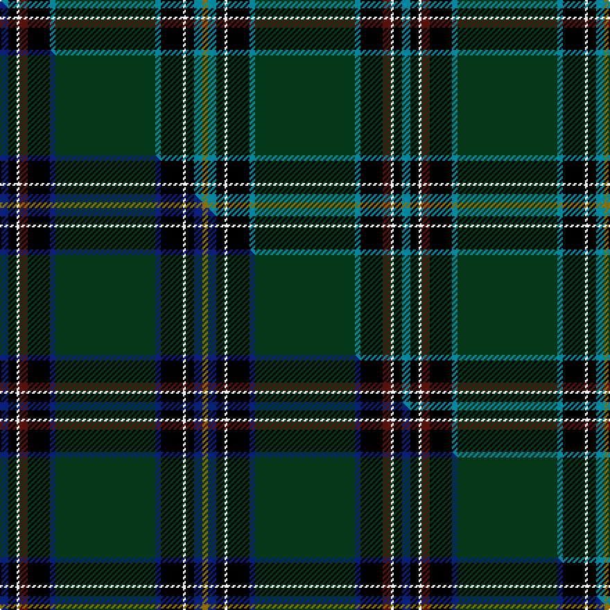

This page is one **sett** — a single exact thread-count. It belongs to the [tartan](/setts/t3k3w1dr3k8t2dg36t2k8w1k3t3y2/)
(the same proportion at any scale), whose colour order is pattern [BKWBKBGBKWKBG](/stripes/bkwbkbgbkwkbg/).

Part of the [U.S. Special Forces](/tartans/u-s-special-forces/) tartan — the named design grouping this sett with its other cloths.

Sourced from tartans-authority.  It is a [13 stripe tartan](/stripes/stripes13/).

Original link http://www.tartansauthority.com/tartan-ferret/display/6519/

## Register references

External register numbers recorded for this tartan.

- Scottish Tartans Authority (ITI): 6519

## Thread count
T/6 K6 W2 DR6 K16 T4 DG72 T4 K16 W2 K6 T6 Y/4

One full sett is **290 threads**.

## Palette
<table><thead><tr><th>Colour</th><th>Shade</th><th>OKLCh</th></tr></thead><tbody><tr><td>T</td><td><code style="background-color:#00879F;">#00879F</code> <small style="color:#888">#00879F</small></td><td><small style="color:#888">oklch(57.4% 0.102 216.1)</small></td></tr><tr><td>DG</td><td><code style="background-color:#053819;">#053819</code> <small style="color:#888">#053819</small></td><td><small style="color:#888">oklch(30.0% 0.075 151.3)</small></td></tr><tr><td>DR</td><td><code style="background-color:#55120C;">#55120C</code> <small style="color:#888">#55120C</small></td><td><small style="color:#888">oklch(30.0% 0.099 29.3)</small></td></tr><tr><td>K</td><td><code style="background-color:#000000;">#000000</code> <small style="color:#888">#000000</small></td><td><small style="color:#888">oklch(0.0% 0.000 0.0)</small></td></tr><tr><td>W</td><td><code style="background-color:#F7F7F7;">#F7F7F7</code> <small style="color:#888">#F7F7F7</small></td><td><small style="color:#888">oklch(97.6% 0.000 89.9)</small></td></tr><tr><td>Y</td><td><code style="background-color:#8B6E00;">#8B6E00</code> <small style="color:#888">#8B6E00</small></td><td><small style="color:#888">oklch(55.1% 0.113 90.4)</small></td></tr></tbody></table>

# Sample pattern

## Compared to the master

This cloth is one sett of its design; the master sett (the exemplar the design is anchored on) is below for comparison.

Its **ΔTartan distance** from the master is **0.08** — the same measure the nearest-tartans table ranks by (0 is identical; a re-scale of the same cloth is near 0, a recolour or a different proportion further).

<figure class="master-compare" style="margin:0">

this sett
master sett ★

<figcaption style="color:#888;font-size:smaller">One weave of this sett against the <a href="/setts/db3k3w1dr3k8db2dg36db2k8w1k3db3y2/">master sett ★</a>, split on the diagonal: a shared proportion runs seamlessly across it with only the shades shifting; a different proportion breaks on it.</figcaption>
</figure>

## Nearest tartan variants

The nearest existing variants by ΔTartan distance, with this cloth at the top so the swatches line up against it.

ΔTartan

Threads

Variant

Sett

—

290

<a href="/variants/s13/t3k3w1dr3k8t2dg36t2k8w1k3t3y2~x2/">U.S. Special Forces (Military)</a>

<a href="/ttd/edit/#slug=db3k3w1dr3k8db2dg36db2k8w1k3db3y2~x2&amp;base=t3k3w1dr3k8t2dg36t2k8w1k3t3y2~x2" title="compare in the TTD">0.08</a>

290

<a href="/variants/s13/db3k3w1dr3k8db2dg36db2k8w1k3db3y2~x2/">U.S. Special Forces</a>

<a href="/ttd/edit/#slug=g4dg40g4k8db4k8g5k2ly4k2dg1g2dg2k1n1~x2&amp;base=t3k3w1dr3k8t2dg36t2k8w1k3t3y2~x2" title="compare in the TTD">1.56</a>

342

<a href="/variants/s15/g4dg40g4k8db4k8g5k2ly4k2dg1g2dg2k1n1~x2/">Eastern Shore Police (Corporate)</a>

<a href="/ttd/edit/#slug=g4dg40g4k8t4k8g5k2dy4k2dg1g2dg2k1lb1~x2&amp;base=t3k3w1dr3k8t2dg36t2k8w1k3t3y2~x2" title="compare in the TTD">1.87</a>

342

<a href="/variants/s15/g4dg40g4k8t4k8g5k2dy4k2dg1g2dg2k1lb1~x2/">Eastern Shore Police Emerald So Corporate Tartan</a>

<a href="/ttd/edit/#slug=g4dg40g4k8db4k8g5k2dy4k2dg1g2dg2k1lb1~x2&amp;base=t3k3w1dr3k8t2dg36t2k8w1k3t3y2~x2" title="compare in the TTD">1.95</a>

342

<a href="/variants/s15/g4dg40g4k8db4k8g5k2dy4k2dg1g2dg2k1lb1~x2/">Eastern Shore Police Emerald Society</a>

<a href="/ttd/edit/#slug=k94db20g34w3g4w3g3ly5g5k5db7w5db5r5db12&amp;base=t3k3w1dr3k8t2dg36t2k8w1k3t3y2~x2" title="compare in the TTD">2.43</a>

314

<a href="/variants/s15/k94db20g34w3g4w3g3ly5g5k5db7w5db5r5db12/">Australian Federal Police</a>

<a href="/ttd/edit/#slug=r10db4r3db6w3db4w3db40dg73k4db2ly6&amp;base=t3k3w1dr3k8t2dg36t2k8w1k3t3y2~x2" title="compare in the TTD">2.46</a>

300

<a href="/variants/s12/r10db4r3db6w3db4w3db40dg73k4db2ly6/">Johnston, Diana Dress (Personal)</a>

<a href="/ttd/edit/#slug=dg50dgi6dg3k6g1dgi6k5lb5k18lb3g1~x2~dgi1806142-g2408144&amp;base=t3k3w1dr3k8t2dg36t2k8w1k3t3y2~x2" title="compare in the TTD">2.48</a>

314

<a href="/variants/s11/dg50dgi6dg3k6g1dgi6k5lb5k18lb3g1~x2~dgi1806142-g2408144/">Undiscovered Scotland (Corporate)</a>

<a href="/ttd/edit/#slug=k2g30k3dbi4k2db18lb1k3r2~x2~dbi1406275-db1004274&amp;base=t3k3w1dr3k8t2dg36t2k8w1k3t3y2~x2" title="compare in the TTD">2.69</a>

252

<a href="/variants/s9/k2g30k3dbi4k2db18lb1k3r2~x2~dbi1406275-db1004274/">Lusk (Personal)</a>

<a href="/ttd/edit/#slug=dg3w2dg39k3lb3k3dg3k20dgi10r2~x2~dgi1804158&amp;base=t3k3w1dr3k8t2dg36t2k8w1k3t3y2~x2" title="compare in the TTD">2.69</a>

342

<a href="/variants/s10/dg3w2dg39k3lb3k3dg3k20dgi10r2~x2~dgi1804158/">Zorra Caledonian Society (Corporate</a>

<a href="/ttd/edit/#slug=k4lr3dt49lr4k2lb5k6o10n15k1dt2~x2~o2500000-n1900000&amp;base=t3k3w1dr3k8t2dg36t2k8w1k3t3y2~x2" title="compare in the TTD">2.79</a>

392

<a href="/variants/s11/k4lr3dt49lr4k2lb5k6o10n15k1dt2~x2~o2500000-n1900000/">Misty Isle (Fashion)</a>

## Neighbour map

Every grey dot is one of 13620 variants placed by the first two principal components of the ΔTartan feature space (42% of its variance). Red is this tartan; blue dots are its nearest — click one to open its page.

<svg viewBox="0 0 640 380" role="img" style="max-width:100%;height:auto;border:1px solid #e0e0e0;border-radius:4px;display:block" xmlns="http://www.w3.org/2000/svg"><image href="/nn/cloud.v1.png" width="640" height="380"/><a href="/variants/s13/db3k3w1dr3k8db2dg36db2k8w1k3db3y2~x2/"><circle cx="273.2" cy="60.4" r="4" fill="#3465a4"><title>U.S. Special Forces</title></circle></a><a href="/variants/s15/g4dg40g4k8db4k8g5k2ly4k2dg1g2dg2k1n1~x2/"><circle cx="251.4" cy="43.4" r="4" fill="#3465a4"><title>Eastern Shore Police (Corporate)</title></circle></a><a href="/variants/s15/g4dg40g4k8t4k8g5k2dy4k2dg1g2dg2k1lb1~x2/"><circle cx="264.1" cy="47.9" r="4" fill="#3465a4"><title>Eastern Shore Police Emerald So Corporate Tartan</title></circle></a><a href="/variants/s15/g4dg40g4k8db4k8g5k2dy4k2dg1g2dg2k1lb1~x2/"><circle cx="270.0" cy="49.4" r="4" fill="#3465a4"><title>Eastern Shore Police Emerald Society</title></circle></a><a href="/variants/s15/k94db20g34w3g4w3g3ly5g5k5db7w5db5r5db12/"><circle cx="203.9" cy="37.7" r="4" fill="#3465a4"><title>Australian Federal Police</title></circle></a><a href="/variants/s12/r10db4r3db6w3db4w3db40dg73k4db2ly6/"><circle cx="266.0" cy="59.4" r="4" fill="#3465a4"><title>Johnston, Diana Dress (Personal)</title></circle></a><a href="/variants/s11/dg50dgi6dg3k6g1dgi6k5lb5k18lb3g1~x2~dgi1806142-g2408144/"><circle cx="291.5" cy="66.8" r="4" fill="#3465a4"><title>Undiscovered Scotland (Corporate)</title></circle></a><a href="/variants/s9/k2g30k3dbi4k2db18lb1k3r2~x2~dbi1406275-db1004274/"><circle cx="215.7" cy="82.4" r="4" fill="#3465a4"><title>Lusk (Personal)</title></circle></a><a href="/variants/s10/dg3w2dg39k3lb3k3dg3k20dgi10r2~x2~dgi1804158/"><circle cx="246.3" cy="97.2" r="4" fill="#3465a4"><title>Zorra Caledonian Society (Corporate</title></circle></a><a href="/variants/s11/k4lr3dt49lr4k2lb5k6o10n15k1dt2~x2~o2500000-n1900000/"><circle cx="257.8" cy="50.8" r="4" fill="#3465a4"><title>Misty Isle (Fashion)</title></circle></a><circle cx="252.9" cy="54.7" r="5" fill="#c00000"/><text x="320" y="376" text-anchor="middle" font-size="11" fill="#999">ground</text><text x="11" y="190" text-anchor="middle" font-size="11" fill="#999" transform="rotate(-90 11 190)">complexity</text></svg>

ID: /variants/s13/t3k3w1dr3k8t2dg36t2k8w1k3t3y2~x2/
