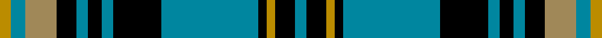

This is one **variant** — a specific cloth: this exact thread count and colourway, with its own
provenance below. It is one weaving of the [sett](/setts/t4k7lyi3k3t34k17t4k5t4k7ly11t5lyi4/) (the scale-free proportion — the
same cloth at any scale or shade), whose colour order is pattern [BKYKBKBKBKYBY](/stripes/bkykbkbkbkyby/).

Sourced from tartans-authority.  It is a [13 stripe tartan](/stripes/stripes13/).

Original link [https://www.tartanregister.gov.uk/tartanDetails.aspx?ref=8651](https://www.tartanregister.gov.uk/tartanDetails.aspx?ref=8651)

Dataset <small>— provenance for this record, inherited from the source manifest</small>

<dl class="dataset-prov">
<dt>source</dt><dd><a href="/sources/tartans-authority/">Scottish Tartans Authority</a></dd>
<dt>data captured from</dt><dd><a href="https://github.com/thetartan/tartan-database/blob/master/data/tartans-authority/data.csv">https://github.com/thetartan/tartan-database/blob/master/data/tartans-authority/data.csv</a></dd>
<dt>data date</dt><dd>April 2013 <small>(this record)</small></dd>
<dt>licence</dt><dd><a href="https://creativecommons.org/licenses/by-nc-nd/4.0/">CC BY-NC-ND 4.0</a></dd>
</dl>

Capture chain <small>— the hands this data passed through, oldest first; each capture carries its own licence</small>

<ol class="capture-chain">
<li><a href="https://www.tartansauthority.com/">Scottish Tartans Authority</a> <small>the heritage body's archive — its tartan-ferret record browser is retired (links repaired to the SRT, above)</small></li>
<li><a href="https://github.com/thetartan/tartan-database">thetartan/tartan-database</a> <small>2016-2017</small> · <a href="https://creativecommons.org/licenses/by-nc-nd/4.0/">CC BY-NC-ND 4.0</a> <small>Levko Kravets's frozen compilation — the capture we vendored, and where its CC licence text came from</small></li>
<li>this dictionary <small>captured 2026-06-10 · commit 5bf86c7566</small> <small>each re-capture is a git commit to data/sources</small></li>
</ol>

## Register references

External register numbers recorded for this tartan.

- Scottish Register of Tartans: [8651](https://www.tartanregister.gov.uk/tartanDetails?ref=8651)
- Scottish Tartans Authority (ITI): 8651

## Thread count
LYi/8 T10 LY22 K14 T8 K10 T8 K34 T68 K6 LYi6 K14 T/8

One full sett is **416 threads**.

## Palette
<table><thead><tr><th>Colour</th><th>Shade</th><th>OKLCh</th></tr></thead><tbody><tr><td>T</td><td><code style="background-color:#00879F;">#00879F</code> <small style="color:#888">#00879F</small></td><td><small style="color:#888">oklch(57.4% 0.102 216.1)</small></td></tr><tr><td>LY</td><td><code style="background-color:#BC8C00;">#BC8C00</code> <small style="color:#888">#BC8C00</small></td><td><small style="color:#888">oklch(66.8% 0.137 84.1)</small></td></tr><tr><td>K</td><td><code style="background-color:#000000;">#000000</code> <small style="color:#888">#000000</small></td><td><small style="color:#888">oklch(0.0% 0.000 0.0)</small></td></tr><tr><td>LY</td><td><code style="background-color:#A08858;">#A08858</code> <small style="color:#888">#A08858</small></td><td><small style="color:#888">oklch(63.7% 0.071 84.0)</small></td></tr></tbody></table>

# Sample pattern

## Nearest tartan variants

The nearest existing variants by ΔTartan distance, with this cloth at the top so the swatches line up against it.

ΔTartan

Threads

Variant

Sett

—

416

<a href="/variants/s13/t4k7lyi3k3t34k17t4k5t4k7ly11t5lyi4~x2~lyi2705081-ly2503076/">State Seal of Oregon (Fashion)</a>

<a href="/ttd/edit/#slug=t24k2t2k2t2k10g5dp3g5k10t11k2t4~x2&amp;base=t4k7lyi3k3t34k17t4k5t4k7ly11t5lyi4~x2~lyi2705081-ly2503076" title="compare in the TTD">1.49</a>

272

<a href="/variants/s13/t24k2t2k2t2k10g5dp3g5k10t11k2t4~x2/">Blanton</a>

<a href="/ttd/edit/#slug=k2db2g24r2g2r12g3k12db11k3db11g2r2g24db2~x2&amp;base=t4k7lyi3k3t34k17t4k5t4k7ly11t5lyi4~x2~lyi2705081-ly2503076" title="compare in the TTD">2.24</a>

448

<a href="/variants/s15/k2db2g24r2g2r12g3k12db11k3db11g2r2g24db2~x2/">MacInroy Hunting</a>

<a href="/ttd/edit/#slug=k6g3k3g28db4g4db10g4db4g4db24g5w3~x2&amp;base=t4k7lyi3k3t34k17t4k5t4k7ly11t5lyi4~x2~lyi2705081-ly2503076" title="compare in the TTD">2.26</a>

390

<a href="/variants/s13/k6g3k3g28db4g4db10g4db4g4db24g5w3~x2/">Marthas Vineyard (District)</a>

<a href="/ttd/edit/#slug=g2k1db9k7g1k1g1k1g9r1g1~x4&amp;base=t4k7lyi3k3t34k17t4k5t4k7ly11t5lyi4~x2~lyi2705081-ly2503076" title="compare in the TTD">2.27</a>

260

<a href="/variants/s11/g2k1db9k7g1k1g1k1g9r1g1~x4/">Louise</a>

<a href="/ttd/edit/#slug=g24k2db3k2db8r2~x2~db1406275&amp;base=t4k7lyi3k3t34k17t4k5t4k7ly11t5lyi4~x2~lyi2705081-ly2503076" title="compare in the TTD">2.31</a>

112

<a href="/variants/s6/g24k2db3k2db8r2~x2~db1406275/">Shaw</a>

<a href="/ttd/edit/#slug=g12k12r1k1r1k12t12r1t12k12r1k1r1k12g12k1~x4~g2203152&amp;base=t4k7lyi3k3t34k17t4k5t4k7ly11t5lyi4~x2~lyi2705081-ly2503076" title="compare in the TTD">2.31</a>

780

<a href="/variants/s16/g12k12r1k1r1k12t12r1t12k12r1k1r1k12g12k1~x4~g2203152/">Guthrie</a>

<a href="/ttd/edit/#slug=g3t36k9r3k3r3k36r3k3r3k9t36g3t2~x2~g2408144&amp;base=t4k7lyi3k3t34k17t4k5t4k7ly11t5lyi4~x2~lyi2705081-ly2503076" title="compare in the TTD">2.32</a>

598

<a href="/variants/s14/g3t36k9r3k3r3k36r3k3r3k9t36g3t2~x2~g2408144/">Home (Clans Originaux)</a>

<a href="/ttd/edit/#slug=k36w3k10w3dg28dr6k18~x2~dg1804158&amp;base=t4k7lyi3k3t34k17t4k5t4k7ly11t5lyi4~x2~lyi2705081-ly2503076" title="compare in the TTD">2.49</a>

308

<a href="/variants/s7/k36w3k10w3dg28dr6k18~x2~dg1804158/">Wild Highlanders</a>

<a href="/ttd/edit/#slug=y5lb36n5lb5n56k5n8k5n5k34y5&amp;base=t4k7lyi3k3t34k17t4k5t4k7ly11t5lyi4~x2~lyi2705081-ly2503076" title="compare in the TTD">2.49</a>

328

<a href="/variants/s11/y5lb36n5lb5n56k5n8k5n5k34y5/">Chartered Institute of Bankers in Scotland</a>

<a href="/ttd/edit/#slug=g1k1g1db10g1db1g1k4g1ly1g10k1g1k1g1~x4&amp;base=t4k7lyi3k3t34k17t4k5t4k7ly11t5lyi4~x2~lyi2705081-ly2503076" title="compare in the TTD">2.50</a>

280

<a href="/variants/s15/g1k1g1db10g1db1g1k4g1ly1g10k1g1k1g1~x4/">Glen Grant Distillery</a>

## Neighbour map

Every grey dot is one of 13621 variants placed by the first two principal components of the ΔTartan feature space (42% of its variance). Red is this tartan; blue dots are its nearest — click one to open its page.

<svg viewBox="0 0 640 380" role="img" style="max-width:100%;height:auto;border:1px solid #e0e0e0;border-radius:4px;display:block" xmlns="http://www.w3.org/2000/svg"><image href="/nn/cloud.v1.png" width="640" height="380"/><a href="/variants/s13/t24k2t2k2t2k10g5dp3g5k10t11k2t4~x2/"><circle cx="229.1" cy="148.9" r="4" fill="#3465a4"><title>Blanton</title></circle></a><a href="/variants/s15/k2db2g24r2g2r12g3k12db11k3db11g2r2g24db2~x2/"><circle cx="200.8" cy="141.8" r="4" fill="#3465a4"><title>MacInroy Hunting</title></circle></a><a href="/variants/s13/k6g3k3g28db4g4db10g4db4g4db24g5w3~x2/"><circle cx="223.4" cy="160.4" r="4" fill="#3465a4"><title>Marthas Vineyard (District)</title></circle></a><a href="/variants/s11/g2k1db9k7g1k1g1k1g9r1g1~x4/"><circle cx="175.7" cy="160.7" r="4" fill="#3465a4"><title>Louise</title></circle></a><a href="/variants/s6/g24k2db3k2db8r2~x2~db1406275/"><circle cx="224.5" cy="150.9" r="4" fill="#3465a4"><title>Shaw</title></circle></a><a href="/variants/s16/g12k12r1k1r1k12t12r1t12k12r1k1r1k12g12k1~x4~g2203152/"><circle cx="185.4" cy="142.1" r="4" fill="#3465a4"><title>Guthrie</title></circle></a><a href="/variants/s14/g3t36k9r3k3r3k36r3k3r3k9t36g3t2~x2~g2408144/"><circle cx="235.9" cy="105.7" r="4" fill="#3465a4"><title>Home (Clans Originaux)</title></circle></a><a href="/variants/s7/k36w3k10w3dg28dr6k18~x2~dg1804158/"><circle cx="206.6" cy="155.5" r="4" fill="#3465a4"><title>Wild Highlanders</title></circle></a><a href="/variants/s11/y5lb36n5lb5n56k5n8k5n5k34y5/"><circle cx="190.3" cy="142.7" r="4" fill="#3465a4"><title>Chartered Institute of Bankers in Scotland</title></circle></a><a href="/variants/s15/g1k1g1db10g1db1g1k4g1ly1g10k1g1k1g1~x4/"><circle cx="212.4" cy="132.4" r="4" fill="#3465a4"><title>Glen Grant Distillery</title></circle></a><circle cx="203.6" cy="146.6" r="5" fill="#c00000"/><text x="320" y="376" text-anchor="middle" font-size="11" fill="#999">ground</text><text x="11" y="190" text-anchor="middle" font-size="11" fill="#999" transform="rotate(-90 11 190)">complexity</text></svg>

ID: /variants/s13/t4k7lyi3k3t34k17t4k5t4k7ly11t5lyi4~x2~lyi2705081-ly2503076/
