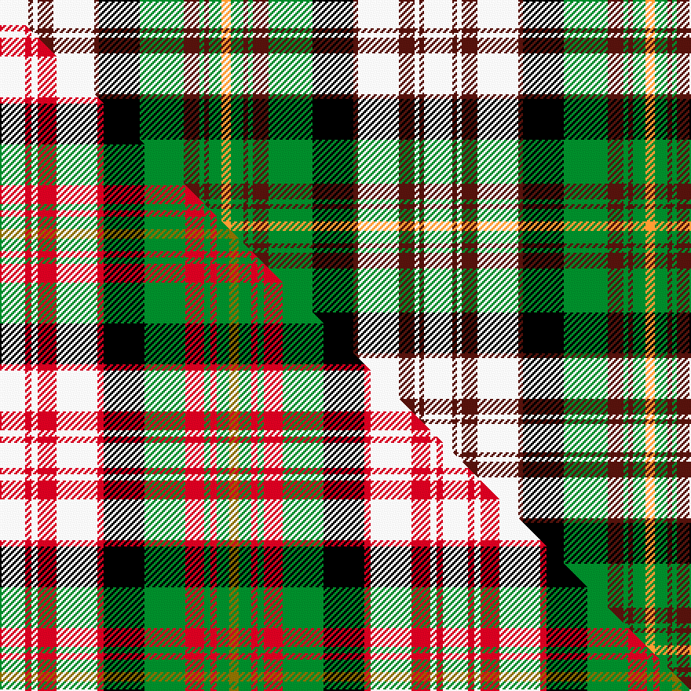

This is one **variant** — a specific cloth: this exact thread count and colourway, with its own
provenance below. It is one weaving of the [sett](/setts/w18dr3w3dr10w26dr3k26g28dr10g3dr3g8lo6/) (the scale-free proportion — the
same cloth at any scale or shade), whose colour order is pattern [WBWBWBKGBGBGY](/stripes/wbwbwbkgbgbgy/).

Part of the [Carnegie Dress](/tartans/c/ca/carnegie-dress/) tartan — the named design grouping this sett with its other cloths.

Sourced from tartans-authority.  It is a [13 stripe tartan](/stripes/stripes13/).

Original link [https://www.tartanregister.gov.uk/tartanDetails.aspx?ref=4461](https://www.tartanregister.gov.uk/tartanDetails.aspx?ref=4461)

Dataset <small>— provenance for this record, inherited from the source manifest</small>

<dl class="dataset-prov">
<dt>source</dt><dd><a href="/sources/tartans-authority/">Scottish Tartans Authority</a></dd>
<dt>data captured from</dt><dd><a href="https://github.com/thetartan/tartan-database/blob/master/data/tartans-authority/data.csv">https://github.com/thetartan/tartan-database/blob/master/data/tartans-authority/data.csv</a></dd>
<dt>data date</dt><dd>pre 2002 <small>(this record)</small></dd>
<dt>licence</dt><dd><a href="https://creativecommons.org/licenses/by-nc-nd/4.0/">CC BY-NC-ND 4.0</a></dd>
</dl>

Capture chain <small>— the hands this data passed through, oldest first; each capture carries its own licence</small>

<ol class="capture-chain">
<li><a href="https://www.tartansauthority.com/">Scottish Tartans Authority</a> <small>the heritage body's archive — its tartan-ferret record browser is retired (links repaired to the SRT, above)</small></li>
<li><a href="https://github.com/thetartan/tartan-database">thetartan/tartan-database</a> <small>2016-2017</small> · <a href="https://creativecommons.org/licenses/by-nc-nd/4.0/">CC BY-NC-ND 4.0</a> <small>Levko Kravets's frozen compilation — the capture we vendored, and where its CC licence text came from</small></li>
<li>this dictionary <small>captured 2026-06-10 · commit 5bf86c7566</small> <small>each re-capture is a git commit to data/sources</small></li>
</ol>

## Register references

External register numbers recorded for this tartan.

- Scottish Tartans Authority (ITI): 4461

## Thread count
W/18 DR3 W3 DR10 W26 DR3 K26 G28 DR10 G3 DR3 G8 LO/6

One full sett is **270 threads**.

## Palette
<table><thead><tr><th>Colour</th><th>Shade</th><th>OKLCh</th></tr></thead><tbody><tr><td>DR</td><td><code style="background-color:#55120C;">#55120C</code> <small style="color:#888">#55120C</small></td><td><small style="color:#888">oklch(30.0% 0.099 29.3)</small></td></tr><tr><td>LO</td><td><code style="background-color:#FF9C34;">#FF9C34</code> <small style="color:#888">#FF9C34</small></td><td><small style="color:#888">oklch(77.9% 0.161 61.8)</small></td></tr><tr><td>G</td><td><code style="background-color:#008B2A;">#008B2A</code> <small style="color:#888">#008B2A</small></td><td><small style="color:#888">oklch(55.4% 0.170 145.9)</small></td></tr><tr><td>K</td><td><code style="background-color:#000000;">#000000</code> <small style="color:#888">#000000</small></td><td><small style="color:#888">oklch(0.0% 0.000 0.0)</small></td></tr><tr><td>W</td><td><code style="background-color:#F7F7F7;">#F7F7F7</code> <small style="color:#888">#F7F7F7</small></td><td><small style="color:#888">oklch(97.6% 0.000 89.9)</small></td></tr></tbody></table>

# Sample pattern

## Compared to the master

This cloth is one sett of its design; the master sett (the exemplar the design is anchored on) is below for comparison.

Its **ΔTartan distance** from the master is **0.63** — the same measure the nearest-tartans table ranks by (0 is identical; a re-scale of the same cloth is near 0, a recolour or a different proportion further).

<figure class="master-compare" style="margin:0">

this sett
master sett ★

<figcaption style="color:#888;font-size:smaller">One weave of this sett against the <a href="/setts/w8r2w2r6w13r2k13g13r6g2r2g4y3/">master sett ★</a>, split on the diagonal: a shared proportion runs seamlessly across it with only the shades shifting; a different proportion breaks on it.</figcaption>
</figure>

## Nearest tartan variants

The nearest existing variants by ΔTartan distance, with this cloth at the top so the swatches line up against it.

ΔTartan

Threads

Variant

Sett

—

270

<a href="/variants/s13/w18dr3w3dr10w26dr3k26g28dr10g3dr3g8lo6/">Carnegie Dress #2 (Fashion)</a>

<a href="/ttd/edit/#slug=w8r2w2r6w13r2k13g13r6g2r2g4y3~x2&amp;base=w18dr3w3dr10w26dr3k26g28dr10g3dr3g8lo6" title="compare in the TTD">0.63</a>

282

<a href="/variants/s13/w8r2w2r6w13r2k13g13r6g2r2g4y3~x2/">Carnegie Dress Family Tartan</a>

<a href="/ttd/edit/#slug=w9r2w2r6w14r2k14g14r6g2r2g8y3~x2&amp;base=w18dr3w3dr10w26dr3k26g28dr10g3dr3g8lo6" title="compare in the TTD">0.66</a>

312

<a href="/variants/s13/w9r2w2r6w14r2k14g14r6g2r2g8y3~x2/">Valley of the Green #2</a>

<a href="/ttd/edit/#slug=k4g4k2g14k6w3k6n2w4n2w15r3~x2&amp;base=w18dr3w3dr10w26dr3k26g28dr10g3dr3g8lo6" title="compare in the TTD">1.32</a>

246

<a href="/variants/s12/k4g4k2g14k6w3k6n2w4n2w15r3~x2/">Hayama Shirt Honten, The</a>

<a href="/ttd/edit/#slug=k4g4k2g12k6w3k6n2w4n2w15r3~x2&amp;base=w18dr3w3dr10w26dr3k26g28dr10g3dr3g8lo6" title="compare in the TTD">1.44</a>

238

<a href="/variants/s12/k4g4k2g12k6w3k6n2w4n2w15r3~x2/">Hayama Shirt Honten, The</a>

<a href="/ttd/edit/#slug=g8r1g2r3g12k12dy1lb12r3lb2r1lb8~x2&amp;base=w18dr3w3dr10w26dr3k26g28dr10g3dr3g8lo6" title="compare in the TTD">1.50</a>

228

<a href="/variants/s12/g8r1g2r3g12k12dy1lb12r3lb2r1lb8~x2/">Macallan Distillery</a>

<a href="/ttd/edit/#slug=db1r1db8k3g8r1g1r1g8k3w10r1w1~x4&amp;base=w18dr3w3dr10w26dr3k26g28dr10g3dr3g8lo6" title="compare in the TTD">1.79</a>

368

<a href="/variants/s13/db1r1db8k3g8r1g1r1g8k3w10r1w1~x4/">Blair Dress Clan Tartan</a>

<a href="/ttd/edit/#slug=y5g2r2g12k9lb12r2lb2r2lb2~x2&amp;base=w18dr3w3dr10w26dr3k26g28dr10g3dr3g8lo6" title="compare in the TTD">2.08</a>

186

<a href="/variants/s10/y5g2r2g12k9lb12r2lb2r2lb2~x2/">Lobban (Personal)</a>

<a href="/ttd/edit/#slug=lo12k3g24r12g24k32w44g4w8g4&amp;base=w18dr3w3dr10w26dr3k26g28dr10g3dr3g8lo6" title="compare in the TTD">2.09</a>

318

<a href="/variants/s10/lo12k3g24r12g24k32w44g4w8g4/">Gillies Dress Green</a>

<a href="/ttd/edit/#slug=r2lb2r2lb12k9g12r2g2y5g2r2g12k9lb12r2lb2r2lb2~x2&amp;base=w18dr3w3dr10w26dr3k26g28dr10g3dr3g8lo6" title="compare in the TTD">2.21</a>

364

<a href="/variants/s18/r2lb2r2lb12k9g12r2g2y5g2r2g12k9lb12r2lb2r2lb2~x2/">Lobban (Personal)</a>

<a href="/ttd/edit/#slug=w6y2w2y3w11g11t2k12t3k6w2~x2&amp;base=w18dr3w3dr10w26dr3k26g28dr10g3dr3g8lo6" title="compare in the TTD">2.23</a>

224

<a href="/variants/s11/w6y2w2y3w11g11t2k12t3k6w2~x2/">Fitzpatrick</a>

## Neighbour map

Every grey dot is one of 13621 variants placed by the first two principal components of the ΔTartan feature space (42% of its variance). Red is this tartan; blue dots are its nearest — click one to open its page.

<svg viewBox="0 0 640 380" role="img" style="max-width:100%;height:auto;border:1px solid #e0e0e0;border-radius:4px;display:block" xmlns="http://www.w3.org/2000/svg"><image href="/nn/cloud.v1.png" width="640" height="380"/><a href="/variants/s13/w8r2w2r6w13r2k13g13r6g2r2g4y3~x2/"><circle cx="47.5" cy="170.2" r="4" fill="#3465a4"><title>Carnegie Dress Family Tartan</title></circle></a><a href="/variants/s13/w9r2w2r6w14r2k14g14r6g2r2g8y3~x2/"><circle cx="48.8" cy="169.5" r="4" fill="#3465a4"><title>Valley of the Green #2</title></circle></a><a href="/variants/s12/k4g4k2g14k6w3k6n2w4n2w15r3~x2/"><circle cx="70.5" cy="164.7" r="4" fill="#3465a4"><title>Hayama Shirt Honten, The</title></circle></a><a href="/variants/s12/k4g4k2g12k6w3k6n2w4n2w15r3~x2/"><circle cx="71.1" cy="167.1" r="4" fill="#3465a4"><title>Hayama Shirt Honten, The</title></circle></a><a href="/variants/s12/g8r1g2r3g12k12dy1lb12r3lb2r1lb8~x2/"><circle cx="105.2" cy="149.0" r="4" fill="#3465a4"><title>Macallan Distillery</title></circle></a><a href="/variants/s13/db1r1db8k3g8r1g1r1g8k3w10r1w1~x4/"><circle cx="92.6" cy="142.2" r="4" fill="#3465a4"><title>Blair Dress Clan Tartan</title></circle></a><a href="/variants/s10/y5g2r2g12k9lb12r2lb2r2lb2~x2/"><circle cx="72.0" cy="182.3" r="4" fill="#3465a4"><title>Lobban (Personal)</title></circle></a><a href="/variants/s10/lo12k3g24r12g24k32w44g4w8g4/"><circle cx="94.4" cy="149.2" r="4" fill="#3465a4"><title>Gillies Dress Green</title></circle></a><a href="/variants/s18/r2lb2r2lb12k9g12r2g2y5g2r2g12k9lb12r2lb2r2lb2~x2/"><circle cx="61.4" cy="158.2" r="4" fill="#3465a4"><title>Lobban (Personal)</title></circle></a><a href="/variants/s11/w6y2w2y3w11g11t2k12t3k6w2~x2/"><circle cx="61.3" cy="186.2" r="4" fill="#3465a4"><title>Fitzpatrick</title></circle></a><circle cx="68.4" cy="151.5" r="5" fill="#c00000"/><text x="320" y="376" text-anchor="middle" font-size="11" fill="#999">ground</text><text x="11" y="190" text-anchor="middle" font-size="11" fill="#999" transform="rotate(-90 11 190)">complexity</text></svg>

ID: /variants/s13/w18dr3w3dr10w26dr3k26g28dr10g3dr3g8lo6/
