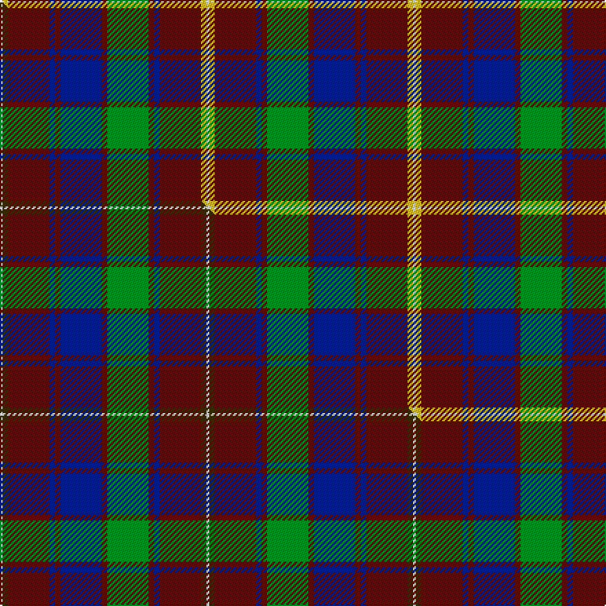

This page is one **sett** — a single exact thread-count. It belongs to the [tartan](/setts/w1ly2dr15db2dr2db15dr2g15dr2db2dr15ly2w1/)
(the same proportion at any scale), whose colour order is pattern [WYBBBBBGBBBYW](/stripes/wybbbbbgbbbyw/).

Part of the [Robbie](/tartans/robbie/) tartan — the named design grouping this sett with its other cloths.

Sourced from tartans-authority.  It is a [13 stripe tartan](/stripes/stripes13/).

Original link http://www.tartansauthority.com/tartan-ferret/display/10383/

## Register references

External register numbers recorded for this tartan.

- Scottish Register of Tartans: [10383](https://www.tartanregister.gov.uk/tartanDetails?ref=10383)
- Scottish Tartans Authority (ITI): 10383

## Thread count
W/2 LY4 DR30 DB4 DR4 DB30 DR4 G30 DR4 DB4 DR30 LY4 W/2

One full sett is **300 threads**.

## Palette
<table><thead><tr><th>Colour</th><th>Shade</th><th>OKLCh</th></tr></thead><tbody><tr><td>DB</td><td><code style="background-color:#082077;">#082077</code> <small style="color:#888">#082077</small></td><td><small style="color:#888">oklch(30.0% 0.149 265.1)</small></td></tr><tr><td>DR</td><td><code style="background-color:#55120C;">#55120C</code> <small style="color:#888">#55120C</small></td><td><small style="color:#888">oklch(30.0% 0.099 29.3)</small></td></tr><tr><td>LY</td><td><code style="background-color:#DCBC32;">#DCBC32</code> <small style="color:#888">#DCBC32</small></td><td><small style="color:#888">oklch(80.0% 0.150 95.2)</small></td></tr><tr><td>G</td><td><code style="background-color:#008B2A;">#008B2A</code> <small style="color:#888">#008B2A</small></td><td><small style="color:#888">oklch(55.4% 0.170 145.9)</small></td></tr><tr><td>W</td><td><code style="background-color:#F7F7F7;">#F7F7F7</code> <small style="color:#888">#F7F7F7</small></td><td><small style="color:#888">oklch(97.6% 0.000 89.9)</small></td></tr></tbody></table>

# Sample pattern

## Compared to the master

This cloth is one sett of its design; the master sett (the exemplar the design is anchored on) is below for comparison.

Its **ΔTartan distance** from the master is **0.06** — the same measure the nearest-tartans table ranks by (0 is identical; a re-scale of the same cloth is near 0, a recolour or a different proportion further).

<figure class="master-compare" style="margin:0">

this sett
master sett ★

<figcaption style="color:#888;font-size:smaller">One weave of this sett against the <a href="/setts/w1dy2dr15db2dr2db15dr2g15dr2db2dr15dy2w1/">master sett ★</a>, split on the diagonal: a shared proportion runs seamlessly across it with only the shades shifting; a different proportion breaks on it.</figcaption>
</figure>

## Nearest tartan variants

The nearest existing variants by ΔTartan distance, with this cloth at the top so the swatches line up against it.

ΔTartan

Threads

Variant

Sett

—

300

<a href="/variants/s13/w1ly2dr15db2dr2db15dr2g15dr2db2dr15ly2w1~x2/">Robbie (Commemorative)</a>

<a href="/ttd/edit/#slug=w1dy2dr15db2dr2db15dr2g15dr2db2dr15dy2w1~x2&amp;base=w1ly2dr15db2dr2db15dr2g15dr2db2dr15ly2w1~x2" title="compare in the TTD">0.06</a>

300

<a href="/variants/s13/w1dy2dr15db2dr2db15dr2g15dr2db2dr15dy2w1~x2/">Robbie (Stirling) (Personal)</a>

<a href="/ttd/edit/#slug=db28dr26w2db5w2dr26g28dr5w2dr5~x2&amp;base=w1ly2dr15db2dr2db15dr2g15dr2db2dr15ly2w1~x2" title="compare in the TTD">2.49</a>

450

<a href="/variants/s10/db28dr26w2db5w2dr26g28dr5w2dr5~x2/">Glenfinnan (Clan?)</a>

<a href="/ttd/edit/#slug=dr3lb2g18lo2g18dp34dr3dp3~x2&amp;base=w1ly2dr15db2dr2db15dr2g15dr2db2dr15ly2w1~x2" title="compare in the TTD">2.74</a>

320

<a href="/variants/s8/dr3lb2g18lo2g18dp34dr3dp3~x2/">Singh</a>

<a href="/ttd/edit/#slug=g4y9g3db4g3w3dr32g4y3~x2~db1208266&amp;base=w1ly2dr15db2dr2db15dr2g15dr2db2dr15ly2w1~x2" title="compare in the TTD">2.96</a>

246

<a href="/variants/s9/g4y9g3db4g3w3dr32g4y3~x2~db1208266/">Antrim County, Crest Range</a>

<a href="/ttd/edit/#slug=w4db38g6dr2g6dr38ly2dr3~x2&amp;base=w1ly2dr15db2dr2db15dr2g15dr2db2dr15ly2w1~x2" title="compare in the TTD">2.98</a>

382

<a href="/variants/s8/w4db38g6dr2g6dr38ly2dr3~x2/">21st Century (Fashion)</a>

<a href="/ttd/edit/#slug=dr5y2dr35g6dr2g6db38w4~x2&amp;base=w1ly2dr15db2dr2db15dr2g15dr2db2dr15ly2w1~x2" title="compare in the TTD">3.06</a>

374

<a href="/variants/s8/dr5y2dr35g6dr2g6db38w4~x2/">Scotland 2000</a>

<a href="/ttd/edit/#slug=g18dp3db10dbi2db10dp20g20dp3y2db2~x2~dp1607327-db0805267-dbi1307262&amp;base=w1ly2dr15db2dr2db15dr2g15dr2db2dr15ly2w1~x2" title="compare in the TTD">3.12</a>

320

<a href="/variants/s10/g18dp3db10dbi2db10dp20g20dp3y2db2~x2~dp1607327-db0805267-dbi1307262/">Glasgow Cathedral Corporate Tartan</a>

<a href="/ttd/edit/#slug=w4db38g6dr2g6dr36y2dr3~x2&amp;base=w1ly2dr15db2dr2db15dr2g15dr2db2dr15ly2w1~x2" title="compare in the TTD">3.13</a>

374

<a href="/variants/s8/w4db38g6dr2g6dr36y2dr3~x2/">Scotland 2000</a>

<a href="/ttd/edit/#slug=w3dr30dg3db3dr3dy3db8lb3dy3db3w3~x2&amp;base=w1ly2dr15db2dr2db15dr2g15dr2db2dr15ly2w1~x2" title="compare in the TTD">3.20</a>

248

<a href="/variants/s11/w3dr30dg3db3dr3dy3db8lb3dy3db3w3~x2/">Lansdowne Course, Blairgowrie Golf Club</a>

<a href="/ttd/edit/#slug=lb1dr1g1dr11db6dr1g14dr1g1lb1~x4&amp;base=w1ly2dr15db2dr2db15dr2g15dr2db2dr15ly2w1~x2" title="compare in the TTD">3.22</a>

296

<a href="/variants/s10/lb1dr1g1dr11db6dr1g14dr1g1lb1~x4/">Glen Tilt #1</a>

## Neighbour map

Every grey dot is one of 13620 variants placed by the first two principal components of the ΔTartan feature space (42% of its variance). Red is this tartan; blue dots are its nearest — click one to open its page.

<svg viewBox="0 0 640 380" role="img" style="max-width:100%;height:auto;border:1px solid #e0e0e0;border-radius:4px;display:block" xmlns="http://www.w3.org/2000/svg"><image href="/nn/cloud.v1.png" width="640" height="380"/><a href="/variants/s13/w1dy2dr15db2dr2db15dr2g15dr2db2dr15dy2w1~x2/"><circle cx="292.7" cy="163.5" r="4" fill="#3465a4"><title>Robbie (Stirling) (Personal)</title></circle></a><a href="/variants/s10/db28dr26w2db5w2dr26g28dr5w2dr5~x2/"><circle cx="293.2" cy="194.5" r="4" fill="#3465a4"><title>Glenfinnan (Clan?)</title></circle></a><a href="/variants/s8/dr3lb2g18lo2g18dp34dr3dp3~x2/"><circle cx="302.0" cy="172.0" r="4" fill="#3465a4"><title>Singh</title></circle></a><a href="/variants/s9/g4y9g3db4g3w3dr32g4y3~x2~db1208266/"><circle cx="285.9" cy="169.5" r="4" fill="#3465a4"><title>Antrim County, Crest Range</title></circle></a><a href="/variants/s8/w4db38g6dr2g6dr38ly2dr3~x2/"><circle cx="300.2" cy="158.5" r="4" fill="#3465a4"><title>21st Century (Fashion)</title></circle></a><a href="/variants/s8/dr5y2dr35g6dr2g6db38w4~x2/"><circle cx="301.9" cy="163.9" r="4" fill="#3465a4"><title>Scotland 2000</title></circle></a><a href="/variants/s10/g18dp3db10dbi2db10dp20g20dp3y2db2~x2~dp1607327-db0805267-dbi1307262/"><circle cx="225.5" cy="200.7" r="4" fill="#3465a4"><title>Glasgow Cathedral Corporate Tartan</title></circle></a><a href="/variants/s8/w4db38g6dr2g6dr36y2dr3~x2/"><circle cx="301.0" cy="161.5" r="4" fill="#3465a4"><title>Scotland 2000</title></circle></a><a href="/variants/s11/w3dr30dg3db3dr3dy3db8lb3dy3db3w3~x2/"><circle cx="262.3" cy="142.0" r="4" fill="#3465a4"><title>Lansdowne Course, Blairgowrie Golf Club</title></circle></a><a href="/variants/s10/lb1dr1g1dr11db6dr1g14dr1g1lb1~x4/"><circle cx="291.9" cy="177.9" r="4" fill="#3465a4"><title>Glen Tilt #1</title></circle></a><circle cx="270.0" cy="155.9" r="5" fill="#c00000"/><text x="320" y="376" text-anchor="middle" font-size="11" fill="#999">ground</text><text x="11" y="190" text-anchor="middle" font-size="11" fill="#999" transform="rotate(-90 11 190)">complexity</text></svg>

ID: /variants/s13/w1ly2dr15db2dr2db15dr2g15dr2db2dr15ly2w1~x2/
