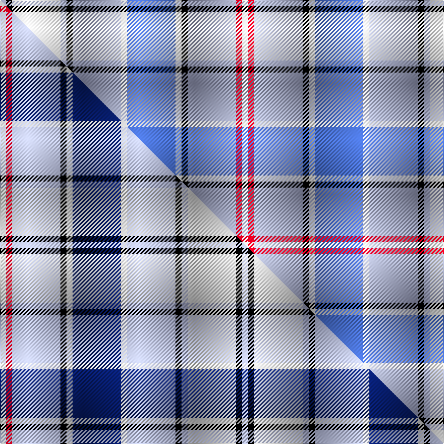

This is one **variant** — a specific cloth: this exact thread count and colourway, with its own
provenance below. It is one weaving of the [sett](/tartans/e/eu/euphoria/) (the scale-free proportion — the
same cloth at any scale or shade), whose colour order is pattern [WKWWKWWBWKWRW](/stripes/wkwwkwwbwkwrw/).

Part of the [Euphoria](/tartans/e/eu/euphoria/) tartan — the named design grouping this sett with its other cloths.

Sourced from tartans-authority.  It is a [13 stripe tartan](/stripes/stripes13/).

Original link <code>http://www.tartansauthority.com/tartan-ferret/display/7363/</code> — retired · [Internet Archive copy](https://web.archive.org/web/*/http://www.tartansauthority.com/tartan-ferret/display/7363/*)

Dataset <small>— provenance for this record, inherited from the source manifest</small>

<dl class="dataset-prov">
<dt>source</dt><dd><a href="/sources/tartans-authority/">Scottish Tartans Authority</a></dd>
<dt>data captured from</dt><dd><a href="https://github.com/thetartan/tartan-database/blob/master/data/tartans-authority/data.csv">https://github.com/thetartan/tartan-database/blob/master/data/tartans-authority/data.csv</a></dd>
<dt>data date</dt><dd>Feb. 2007 <small>(this record)</small></dd>
<dt>licence</dt><dd><a href="https://creativecommons.org/licenses/by-nc-nd/4.0/">CC BY-NC-ND 4.0</a></dd>
</dl>

Capture chain <small>— the hands this data passed through, oldest first; each capture carries its own licence</small>

<ol class="capture-chain">
<li><a href="https://www.tartansauthority.com/">Scottish Tartans Authority</a> <small>the heritage body’s archive — its tartan-ferret record browser is retired; dead record links are shown unlinked, with an Internet Archive copy (ITI numbers are not SRT references)</small></li>
<li><a href="https://github.com/thetartan/tartan-database">thetartan/tartan-database</a> <small>2016-2017</small> · <a href="https://creativecommons.org/licenses/by-nc-nd/4.0/">CC BY-NC-ND 4.0</a> <small>Levko Kravets's frozen compilation — the capture we vendored, and where its CC licence text came from</small></li>
<li>this dictionary <small>captured 2026-06-10 · commit 5bf86c7566</small> <small>each re-capture is a git commit to data/sources</small></li>
</ol>

## Register references

External register numbers recorded for this tartan.

- Scottish Tartans Authority (ITI): 7363

## Thread count
LB/6 K6 W48 LB6 K6 LB48 W6 B48 W6 K6 LB48 R6 W/6

One full sett is **480 threads**.

## Palette
<table><thead><tr><th>Colour</th><th>Shade</th><th>OKLCh</th></tr></thead><tbody><tr><td>B</td><td><code style="background-color:#466CC8;">#466CC8</code> <small style="color:#888">#466CC8</small></td><td><small style="color:#888">oklch(55.1% 0.149 265.0)</small></td></tr><tr><td>K</td><td><code style="background-color:#000000;">#000000</code> <small style="color:#888">#000000</small></td><td><small style="color:#888">oklch(0.0% 0.000 0.0)</small></td></tr><tr><td>W</td><td><code style="background-color:#F7F7F7;">#F7F7F7</code> <small style="color:#888">#F7F7F7</small></td><td><small style="color:#888">oklch(97.6% 0.000 89.9)</small></td></tr><tr><td>LB</td><td><code style="background-color:#B5BBDE;">#B5BBDE</code> <small style="color:#888">#B5BBDE</small></td><td><small style="color:#888">oklch(79.9% 0.050 277.6)</small></td></tr><tr><td>R</td><td><code style="background-color:#D60020;">#D60020</code> <small style="color:#888">#D60020</small></td><td><small style="color:#888">oklch(55.2% 0.224 25.5)</small></td></tr></tbody></table>

# Sample pattern

[Sample sheet (PDF)](swatch.pdf) — the woven sample, thread count and palette on one printable A4, rendered on demand (the same sheet the TTD print page downloads).

## Compared to the master

This cloth is one sett of its design; the master sett (the exemplar the design is anchored on) is below for comparison.

Its **ΔTartan distance** from the master is **0.10** — the same measure the nearest-tartans table ranks by (0 is identical; a re-scale of the same cloth is near 0, a recolour or a different proportion further).

<figure class="master-compare" style="margin:0">

this sett
master sett ★

<figcaption style="color:#888;font-size:smaller">One weave of this sett against the <a href="/setts/w1r1lb8k1w1db8w1lb8k1lb1w8k1lb1/">master sett ★</a>, split on the diagonal: a shared proportion runs seamlessly across it with only the shades shifting; a different proportion breaks on it.</figcaption>
</figure>

## Nearest tartan variants

The nearest existing variants by ΔTartan distance, with this cloth at the top so the swatches line up against it.

ΔTartan

Threads

Variant

Sett

—

480

<a href="/variants/s13/w1r1lb8k1w1b8w1lb8k1lb1w8k1lb1~x6/">Euphoria (Universal)</a>

<a href="/ttd/edit/#slug=w1r1lb8k1w1db8w1lb8k1lb1w8k1lb1~x6&amp;base=w1r1lb8k1w1b8w1lb8k1lb1w8k1lb1~x6" title="compare in the TTD">0.10</a>

480

<a href="/variants/s13/w1r1lb8k1w1db8w1lb8k1lb1w8k1lb1~x6/">Euphoria</a>

<a href="/ttd/edit/#slug=g4r1db8w1r1w1lb8w1lb8w1y1~x4&amp;base=w1r1lb8k1w1b8w1lb8k1lb1w8k1lb1~x6" title="compare in the TTD">2.80</a>

260

<a href="/variants/s11/g4r1db8w1r1w1lb8w1lb8w1y1~x4/">Texas Bluebonnet District Tartan</a>

<a href="/ttd/edit/#slug=w8g6w44db10lb6k3lb4k3lb34w4&amp;base=w1r1lb8k1w1b8w1lb8k1lb1w8k1lb1~x6" title="compare in the TTD">2.87</a>

232

<a href="/variants/s10/w8g6w44db10lb6k3lb4k3lb34w4/">Elsa Dance</a>

<a href="/ttd/edit/#slug=g5r1db10w1r1w1lb10w1lb10w1y1~x4&amp;base=w1r1lb8k1w1b8w1lb8k1lb1w8k1lb1~x6" title="compare in the TTD">2.94</a>

312

<a href="/variants/s11/g5r1db10w1r1w1lb10w1lb10w1y1~x4/">Texas Blue Bonnet</a>

<a href="/ttd/edit/#slug=dr2o9lb4w2n22w2lb4w22n2w8dr2~x2~o62-n47&amp;base=w1r1lb8k1w1b8w1lb8k1lb1w8k1lb1~x6" title="compare in the TTD">3.01</a>

308

<a href="/variants/s11/dr2o9lb4w2n22w2lb4w22n2w8dr2~x2~o62-n47/">MacRae Grey (Fashion)</a>

<a href="/ttd/edit/#slug=lb12k1lb1k1lb1db8w9n2~x4&amp;base=w1r1lb8k1w1b8w1lb8k1lb1w8k1lb1~x6" title="compare in the TTD">3.01</a>

224

<a href="/variants/s8/lb12k1lb1k1lb1db8w9n2~x4/">Arran - 1989 (Fashion)</a>

<a href="/ttd/edit/#slug=lb26w9k2w2lb2w2n11w8y2n2dr2~x2&amp;base=w1r1lb8k1w1b8w1lb8k1lb1w8k1lb1~x6" title="compare in the TTD">3.13</a>

216

<a href="/variants/s11/lb26w9k2w2lb2w2n11w8y2n2dr2~x2/">Manchester Blues Modern</a>

<a href="/ttd/edit/#slug=lb6k2lb24w4lb4dr2db16lb20w4lb20db16w16db3w4~x2&amp;base=w1r1lb8k1w1b8w1lb8k1lb1w8k1lb1~x6" title="compare in the TTD">3.14</a>

544

<a href="/variants/s14/lb6k2lb24w4lb4dr2db16lb20w4lb20db16w16db3w4~x2/">MacHinery Dress</a>

<a href="/ttd/edit/#slug=t14lb2ly2lb2t25k6w17r3w3r3w3r3w3r3~x2&amp;base=w1r1lb8k1w1b8w1lb8k1lb1w8k1lb1~x6" title="compare in the TTD">3.19</a>

322

<a href="/variants/s14/t14lb2ly2lb2t25k6w17r3w3r3w3r3w3r3~x2/">Letang (Personal)</a>

<a href="/ttd/edit/#slug=b14db2y2db2b25k6w17r3w3r3w3r3w3r3~x2&amp;base=w1r1lb8k1w1b8w1lb8k1lb1w8k1lb1~x6" title="compare in the TTD">3.20</a>

322

<a href="/variants/s14/b14db2y2db2b25k6w17r3w3r3w3r3w3r3~x2/">Letang Family (Neuilly sur Seine, France) (Personal)</a>

## Neighbour map

Every grey dot is one of 13662 variants placed by the first two principal components of the ΔTartan feature space (42% of its variance). Red is this tartan; blue dots are its nearest — click one to open its page. The map is a flat projection of a many-dimensional space — [how to read it](/posts/neighbourhood-maps/).

<svg viewBox="0 0 640 380" role="img" style="max-width:100%;height:auto;border:1px solid #e0e0e0;border-radius:4px;display:block" xmlns="http://www.w3.org/2000/svg"><image href="/nn/cloud.v1.png" width="640" height="380"/><a href="/variants/s13/w1r1lb8k1w1db8w1lb8k1lb1w8k1lb1~x6/"><circle cx="156.0" cy="148.3" r="4" fill="#3465a4"><title>Euphoria</title></circle></a><a href="/variants/s11/g4r1db8w1r1w1lb8w1lb8w1y1~x4/"><circle cx="168.1" cy="159.0" r="4" fill="#3465a4"><title>Texas Bluebonnet District Tartan</title></circle></a><a href="/variants/s10/w8g6w44db10lb6k3lb4k3lb34w4/"><circle cx="220.0" cy="135.5" r="4" fill="#3465a4"><title>Elsa Dance</title></circle></a><a href="/variants/s11/g5r1db10w1r1w1lb10w1lb10w1y1~x4/"><circle cx="191.0" cy="145.6" r="4" fill="#3465a4"><title>Texas Blue Bonnet</title></circle></a><a href="/variants/s11/dr2o9lb4w2n22w2lb4w22n2w8dr2~x2~o62-n47/"><circle cx="205.4" cy="161.5" r="4" fill="#3465a4"><title>MacRae Grey (Fashion)</title></circle></a><a href="/variants/s8/lb12k1lb1k1lb1db8w9n2~x4/"><circle cx="157.6" cy="157.8" r="4" fill="#3465a4"><title>Arran - 1989 (Fashion)</title></circle></a><a href="/variants/s11/lb26w9k2w2lb2w2n11w8y2n2dr2~x2/"><circle cx="190.0" cy="129.6" r="4" fill="#3465a4"><title>Manchester Blues Modern</title></circle></a><a href="/variants/s14/lb6k2lb24w4lb4dr2db16lb20w4lb20db16w16db3w4~x2/"><circle cx="212.6" cy="154.9" r="4" fill="#3465a4"><title>MacHinery Dress</title></circle></a><a href="/variants/s14/t14lb2ly2lb2t25k6w17r3w3r3w3r3w3r3~x2/"><circle cx="155.0" cy="112.9" r="4" fill="#3465a4"><title>Letang (Personal)</title></circle></a><a href="/variants/s14/b14db2y2db2b25k6w17r3w3r3w3r3w3r3~x2/"><circle cx="151.6" cy="107.5" r="4" fill="#3465a4"><title>Letang Family (Neuilly sur Seine, France) (Personal)</title></circle></a><circle cx="174.0" cy="155.2" r="5" fill="#c00000"/><text x="320" y="376" text-anchor="middle" font-size="11" fill="#999">ground</text><text x="11" y="190" text-anchor="middle" font-size="11" fill="#999" transform="rotate(-90 11 190)">complexity</text></svg>

ID: /variants/s13/w1r1lb8k1w1b8w1lb8k1lb1w8k1lb1~x6/
