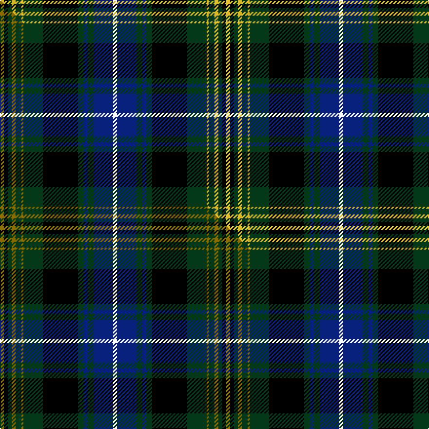

This is one **variant** — a specific cloth: this exact thread count and colourway, with its own
provenance below. It is one weaving of the [sett](/setts/w2db10dg3db2dg3k18dg10ly1dg3ly2dg2k2ly2/) (the scale-free proportion — the
same cloth at any scale or shade), whose colour order is pattern [WBGBGKGYGYGKY](/stripes/wbgbgkgygygky/).

Part of the [O'Doherty](/tartans/o/o/o-doherty/) tartan — the named design grouping this sett with its other cloths.

Sourced from tartans-authority.  It is a [13 stripe tartan](/stripes/stripes13/).

Original link [https://www.tartanregister.gov.uk/tartanDetails.aspx?ref=10566](https://www.tartanregister.gov.uk/tartanDetails.aspx?ref=10566)

Dataset <small>— provenance for this record, inherited from the source manifest</small>

<dl class="dataset-prov">
<dt>source</dt><dd><a href="/sources/tartans-authority/">Scottish Tartans Authority</a></dd>
<dt>data captured from</dt><dd><a href="https://github.com/thetartan/tartan-database/blob/master/data/tartans-authority/data.csv">https://github.com/thetartan/tartan-database/blob/master/data/tartans-authority/data.csv</a></dd>
<dt>data date</dt><dd>8th Sept. 2011 <small>(this record)</small></dd>
<dt>licence</dt><dd><a href="https://creativecommons.org/licenses/by-nc-nd/4.0/">CC BY-NC-ND 4.0</a></dd>
</dl>

Capture chain <small>— the hands this data passed through, oldest first; each capture carries its own licence</small>

<ol class="capture-chain">
<li><a href="https://www.tartansauthority.com/">Scottish Tartans Authority</a> <small>the heritage body's archive — its tartan-ferret record browser is retired (links repaired to the SRT, above)</small></li>
<li><a href="https://github.com/thetartan/tartan-database">thetartan/tartan-database</a> <small>2016-2017</small> · <a href="https://creativecommons.org/licenses/by-nc-nd/4.0/">CC BY-NC-ND 4.0</a> <small>Levko Kravets's frozen compilation — the capture we vendored, and where its CC licence text came from</small></li>
<li>this dictionary <small>captured 2026-06-10 · commit 5bf86c7566</small> <small>each re-capture is a git commit to data/sources</small></li>
</ol>

## Register references

External register numbers recorded for this tartan.

- Scottish Register of Tartans: [10566](https://www.tartanregister.gov.uk/tartanDetails?ref=10566)
- Scottish Tartans Authority (ITI): 10566

## Thread count
LY/4 K4 DG4 LY4 DG6 LY2 DG20 K36 DG6 DB4 DG6 DB20 W/4

One full sett is **232 threads**.

## Palette
<table><thead><tr><th>Colour</th><th>Shade</th><th>OKLCh</th></tr></thead><tbody><tr><td>DB</td><td><code style="background-color:#082077;">#082077</code> <small style="color:#888">#082077</small></td><td><small style="color:#888">oklch(30.0% 0.149 265.1)</small></td></tr><tr><td>DG</td><td><code style="background-color:#053819;">#053819</code> <small style="color:#888">#053819</small></td><td><small style="color:#888">oklch(30.0% 0.075 151.3)</small></td></tr><tr><td>K</td><td><code style="background-color:#000000;">#000000</code> <small style="color:#888">#000000</small></td><td><small style="color:#888">oklch(0.0% 0.000 0.0)</small></td></tr><tr><td>W</td><td><code style="background-color:#F7F7F7;">#F7F7F7</code> <small style="color:#888">#F7F7F7</small></td><td><small style="color:#888">oklch(97.6% 0.000 89.9)</small></td></tr><tr><td>LY</td><td><code style="background-color:#DCBC32;">#DCBC32</code> <small style="color:#888">#DCBC32</small></td><td><small style="color:#888">oklch(80.0% 0.150 95.2)</small></td></tr></tbody></table>

# Sample pattern

## Compared to the master

This cloth is one sett of its design; the master sett (the exemplar the design is anchored on) is below for comparison.

Its **ΔTartan distance** from the master is **0.05** — the same measure the nearest-tartans table ranks by (0 is identical; a re-scale of the same cloth is near 0, a recolour or a different proportion further).

<figure class="master-compare" style="margin:0">

this sett
master sett ★

<figcaption style="color:#888;font-size:smaller">One weave of this sett against the <a href="/setts/y2k2dg2y2dg3y1dg10k18dg3db2dg3db10w2/">master sett ★</a>, split on the diagonal: a shared proportion runs seamlessly across it with only the shades shifting; a different proportion breaks on it.</figcaption>
</figure>

## Nearest tartan variants

The nearest existing variants by ΔTartan distance, with this cloth at the top so the swatches line up against it.

ΔTartan

Threads

Variant

Sett

—

232

<a href="/variants/s13/w2db10dg3db2dg3k18dg10ly1dg3ly2dg2k2ly2~x2/">O'Doherty (Name)</a>

<a href="/ttd/edit/#slug=y2k2dg2y2dg3y1dg10k18dg3db2dg3db10w2~x2&amp;base=w2db10dg3db2dg3k18dg10ly1dg3ly2dg2k2ly2~x2" title="compare in the TTD">0.05</a>

232

<a href="/variants/s13/y2k2dg2y2dg3y1dg10k18dg3db2dg3db10w2~x2/">O'Doherty (Glasgow) (Personal)</a>

<a href="/ttd/edit/#slug=r4k2db16k16g16ly4g16k16db1k1db1k1db1k1db8r2~x2&amp;base=w2db10dg3db2dg3k18dg10ly1dg3ly2dg2k2ly2~x2" title="compare in the TTD">1.50</a>

412

<a href="/variants/s16/r4k2db16k16g16ly4g16k16db1k1db1k1db1k1db8r2~x2/">Farquharson</a>

<a href="/ttd/edit/#slug=r8db30k4db4k4db4k56g55y8g55k56db46k4r8&amp;base=w2db10dg3db2dg3k18dg10ly1dg3ly2dg2k2ly2~x2" title="compare in the TTD">1.51</a>

668

<a href="/variants/s14/r8db30k4db4k4db4k56g55y8g55k56db46k4r8/">Farquharson (Clan)</a>

<a href="/ttd/edit/#slug=db16r5db30r2k33g30r5g2r2g7w2~x2&amp;base=w2db10dg3db2dg3k18dg10ly1dg3ly2dg2k2ly2~x2" title="compare in the TTD">1.55</a>

500

<a href="/variants/s11/db16r5db30r2k33g30r5g2r2g7w2~x2/">MacDonell of Glengarry</a>

<a href="/ttd/edit/#slug=k4b1k12w1b4w1dg4w1dr4dg12k1w2~x2&amp;base=w2db10dg3db2dg3k18dg10ly1dg3ly2dg2k2ly2~x2" title="compare in the TTD">1.71</a>

176

<a href="/variants/s12/k4b1k12w1b4w1dg4w1dr4dg12k1w2~x2/">Glenfalloch</a>

<a href="/ttd/edit/#slug=db16k2db2k2db2k12g12y2k2y2g12k16db16k1w3~x2&amp;base=w2db10dg3db2dg3k18dg10ly1dg3ly2dg2k2ly2~x2" title="compare in the TTD">1.71</a>

370

<a href="/variants/s15/db16k2db2k2db2k12g12y2k2y2g12k16db16k1w3~x2/">Dyce #2</a>

<a href="/ttd/edit/#slug=lb3g3k4g14k4g3k14db18r1db4r2~x2&amp;base=w2db10dg3db2dg3k18dg10ly1dg3ly2dg2k2ly2~x2" title="compare in the TTD">1.73</a>

270

<a href="/variants/s11/lb3g3k4g14k4g3k14db18r1db4r2~x2/">Clerke of Ulva</a>

<a href="/ttd/edit/#slug=db16r5db30r2k33g30r5g2r2g7w4&amp;base=w2db10dg3db2dg3k18dg10ly1dg3ly2dg2k2ly2~x2" title="compare in the TTD">1.74</a>

252

<a href="/variants/s11/db16r5db30r2k33g30r5g2r2g7w4/">MacDonell of Glengarry #3</a>

<a href="/ttd/edit/#slug=db24k4db4k4db4k24g24r5g6k2y2~x2&amp;base=w2db10dg3db2dg3k18dg10ly1dg3ly2dg2k2ly2~x2" title="compare in the TTD">1.76</a>

360

<a href="/variants/s11/db24k4db4k4db4k24g24r5g6k2y2~x2/">Grant</a>

<a href="/ttd/edit/#slug=db20r2db2r5db30r2k32w2g30r5g4r2g4w2&amp;base=w2db10dg3db2dg3k18dg10ly1dg3ly2dg2k2ly2~x2" title="compare in the TTD">1.79</a>

262

<a href="/variants/s14/db20r2db2r5db30r2k32w2g30r5g4r2g4w2/">MacDonald of Clanranald #5</a>

## Neighbour map

Every grey dot is one of 13621 variants placed by the first two principal components of the ΔTartan feature space (42% of its variance). Red is this tartan; blue dots are its nearest — click one to open its page. The map is a flat projection of a many-dimensional space — [how to read it](/posts/neighbourhood-maps/).

<svg viewBox="0 0 640 380" role="img" style="max-width:100%;height:auto;border:1px solid #e0e0e0;border-radius:4px;display:block" xmlns="http://www.w3.org/2000/svg"><image href="/nn/cloud.v1.png" width="640" height="380"/><a href="/variants/s13/y2k2dg2y2dg3y1dg10k18dg3db2dg3db10w2~x2/"><circle cx="166.1" cy="122.4" r="4" fill="#3465a4"><title>O'Doherty (Glasgow) (Personal)</title></circle></a><a href="/variants/s16/r4k2db16k16g16ly4g16k16db1k1db1k1db1k1db8r2~x2/"><circle cx="123.9" cy="112.1" r="4" fill="#3465a4"><title>Farquharson</title></circle></a><a href="/variants/s14/r8db30k4db4k4db4k56g55y8g55k56db46k4r8/"><circle cx="132.7" cy="127.8" r="4" fill="#3465a4"><title>Farquharson (Clan)</title></circle></a><a href="/variants/s11/db16r5db30r2k33g30r5g2r2g7w2~x2/"><circle cx="136.2" cy="126.5" r="4" fill="#3465a4"><title>MacDonell of Glengarry</title></circle></a><a href="/variants/s12/k4b1k12w1b4w1dg4w1dr4dg12k1w2~x2/"><circle cx="125.5" cy="134.4" r="4" fill="#3465a4"><title>Glenfalloch</title></circle></a><a href="/variants/s15/db16k2db2k2db2k12g12y2k2y2g12k16db16k1w3~x2/"><circle cx="133.9" cy="126.6" r="4" fill="#3465a4"><title>Dyce #2</title></circle></a><a href="/variants/s11/lb3g3k4g14k4g3k14db18r1db4r2~x2/"><circle cx="125.8" cy="134.1" r="4" fill="#3465a4"><title>Clerke of Ulva</title></circle></a><a href="/variants/s11/db16r5db30r2k33g30r5g2r2g7w4/"><circle cx="127.7" cy="127.7" r="4" fill="#3465a4"><title>MacDonell of Glengarry #3</title></circle></a><a href="/variants/s11/db24k4db4k4db4k24g24r5g6k2y2~x2/"><circle cx="131.3" cy="144.1" r="4" fill="#3465a4"><title>Grant</title></circle></a><a href="/variants/s14/db20r2db2r5db30r2k32w2g30r5g4r2g4w2/"><circle cx="141.4" cy="106.9" r="4" fill="#3465a4"><title>MacDonald of Clanranald #5</title></circle></a><circle cx="148.5" cy="117.0" r="5" fill="#c00000"/><text x="320" y="376" text-anchor="middle" font-size="11" fill="#999">ground</text><text x="11" y="190" text-anchor="middle" font-size="11" fill="#999" transform="rotate(-90 11 190)">complexity</text></svg>

ID: /variants/s13/w2db10dg3db2dg3k18dg10ly1dg3ly2dg2k2ly2~x2/
