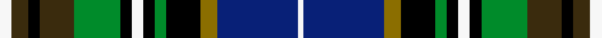
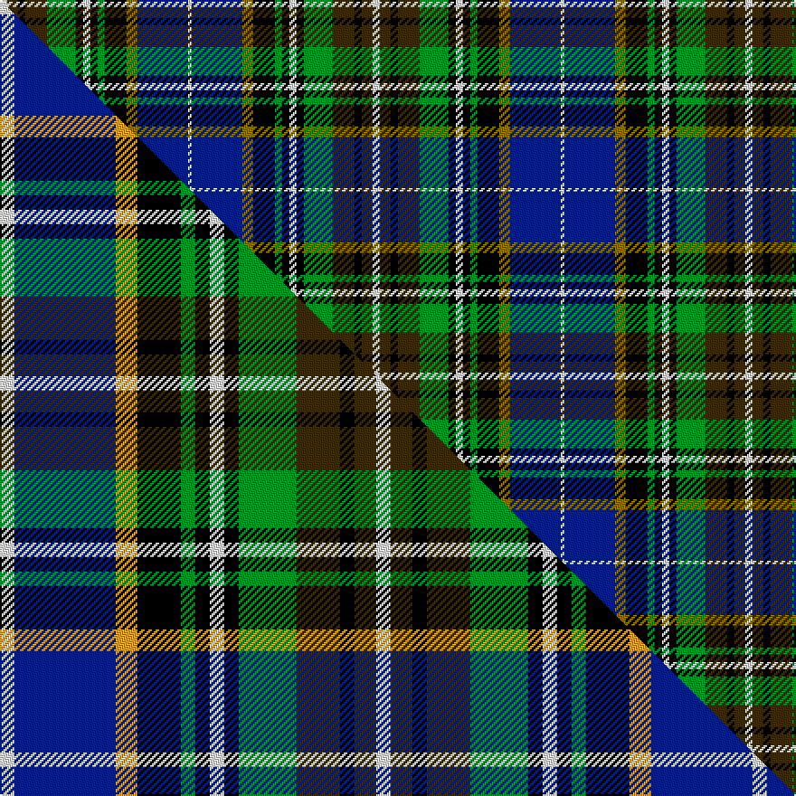

This page is one **sett** — a single exact thread-count. It belongs to the [tartan](/setts/w2dy3k2dy6g8k2w2k2g2k6y3db14w1/)
(the same proportion at any scale), whose colour order is pattern [WBGKGKWKGGKGW](/stripes/wbgkgkwkggkgw/).

Part of the [Bowling](/tartans/bowling/) tartan — the named design grouping this sett with its other cloths.

Sourced from house-of-tartan.  It is a [13 stripe tartan](/stripes/stripes13/).

Original link http://www.house-of-tartan.scotland.net/house/TartanViewjs.asp?colr=Def&tnam=1796

## Provenance

Earliest known date: 1880 This pattern was recorded by Bill Johnston, Shippak, USA in 1978 along with other patterns extracted from the 'Clan Originaux' at Pendleton Mill. This and other Irish patterns appear to have originated in the former Waterford Mill in Ireland before they arrived at Pendleton in the late 19C

## Thread count
W/4 DY6 K4 DY12 G16 K4 W4 K4 G4 K12 Y6 DB28 W/2

One full sett is **206 threads**.

## Palette
<table><thead><tr><th>Colour</th><th>Shade</th><th>OKLCh</th></tr></thead><tbody><tr><td>DB</td><td><code style="background-color:#082077;">#082077</code> <small style="color:#888">#082077</small></td><td><small style="color:#888">oklch(30.0% 0.149 265.1)</small></td></tr><tr><td>G</td><td><code style="background-color:#008B2A;">#008B2A</code> <small style="color:#888">#008B2A</small></td><td><small style="color:#888">oklch(55.4% 0.170 145.9)</small></td></tr><tr><td>K</td><td><code style="background-color:#000000;">#000000</code> <small style="color:#888">#000000</small></td><td><small style="color:#888">oklch(0.0% 0.000 0.0)</small></td></tr><tr><td>W</td><td><code style="background-color:#F7F7F7;">#F7F7F7</code> <small style="color:#888">#F7F7F7</small></td><td><small style="color:#888">oklch(97.6% 0.000 89.9)</small></td></tr><tr><td>DY</td><td><code style="background-color:#3A2B0D;">#3A2B0D</code> <small style="color:#888">#3A2B0D</small></td><td><small style="color:#888">oklch(30.0% 0.049 82.0)</small></td></tr><tr><td>Y</td><td><code style="background-color:#8B6E00;">#8B6E00</code> <small style="color:#888">#8B6E00</small></td><td><small style="color:#888">oklch(55.1% 0.113 90.4)</small></td></tr></tbody></table>

# Sample pattern

## Compared to the master

This cloth is one sett of its design; the master sett (the exemplar the design is anchored on) is below for comparison.

Its **ΔTartan distance** from the master is **1.08** — the same measure the nearest-tartans table ranks by (0 is identical; a re-scale of the same cloth is near 0, a recolour or a different proportion further).

<figure class="master-compare" style="margin:0">

this sett
master sett ★

<figcaption style="color:#888;font-size:smaller">One weave of this sett against the <a href="/setts/w2db14lo3k6g2k2w2k2g8dy6k2dy3w2/">master sett ★</a>, split on the diagonal: a shared proportion runs seamlessly across it with only the shades shifting; a different proportion breaks on it.</figcaption>
</figure>

## Nearest variants

The nearest existing variants by ΔTartan distance, with this cloth at the top so the swatches line up against it.

ΔTartan

Threads

Variant

Sett

—

206

<a href="/variants/s13/w2dy3k2dy6g8k2w2k2g2k6y3db14w1~x2/">Bowling Irish Family Tartan</a>

<a href="/ttd/edit/#slug=w2y3k2y6g8k2w2k2g2k6ly3db14w1~x2~y2405105-ly3307090&amp;base=w2dy3k2dy6g8k2w2k2g2k6y3db14w1~x2" title="compare in the TTD">0.00</a>

206

<a href="/variants/s13/w2y3k2y6g8k2w2k2g2k6ly3db14w1~x2~y2405105-ly3307090/">Bowling</a>

<a href="/ttd/edit/#slug=w2db14lo3k6g2k2w2k2g8dy6k2dy3w2~x4&amp;base=w2dy3k2dy6g8k2w2k2g2k6y3db14w1~x2" title="compare in the TTD">0.79</a>

416

<a href="/variants/s13/w2db14lo3k6g2k2w2k2g8dy6k2dy3w2~x4/">Bowling (Clan)</a>

<a href="/ttd/edit/#slug=w3db20y4k9w3k3w3k3g14dy9k3dy4w3~x2&amp;base=w2dy3k2dy6g8k2w2k2g2k6y3db14w1~x2" title="compare in the TTD">1.52</a>

312

<a href="/variants/s13/w3db20y4k9w3k3w3k3g14dy9k3dy4w3~x2/">Clodagh Cork Irish District Tartan</a>

## Neighbour map

Every grey dot is one of 13620 variants placed by the first two principal components of the ΔTartan feature space (42% of its variance). Red is this tartan; blue dots are its nearest — click one to open its page.

<svg viewBox="0 0 640 380" role="img" style="max-width:100%;height:auto;border:1px solid #e0e0e0;border-radius:4px;display:block" xmlns="http://www.w3.org/2000/svg"><image href="/nn/cloud.v1.png" width="640" height="380"/><a href="/variants/s13/w2y3k2y6g8k2w2k2g2k6ly3db14w1~x2~y2405105-ly3307090/"><circle cx="39.2" cy="124.0" r="4" fill="#3465a4"><title>Bowling</title></circle></a><a href="/variants/s13/w2db14lo3k6g2k2w2k2g8dy6k2dy3w2~x4/"><circle cx="16.1" cy="151.4" r="4" fill="#3465a4"><title>Bowling (Clan)</title></circle></a><a href="/variants/s13/w3db20y4k9w3k3w3k3g14dy9k3dy4w3~x2/"><circle cx="14.0" cy="153.7" r="4" fill="#3465a4"><title>Clodagh Cork Irish District Tartan</title></circle></a><circle cx="47.8" cy="125.6" r="5" fill="#c00000"/><text x="320" y="376" text-anchor="middle" font-size="11" fill="#999">ground</text><text x="11" y="190" text-anchor="middle" font-size="11" fill="#999" transform="rotate(-90 11 190)">complexity</text></svg>

ID: /variants/s13/w2dy3k2dy6g8k2w2k2g2k6y3db14w1~x2/
