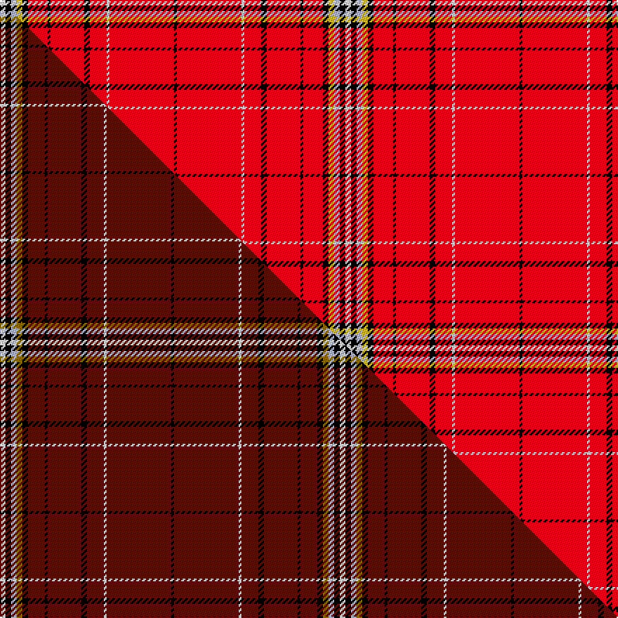

This page is one **sett** — a single exact thread-count. It belongs to the [tartan](/setts/w2k2lb2ly2k2r7k1r12k2r6w1r23k1/)
(the same proportion at any scale), whose colour order is pattern [KRWRKRKRKYWKW](/stripes/krwrkrkrkywkw/).

Part of the [Wilding, Michael John](/tartans/wilding-michael-john/) tartan — the named design grouping this sett with its other cloths.

Sourced from tartans-authority.  It is a [13 stripe tartan](/stripes/stripes13/).

Original link http://www.tartansauthority.com/tartan-ferret/display/11274/

## Register references

External register numbers recorded for this tartan.

- Scottish Register of Tartans: [11274](https://www.tartanregister.gov.uk/tartanDetails?ref=11274)
- Scottish Tartans Authority (ITI): 11274

## Thread count
W/4 K4 LB4 LY4 K4 R14 K2 R24 K4 R12 W2 R46 K/2

One full sett is **246 threads**.

## Palette
<table><thead><tr><th>Colour</th><th>Shade</th><th>OKLCh</th></tr></thead><tbody><tr><td>LB</td><td><code style="background-color:#B5BBDE;">#B5BBDE</code> <small style="color:#888">#B5BBDE</small></td><td><small style="color:#888">oklch(79.9% 0.050 277.6)</small></td></tr><tr><td>R</td><td><code style="background-color:#D60020;">#D60020</code> <small style="color:#888">#D60020</small></td><td><small style="color:#888">oklch(55.2% 0.224 25.5)</small></td></tr><tr><td>K</td><td><code style="background-color:#000000;">#000000</code> <small style="color:#888">#000000</small></td><td><small style="color:#888">oklch(0.0% 0.000 0.0)</small></td></tr><tr><td>W</td><td><code style="background-color:#F7F7F7;">#F7F7F7</code> <small style="color:#888">#F7F7F7</small></td><td><small style="color:#888">oklch(97.6% 0.000 89.9)</small></td></tr><tr><td>LY</td><td><code style="background-color:#DCBC32;">#DCBC32</code> <small style="color:#888">#DCBC32</small></td><td><small style="color:#888">oklch(80.0% 0.150 95.2)</small></td></tr></tbody></table>

# Sample pattern

## Compared to the master

This cloth is one sett of its design; the master sett (the exemplar the design is anchored on) is below for comparison.

Its **ΔTartan distance** from the master is **2.51** — the same measure the nearest-tartans table ranks by (0 is identical; a re-scale of the same cloth is near 0, a recolour or a different proportion further).

<figure class="master-compare" style="margin:0">

this sett
master sett ★

<figcaption style="color:#888;font-size:smaller">One weave of this sett against the <a href="/setts/w2k2lb2y2k2dr6k1dr12k2dr6w1dr23k1/">master sett ★</a>, split on the diagonal: a shared proportion runs seamlessly across it with only the shades shifting; a different proportion breaks on it.</figcaption>
</figure>

## Nearest tartan variants

The nearest existing variants by ΔTartan distance, with this cloth at the top so the swatches line up against it.

ΔTartan

Threads

Variant

Sett

—

246

<a href="/variants/s13/w2k2lb2ly2k2r7k1r12k2r6w1r23k1~x2/">Wilding, Michael John (Personal)</a>

<a href="/ttd/edit/#slug=r80w2r5k10r6n4r10k2n6&amp;base=w2k2lb2ly2k2r7k1r12k2r6w1r23k1~x2" title="compare in the TTD">2.08</a>

164

<a href="/variants/s9/r80w2r5k10r6n4r10k2n6/">Hampden-Sydney College</a>

<a href="/ttd/edit/#slug=k3w1r20db4r4g10r4db4r20k1w3~x2&amp;base=w2k2lb2ly2k2r7k1r12k2r6w1r23k1~x2" title="compare in the TTD">2.24</a>

284

<a href="/variants/s11/k3w1r20db4r4g10r4db4r20k1w3~x2/">Hoben (Personal)</a>

<a href="/ttd/edit/#slug=r65w1r6k8g8r6k3r11~x2&amp;base=w2k2lb2ly2k2r7k1r12k2r6w1r23k1~x2" title="compare in the TTD">2.35</a>

280

<a href="/variants/s8/r65w1r6k8g8r6k3r11~x2/">Gudbrandsdalen, Rondastakken #2</a>

<a href="/ttd/edit/#slug=r44db3k6ly2k2ly2k10r5k2r3w2~x2&amp;base=w2k2lb2ly2k2r7k1r12k2r6w1r23k1~x2" title="compare in the TTD">2.39</a>

232

<a href="/variants/s11/r44db3k6ly2k2ly2k10r5k2r3w2~x2/">Heritage Plaid</a>

<a href="/ttd/edit/#slug=r45k3y4k3r45k1dp2k1r2g8r2~x2&amp;base=w2k2lb2ly2k2r7k1r12k2r6w1r23k1~x2" title="compare in the TTD">2.66</a>

370

<a href="/variants/s11/r45k3y4k3r45k1dp2k1r2g8r2~x2/">O'Malley (Name?)</a>

<a href="/ttd/edit/#slug=r66db2k11ly4k2w4k11g2r8k2r8w2&amp;base=w2k2lb2ly2k2r7k1r12k2r6w1r23k1~x2" title="compare in the TTD">2.66</a>

176

<a href="/variants/s12/r66db2k11ly4k2w4k11g2r8k2r8w2/">Tilted Kilt (Corporate)</a>

<a href="/ttd/edit/#slug=r66db2k11y4k2w4k11g2r8k2r8w2&amp;base=w2k2lb2ly2k2r7k1r12k2r6w1r23k1~x2" title="compare in the TTD">2.66</a>

176

<a href="/variants/s12/r66db2k11y4k2w4k11g2r8k2r8w2/">TIlted Kilt</a>

<a href="/ttd/edit/#slug=k2r35db6r5db2r2db2r14w2~x2&amp;base=w2k2lb2ly2k2r7k1r12k2r6w1r23k1~x2" title="compare in the TTD">2.68</a>

272

<a href="/variants/s9/k2r35db6r5db2r2db2r14w2~x2/">Rose of Kilravock (Personal)</a>

<a href="/ttd/edit/#slug=r44db3k6o2k2o2k10r5k2r3w2~x2&amp;base=w2k2lb2ly2k2r7k1r12k2r6w1r23k1~x2" title="compare in the TTD">2.69</a>

232

<a href="/variants/s11/r44db3k6o2k2o2k10r5k2r3w2~x2/">Hilton Plaid</a>

<a href="/ttd/edit/#slug=r87db8k11y2k3w2k3g13r11k2r5w3&amp;base=w2k2lb2ly2k2r7k1r12k2r6w1r23k1~x2" title="compare in the TTD">2.69</a>

210

<a href="/variants/s12/r87db8k11y2k3w2k3g13r11k2r5w3/">Stewart/Stuart, Royal</a>

## Neighbour map

Every grey dot is one of 13620 variants placed by the first two principal components of the ΔTartan feature space (42% of its variance). Red is this tartan; blue dots are its nearest — click one to open its page.

<svg viewBox="0 0 640 380" role="img" style="max-width:100%;height:auto;border:1px solid #e0e0e0;border-radius:4px;display:block" xmlns="http://www.w3.org/2000/svg"><image href="/nn/cloud.v1.png" width="640" height="380"/><a href="/variants/s9/r80w2r5k10r6n4r10k2n6/"><circle cx="537.9" cy="60.6" r="4" fill="#3465a4"><title>Hampden-Sydney College</title></circle></a><a href="/variants/s11/k3w1r20db4r4g10r4db4r20k1w3~x2/"><circle cx="319.0" cy="105.6" r="4" fill="#3465a4"><title>Hoben (Personal)</title></circle></a><a href="/variants/s8/r65w1r6k8g8r6k3r11~x2/"><circle cx="535.2" cy="64.7" r="4" fill="#3465a4"><title>Gudbrandsdalen, Rondastakken #2</title></circle></a><a href="/variants/s11/r44db3k6ly2k2ly2k10r5k2r3w2~x2/"><circle cx="334.3" cy="57.6" r="4" fill="#3465a4"><title>Heritage Plaid</title></circle></a><a href="/variants/s11/r45k3y4k3r45k1dp2k1r2g8r2~x2/"><circle cx="525.8" cy="44.7" r="4" fill="#3465a4"><title>O'Malley (Name?)</title></circle></a><a href="/variants/s12/r66db2k11ly4k2w4k11g2r8k2r8w2/"><circle cx="350.4" cy="22.7" r="4" fill="#3465a4"><title>Tilted Kilt (Corporate)</title></circle></a><a href="/variants/s12/r66db2k11y4k2w4k11g2r8k2r8w2/"><circle cx="352.6" cy="23.3" r="4" fill="#3465a4"><title>TIlted Kilt</title></circle></a><a href="/variants/s9/k2r35db6r5db2r2db2r14w2~x2/"><circle cx="496.0" cy="109.1" r="4" fill="#3465a4"><title>Rose of Kilravock (Personal)</title></circle></a><a href="/variants/s11/r44db3k6o2k2o2k10r5k2r3w2~x2/"><circle cx="338.7" cy="58.4" r="4" fill="#3465a4"><title>Hilton Plaid</title></circle></a><a href="/variants/s12/r87db8k11y2k3w2k3g13r11k2r5w3/"><circle cx="379.1" cy="14.0" r="4" fill="#3465a4"><title>Stewart/Stuart, Royal</title></circle></a><circle cx="412.3" cy="66.9" r="5" fill="#c00000"/><text x="320" y="376" text-anchor="middle" font-size="11" fill="#999">ground</text><text x="11" y="190" text-anchor="middle" font-size="11" fill="#999" transform="rotate(-90 11 190)">complexity</text></svg>

ID: /variants/s13/w2k2lb2ly2k2r7k1r12k2r6w1r23k1~x2/
