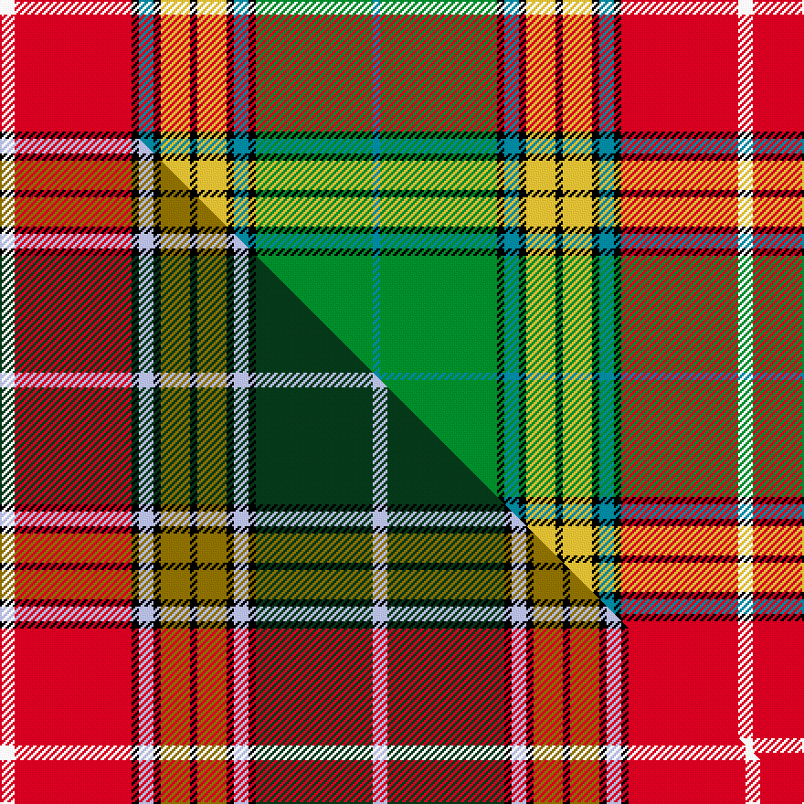

This is one **variant** — a specific cloth: this exact thread count and colourway, with its own
provenance below. It is one weaving of the [sett](/setts/w2r16k1t2k1ly4k1ly4k1t2k1g16t1/) (the scale-free proportion — the
same cloth at any scale or shade), whose colour order is pattern [BGKBKYKYKBKRW](/stripes/bgkbkykykbkrw/).

Part of the [Buchanan](/tartans/b/bu/buchanan-2/) tartan — the named design grouping this sett with its other cloths.

Sourced from logan-1831.  It is a [13 stripe tartan](/stripes/stripes13/).

Original link [/posts/logans-scottish-gael/](/posts/logans-scottish-gael/)

## Provenance

<figure class="logan-scan">

<figcaption>Logan, The Scottish Gaël (1831), vol. II p. 402 — page-scan crop (379,1555)–(634,2101)</figcaption>
</figure>

James Logan recorded the **Buchanan** sett in 1831, on page 402 of the *Table of Clan Tartans* in *The Scottish Gaël* — the earliest systematic published collection of clan setts. Logan gives the stripe widths in eighths of an inch, measured across the cloth and reflected about each end (a half-sett):

> ½ azure · 8 green · ½ black · 1 azure · ½ black · 2 yellow · ½ black · 2 yellow · ½ black · 1 azure · ½ black · 8 red · 1 white

Rendered at 8 threads to the eighth-inch that is `A/4 G64 K4 A8 K4 Y16 K4 Y16 K4 A8 K4 R64 W/8` — the eighths are the captured data, and the threadcount is derived from them at that stated factor. How many threads an eighth of cloth held depends on the weave's density, so the factor is a display calibration, not Logan's count; the sett's identity lives in the proportions, which the eighths record directly. Logan named his colours rather than dyeing to a standard, so the palette here is the Dictionary's modern reading of his names.

See [Logan's Scottish Gaël](/posts/logans-scottish-gael/) for the full table and method.

## Related setts

Later records of the **Buchanan** name adjusted Logan's counts: [Buchanan](/variants/s18/g23k3db9k3r20w3r20k3db9k3y20k3y20k3db9k3g23db9~x2/); [Buchanan #2](/variants/s13/w3r31k2lb4k2y8k2y8k2lb4k2g31lb3~x2/); [Buchanan #3](/variants/s13/w2r12k1lb2k1y3k1y3k1lb2k1g12lb2~x2/); [Buchanan #4](/variants/s13/w4r25k2lb4k2y8k3y8k2lb4k2g25lb4~x2/). Compare their thread counts with Logan's above.

Dataset <small>— provenance for this record, inherited from the source manifest</small>

<dl class="dataset-prov">
<dt>source</dt><dd><a href="/sources/logan-1831/">Logan, The Scottish Gaël (1831)</a></dd>
<dt>data captured from</dt><dd><a href="https://archive.org/details/scotishgalorcel02logagoog">https://archive.org/details/scotishgalorcel02logagoog</a></dd>
<dt>data date</dt><dd>1831 <small>(this record)</small></dd>
<dt>licence</dt><dd>Public domain</dd>
</dl>

Capture chain <small>— the hands this data passed through, oldest first; each capture carries its own licence</small>

<ol class="capture-chain">
<li>James Logan, The Scottish Gaël (first edition) <small>1831</small> · Public domain <small>the printed Table of Clan Tartans, vol. II pp. 401-408, plus the Duke of Sussex plate</small></li>
<li><a href="https://archive.org/details/scotishgalorcel02logagoog">Internet Archive scan</a> <small>the digitised first edition the transcription was made from, cross-checked against the OCR</small></li>
<li><a href="/posts/logans-scottish-gael/">Tartan Dictionary transcription — Logan's Scottish Gaël</a> <small>2026-06</small> · <a href="https://creativecommons.org/licenses/by-sa/4.0/">CC BY-SA 4.0</a> <small>by-eye transcription of the Table of Clan Tartans and the Duke of Sussex plate — depths in eighths of an inch, rendered at 8 threads per eighth (a display calibration anchored by the Register's Abercrombie ×8 stripe-for-stripe match); method and match report in the linked post</small></li>
<li>this dictionary <small>each re-capture is a git commit to data/sources</small></li>
</ol>

## Thread count
W/8 R64 K4 T8 K4 LY16 K4 LY16 K4 T8 K4 G64 T/4

One full sett is **404 threads**.

## Palette
<table><thead><tr><th>Colour</th><th>Shade</th><th>OKLCh</th></tr></thead><tbody><tr><td>T</td><td><code style="background-color:#00879F;">#00879F</code> <small style="color:#888">#00879F</small></td><td><small style="color:#888">oklch(57.4% 0.102 216.1)</small></td></tr><tr><td>G</td><td><code style="background-color:#008B2A;">#008B2A</code> <small style="color:#888">#008B2A</small></td><td><small style="color:#888">oklch(55.4% 0.170 145.9)</small></td></tr><tr><td>K</td><td><code style="background-color:#000000;">#000000</code> <small style="color:#888">#000000</small></td><td><small style="color:#888">oklch(0.0% 0.000 0.0)</small></td></tr><tr><td>W</td><td><code style="background-color:#F7F7F7;">#F7F7F7</code> <small style="color:#888">#F7F7F7</small></td><td><small style="color:#888">oklch(97.6% 0.000 89.9)</small></td></tr><tr><td>R</td><td><code style="background-color:#D60020;">#D60020</code> <small style="color:#888">#D60020</small></td><td><small style="color:#888">oklch(55.2% 0.224 25.5)</small></td></tr><tr><td>LY</td><td><code style="background-color:#DCBC32;">#DCBC32</code> <small style="color:#888">#DCBC32</small></td><td><small style="color:#888">oklch(80.0% 0.150 95.2)</small></td></tr></tbody></table>

# Sample pattern

## Compared to the master

This cloth is one sett of its design; the master sett (the exemplar the design is anchored on) is below for comparison.

Its **ΔTartan distance** from the master is **0.22** — the same measure the nearest-tartans table ranks by (0 is identical; a re-scale of the same cloth is near 0, a recolour or a different proportion further).

<figure class="master-compare" style="margin:0">

this sett
master sett ★

<figcaption style="color:#888;font-size:smaller">One weave of this sett against the <a href="/setts/w2r16k1lb2k1y4k1y4k1lb2k1dg16lb2/">master sett ★</a>, split on the diagonal: a shared proportion runs seamlessly across it with only the shades shifting; a different proportion breaks on it.</figcaption>
</figure>

## Nearest tartan variants

The nearest existing variants by ΔTartan distance, with this cloth at the top so the swatches line up against it.

ΔTartan

Threads

Variant

Sett

—

404

<a href="/variants/s13/w2r16k1t2k1ly4k1ly4k1t2k1g16t1~x4/">Buchanan</a>

<a href="/ttd/edit/#slug=w2r16k1lb2k1y4k1y4k1lb2k1g16lb2~x2&amp;base=w2r16k1t2k1ly4k1ly4k1t2k1g16t1~x4" title="compare in the TTD">0.14</a>

204

<a href="/variants/s13/w2r16k1lb2k1y4k1y4k1lb2k1g16lb2~x2/">Buchanan D</a>

<a href="/ttd/edit/#slug=w3r31k2lb4k2y8k2y8k2lb4k2g31lb3~x2&amp;base=w2r16k1t2k1ly4k1ly4k1t2k1g16t1~x4" title="compare in the TTD">0.17</a>

396

<a href="/variants/s13/w3r31k2lb4k2y8k2y8k2lb4k2g31lb3~x2/">Buchanan #2</a>

<a href="/ttd/edit/#slug=w2r16k1lb2k1y4k1y4k1lb2k1dg16lb2~x4&amp;base=w2r16k1t2k1ly4k1ly4k1t2k1g16t1~x4" title="compare in the TTD">0.22</a>

408

<a href="/variants/s13/w2r16k1lb2k1y4k1y4k1lb2k1dg16lb2~x4/">Buchanan (Logan)</a>

<a href="/ttd/edit/#slug=w4r25k2lb4k2y8k3y8k2lb4k2g25lb4~x2&amp;base=w2r16k1t2k1ly4k1ly4k1t2k1g16t1~x4" title="compare in the TTD">0.31</a>

356

<a href="/variants/s13/w4r25k2lb4k2y8k3y8k2lb4k2g25lb4~x2/">Buchanan Clan Tartan</a>

<a href="/ttd/edit/#slug=w2r12k1lb2k1y3k1y3k1lb2k1g12lb2~x2&amp;base=w2r16k1t2k1ly4k1ly4k1t2k1g16t1~x4" title="compare in the TTD">0.35</a>

164

<a href="/variants/s13/w2r12k1lb2k1y3k1y3k1lb2k1g12lb2~x2/">Buchanan #3</a>

<a href="/ttd/edit/#slug=w2r16k1lb2k1y4k1lb2k1g16lb1~x4&amp;base=w2r16k1t2k1ly4k1ly4k1t2k1g16t1~x4" title="compare in the TTD">1.30</a>

364

<a href="/variants/s11/w2r16k1lb2k1y4k1lb2k1g16lb1~x4/">Baxter (Clan)</a>

<a href="/ttd/edit/#slug=w2r16k1lb2k1y4k1lb2k1g16lb1~x2&amp;base=w2r16k1t2k1ly4k1ly4k1t2k1g16t1~x4" title="compare in the TTD">1.30</a>

182

<a href="/variants/s11/w2r16k1lb2k1y4k1lb2k1g16lb1~x2/">Baxter of Balgavies</a>

<a href="/ttd/edit/#slug=w2r16k1t2k1ly4k1t2k1dg16t1~x4&amp;base=w2r16k1t2k1ly4k1ly4k1t2k1g16t1~x4" title="compare in the TTD">1.30</a>

364

<a href="/variants/s11/w2r16k1t2k1ly4k1t2k1dg16t1~x4/">Baxter of Balgavies</a>

<a href="/ttd/edit/#slug=dg1r16w1db2w2ly4w2ly4w2db2w1dg16lb1~x4&amp;base=w2r16k1t2k1ly4k1ly4k1t2k1g16t1~x4" title="compare in the TTD">1.41</a>

424

<a href="/variants/s13/dg1r16w1db2w2ly4w2ly4w2db2w1dg16lb1~x4/">Gibbs/Gibson (Name)</a>

<a href="/ttd/edit/#slug=t2g16k1t2k1lo4k1lo4k1t2k1dr16w2~x4&amp;base=w2r16k1t2k1ly4k1ly4k1t2k1g16t1~x4" title="compare in the TTD">2.03</a>

408

<a href="/variants/s13/t2g16k1t2k1lo4k1lo4k1t2k1dr16w2~x4/">Baxter</a>

## Neighbour map

Every grey dot is one of 13656 variants placed by the first two principal components of the ΔTartan feature space (42% of its variance). Red is this tartan; blue dots are its nearest — click one to open its page. The map is a flat projection of a many-dimensional space — [how to read it](/posts/neighbourhood-maps/).

<svg viewBox="0 0 640 380" role="img" style="max-width:100%;height:auto;border:1px solid #e0e0e0;border-radius:4px;display:block" xmlns="http://www.w3.org/2000/svg"><image href="/nn/cloud.v1.png" width="640" height="380"/><a href="/variants/s13/w2r16k1lb2k1y4k1y4k1lb2k1g16lb2~x2/"><circle cx="116.6" cy="93.7" r="4" fill="#3465a4"><title>Buchanan D</title></circle></a><a href="/variants/s13/w3r31k2lb4k2y8k2y8k2lb4k2g31lb3~x2/"><circle cx="118.7" cy="94.3" r="4" fill="#3465a4"><title>Buchanan #2</title></circle></a><a href="/variants/s13/w2r16k1lb2k1y4k1y4k1lb2k1dg16lb2~x4/"><circle cx="112.4" cy="88.7" r="4" fill="#3465a4"><title>Buchanan (Logan)</title></circle></a><a href="/variants/s13/w4r25k2lb4k2y8k3y8k2lb4k2g25lb4~x2/"><circle cx="77.1" cy="112.2" r="4" fill="#3465a4"><title>Buchanan Clan Tartan</title></circle></a><a href="/variants/s13/w2r12k1lb2k1y3k1y3k1lb2k1g12lb2~x2/"><circle cx="80.9" cy="110.1" r="4" fill="#3465a4"><title>Buchanan #3</title></circle></a><a href="/variants/s11/w2r16k1lb2k1y4k1lb2k1g16lb1~x4/"><circle cx="143.4" cy="96.3" r="4" fill="#3465a4"><title>Baxter (Clan)</title></circle></a><a href="/variants/s11/w2r16k1lb2k1y4k1lb2k1g16lb1~x2/"><circle cx="143.4" cy="96.3" r="4" fill="#3465a4"><title>Baxter of Balgavies</title></circle></a><a href="/variants/s11/w2r16k1t2k1ly4k1t2k1dg16t1~x4/"><circle cx="137.4" cy="91.5" r="4" fill="#3465a4"><title>Baxter of Balgavies</title></circle></a><a href="/variants/s13/dg1r16w1db2w2ly4w2ly4w2db2w1dg16lb1~x4/"><circle cx="132.3" cy="104.3" r="4" fill="#3465a4"><title>Gibbs/Gibson (Name)</title></circle></a><a href="/variants/s13/t2g16k1t2k1lo4k1lo4k1t2k1dr16w2~x4/"><circle cx="108.5" cy="95.1" r="4" fill="#3465a4"><title>Baxter</title></circle></a><circle cx="114.2" cy="90.4" r="5" fill="#c00000"/><text x="320" y="376" text-anchor="middle" font-size="11" fill="#999">ground</text><text x="11" y="190" text-anchor="middle" font-size="11" fill="#999" transform="rotate(-90 11 190)">complexity</text></svg>

ID: /variants/s13/w2r16k1t2k1ly4k1ly4k1t2k1g16t1~x4/
