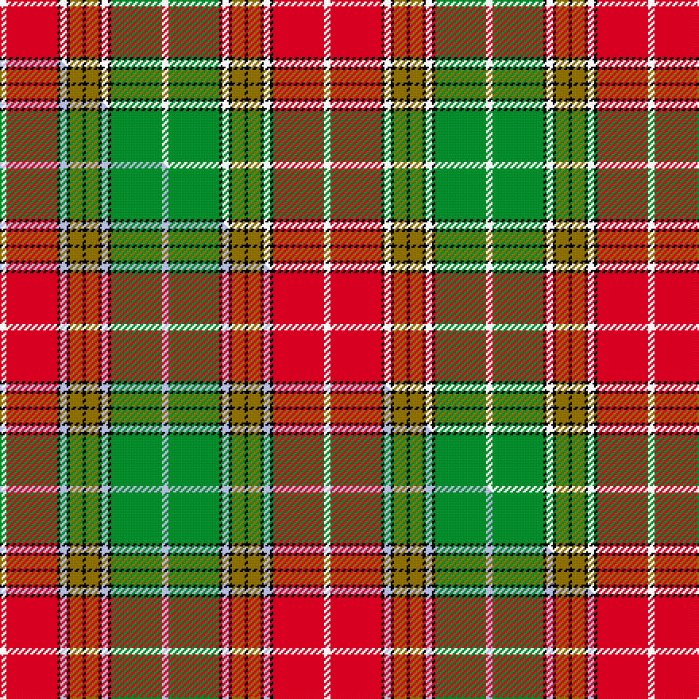

This page is one **sett** — a single exact thread-count. It belongs to the [tartan](/setts/w2r16k1w2k1y4k1y4k1w2k1g16w2/)
(the same proportion at any scale), whose colour order is pattern [WGKWKGKGKWKRW](/stripes/wgkwkgkgkwkrw/).

Part of the [Buchanan D](/tartans/buchanan-d/) tartan — the named design grouping this sett with its other cloths.

Sourced from weddslist.  It is a [13 stripe tartan](/stripes/stripes13/).

Original link http://www.weddslist.com/cgi-bin/tartans/pg.pl?source=rb

2 attestations — the source records this cloth was collapsed from (oldest owns this page)

<ul>
<li>undated — Buchanan D (weddslist, <a href="http://www.weddslist.com/cgi-bin/tartans/pg.pl?source=rb">record</a>) </li>
<li>undated — Buchanan D1 (weddslist, <a href="http://www.weddslist.com/cgi-bin/tartans/pg.pl?source=rb">record</a>) </li>
</ul>

## Thread count
W/4 R32 K2 W4 K2 Y8 K2 Y8 K2 W4 K2 G32 W/4

One full sett is **204 threads**.

## Palette
<table><thead><tr><th>Colour</th><th>Shade</th><th>OKLCh</th></tr></thead><tbody><tr><td>G</td><td><code style="background-color:#008B2A;">#008B2A</code> <small style="color:#888">#008B2A</small></td><td><small style="color:#888">oklch(55.4% 0.170 145.9)</small></td></tr><tr><td>K</td><td><code style="background-color:#000000;">#000000</code> <small style="color:#888">#000000</small></td><td><small style="color:#888">oklch(0.0% 0.000 0.0)</small></td></tr><tr><td>W</td><td><code style="background-color:#F7F7F7;">#F7F7F7</code> <small style="color:#888">#F7F7F7</small></td><td><small style="color:#888">oklch(97.6% 0.000 89.9)</small></td></tr><tr><td>R</td><td><code style="background-color:#D60020;">#D60020</code> <small style="color:#888">#D60020</small></td><td><small style="color:#888">oklch(55.2% 0.224 25.5)</small></td></tr><tr><td>Y</td><td><code style="background-color:#8B6E00;">#8B6E00</code> <small style="color:#888">#8B6E00</small></td><td><small style="color:#888">oklch(55.1% 0.113 90.4)</small></td></tr></tbody></table>

# Sample pattern

## Compared to the master

This cloth is one sett of its design; the master sett (the exemplar the design is anchored on) is below for comparison.

Its **ΔTartan distance** from the master is **2.48** — the same measure the nearest-tartans table ranks by (0 is identical; a re-scale of the same cloth is near 0, a recolour or a different proportion further).

<figure class="master-compare" style="margin:0">

this sett
master sett ★

<figcaption style="color:#888;font-size:smaller">One weave of this sett against the <a href="/setts/w2r16k1lb2k1y4k1y4k1lb2k1g16lb2/">master sett ★</a>, split on the diagonal: a shared proportion runs seamlessly across it with only the shades shifting; a different proportion breaks on it.</figcaption>
</figure>

## Nearest tartan variants

The nearest existing variants by ΔTartan distance, with this cloth at the top so the swatches line up against it.

ΔTartan

Threads

Variant

Sett

—

204

<a href="/variants/s13/w2r16k1w2k1y4k1y4k1w2k1g16w2~x2/">Buchanan D</a>

<a href="/ttd/edit/#slug=w2r16k1lb2k1y4k1lb2k1g16lb1~x4&amp;base=w2r16k1w2k1y4k1y4k1w2k1g16w2~x2" title="compare in the TTD">2.20</a>

364

<a href="/variants/s11/w2r16k1lb2k1y4k1lb2k1g16lb1~x4/">Baxter (Clan)</a>

<a href="/ttd/edit/#slug=w2r16k1lb2k1y4k1lb2k1g16lb1~x2&amp;base=w2r16k1w2k1y4k1y4k1w2k1g16w2~x2" title="compare in the TTD">2.20</a>

182

<a href="/variants/s11/w2r16k1lb2k1y4k1lb2k1g16lb1~x2/">Baxter of Balgavies</a>

<a href="/ttd/edit/#slug=w2r16k1t2k1ly4k1ly4k1t2k1g16t1~x4&amp;base=w2r16k1w2k1y4k1y4k1w2k1g16w2~x2" title="compare in the TTD">2.44</a>

404

<a href="/variants/s13/w2r16k1t2k1ly4k1ly4k1t2k1g16t1~x4/">Buchanan</a>

<a href="/ttd/edit/#slug=w2r16k1lb2k1y4k1y4k1lb2k1g16lb2~x2&amp;base=w2r16k1w2k1y4k1y4k1w2k1g16w2~x2" title="compare in the TTD">2.48</a>

204

<a href="/variants/s13/w2r16k1lb2k1y4k1y4k1lb2k1g16lb2~x2/">Buchanan D</a>

<a href="/ttd/edit/#slug=w3r31k2lb4k2y8k2y8k2lb4k2g31lb3~x2&amp;base=w2r16k1w2k1y4k1y4k1w2k1g16w2~x2" title="compare in the TTD">2.48</a>

396

<a href="/variants/s13/w3r31k2lb4k2y8k2y8k2lb4k2g31lb3~x2/">Buchanan #2</a>

<a href="/ttd/edit/#slug=w2r12k1lb2k1y3k1y3k1lb2k1g12lb2~x2&amp;base=w2r16k1w2k1y4k1y4k1w2k1g16w2~x2" title="compare in the TTD">2.61</a>

164

<a href="/variants/s13/w2r12k1lb2k1y3k1y3k1lb2k1g12lb2~x2/">Buchanan #3</a>

<a href="/ttd/edit/#slug=w4r25k2lb4k2y8k3y8k2lb4k2g25lb4~x2&amp;base=w2r16k1w2k1y4k1y4k1w2k1g16w2~x2" title="compare in the TTD">2.68</a>

356

<a href="/variants/s13/w4r25k2lb4k2y8k3y8k2lb4k2g25lb4~x2/">Buchanan #4</a>

<a href="/ttd/edit/#slug=dgi3r15dg2r2dg2r2dg18ly2dg2ly2dg2ly27k2ly2k6lo2~x2~dgi1703114-lo3007057&amp;base=w2r16k1w2k1y4k1y4k1w2k1g16w2~x2" title="compare in the TTD">2.73</a>

354

<a href="/variants/s16/dgi3r15dg2r2dg2r2dg18ly2dg2ly2dg2ly27k2ly2k6lo2~x2~dgi1703114-lo3007057/">Strathmore</a>

<a href="/ttd/edit/#slug=r24k8dg12k1g2k1dg12k8w3g2w14g1w2~x2~dg1806142-g2508144&amp;base=w2r16k1w2k1y4k1y4k1w2k1g16w2~x2" title="compare in the TTD">2.75</a>

308

<a href="/variants/s13/r24k8dg12k1g2k1dg12k8w3g2w14g1w2~x2~dg1806142-g2508144/">Hohenzollern Staff (Personal)</a>

<a href="/ttd/edit/#slug=r24k8dg12k1g2k1dg12k8w3g2w14g1w2~x2~r2109032-dg1806142-g2508144&amp;base=w2r16k1w2k1y4k1y4k1w2k1g16w2~x2" title="compare in the TTD">2.77</a>

308

<a href="/variants/s13/r24k8dg12k1g2k1dg12k8w3g2w14g1w2~x2~r2109032-dg1806142-g2508144/">Hohenzollern Staff</a>

## Neighbour map

Every grey dot is one of 13620 variants placed by the first two principal components of the ΔTartan feature space (42% of its variance). Red is this tartan; blue dots are its nearest — click one to open its page.

<svg viewBox="0 0 640 380" role="img" style="max-width:100%;height:auto;border:1px solid #e0e0e0;border-radius:4px;display:block" xmlns="http://www.w3.org/2000/svg"><image href="/nn/cloud.v1.png" width="640" height="380"/><a href="/variants/s11/w2r16k1lb2k1y4k1lb2k1g16lb1~x4/"><circle cx="143.3" cy="96.6" r="4" fill="#3465a4"><title>Baxter (Clan)</title></circle></a><a href="/variants/s11/w2r16k1lb2k1y4k1lb2k1g16lb1~x2/"><circle cx="143.3" cy="96.6" r="4" fill="#3465a4"><title>Baxter of Balgavies</title></circle></a><a href="/variants/s13/w2r16k1t2k1ly4k1ly4k1t2k1g16t1~x4/"><circle cx="114.1" cy="90.6" r="4" fill="#3465a4"><title>Buchanan</title></circle></a><a href="/variants/s13/w2r16k1lb2k1y4k1y4k1lb2k1g16lb2~x2/"><circle cx="116.5" cy="93.9" r="4" fill="#3465a4"><title>Buchanan D</title></circle></a><a href="/variants/s13/w3r31k2lb4k2y8k2y8k2lb4k2g31lb3~x2/"><circle cx="118.6" cy="94.5" r="4" fill="#3465a4"><title>Buchanan #2</title></circle></a><a href="/variants/s13/w2r12k1lb2k1y3k1y3k1lb2k1g12lb2~x2/"><circle cx="80.8" cy="110.4" r="4" fill="#3465a4"><title>Buchanan #3</title></circle></a><a href="/variants/s13/w4r25k2lb4k2y8k3y8k2lb4k2g25lb4~x2/"><circle cx="77.0" cy="112.4" r="4" fill="#3465a4"><title>Buchanan #4</title></circle></a><a href="/variants/s16/dgi3r15dg2r2dg2r2dg18ly2dg2ly2dg2ly27k2ly2k6lo2~x2~dgi1703114-lo3007057/"><circle cx="129.7" cy="89.1" r="4" fill="#3465a4"><title>Strathmore</title></circle></a><a href="/variants/s13/r24k8dg12k1g2k1dg12k8w3g2w14g1w2~x2~dg1806142-g2508144/"><circle cx="90.1" cy="102.8" r="4" fill="#3465a4"><title>Hohenzollern Staff (Personal)</title></circle></a><a href="/variants/s13/r24k8dg12k1g2k1dg12k8w3g2w14g1w2~x2~r2109032-dg1806142-g2508144/"><circle cx="90.3" cy="103.2" r="4" fill="#3465a4"><title>Hohenzollern Staff</title></circle></a><circle cx="124.9" cy="103.9" r="5" fill="#c00000"/><text x="320" y="376" text-anchor="middle" font-size="11" fill="#999">ground</text><text x="11" y="190" text-anchor="middle" font-size="11" fill="#999" transform="rotate(-90 11 190)">complexity</text></svg>

ID: /variants/s13/w2r16k1w2k1y4k1y4k1w2k1g16w2~x2/
