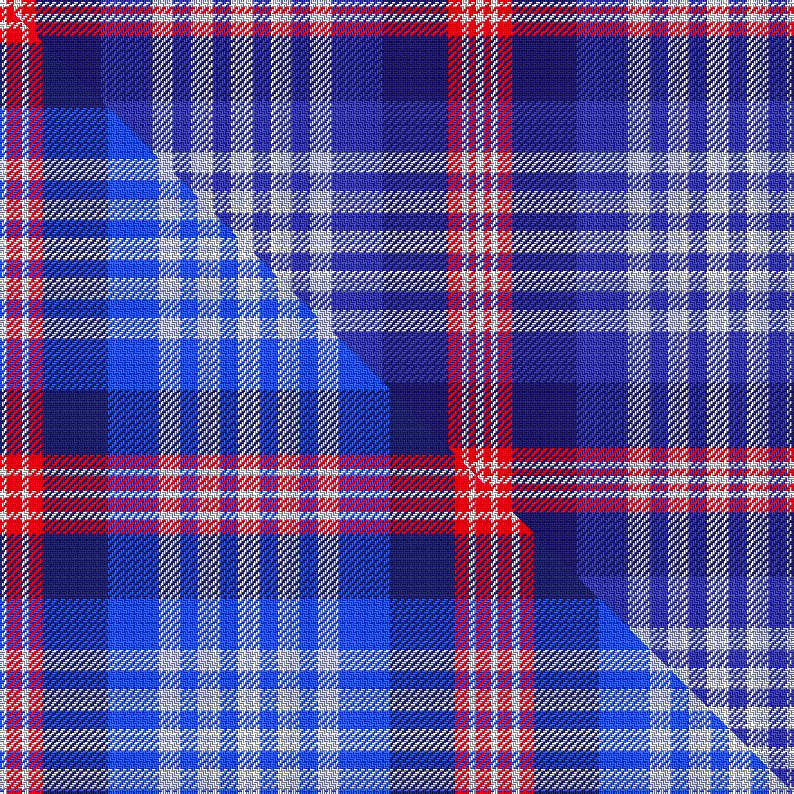

This is one **variant** — a specific cloth: this exact thread count and colourway, with its own
provenance below. It is one weaving of the [sett](/tartans/d/da/daughters-of-the-american-revolution/) (the scale-free proportion — the
same cloth at any scale or shade), whose colour order is pattern [WRWRBBWBWWBWW](/stripes/wrwrbbwbwwbww/).

Part of the [Daughters of the American Revolution](/tartans/d/da/daughters-of-the-american-revolution/) tartan — the named design grouping this sett with its other cloths.

Sourced from tartans-authority.  It is a [13 stripe tartan](/stripes/stripes13/).

Original link <code>http://www.tartansauthority.com/tartan-ferret/display/11129/</code> — retired · [Internet Archive copy](https://web.archive.org/web/*/http://www.tartansauthority.com/tartan-ferret/display/11129/*)

Dataset <small>— provenance for this record, inherited from the source manifest</small>

<dl class="dataset-prov">
<dt>source</dt><dd><a href="/sources/tartans-authority/">Scottish Tartans Authority</a></dd>
<dt>data captured from</dt><dd><a href="https://github.com/thetartan/tartan-database/blob/master/data/tartans-authority/data.csv">https://github.com/thetartan/tartan-database/blob/master/data/tartans-authority/data.csv</a></dd>
<dt>data date</dt><dd>2014 <small>(this record)</small></dd>
<dt>licence</dt><dd><a href="https://creativecommons.org/licenses/by-nc-nd/4.0/">CC BY-NC-ND 4.0</a></dd>
</dl>

Capture chain <small>— the hands this data passed through, oldest first; each capture carries its own licence</small>

<ol class="capture-chain">
<li><a href="https://www.tartansauthority.com/">Scottish Tartans Authority</a> <small>the heritage body’s archive — its tartan-ferret record browser is retired; dead record links are shown unlinked, with an Internet Archive copy (ITI numbers are not SRT references)</small></li>
<li><a href="https://github.com/thetartan/tartan-database">thetartan/tartan-database</a> <small>2016-2017</small> · <a href="https://creativecommons.org/licenses/by-nc-nd/4.0/">CC BY-NC-ND 4.0</a> <small>Levko Kravets's frozen compilation — the capture we vendored, and where its CC licence text came from</small></li>
<li>this dictionary <small>captured 2026-06-10 · commit 5bf86c7566</small> <small>each re-capture is a git commit to data/sources</small></li>
</ol>

## Register references

External register numbers recorded for this tartan.

- Scottish Register of Tartans: [11129](https://www.tartanregister.gov.uk/tartanDetails?ref=11129)
- Scottish Tartans Authority (ITI): 11129

## Thread count
W/4 R4 W4 R8 DB36 DBi28 LB12 DBi10 LB8 W4 DBi10 W4 LB/4

One full sett is **264 threads**.

## Palette
<table><thead><tr><th>Colour</th><th>Shade</th><th>OKLCh</th></tr></thead><tbody><tr><td>DB</td><td><code style="background-color:#38409C;">#38409C</code> <small style="color:#888">#38409C</small></td><td><small style="color:#888">oklch(42.1% 0.148 274.4)</small></td></tr><tr><td>DB</td><td><code style="background-color:#202060;">#202060</code> <small style="color:#888">#202060</small></td><td><small style="color:#888">oklch(28.9% 0.111 276.9)</small></td></tr><tr><td>LB</td><td><code style="background-color:#B5BBDE;">#B5BBDE</code> <small style="color:#888">#B5BBDE</small></td><td><small style="color:#888">oklch(79.9% 0.050 277.6)</small></td></tr><tr><td>R</td><td><code style="background-color:#D60020;">#D60020</code> <small style="color:#888">#D60020</small></td><td><small style="color:#888">oklch(55.2% 0.224 25.5)</small></td></tr><tr><td>W</td><td><code style="background-color:#F7F7F7;">#F7F7F7</code> <small style="color:#888">#F7F7F7</small></td><td><small style="color:#888">oklch(97.6% 0.000 89.9)</small></td></tr></tbody></table>

# Sample pattern

## Compared to the master

This cloth is one sett of its design; the master sett (the exemplar the design is anchored on) is below for comparison.

Its **ΔTartan distance** from the master is **0.12** — the same measure the nearest-tartans table ranks by (0 is identical; a re-scale of the same cloth is near 0, a recolour or a different proportion further).

<figure class="master-compare" style="margin:0">

this sett
master sett ★

<figcaption style="color:#888;font-size:smaller">One weave of this sett against the <a href="/setts/w2r4w2r4db18b14lb6b5lb4w2b5w2lb2/">master sett ★</a>, split on the diagonal: a shared proportion runs seamlessly across it with only the shades shifting; a different proportion breaks on it.</figcaption>
</figure>

## Nearest tartan variants

The nearest existing variants by ΔTartan distance, with this cloth at the top so the swatches line up against it.

ΔTartan

Threads

Variant

Sett

—

264

<a href="/variants/s13/w2r2w2r4db18dbi14lb6dbi5lb4w2dbi5w2lb2~x2~db1204274-dbi1706275/">Daughters of the American Revolution</a>

<a href="/ttd/edit/#slug=w2r4w2r4dt18b14lb6b5lb4w2b5w2lb2~x2~dt1204274-b2008266&amp;base=w2r2w2r4db18dbi14lb6dbi5lb4w2dbi5w2lb2~x2~db1204274-dbi1706275" title="compare in the TTD">0.10</a>

272

<a href="/variants/s13/w2r4w2r4db18b14lb6b5lb4w2b5w2lb2~x2~db1204274-b2008266/">Daughters of the American Revolution</a>

<a href="/ttd/edit/#slug=t2w2b5w2t4b5t6b14db18r4w2r4w2~x2&amp;base=w2r2w2r4db18dbi14lb6dbi5lb4w2dbi5w2lb2~x2~db1204274-dbi1706275" title="compare in the TTD">0.20</a>

272

<a href="/variants/s13/t2w2b5w2t4b5t6b14db18r4w2r4w2~x2/">Daughters of the American Revolution Corporate Tartan</a>

<a href="/ttd/edit/#slug=y4r23db3r3db16lb15b27lb8b5lb13w4~db1108266-b1611266&amp;base=w2r2w2r4db18dbi14lb6dbi5lb4w2dbi5w2lb2~x2~db1204274-dbi1706275" title="compare in the TTD">2.78</a>

234

<a href="/variants/s11/y4r23db3r3db16lb15b27lb8b5lb13w4~db1108266-b1511266/">Shanghai Scottish</a>

<a href="/ttd/edit/#slug=db9y4db4lb41db4r4lb4r15lb4r4db41w4~x2&amp;base=w2r2w2r4db18dbi14lb6dbi5lb4w2dbi5w2lb2~x2~db1204274-dbi1706275" title="compare in the TTD">2.81</a>

526

<a href="/variants/s12/db9y4db4lb41db4r4lb4r15lb4r4db41w4~x2/">Philadelphia Police and Fire Pipes and Drums</a>

<a href="/ttd/edit/#slug=db4y3db17r7w2o7w2db7b17o3b4~x2&amp;base=w2r2w2r4db18dbi14lb6dbi5lb4w2dbi5w2lb2~x2~db1204274-dbi1706275" title="compare in the TTD">2.82</a>

276

<a href="/variants/s11/db4y3db17r7w2o7w2db7b17o3b4~x2/">Asman Hunting</a>

<a href="/ttd/edit/#slug=lb15db2lb2db2lb2db13r13db2w2db2lb2db2w2~x4&amp;base=w2r2w2r4db18dbi14lb6dbi5lb4w2dbi5w2lb2~x2~db1204274-dbi1706275" title="compare in the TTD">2.96</a>

420

<a href="/variants/s13/lb15db2lb2db2lb2db13r13db2w2db2lb2db2w2~x4/">Mearns Castle High School</a>

<a href="/ttd/edit/#slug=dr5r2db24lb2db2lb2db6lb8dr6lb8ly4~x2&amp;base=w2r2w2r4db18dbi14lb6dbi5lb4w2dbi5w2lb2~x2~db1204274-dbi1706275" title="compare in the TTD">3.02</a>

258

<a href="/variants/s11/dr5r2db24lb2db2lb2db6lb8dr6lb8ly4~x2/">Tasmania (District)</a>

<a href="/ttd/edit/#slug=dr12db10lb3o3lb3db3lb16db3lb3o3lb3db10dr12w4~x2~o2500000&amp;base=w2r2w2r4db18dbi14lb6dbi5lb4w2dbi5w2lb2~x2~db1204274-dbi1706275" title="compare in the TTD">3.05</a>

320

<a href="/variants/s14/dr12db10lb3o3lb3db3lb16db3lb3o3lb3db10dr12w4~x2~o2500000/">Greer</a>

<a href="/ttd/edit/#slug=db3w3r3w24y4dy6db3r2db16b12y2db3~x2&amp;base=w2r2w2r4db18dbi14lb6dbi5lb4w2dbi5w2lb2~x2~db1204274-dbi1706275" title="compare in the TTD">3.12</a>

312

<a href="/variants/s12/db3w3r3w24y4dy6db3r2db16b12y2db3~x2/">Lashbrooke of Barrowfield</a>

<a href="/ttd/edit/#slug=w5db1dbi10db2dbi4db2dbi1db2dbi4db2r15w15db15dp2db1dp4~x2~db1003265-dbi1605267&amp;base=w2r2w2r4db18dbi14lb6dbi5lb4w2dbi5w2lb2~x2~db1204274-dbi1706275" title="compare in the TTD">3.16</a>

322

<a href="/variants/s16/w5db1dbi10db2dbi4db2dbi1db2dbi4db2r15w15db15dp2db1dp4~x2~db1003265-dbi1605267/">Auld Alliance</a>

## Neighbour map

Every grey dot is one of 13657 variants placed by the first two principal components of the ΔTartan feature space (42% of its variance). Red is this tartan; blue dots are its nearest — click one to open its page. The map is a flat projection of a many-dimensional space — [how to read it](/posts/neighbourhood-maps/).

<svg viewBox="0 0 640 380" role="img" style="max-width:100%;height:auto;border:1px solid #e0e0e0;border-radius:4px;display:block" xmlns="http://www.w3.org/2000/svg"><image href="/nn/cloud.v1.png" width="640" height="380"/><a href="/variants/s13/w2r4w2r4db18b14lb6b5lb4w2b5w2lb2~x2~db1204274-b2008266/"><circle cx="137.1" cy="170.5" r="4" fill="#3465a4"><title>Daughters of the American Revolution</title></circle></a><a href="/variants/s13/t2w2b5w2t4b5t6b14db18r4w2r4w2~x2/"><circle cx="152.4" cy="179.0" r="4" fill="#3465a4"><title>Daughters of the American Revolution Corporate Tartan</title></circle></a><a href="/variants/s11/y4r23db3r3db16lb15b27lb8b5lb13w4~db1108266-b1511266/"><circle cx="88.7" cy="173.5" r="4" fill="#3465a4"><title>Shanghai Scottish</title></circle></a><a href="/variants/s12/db9y4db4lb41db4r4lb4r15lb4r4db41w4~x2/"><circle cx="208.1" cy="143.5" r="4" fill="#3465a4"><title>Philadelphia Police and Fire Pipes and Drums</title></circle></a><a href="/variants/s11/db4y3db17r7w2o7w2db7b17o3b4~x2/"><circle cx="157.0" cy="180.5" r="4" fill="#3465a4"><title>Asman Hunting</title></circle></a><a href="/variants/s13/lb15db2lb2db2lb2db13r13db2w2db2lb2db2w2~x4/"><circle cx="184.5" cy="173.1" r="4" fill="#3465a4"><title>Mearns Castle High School</title></circle></a><a href="/variants/s11/dr5r2db24lb2db2lb2db6lb8dr6lb8ly4~x2/"><circle cx="214.6" cy="156.0" r="4" fill="#3465a4"><title>Tasmania (District)</title></circle></a><a href="/variants/s14/dr12db10lb3o3lb3db3lb16db3lb3o3lb3db10dr12w4~x2~o2500000/"><circle cx="109.2" cy="205.1" r="4" fill="#3465a4"><title>Greer</title></circle></a><a href="/variants/s12/db3w3r3w24y4dy6db3r2db16b12y2db3~x2/"><circle cx="112.4" cy="136.6" r="4" fill="#3465a4"><title>Lashbrooke of Barrowfield</title></circle></a><a href="/variants/s16/w5db1dbi10db2dbi4db2dbi1db2dbi4db2r15w15db15dp2db1dp4~x2~db1003265-dbi1605267/"><circle cx="118.5" cy="131.2" r="4" fill="#3465a4"><title>Auld Alliance</title></circle></a><circle cx="145.3" cy="166.9" r="5" fill="#c00000"/><text x="320" y="376" text-anchor="middle" font-size="11" fill="#999">ground</text><text x="11" y="190" text-anchor="middle" font-size="11" fill="#999" transform="rotate(-90 11 190)">complexity</text></svg>

ID: /variants/s13/w2r2w2r4db18dbi14lb6dbi5lb4w2dbi5w2lb2~x2~db1204274-dbi1706275/
