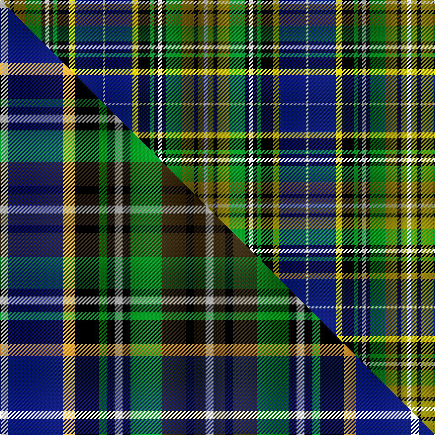

This is one **variant** — a specific cloth: this exact thread count and colourway, with its own
provenance below. It is one weaving of the [sett](/tartans/b/bo/bowling/) (the scale-free proportion — the
same cloth at any scale or shade), whose colour order is pattern [WBYKGKWKGGKGW](/stripes/wbykgkwkggkgw/).

Part of the [Bowling](/tartans/b/bo/bowling/) tartan — the named design grouping this sett with its other cloths.

Sourced from weddslist.  It is a [13 stripe tartan](/stripes/stripes13/).

Original link [http://www.weddslist.com/cgi-bin/tartans/pg.pl?source=sts](http://www.weddslist.com/cgi-bin/tartans/pg.pl?source=sts)

Dataset <small>— provenance for this record, inherited from the source manifest</small>

<dl class="dataset-prov">
<dt>source</dt><dd><a href="/sources/weddslist/">Weddslist</a></dd>
<dt>data captured from</dt><dd><a href="https://github.com/thetartan/tartan-database/blob/master/data/weddslist/data.csv">https://github.com/thetartan/tartan-database/blob/master/data/weddslist/data.csv</a></dd>
<dt>data date</dt><dd>2016-11-17 <small>(dataset default)</small></dd>
<dt>licence</dt><dd><a href="https://creativecommons.org/licenses/by-nc-nd/4.0/">CC BY-NC-ND 4.0</a></dd>
</dl>

Capture chain <small>— the hands this data passed through, oldest first; each capture carries its own licence</small>

<ol class="capture-chain">
<li><a href="https://www.weddslist.com/tartans/">Weddslist</a> <small>the living privately compiled reference</small></li>
<li><a href="https://github.com/thetartan/tartan-database">thetartan/tartan-database</a> <small>2016-2017</small> · <a href="https://creativecommons.org/licenses/by-nc-nd/4.0/">CC BY-NC-ND 4.0</a> <small>Levko Kravets's frozen compilation — the capture we vendored, and where its CC licence text came from</small></li>
<li>this dictionary <small>captured 2026-06-10 · commit 5bf86c7566</small> <small>each re-capture is a git commit to data/sources</small></li>
</ol>

## Thread count
W/4 Y6 K4 Y12 G16 K4 W4 K4 G4 K12 LY6 DB28 W/2

One full sett is **206 threads**.

## Palette
<table><thead><tr><th>Colour</th><th>Shade</th><th>OKLCh</th></tr></thead><tbody><tr><td>DB</td><td><code style="background-color:#082077;">#082077</code> <small style="color:#888">#082077</small></td><td><small style="color:#888">oklch(30.0% 0.149 265.1)</small></td></tr><tr><td>G</td><td><code style="background-color:#008B2A;">#008B2A</code> <small style="color:#888">#008B2A</small></td><td><small style="color:#888">oklch(55.4% 0.170 145.9)</small></td></tr><tr><td>K</td><td><code style="background-color:#000000;">#000000</code> <small style="color:#888">#000000</small></td><td><small style="color:#888">oklch(0.0% 0.000 0.0)</small></td></tr><tr><td>Y</td><td><code style="background-color:#908000;">#908000</code> <small style="color:#888">#908000</small></td><td><small style="color:#888">oklch(59.6% 0.124 100.6)</small></td></tr><tr><td>W</td><td><code style="background-color:#F7F7F7;">#F7F7F7</code> <small style="color:#888">#F7F7F7</small></td><td><small style="color:#888">oklch(97.6% 0.000 89.9)</small></td></tr><tr><td>LY</td><td><code style="background-color:#F0C000;">#F0C000</code> <small style="color:#888">#F0C000</small></td><td><small style="color:#888">oklch(82.7% 0.169 90.5)</small></td></tr></tbody></table>

# Sample pattern

## Compared to the master

This cloth is one sett of its design; the master sett (the exemplar the design is anchored on) is below for comparison.

Its **ΔTartan distance** from the master is **0.81** — the same measure the nearest-tartans table ranks by (0 is identical; a re-scale of the same cloth is near 0, a recolour or a different proportion further).

<figure class="master-compare" style="margin:0">

this sett
master sett ★

<figcaption style="color:#888;font-size:smaller">One weave of this sett against the <a href="/setts/w2db14lo3k6g2k2w2k2g8dy6k2dy3w2/">master sett ★</a>, split on the diagonal: a shared proportion runs seamlessly across it with only the shades shifting; a different proportion breaks on it.</figcaption>
</figure>

## Nearest tartan variants

The nearest existing variants by ΔTartan distance, with this cloth at the top so the swatches line up against it.

ΔTartan

Threads

Variant

Sett

—

206

<a href="/variants/s13/w2y3k2y6g8k2w2k2g2k6ly3db14w1~x2~y2405105-ly3307090/">Bowling</a>

<a href="/ttd/edit/#slug=w2dy3k2dy6g8k2w2k2g2k6y3db14w1~x2&amp;base=w2y3k2y6g8k2w2k2g2k6ly3db14w1~x2~y2405105-ly3307090" title="compare in the TTD">0.12</a>

206

<a href="/variants/s13/w2dy3k2dy6g8k2w2k2g2k6y3db14w1~x2/">Bowling Irish Family Tartan</a>

<a href="/ttd/edit/#slug=w2db14lo3k6g2k2w2k2g8dy6k2dy3w2~x4&amp;base=w2y3k2y6g8k2w2k2g2k6ly3db14w1~x2~y2405105-ly3307090" title="compare in the TTD">0.81</a>

416

<a href="/variants/s13/w2db14lo3k6g2k2w2k2g8dy6k2dy3w2~x4/">Bowling (Clan)</a>

<a href="/ttd/edit/#slug=w4dy4k3dy9g13k3w3k3w3k9y4lb20w3~x2&amp;base=w2y3k2y6g8k2w2k2g2k6ly3db14w1~x2~y2405105-ly3307090" title="compare in the TTD">1.51</a>

310

<a href="/variants/s13/w4dy4k3dy9g13k3w3k3w3k9y4lb20w3~x2/">Clodagh/Cork</a>

<a href="/ttd/edit/#slug=w3db20y4k9w3k3w3k3g14dy9k3dy4w3~x2&amp;base=w2y3k2y6g8k2w2k2g2k6ly3db14w1~x2~y2405105-ly3307090" title="compare in the TTD">1.51</a>

312

<a href="/variants/s13/w3db20y4k9w3k3w3k3g14dy9k3dy4w3~x2/">Clodagh Cork Irish District Tartan</a>

<a href="/ttd/edit/#slug=w6g6w6g12lb8g14dy24k4lb4k4dp44w12g20k4lb5&amp;base=w2y3k2y6g8k2w2k2g2k6ly3db14w1~x2~y2405105-ly3307090" title="compare in the TTD">1.96</a>

335

<a href="/variants/s15/w6g6w6g12lb8g14dy24k4lb4k4dp44w12g20k4lb5/">Wexford County, Crest Range</a>

<a href="/ttd/edit/#slug=w2db3r6k8g12y1db4k2w2~x4&amp;base=w2y3k2y6g8k2w2k2g2k6ly3db14w1~x2~y2405105-ly3307090" title="compare in the TTD">2.18</a>

304

<a href="/variants/s9/w2db3r6k8g12y1db4k2w2~x4/">Scottish National - 1934 (Fashion)</a>

<a href="/ttd/edit/#slug=w2db3r6k8g12y1db4k2w2~x2&amp;base=w2y3k2y6g8k2w2k2g2k6ly3db14w1~x2~y2405105-ly3307090" title="compare in the TTD">2.18</a>

152

<a href="/variants/s9/w2db3r6k8g12y1db4k2w2~x2/">National Trade Tartan</a>

<a href="/ttd/edit/#slug=db2k2db8k8g12k1w2k1g12k8r3lb3r14lb2r2~x2&amp;base=w2y3k2y6g8k2w2k2g2k6ly3db14w1~x2~y2405105-ly3307090" title="compare in the TTD">2.21</a>

312

<a href="/variants/s15/db2k2db8k8g12k1w2k1g12k8r3lb3r14lb2r2~x2/">Unidentified - C20th</a>

<a href="/ttd/edit/#slug=w2db3r6k8g12lo1db4k2w2~x2&amp;base=w2y3k2y6g8k2w2k2g2k6ly3db14w1~x2~y2405105-ly3307090" title="compare in the TTD">2.22</a>

152

<a href="/variants/s9/w2db3r6k8g12lo1db4k2w2~x2/">National (1934), The</a>

<a href="/ttd/edit/#slug=g16k1db12k1lb12k1r10y7k1y7k2lb1k4~x2&amp;base=w2y3k2y6g8k2w2k2g2k6ly3db14w1~x2~y2405105-ly3307090" title="compare in the TTD">2.23</a>

260

<a href="/variants/s13/g16k1db12k1lb12k1r10y7k1y7k2lb1k4~x2/">Ville de Beauport District Canadian Tartan</a>

## Neighbour map

Every grey dot is one of 13657 variants placed by the first two principal components of the ΔTartan feature space (42% of its variance). Red is this tartan; blue dots are its nearest — click one to open its page. The map is a flat projection of a many-dimensional space — [how to read it](/posts/neighbourhood-maps/).

<svg viewBox="0 0 640 380" role="img" style="max-width:100%;height:auto;border:1px solid #e0e0e0;border-radius:4px;display:block" xmlns="http://www.w3.org/2000/svg"><image href="/nn/cloud.v1.png" width="640" height="380"/><a href="/variants/s13/w2dy3k2dy6g8k2w2k2g2k6y3db14w1~x2/"><circle cx="47.5" cy="125.6" r="4" fill="#3465a4"><title>Bowling Irish Family Tartan</title></circle></a><a href="/variants/s13/w2db14lo3k6g2k2w2k2g8dy6k2dy3w2~x4/"><circle cx="15.8" cy="151.3" r="4" fill="#3465a4"><title>Bowling (Clan)</title></circle></a><a href="/variants/s13/w4dy4k3dy9g13k3w3k3w3k9y4lb20w3~x2/"><circle cx="14.0" cy="154.0" r="4" fill="#3465a4"><title>Clodagh/Cork</title></circle></a><a href="/variants/s13/w3db20y4k9w3k3w3k3g14dy9k3dy4w3~x2/"><circle cx="14.0" cy="153.5" r="4" fill="#3465a4"><title>Clodagh Cork Irish District Tartan</title></circle></a><a href="/variants/s15/w6g6w6g12lb8g14dy24k4lb4k4dp44w12g20k4lb5/"><circle cx="56.5" cy="124.0" r="4" fill="#3465a4"><title>Wexford County, Crest Range</title></circle></a><a href="/variants/s9/w2db3r6k8g12y1db4k2w2~x4/"><circle cx="52.9" cy="147.4" r="4" fill="#3465a4"><title>Scottish National - 1934 (Fashion)</title></circle></a><a href="/variants/s9/w2db3r6k8g12y1db4k2w2~x2/"><circle cx="52.9" cy="147.4" r="4" fill="#3465a4"><title>National Trade Tartan</title></circle></a><a href="/variants/s15/db2k2db8k8g12k1w2k1g12k8r3lb3r14lb2r2~x2/"><circle cx="60.4" cy="116.8" r="4" fill="#3465a4"><title>Unidentified - C20th</title></circle></a><a href="/variants/s9/w2db3r6k8g12lo1db4k2w2~x2/"><circle cx="52.0" cy="146.9" r="4" fill="#3465a4"><title>National (1934), The</title></circle></a><a href="/variants/s13/g16k1db12k1lb12k1r10y7k1y7k2lb1k4~x2/"><circle cx="35.9" cy="119.7" r="4" fill="#3465a4"><title>Ville de Beauport District Canadian Tartan</title></circle></a><circle cx="39.0" cy="123.9" r="5" fill="#c00000"/><text x="320" y="376" text-anchor="middle" font-size="11" fill="#999">ground</text><text x="11" y="190" text-anchor="middle" font-size="11" fill="#999" transform="rotate(-90 11 190)">complexity</text></svg>

ID: /variants/s13/w2y3k2y6g8k2w2k2g2k6ly3db14w1~x2~y2405105-ly3307090/
