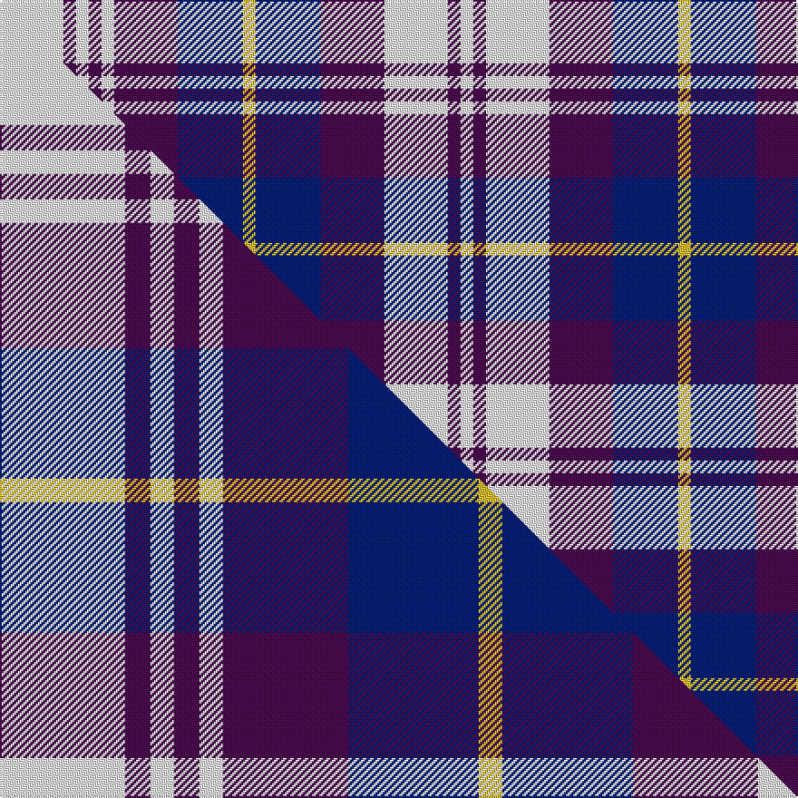

This is one **variant** — a specific cloth: this exact thread count and colourway, with its own
provenance below. It is one weaving of the [sett](/tartans/p/po/poulter-tron/) (the scale-free proportion — the
same cloth at any scale or shade), whose colour order is pattern [WBWBBYBBWBWBW](/stripes/wbwbbybbwbwbw/).

Part of the [Poulter Tron](/tartans/p/po/poulter-tron/) tartan — the named design grouping this sett with its other cloths.

Sourced from tartans-authority.  It is a [13 stripe tartan](/stripes/stripes13/).

Original link <code>http://www.tartansauthority.com/tartan-ferret/display/11240/</code> — retired · [Internet Archive copy](https://web.archive.org/web/*/http://www.tartansauthority.com/tartan-ferret/display/11240/*)

Dataset <small>— provenance for this record, inherited from the source manifest</small>

<dl class="dataset-prov">
<dt>source</dt><dd><a href="/sources/tartans-authority/">Scottish Tartans Authority</a></dd>
<dt>data captured from</dt><dd><a href="https://github.com/thetartan/tartan-database/blob/master/data/tartans-authority/data.csv">https://github.com/thetartan/tartan-database/blob/master/data/tartans-authority/data.csv</a></dd>
<dt>data date</dt><dd>2015 <small>(this record)</small></dd>
<dt>licence</dt><dd><a href="https://creativecommons.org/licenses/by-nc-nd/4.0/">CC BY-NC-ND 4.0</a></dd>
</dl>

Capture chain <small>— the hands this data passed through, oldest first; each capture carries its own licence</small>

<ol class="capture-chain">
<li><a href="https://www.tartansauthority.com/">Scottish Tartans Authority</a> <small>the heritage body’s archive — its tartan-ferret record browser is retired; dead record links are shown unlinked, with an Internet Archive copy (ITI numbers are not SRT references)</small></li>
<li><a href="https://github.com/thetartan/tartan-database">thetartan/tartan-database</a> <small>2016-2017</small> · <a href="https://creativecommons.org/licenses/by-nc-nd/4.0/">CC BY-NC-ND 4.0</a> <small>Levko Kravets's frozen compilation — the capture we vendored, and where its CC licence text came from</small></li>
<li>this dictionary <small>captured 2026-06-10 · commit 5bf86c7566</small> <small>each re-capture is a git commit to data/sources</small></li>
</ol>

## Register references

External register numbers recorded for this tartan.

- Scottish Register of Tartans: [11240](https://www.tartanregister.gov.uk/tartanDetails?ref=11240)
- Scottish Tartans Authority (ITI): 11240

## Thread count
W/35 DP7 W7 DP7 W7 DP35 DB36 LY7 DB36 DP35 W35 DP7 W/7

One full sett is **480 threads**.

## Palette
<table><thead><tr><th>Colour</th><th>Shade</th><th>OKLCh</th></tr></thead><tbody><tr><td>DB</td><td><code style="background-color:#082077;">#082077</code> <small style="color:#888">#082077</small></td><td><small style="color:#888">oklch(30.0% 0.149 265.1)</small></td></tr><tr><td>LY</td><td><code style="background-color:#DCBC32;">#DCBC32</code> <small style="color:#888">#DCBC32</small></td><td><small style="color:#888">oklch(80.0% 0.150 95.2)</small></td></tr><tr><td>DP</td><td><code style="background-color:#4B0B4F;">#4B0B4F</code> <small style="color:#888">#4B0B4F</small></td><td><small style="color:#888">oklch(30.1% 0.125 325.4)</small></td></tr><tr><td>W</td><td><code style="background-color:#F7F7F7;">#F7F7F7</code> <small style="color:#888">#F7F7F7</small></td><td><small style="color:#888">oklch(97.6% 0.000 89.9)</small></td></tr></tbody></table>

# Sample pattern

## Compared to the master

This cloth is one sett of its design; the master sett (the exemplar the design is anchored on) is below for comparison.

Its **ΔTartan distance** from the master is **0.09** — the same measure the nearest-tartans table ranks by (0 is identical; a re-scale of the same cloth is near 0, a recolour or a different proportion further).

<figure class="master-compare" style="margin:0">

this sett
master sett ★

<figcaption style="color:#888;font-size:smaller">One weave of this sett against the <a href="/setts/w69dp14w13dp14w13dp69db72ly13db72dp69w68dp14w13/">master sett ★</a>, split on the diagonal: a shared proportion runs seamlessly across it with only the shades shifting; a different proportion breaks on it.</figcaption>
</figure>

## Nearest tartan variants

The nearest existing variants by ΔTartan distance, with this cloth at the top so the swatches line up against it.

ΔTartan

Threads

Variant

Sett

—

480

<a href="/variants/s13/w35dp7w7dp7w7dp35db36ly7db36dp35w35dp7w7/">Poulter Tron</a>

<a href="/ttd/edit/#slug=w69dp14w13dp14w13dp69db72ly13db72dp69w68dp14w13&amp;base=w35dp7w7dp7w7dp35db36ly7db36dp35w35dp7w7" title="compare in the TTD">0.09</a>

944

<a href="/variants/s13/w69dp14w13dp14w13dp69db72ly13db72dp69w68dp14w13/">Poulter Tron</a>

<a href="/ttd/edit/#slug=lb25dp4lb4dp4lb4dp23lr23w4lr23dp23lb23dp4lb4~x2~lb3401300-lr3000000&amp;base=w35dp7w7dp7w7dp35db36ly7db36dp35w35dp7w7" title="compare in the TTD">2.59</a>

614

<a href="/variants/s13/lb25dp4lb4dp4lb4dp23lr23w4lr23dp23lb23dp4lb4~x2~lb3401300-lr3000000/">Poulter Pink Corporate Tartan</a>

<a href="/ttd/edit/#slug=dr12w2dr2w2dr2w10b12w3b12w10dr12w2dr2~x2&amp;base=w35dp7w7dp7w7dp35db36ly7db36dp35w35dp7w7" title="compare in the TTD">2.68</a>

304

<a href="/variants/s13/dr12w2dr2w2dr2w10b12w3b12w10dr12w2dr2~x2/">Red, White, Blue Watch (Dance)</a>

<a href="/ttd/edit/#slug=ly2db10dr3ly2w3ly2db3dr3db3w3ly2~x4&amp;base=w35dp7w7dp7w7dp35db36ly7db36dp35w35dp7w7" title="compare in the TTD">2.72</a>

272

<a href="/variants/s11/ly2db10dr3ly2w3ly2db3dr3db3w3ly2~x4/">Unidentified #55</a>

<a href="/ttd/edit/#slug=db25lb8db8lb8db8lb46w46lp8w46lb46db46lb8db8&amp;base=w35dp7w7dp7w7dp35db36ly7db36dp35w35dp7w7" title="compare in the TTD">2.90</a>

589

<a href="/variants/s13/db25lb8db8lb8db8lb46w46lp8w46lb46db46lb8db8/">Poulter SG 104 (Fashion)</a>

<a href="/ttd/edit/#slug=lp25dp4lp4dp4lp4dp23lb23w4lb23dp23lp23dp4lp4~x2&amp;base=w35dp7w7dp7w7dp35db36ly7db36dp35w35dp7w7" title="compare in the TTD">2.96</a>

614

<a href="/variants/s13/lp25dp4lp4dp4lp4dp23lb23w4lb23dp23lp23dp4lp4~x2/">Poulter, Pink (Corporate)</a>

<a href="/ttd/edit/#slug=lb16dt2lb2dt2lb2dt16db16ly3db16dt16lb16dt2lb2~x2~dt1204274-db1406275&amp;base=w35dp7w7dp7w7dp35db36ly7db36dp35w35dp7w7" title="compare in the TTD">3.14</a>

408

<a href="/variants/s13/lb16db2lb2db2lb2db16dbi16ly3dbi16db16lb16db2lb2~x2~db1204274-dbi1406275/">Adair (Name)</a>

<a href="/ttd/edit/#slug=lb16db3lb3n3lb3db10dr12w4~x2&amp;base=w35dp7w7dp7w7dp35db36ly7db36dp35w35dp7w7" title="compare in the TTD">3.34</a>

176

<a href="/variants/s8/lb16db3lb3n3lb3db10dr12w4~x2/">Greer (Name?)</a>

<a href="/ttd/edit/#slug=db2lb2db7dr8lb10db2lb2db2~x2&amp;base=w35dp7w7dp7w7dp35db36ly7db36dp35w35dp7w7" title="compare in the TTD">3.36</a>

132

<a href="/variants/s8/db2lb2db7dr8lb10db2lb2db2~x2/">Laval Dress, Tartan de</a>

<a href="/ttd/edit/#slug=n12dt2n2dt2n2dt10w12dt3w12dt10n12dt2n2~x2&amp;base=w35dp7w7dp7w7dp35db36ly7db36dp35w35dp7w7" title="compare in the TTD">3.91</a>

304

<a href="/variants/s13/n12dt2n2dt2n2dt10w12dt3w12dt10n12dt2n2~x2/">Grey Watch Dress (1989)</a>

## Neighbour map

Every grey dot is one of 13656 variants placed by the first two principal components of the ΔTartan feature space (42% of its variance). Red is this tartan; blue dots are its nearest — click one to open its page. The map is a flat projection of a many-dimensional space — [how to read it](/posts/neighbourhood-maps/).

<svg viewBox="0 0 640 380" role="img" style="max-width:100%;height:auto;border:1px solid #e0e0e0;border-radius:4px;display:block" xmlns="http://www.w3.org/2000/svg"><image href="/nn/cloud.v1.png" width="640" height="380"/><a href="/variants/s13/w69dp14w13dp14w13dp69db72ly13db72dp69w68dp14w13/"><circle cx="172.1" cy="234.9" r="4" fill="#3465a4"><title>Poulter Tron</title></circle></a><a href="/variants/s13/lb25dp4lb4dp4lb4dp23lr23w4lr23dp23lb23dp4lb4~x2~lb3401300-lr3000000/"><circle cx="208.8" cy="237.2" r="4" fill="#3465a4"><title>Poulter Pink Corporate Tartan</title></circle></a><a href="/variants/s13/dr12w2dr2w2dr2w10b12w3b12w10dr12w2dr2~x2/"><circle cx="206.1" cy="246.6" r="4" fill="#3465a4"><title>Red, White, Blue Watch (Dance)</title></circle></a><a href="/variants/s11/ly2db10dr3ly2w3ly2db3dr3db3w3ly2~x4/"><circle cx="190.9" cy="250.1" r="4" fill="#3465a4"><title>Unidentified #55</title></circle></a><a href="/variants/s13/db25lb8db8lb8db8lb46w46lp8w46lb46db46lb8db8/"><circle cx="193.6" cy="238.5" r="4" fill="#3465a4"><title>Poulter SG 104 (Fashion)</title></circle></a><a href="/variants/s13/lp25dp4lp4dp4lp4dp23lb23w4lb23dp23lp23dp4lp4~x2/"><circle cx="220.1" cy="238.7" r="4" fill="#3465a4"><title>Poulter, Pink (Corporate)</title></circle></a><a href="/variants/s13/lb16db2lb2db2lb2db16dbi16ly3dbi16db16lb16db2lb2~x2~db1204274-dbi1406275/"><circle cx="218.4" cy="225.6" r="4" fill="#3465a4"><title>Adair (Name)</title></circle></a><a href="/variants/s8/lb16db3lb3n3lb3db10dr12w4~x2/"><circle cx="184.9" cy="246.5" r="4" fill="#3465a4"><title>Greer (Name?)</title></circle></a><a href="/variants/s8/db2lb2db7dr8lb10db2lb2db2~x2/"><circle cx="241.4" cy="276.1" r="4" fill="#3465a4"><title>Laval Dress, Tartan de</title></circle></a><a href="/variants/s13/n12dt2n2dt2n2dt10w12dt3w12dt10n12dt2n2~x2/"><circle cx="210.0" cy="252.6" r="4" fill="#3465a4"><title>Grey Watch Dress (1989)</title></circle></a><circle cx="168.1" cy="238.6" r="5" fill="#c00000"/><text x="320" y="376" text-anchor="middle" font-size="11" fill="#999">ground</text><text x="11" y="190" text-anchor="middle" font-size="11" fill="#999" transform="rotate(-90 11 190)">complexity</text></svg>

ID: /variants/s13/w35dp7w7dp7w7dp35db36ly7db36dp35w35dp7w7/
