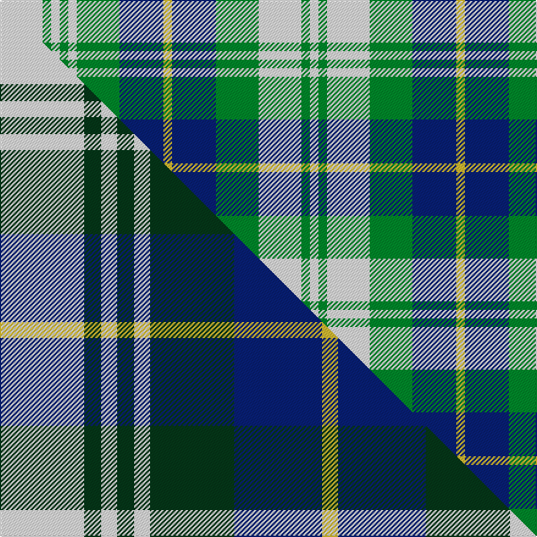

This page is one **sett** — a single exact thread-count. It belongs to the [tartan](/setts/w35g7w7g7w7g35db36ly7db36g35w35g7w7/)
(the same proportion at any scale), whose colour order is pattern [WGWGBYBGWGWGW](/stripes/wgwgbybgwgwgw/).

Part of the [Poulter Hoylake](/tartans/poulter-hoylake/) tartan — the named design grouping this sett with its other cloths.

Sourced from tartans-authority.  It is a [13 stripe tartan](/stripes/stripes13/).

Original link http://www.tartansauthority.com/tartan-ferret/display/11239/

## Register references

External register numbers recorded for this tartan.

- Scottish Register of Tartans: [11239](https://www.tartanregister.gov.uk/tartanDetails?ref=11239)
- Scottish Tartans Authority (ITI): 11239

## Thread count
W/35 G7 W7 G7 W7 G35 DB36 LY7 DB36 G35 W35 G7 W/7

One full sett is **480 threads**.

## Palette
<table><thead><tr><th>Colour</th><th>Shade</th><th>OKLCh</th></tr></thead><tbody><tr><td>DB</td><td><code style="background-color:#082077;">#082077</code> <small style="color:#888">#082077</small></td><td><small style="color:#888">oklch(30.0% 0.149 265.1)</small></td></tr><tr><td>G</td><td><code style="background-color:#008B2A;">#008B2A</code> <small style="color:#888">#008B2A</small></td><td><small style="color:#888">oklch(55.4% 0.170 145.9)</small></td></tr><tr><td>LY</td><td><code style="background-color:#DCBC32;">#DCBC32</code> <small style="color:#888">#DCBC32</small></td><td><small style="color:#888">oklch(80.0% 0.150 95.2)</small></td></tr><tr><td>W</td><td><code style="background-color:#F7F7F7;">#F7F7F7</code> <small style="color:#888">#F7F7F7</small></td><td><small style="color:#888">oklch(97.6% 0.000 89.9)</small></td></tr></tbody></table>

# Sample pattern

## Compared to the master

This cloth is one sett of its design; the master sett (the exemplar the design is anchored on) is below for comparison.

Its **ΔTartan distance** from the master is **0.23** — the same measure the nearest-tartans table ranks by (0 is identical; a re-scale of the same cloth is near 0, a recolour or a different proportion further).

<figure class="master-compare" style="margin:0">

this sett
master sett ★

<figcaption style="color:#888;font-size:smaller">One weave of this sett against the <a href="/setts/w69dg14w13dg14w13dg69db72ly13db72dg69w68dg14w13/">master sett ★</a>, split on the diagonal: a shared proportion runs seamlessly across it with only the shades shifting; a different proportion breaks on it.</figcaption>
</figure>

## Nearest tartan variants

The nearest existing variants by ΔTartan distance, with this cloth at the top so the swatches line up against it.

ΔTartan

Threads

Variant

Sett

—

480

<a href="/variants/s13/w35g7w7g7w7g35db36ly7db36g35w35g7w7/">Poulter Hoylake</a>

<a href="/ttd/edit/#slug=w69dg14w13dg14w13dg69db72ly13db72dg69w68dg14w13&amp;base=w35g7w7g7w7g35db36ly7db36g35w35g7w7" title="compare in the TTD">0.23</a>

944

<a href="/variants/s13/w69dg14w13dg14w13dg69db72ly13db72dg69w68dg14w13/">Poulter Hoylake</a>

<a href="/ttd/edit/#slug=w25g8w8g8w8g46lb46y8lb46g46w46g8w8&amp;base=w35g7w7g7w7g35db36ly7db36g35w35g7w7" title="compare in the TTD">0.42</a>

589

<a href="/variants/s13/w25g8w8g8w8g46lb46y8lb46g46w46g8w8/">Poulter SG 096 (Fashion)</a>

<a href="/ttd/edit/#slug=n11dt2n2dt2n2dt12lb12dt2lb12dt12n11dt2n2~x2&amp;base=w35g7w7g7w7g35db36ly7db36g35w35g7w7" title="compare in the TTD">1.22</a>

310

<a href="/variants/s13/n11dt2n2dt2n2dt12lb12dt2lb12dt12n11dt2n2~x2/">Scottish Scouts (1922) (Corporate)</a>

<a href="/ttd/edit/#slug=n1dt1n3dt3y4dt1y4dt3w1n1w6n1w1~x4&amp;base=w35g7w7g7w7g35db36ly7db36g35w35g7w7" title="compare in the TTD">3.23</a>

232

<a href="/variants/s13/n1dt1n3dt3y4dt1y4dt3w1n1w6n1w1~x4/">Black Watch Dress, Brown/Grey (Fash)</a>

<a href="/ttd/edit/#slug=g36w7g7w7g7lb36w35dp7w36lb35g34w7g7&amp;base=w35g7w7g7w7g35db36ly7db36g35w35g7w7" title="compare in the TTD">3.25</a>

479

<a href="/variants/s13/g36w7g7w7g7lb36w35dp7w36lb35g34w7g7/">Poulter Millicent</a>

<a href="/ttd/edit/#slug=g69w14g13w14g13lb69w72dp13w72lb69g68w14g13&amp;base=w35g7w7g7w7g35db36ly7db36g35w35g7w7" title="compare in the TTD">3.32</a>

944

<a href="/variants/s13/g69w14g13w14g13lb69w72dp13w72lb69g68w14g13/">Poulter Millicent</a>

<a href="/ttd/edit/#slug=n12dt2n2dt2n2dt10w12dt3w12dt10n12dt2n2~x2&amp;base=w35g7w7g7w7g35db36ly7db36g35w35g7w7" title="compare in the TTD">3.44</a>

304

<a href="/variants/s13/n12dt2n2dt2n2dt10w12dt3w12dt10n12dt2n2~x2/">Grey Watch Dress (1989)</a>

<a href="/ttd/edit/#slug=db3dy14g2dy2g2dy3g6w18db3dy2db2dy2~x2&amp;base=w35g7w7g7w7g35db36ly7db36g35w35g7w7" title="compare in the TTD">3.79</a>

226

<a href="/variants/s12/db3dy14g2dy2g2dy3g6w18db3dy2db2dy2~x2/">Raibert Check</a>

<a href="/ttd/edit/#slug=db2g13db11lb4w9db2~x2&amp;base=w35g7w7g7w7g35db36ly7db36g35w35g7w7" title="compare in the TTD">3.83</a>

156

<a href="/variants/s6/db2g13db11lb4w9db2~x2/">Loch Leven Check Trade Tartan</a>

<a href="/ttd/edit/#slug=t15w13dy6t2dy2r2dy2t2dy6w13t15r3~x4~r2109032&amp;base=w35g7w7g7w7g35db36ly7db36g35w35g7w7" title="compare in the TTD">3.84</a>

576

<a href="/variants/s12/t15w13dy6t2dy2r2dy2t2dy6w13t15r3~x4~r2109032/">Thompson (Pendleton)</a>

## Neighbour map

Every grey dot is one of 13620 variants placed by the first two principal components of the ΔTartan feature space (42% of its variance). Red is this tartan; blue dots are its nearest — click one to open its page.

<svg viewBox="0 0 640 380" role="img" style="max-width:100%;height:auto;border:1px solid #e0e0e0;border-radius:4px;display:block" xmlns="http://www.w3.org/2000/svg"><image href="/nn/cloud.v1.png" width="640" height="380"/><a href="/variants/s13/w69dg14w13dg14w13dg69db72ly13db72dg69w68dg14w13/"><circle cx="145.6" cy="226.5" r="4" fill="#3465a4"><title>Poulter Hoylake</title></circle></a><a href="/variants/s13/w25g8w8g8w8g46lb46y8lb46g46w46g8w8/"><circle cx="215.8" cy="247.3" r="4" fill="#3465a4"><title>Poulter SG 096 (Fashion)</title></circle></a><a href="/variants/s13/n11dt2n2dt2n2dt12lb12dt2lb12dt12n11dt2n2~x2/"><circle cx="256.4" cy="262.4" r="4" fill="#3465a4"><title>Scottish Scouts (1922) (Corporate)</title></circle></a><a href="/variants/s13/n1dt1n3dt3y4dt1y4dt3w1n1w6n1w1~x4/"><circle cx="121.2" cy="234.1" r="4" fill="#3465a4"><title>Black Watch Dress, Brown/Grey (Fash)</title></circle></a><a href="/variants/s13/g36w7g7w7g7lb36w35dp7w36lb35g34w7g7/"><circle cx="183.8" cy="246.9" r="4" fill="#3465a4"><title>Poulter Millicent</title></circle></a><a href="/variants/s13/g69w14g13w14g13lb69w72dp13w72lb69g68w14g13/"><circle cx="190.8" cy="243.1" r="4" fill="#3465a4"><title>Poulter Millicent</title></circle></a><a href="/variants/s13/n12dt2n2dt2n2dt10w12dt3w12dt10n12dt2n2~x2/"><circle cx="209.9" cy="252.7" r="4" fill="#3465a4"><title>Grey Watch Dress (1989)</title></circle></a><a href="/variants/s12/db3dy14g2dy2g2dy3g6w18db3dy2db2dy2~x2/"><circle cx="185.9" cy="181.0" r="4" fill="#3465a4"><title>Raibert Check</title></circle></a><a href="/variants/s6/db2g13db11lb4w9db2~x2/"><circle cx="165.8" cy="263.1" r="4" fill="#3465a4"><title>Loch Leven Check Trade Tartan</title></circle></a><a href="/variants/s12/t15w13dy6t2dy2r2dy2t2dy6w13t15r3~x4~r2109032/"><circle cx="178.1" cy="199.7" r="4" fill="#3465a4"><title>Thompson (Pendleton)</title></circle></a><circle cx="146.3" cy="235.6" r="5" fill="#c00000"/><text x="320" y="376" text-anchor="middle" font-size="11" fill="#999">ground</text><text x="11" y="190" text-anchor="middle" font-size="11" fill="#999" transform="rotate(-90 11 190)">complexity</text></svg>

ID: /variants/s13/w35g7w7g7w7g35db36ly7db36g35w35g7w7/
