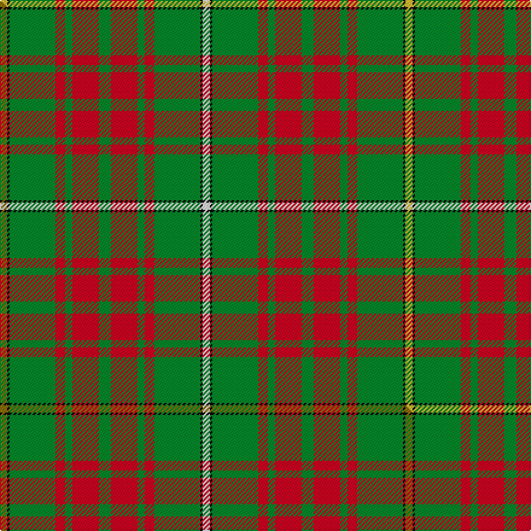

This is one **variant** — a specific cloth: this exact thread count and colourway, with its own
provenance below. It is one weaving of the [sett](/setts/w3k1g19r4g3r11g5r11g3r4g19k1ly3/) (the scale-free proportion — the
same cloth at any scale or shade), whose colour order is pattern [WKGRGRGRGRGKY](/stripes/wkgrgrgrgrgky/).

Part of the [Bruce Hunting](/tartans/bruce-hunting/) tartan — the named design grouping this sett with its other cloths.

Sourced from tartans-authority.  It is a [13 stripe tartan](/stripes/stripes13/).

Original link [https://www.tartanregister.gov.uk/tartanDetails.aspx?ref=1816](https://www.tartanregister.gov.uk/tartanDetails.aspx?ref=1816)

Dataset <small>— provenance for this record, inherited from the source manifest</small>

<dl class="dataset-prov">
<dt>source</dt><dd><a href="/sources/tartans-authority/">Scottish Tartans Authority</a></dd>
<dt>data captured from</dt><dd><a href="https://github.com/thetartan/tartan-database/blob/master/data/tartans-authority/data.csv">https://github.com/thetartan/tartan-database/blob/master/data/tartans-authority/data.csv</a></dd>
<dt>data date</dt><dd>1939 <small>(this record)</small></dd>
<dt>licence</dt><dd><a href="https://creativecommons.org/licenses/by-nc-nd/4.0/">CC BY-NC-ND 4.0</a></dd>
</dl>

Capture chain <small>— the hands this data passed through, oldest first; each capture carries its own licence</small>

<ol class="capture-chain">
<li><a href="https://www.tartansauthority.com/">Scottish Tartans Authority</a> <small>the heritage body's archive — its tartan-ferret record browser is retired (links repaired to the SRT, above)</small></li>
<li><a href="https://github.com/thetartan/tartan-database">thetartan/tartan-database</a> <small>2016-2017</small> · <a href="https://creativecommons.org/licenses/by-nc-nd/4.0/">CC BY-NC-ND 4.0</a> <small>Levko Kravets's frozen compilation — the capture we vendored, and where its CC licence text came from</small></li>
<li>this dictionary <small>captured 2026-06-10 · commit 5bf86c7566</small> <small>each re-capture is a git commit to data/sources</small></li>
</ol>

## Register references

External register numbers recorded for this tartan.

- Scottish Tartans Authority (ITI): 1816

## Thread count
LY/6 K2 G38 R8 G6 R22 G10 R22 G6 R8 G38 K2 W/6

One full sett is **336 threads**.

## Palette
<table><thead><tr><th>Colour</th><th>Shade</th><th>OKLCh</th></tr></thead><tbody><tr><td>G</td><td><code style="background-color:#008B2A;">#008B2A</code> <small style="color:#888">#008B2A</small></td><td><small style="color:#888">oklch(55.4% 0.170 145.9)</small></td></tr><tr><td>K</td><td><code style="background-color:#000000;">#000000</code> <small style="color:#888">#000000</small></td><td><small style="color:#888">oklch(0.0% 0.000 0.0)</small></td></tr><tr><td>W</td><td><code style="background-color:#F7F7F7;">#F7F7F7</code> <small style="color:#888">#F7F7F7</small></td><td><small style="color:#888">oklch(97.6% 0.000 89.9)</small></td></tr><tr><td>R</td><td><code style="background-color:#D60020;">#D60020</code> <small style="color:#888">#D60020</small></td><td><small style="color:#888">oklch(55.2% 0.224 25.5)</small></td></tr><tr><td>LY</td><td><code style="background-color:#DCBC32;">#DCBC32</code> <small style="color:#888">#DCBC32</small></td><td><small style="color:#888">oklch(80.0% 0.150 95.2)</small></td></tr></tbody></table>

# Sample pattern

## Compared to the master

This cloth is one sett of its design; the master sett (the exemplar the design is anchored on) is below for comparison.

Its **ΔTartan distance** from the master is **0.02** — the same measure the nearest-tartans table ranks by (0 is identical; a re-scale of the same cloth is near 0, a recolour or a different proportion further).

<figure class="master-compare" style="margin:0">

this sett
master sett ★

<figcaption style="color:#888;font-size:smaller">One weave of this sett against the <a href="/setts/y3k1g19r4g3r11g5r11g3r4g19k1w3/">master sett ★</a>, split on the diagonal: a shared proportion runs seamlessly across it with only the shades shifting; a different proportion breaks on it.</figcaption>
</figure>

## Nearest tartan variants

The nearest existing variants by ΔTartan distance, with this cloth at the top so the swatches line up against it.

ΔTartan

Threads

Variant

Sett

—

336

<a href="/variants/s13/w3k1g19r4g3r11g5r11g3r4g19k1ly3~x2/">Bruce Hunting (Clan)</a>

<a href="/ttd/edit/#slug=y3k1g19r4g3r11g5r11g3r4g19k1w3~x2&amp;base=w3k1g19r4g3r11g5r11g3r4g19k1ly3~x2" title="compare in the TTD">0.02</a>

336

<a href="/variants/s13/y3k1g19r4g3r11g5r11g3r4g19k1w3~x2/">Bruce Hunting</a>

<a href="/ttd/edit/#slug=k2r18g7r3g10w1g10r3g10w1g10r3g7r18k1~x4&amp;base=w3k1g19r4g3r11g5r11g3r4g19k1ly3~x2" title="compare in the TTD">2.61</a>

820

<a href="/variants/s15/k2r18g7r3g10w1g10r3g10w1g10r3g7r18k1~x4/">MacAulay</a>

<a href="/ttd/edit/#slug=r6g4y2g17r2g2r2g8r26g6r4k2r4w6~x2&amp;base=w3k1g19r4g3r11g5r11g3r4g19k1ly3~x2" title="compare in the TTD">3.07</a>

340

<a href="/variants/s14/r6g4y2g17r2g2r2g8r26g6r4k2r4w6~x2/">Hay</a>

<a href="/ttd/edit/#slug=k3g3y2g30k2g3r12g6lp6k3g3~x2&amp;base=w3k1g19r4g3r11g5r11g3r4g19k1ly3~x2" title="compare in the TTD">3.16</a>

280

<a href="/variants/s11/k3g3y2g30k2g3r12g6lp6k3g3~x2/">McAlifyfe (Personal)</a>

<a href="/ttd/edit/#slug=r4g8w1g8r4g4r2g4r24k2~x2&amp;base=w3k1g19r4g3r11g5r11g3r4g19k1ly3~x2" title="compare in the TTD">3.18</a>

232

<a href="/variants/s10/r4g8w1g8r4g4r2g4r24k2~x2/">Cumming Clan Tartan</a>

<a href="/ttd/edit/#slug=y4k1r22g5r4g12r6g12r4g5r22k1w4~x2&amp;base=w3k1g19r4g3r11g5r11g3r4g19k1ly3~x2" title="compare in the TTD">3.19</a>

392

<a href="/variants/s13/y4k1r22g5r4g12r6g12r4g5r22k1w4~x2/">Bruce</a>

<a href="/ttd/edit/#slug=dp3k1g16dr5g6dr5g14dr16lo2~x2&amp;base=w3k1g19r4g3r11g5r11g3r4g19k1ly3~x2" title="compare in the TTD">3.22</a>

262

<a href="/variants/s9/dp3k1g16dr5g6dr5g14dr16lo2~x2/">Fulton</a>

<a href="/ttd/edit/#slug=y28k2y28k2y2k2ly29k2r2k2~x2&amp;base=w3k1g19r4g3r11g5r11g3r4g19k1ly3~x2" title="compare in the TTD">3.24</a>

336

<a href="/variants/s10/y28k2y28k2y2k2ly29k2r2k2~x2/">Ulster Irish District Tartan</a>

<a href="/ttd/edit/#slug=lb5k1g30dp15r8g30r8dp2&amp;base=w3k1g19r4g3r11g5r11g3r4g19k1ly3~x2" title="compare in the TTD">3.31</a>

191

<a href="/variants/s8/lb5k1g30dp15r8g30r8dp2/">Shaw of Tordarroch Hunting Clan Tartan</a>

<a href="/ttd/edit/#slug=db3k1g13y1r1w1r6g3r1g3w1~x2&amp;base=w3k1g19r4g3r11g5r11g3r4g19k1ly3~x2" title="compare in the TTD">3.34</a>

128

<a href="/variants/s11/db3k1g13y1r1w1r6g3r1g3w1~x2/">Canadian Caledonian Hunting Canadian Tartan</a>

## Neighbour map

Every grey dot is one of 13621 variants placed by the first two principal components of the ΔTartan feature space (42% of its variance). Red is this tartan; blue dots are its nearest — click one to open its page.

<svg viewBox="0 0 640 380" role="img" style="max-width:100%;height:auto;border:1px solid #e0e0e0;border-radius:4px;display:block" xmlns="http://www.w3.org/2000/svg"><image href="/nn/cloud.v1.png" width="640" height="380"/><a href="/variants/s13/y3k1g19r4g3r11g5r11g3r4g19k1w3~x2/"><circle cx="293.6" cy="130.8" r="4" fill="#3465a4"><title>Bruce Hunting</title></circle></a><a href="/variants/s15/k2r18g7r3g10w1g10r3g10w1g10r3g7r18k1~x4/"><circle cx="282.5" cy="142.6" r="4" fill="#3465a4"><title>MacAulay</title></circle></a><a href="/variants/s14/r6g4y2g17r2g2r2g8r26g6r4k2r4w6~x2/"><circle cx="242.4" cy="125.4" r="4" fill="#3465a4"><title>Hay</title></circle></a><a href="/variants/s11/k3g3y2g30k2g3r12g6lp6k3g3~x2/"><circle cx="287.8" cy="119.0" r="4" fill="#3465a4"><title>McAlifyfe (Personal)</title></circle></a><a href="/variants/s10/r4g8w1g8r4g4r2g4r24k2~x2/"><circle cx="337.8" cy="125.8" r="4" fill="#3465a4"><title>Cumming Clan Tartan</title></circle></a><a href="/variants/s13/y4k1r22g5r4g12r6g12r4g5r22k1w4~x2/"><circle cx="301.6" cy="119.2" r="4" fill="#3465a4"><title>Bruce</title></circle></a><a href="/variants/s9/dp3k1g16dr5g6dr5g14dr16lo2~x2/"><circle cx="279.3" cy="169.3" r="4" fill="#3465a4"><title>Fulton</title></circle></a><a href="/variants/s10/y28k2y28k2y2k2ly29k2r2k2~x2/"><circle cx="311.4" cy="133.4" r="4" fill="#3465a4"><title>Ulster Irish District Tartan</title></circle></a><a href="/variants/s8/lb5k1g30dp15r8g30r8dp2/"><circle cx="322.4" cy="135.3" r="4" fill="#3465a4"><title>Shaw of Tordarroch Hunting Clan Tartan</title></circle></a><a href="/variants/s11/db3k1g13y1r1w1r6g3r1g3w1~x2/"><circle cx="242.0" cy="118.8" r="4" fill="#3465a4"><title>Canadian Caledonian Hunting Canadian Tartan</title></circle></a><circle cx="288.6" cy="129.2" r="5" fill="#c00000"/><text x="320" y="376" text-anchor="middle" font-size="11" fill="#999">ground</text><text x="11" y="190" text-anchor="middle" font-size="11" fill="#999" transform="rotate(-90 11 190)">complexity</text></svg>

ID: /variants/s13/w3k1g19r4g3r11g5r11g3r4g19k1ly3~x2/
