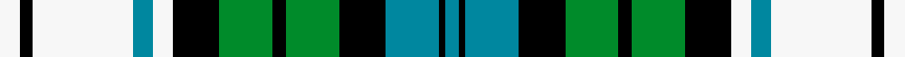

This page is one **sett** — a single exact thread-count. It belongs to the [tartan](/setts/w3k2w15t3w3k7g8k2g8k7t8k1t2/)
(the same proportion at any scale), whose colour order is pattern [BKBKGKGKWBWKW](/stripes/bkbkgkgkwbwkw/).

Sourced from register-of-tartans.  It is a [13 stripe tartan](/stripes/stripes13/).

Original link https://www.tartanregister.gov.uk/tartanDetails.aspx?ref=531

2 attestations — the source records this cloth was collapsed from (oldest owns this page)

<ul>
<li>01/01/2002 — Campbell, 42nd Dress (Balhousie) (register-of-tartans, <a href="https://www.tartanregister.gov.uk/tartanDetails.aspx?ref=531">record</a>)  <em>A sample is displayed in the Black Watch museum Perth. It was never worn as a regimental tartan.</em></li>
<li>pre 2002 — Campbell, 42nd Dress (Military) (tartans-authority, <a href="http://www.tartansauthority.com/tartan-ferret/display/20/">record</a>) </li>
</ul>

## Register references

External register numbers recorded for this tartan.

- Scottish Register of Tartans: [531](https://www.tartanregister.gov.uk/tartanDetails.aspx?ref=531)
- Scottish Tartans Authority (ITI): 20
- Scottish Tartans World Register: 20

## Thread count
W/6 K4 W30 T6 W6 K14 G16 K4 G16 K14 T16 K2 T/4

One full sett is **266 threads**.

## Palette
<table><thead><tr><th>Colour</th><th>Shade</th><th>OKLCh</th></tr></thead><tbody><tr><td>T</td><td><code style="background-color:#00879F;">#00879F</code> <small style="color:#888">#00879F</small></td><td><small style="color:#888">oklch(57.4% 0.102 216.1)</small></td></tr><tr><td>DB</td><td><code style="background-color:#082077;">#082077</code> <small style="color:#888">#082077</small></td><td><small style="color:#888">oklch(30.0% 0.149 265.1)</small></td></tr><tr><td>DG</td><td><code style="background-color:#053819;">#053819</code> <small style="color:#888">#053819</small></td><td><small style="color:#888">oklch(30.0% 0.075 151.3)</small></td></tr><tr><td>G</td><td><code style="background-color:#008B2A;">#008B2A</code> <small style="color:#888">#008B2A</small></td><td><small style="color:#888">oklch(55.4% 0.170 145.9)</small></td></tr><tr><td>K</td><td><code style="background-color:#000000;">#000000</code> <small style="color:#888">#000000</small></td><td><small style="color:#888">oklch(0.0% 0.000 0.0)</small></td></tr><tr><td>W</td><td><code style="background-color:#F7F7F7;">#F7F7F7</code> <small style="color:#888">#F7F7F7</small></td><td><small style="color:#888">oklch(97.6% 0.000 89.9)</small></td></tr></tbody></table>

# Sample pattern

## Nearest variants

The nearest existing variants by ΔTartan distance, with this cloth at the top so the swatches line up against it.

ΔTartan

Threads

Variant

Sett

—

266

<a href="/variants/s13/w3k2w15t3w3k7g8k2g8k7t8k1t2~x2/">Campbell, 42nd Dress (Balhousie)</a>

<a href="/ttd/edit/#slug=w3k2w15db3w3k7g8k2g8k7db8k1db2~x2&amp;base=w3k2w15t3w3k7g8k2g8k7t8k1t2~x2" title="compare in the TTD">0.00</a>

266

<a href="/variants/s13/w3k2w15db3w3k7g8k2g8k7db8k1db2~x2/">Campbell, 42nd dress</a>

<a href="/ttd/edit/#slug=db4k4db10k10g13y3g13k10w4db4w16db2w3~x2&amp;base=w3k2w15t3w3k7g8k2g8k7t8k1t2~x2" title="compare in the TTD">2.45</a>

370

<a href="/variants/s13/db4k4db10k10g13y3g13k10w4db4w16db2w3~x2/">Gordon Dress</a>

<a href="/ttd/edit/#slug=db4k4db10k10g12ly2g12k10w4db4w16db3w2~x2&amp;base=w3k2w15t3w3k7g8k2g8k7t8k1t2~x2" title="compare in the TTD">2.50</a>

360

<a href="/variants/s13/db4k4db10k10g12ly2g12k10w4db4w16db3w2~x2/">Gordon Dress (1965)</a>

## Neighbour map

Every grey dot is one of 13620 variants placed by the first two principal components of the ΔTartan feature space (42% of its variance). Red is this tartan; blue dots are its nearest — click one to open its page.

<svg viewBox="0 0 640 380" role="img" style="max-width:100%;height:auto;border:1px solid #e0e0e0;border-radius:4px;display:block" xmlns="http://www.w3.org/2000/svg"><image href="/nn/cloud.v1.png" width="640" height="380"/><a href="/variants/s13/w3k2w15db3w3k7g8k2g8k7db8k1db2~x2/"><circle cx="85.4" cy="157.2" r="4" fill="#3465a4"><title>Campbell, 42nd dress</title></circle></a><a href="/variants/s13/db4k4db10k10g13y3g13k10w4db4w16db2w3~x2/"><circle cx="28.2" cy="180.0" r="4" fill="#3465a4"><title>Gordon Dress</title></circle></a><a href="/variants/s13/db4k4db10k10g12ly2g12k10w4db4w16db3w2~x2/"><circle cx="26.8" cy="180.0" r="4" fill="#3465a4"><title>Gordon Dress (1965)</title></circle></a><circle cx="85.6" cy="159.3" r="5" fill="#c00000"/><text x="320" y="376" text-anchor="middle" font-size="11" fill="#999">ground</text><text x="11" y="190" text-anchor="middle" font-size="11" fill="#999" transform="rotate(-90 11 190)">complexity</text></svg>

ID: /variants/s13/w3k2w15t3w3k7g8k2g8k7t8k1t2~x2/
