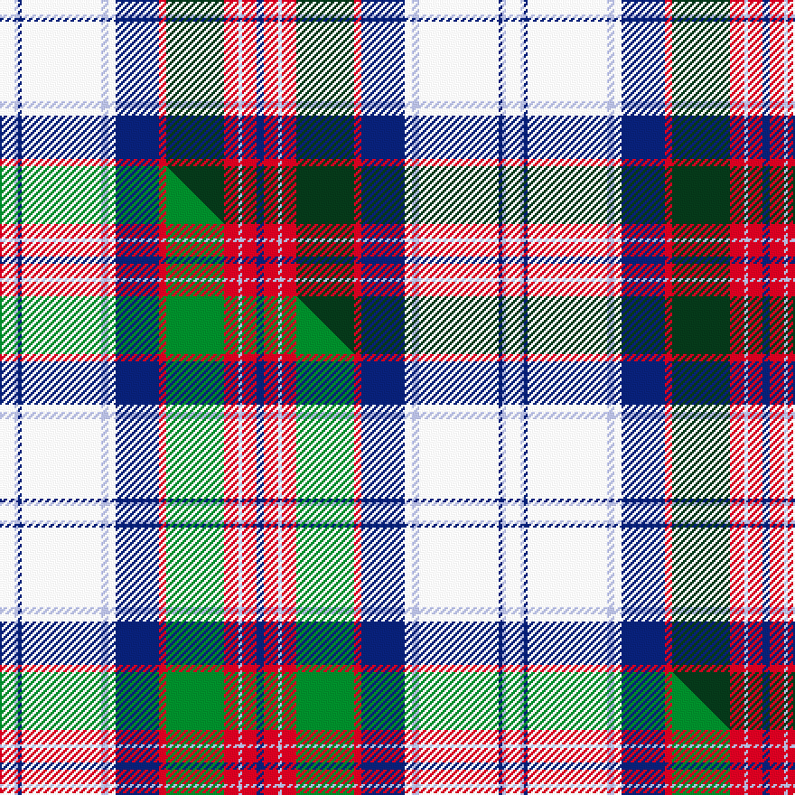

This is one **variant** — a specific cloth: this exact thread count and colourway, with its own
provenance below. It is one weaving of the [sett](/setts/w4lb1db1w22lb2w2db12r2dg16r4lb1r4db2/) (the scale-free proportion — the
same cloth at any scale or shade), whose colour order is pattern [BRWRGRBWWWBWW](/stripes/brwrgrbwwwbww/).

Part of the [MacGillivray Dress, Janice](/tartans/m/ma/macgillivray-dress-janice/) tartan — the named design grouping this sett with its other cloths.

Sourced from tartans-authority.  It is a [13 stripe tartan](/stripes/stripes13/).

Original link [https://www.tartanregister.gov.uk/tartanDetails.aspx?ref=10811](https://www.tartanregister.gov.uk/tartanDetails.aspx?ref=10811)

Dataset <small>— provenance for this record, inherited from the source manifest</small>

<dl class="dataset-prov">
<dt>source</dt><dd><a href="/sources/tartans-authority/">Scottish Tartans Authority</a></dd>
<dt>data captured from</dt><dd><a href="https://github.com/thetartan/tartan-database/blob/master/data/tartans-authority/data.csv">https://github.com/thetartan/tartan-database/blob/master/data/tartans-authority/data.csv</a></dd>
<dt>data date</dt><dd>11/11/2011 <small>(this record)</small></dd>
<dt>licence</dt><dd><a href="https://creativecommons.org/licenses/by-nc-nd/4.0/">CC BY-NC-ND 4.0</a></dd>
</dl>

Capture chain <small>— the hands this data passed through, oldest first; each capture carries its own licence</small>

<ol class="capture-chain">
<li><a href="https://www.tartansauthority.com/">Scottish Tartans Authority</a> <small>the heritage body's archive — its tartan-ferret record browser is retired (links repaired to the SRT, above)</small></li>
<li><a href="https://github.com/thetartan/tartan-database">thetartan/tartan-database</a> <small>2016-2017</small> · <a href="https://creativecommons.org/licenses/by-nc-nd/4.0/">CC BY-NC-ND 4.0</a> <small>Levko Kravets's frozen compilation — the capture we vendored, and where its CC licence text came from</small></li>
<li>this dictionary <small>captured 2026-06-10 · commit 5bf86c7566</small> <small>each re-capture is a git commit to data/sources</small></li>
</ol>

## Register references

External register numbers recorded for this tartan.

- Scottish Register of Tartans: [10811](https://www.tartanregister.gov.uk/tartanDetails?ref=10811)
- Scottish Tartans Authority (ITI): 10811

## Thread count
W/8 LB2 DB2 W44 LB4 W4 DB24 R4 DG32 R8 LB2 R8 DB/4

One full sett is **280 threads**.

## Palette
<table><thead><tr><th>Colour</th><th>Shade</th><th>OKLCh</th></tr></thead><tbody><tr><td>LB</td><td><code style="background-color:#B5BBDE;">#B5BBDE</code> <small style="color:#888">#B5BBDE</small></td><td><small style="color:#888">oklch(79.9% 0.050 277.6)</small></td></tr><tr><td>DB</td><td><code style="background-color:#082077;">#082077</code> <small style="color:#888">#082077</small></td><td><small style="color:#888">oklch(30.0% 0.149 265.1)</small></td></tr><tr><td>DG</td><td><code style="background-color:#053819;">#053819</code> <small style="color:#888">#053819</small></td><td><small style="color:#888">oklch(30.0% 0.075 151.3)</small></td></tr><tr><td>W</td><td><code style="background-color:#F7F7F7;">#F7F7F7</code> <small style="color:#888">#F7F7F7</small></td><td><small style="color:#888">oklch(97.6% 0.000 89.9)</small></td></tr><tr><td>R</td><td><code style="background-color:#D60020;">#D60020</code> <small style="color:#888">#D60020</small></td><td><small style="color:#888">oklch(55.2% 0.224 25.5)</small></td></tr></tbody></table>

# Sample pattern

## Compared to the master

This cloth is one sett of its design; the master sett (the exemplar the design is anchored on) is below for comparison.

Its **ΔTartan distance** from the master is **0.11** — the same measure the nearest-tartans table ranks by (0 is identical; a re-scale of the same cloth is near 0, a recolour or a different proportion further).

<figure class="master-compare" style="margin:0">

this sett
master sett ★

<figcaption style="color:#888;font-size:smaller">One weave of this sett against the <a href="/setts/w4lb1db1w22lb2w2db12r2g16r4lb1r4db2/">master sett ★</a>, split on the diagonal: a shared proportion runs seamlessly across it with only the shades shifting; a different proportion breaks on it.</figcaption>
</figure>

## Nearest tartan variants

The nearest existing variants by ΔTartan distance, with this cloth at the top so the swatches line up against it.

ΔTartan

Threads

Variant

Sett

—

280

<a href="/variants/s13/w4lb1db1w22lb2w2db12r2dg16r4lb1r4db2~x2/">MacGillivray Dress, Janice (Personal</a>

<a href="/ttd/edit/#slug=w4lb1db1w22lb2w2db12r2g16r4lb1r4db2~x2&amp;base=w4lb1db1w22lb2w2db12r2dg16r4lb1r4db2~x2" title="compare in the TTD">0.11</a>

280

<a href="/variants/s13/w4lb1db1w22lb2w2db12r2g16r4lb1r4db2~x2/">MacGillivray Dress, Janice</a>

<a href="/ttd/edit/#slug=lo4db2r7db15r3db3r3db7w28dy7w6dy2~x2~r2109032&amp;base=w4lb1db1w22lb2w2db12r2dg16r4lb1r4db2~x2" title="compare in the TTD">2.04</a>

336

<a href="/variants/s12/lo4db2r7db15r3db3r3db7w28dy7w6dy2~x2~r2109032/">Walker, Dress (Personal)</a>

<a href="/ttd/edit/#slug=lo4db2r7db15r3db3r3db7w28dy7w6dy2~x2&amp;base=w4lb1db1w22lb2w2db12r2dg16r4lb1r4db2~x2" title="compare in the TTD">2.09</a>

336

<a href="/variants/s12/lo4db2r7db15r3db3r3db7w28dy7w6dy2~x2/">Walker, Dress (Name)</a>

<a href="/ttd/edit/#slug=dg4g3dg3g4dg4db8dg3db9w29r2w4r2~x2&amp;base=w4lb1db1w22lb2w2db12r2dg16r4lb1r4db2~x2" title="compare in the TTD">2.18</a>

288

<a href="/variants/s12/dg4g3dg3g4dg4db8dg3db9w29r2w4r2~x2/">Ross Hunting Dress</a>

<a href="/ttd/edit/#slug=w55dg12r2dg3w2dgi10dp9dg2dp6w2~x2~dgi1806142-dp1607327&amp;base=w4lb1db1w22lb2w2db12r2dg16r4lb1r4db2~x2" title="compare in the TTD">2.27</a>

298

<a href="/variants/s10/w55dg12r2dg3w2dgi10dp9dg2dp6w2~x2~dgi1806142-dp1607327/">Strathyre Dress (Dance)</a>

<a href="/ttd/edit/#slug=lb63dp21w16dp2w4dp4w12lo6w16k21~x2&amp;base=w4lb1db1w22lb2w2db12r2dg16r4lb1r4db2~x2" title="compare in the TTD">2.34</a>

492

<a href="/variants/s10/lb63dp21w16dp2w4dp4w12lo6w16k21~x2/">Xain (Personal)</a>

<a href="/ttd/edit/#slug=lo2w1lo12db2r1db18r1lb18r1lb2w12lo1w1~x2&amp;base=w4lb1db1w22lb2w2db12r2dg16r4lb1r4db2~x2" title="compare in the TTD">2.45</a>

282

<a href="/variants/s13/lo2w1lo12db2r1db18r1lb18r1lb2w12lo1w1~x2/">International Council for Commercial Arbitration</a>

<a href="/ttd/edit/#slug=r3db1ri20db20w2db2w2db2w32dg1db1r3~x2~r2108022-ri2806019&amp;base=w4lb1db1w22lb2w2db12r2dg16r4lb1r4db2~x2" title="compare in the TTD">2.48</a>

344

<a href="/variants/s12/r3db1ri20db20w2db2w2db2w32dg1db1r3~x2~r2108022-ri2806019/">Sunart, Saphire (Dance)</a>

<a href="/ttd/edit/#slug=w50g5y2g5r2g20r2db5y2db40~x2&amp;base=w4lb1db1w22lb2w2db12r2dg16r4lb1r4db2~x2" title="compare in the TTD">2.48</a>

352

<a href="/variants/s10/w50g5y2g5r2g20r2db5y2db40~x2/">Cornell (Fashion)</a>

<a href="/ttd/edit/#slug=lb63dp21w16dp2w4dp4w12lo6w16dp4k21~x2&amp;base=w4lb1db1w22lb2w2db12r2dg16r4lb1r4db2~x2" title="compare in the TTD">2.52</a>

508

<a href="/variants/s11/lb63dp21w16dp2w4dp4w12lo6w16dp4k21~x2/">Xain (Personal)</a>

## Neighbour map

Every grey dot is one of 13621 variants placed by the first two principal components of the ΔTartan feature space (42% of its variance). Red is this tartan; blue dots are its nearest — click one to open its page. The map is a flat projection of a many-dimensional space — [how to read it](/posts/neighbourhood-maps/).

<svg viewBox="0 0 640 380" role="img" style="max-width:100%;height:auto;border:1px solid #e0e0e0;border-radius:4px;display:block" xmlns="http://www.w3.org/2000/svg"><image href="/nn/cloud.v1.png" width="640" height="380"/><a href="/variants/s13/w4lb1db1w22lb2w2db12r2g16r4lb1r4db2~x2/"><circle cx="171.0" cy="112.3" r="4" fill="#3465a4"><title>MacGillivray Dress, Janice</title></circle></a><a href="/variants/s12/lo4db2r7db15r3db3r3db7w28dy7w6dy2~x2~r2109032/"><circle cx="160.0" cy="139.3" r="4" fill="#3465a4"><title>Walker, Dress (Personal)</title></circle></a><a href="/variants/s12/lo4db2r7db15r3db3r3db7w28dy7w6dy2~x2/"><circle cx="160.3" cy="139.2" r="4" fill="#3465a4"><title>Walker, Dress (Name)</title></circle></a><a href="/variants/s12/dg4g3dg3g4dg4db8dg3db9w29r2w4r2~x2/"><circle cx="179.2" cy="128.0" r="4" fill="#3465a4"><title>Ross Hunting Dress</title></circle></a><a href="/variants/s10/w55dg12r2dg3w2dgi10dp9dg2dp6w2~x2~dgi1806142-dp1607327/"><circle cx="195.3" cy="72.7" r="4" fill="#3465a4"><title>Strathyre Dress (Dance)</title></circle></a><a href="/variants/s10/lb63dp21w16dp2w4dp4w12lo6w16k21~x2/"><circle cx="171.7" cy="106.9" r="4" fill="#3465a4"><title>Xain (Personal)</title></circle></a><a href="/variants/s13/lo2w1lo12db2r1db18r1lb18r1lb2w12lo1w1~x2/"><circle cx="141.6" cy="123.1" r="4" fill="#3465a4"><title>International Council for Commercial Arbitration</title></circle></a><a href="/variants/s12/r3db1ri20db20w2db2w2db2w32dg1db1r3~x2~r2108022-ri2806019/"><circle cx="214.7" cy="83.6" r="4" fill="#3465a4"><title>Sunart, Saphire (Dance)</title></circle></a><a href="/variants/s10/w50g5y2g5r2g20r2db5y2db40~x2/"><circle cx="194.9" cy="111.6" r="4" fill="#3465a4"><title>Cornell (Fashion)</title></circle></a><a href="/variants/s11/lb63dp21w16dp2w4dp4w12lo6w16dp4k21~x2/"><circle cx="162.2" cy="95.8" r="4" fill="#3465a4"><title>Xain (Personal)</title></circle></a><circle cx="165.6" cy="108.1" r="5" fill="#c00000"/><text x="320" y="376" text-anchor="middle" font-size="11" fill="#999">ground</text><text x="11" y="190" text-anchor="middle" font-size="11" fill="#999" transform="rotate(-90 11 190)">complexity</text></svg>

ID: /variants/s13/w4lb1db1w22lb2w2db12r2dg16r4lb1r4db2~x2/
